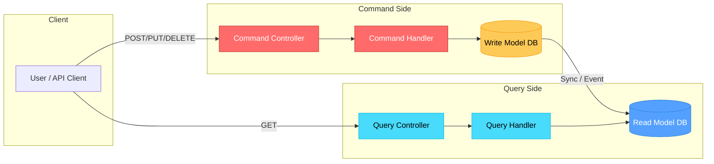
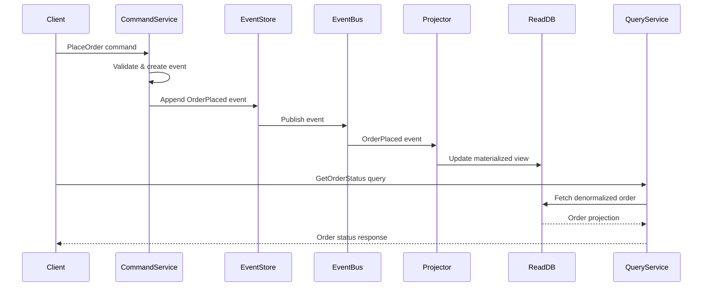
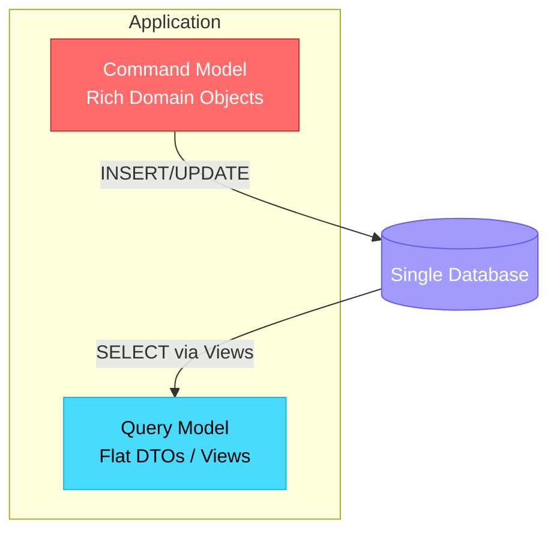
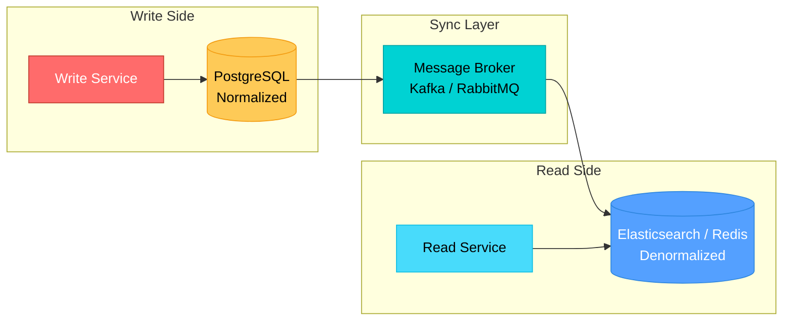
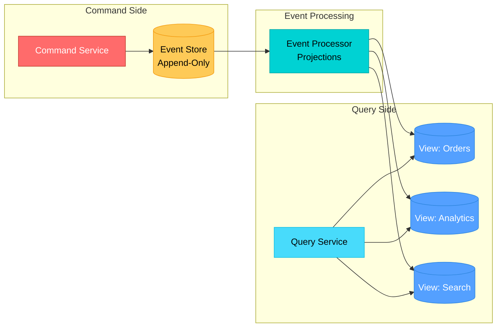

# CQRS (Command Query Responsibility Segregation)

!!! tip "Why CQRS Appears in System Design Interviews"
    CQRS is a **top-tier system design topic** at FAANG companies. Interviewers test whether you can design systems that handle asymmetric read/write workloads, maintain consistency across distributed services, and scale independently. Mastering CQRS shows you understand trade-offs between complexity, performance, and consistency.

---

## The Problem with Traditional CRUD

In a traditional CRUD architecture, the same data model handles both reads and writes. This works for simple applications but breaks down when:

| Problem | Impact |
|---------|--------|
| **Read/Write ratio is skewed** | 90%+ reads starve write throughput (e.g., product catalog) |
| **Complex query requirements** | Joins across normalized tables kill read performance |
| **Independent scaling needs** | Cannot scale reads without also scaling writes |
| **Conflicting optimization** | Write model needs normalization; read model needs denormalization |
| **Security boundaries** | Same model exposes write operations to read-only consumers |
| **Domain complexity** | Single model becomes a "god object" mixing concerns |

---

## CQRS Pattern Explained

CQRS separates the **Command** (write) side from the **Query** (read) side into distinct models, each optimized for its purpose.



**Key Principles:**

- **Commands** mutate state and return no data (or just an acknowledgment)
- **Queries** return data and never mutate state
- The read model is a **projection** optimized for specific query patterns
- Models can use entirely different schemas, databases, or even technologies

---

## CQRS + Event Sourcing

CQRS and Event Sourcing are often combined. Instead of storing current state, every state change is captured as an immutable event.



**How They Complement Each Other:**

| Event Sourcing Provides | CQRS Provides |
|------------------------|---------------|
| Complete audit trail | Optimized read models |
| Temporal queries (state at any point) | Independent scaling |
| Event replay for rebuilding projections | Separation of concerns |
| Natural event-driven architecture | Tailored query performance |

---

## Implementation Patterns

### Pattern 1: Simple CQRS (Same DB, Different Models)

The simplest form -- separate read and write models backed by the same database.



**Use when:** Moderate complexity, same team owns read/write, no extreme scale needs.

### Pattern 2: CQRS with Separate Databases

Read and write sides use different databases optimized for their workload.



**Use when:** High read volume, need different storage technologies, independent scaling required.

### Pattern 3: CQRS with Event Store

Full event sourcing -- write side appends events, read side builds projections from event stream.



**Use when:** Need audit trail, temporal queries, multiple read projections, complex domain.

---

## Eventual Consistency Handling

With separate read/write stores, the system becomes **eventually consistent**. Here are strategies to handle this:

### Strategies

| Strategy | Description | Trade-off |
|----------|-------------|-----------|
| **Read-your-writes** | After a write, route the user's next read to the write DB | Adds routing complexity |
| **Causal consistency** | Track causality tokens; read side waits until caught up | Adds latency to reads |
| **Polling with version** | Client polls until read model version >= write version | Client-side complexity |
| **Optimistic UI** | Client assumes success and shows expected state | May need rollback |
| **Stale-while-revalidate** | Serve stale data immediately, refresh in background | Brief staleness window |

### Consistency Window

```
Write committed --> Event published --> Projection updated --> Read reflects write
     t=0              t=50ms              t=100-500ms           t=500ms-2s
```

In practice, for most systems the consistency window is **under 1 second**, which is acceptable for the vast majority of use cases.

---

## Spring Boot Implementation

### Command Side

```java
// Command
@Data
@AllArgsConstructor
public class CreateOrderCommand {
    private String orderId;
    private String customerId;
    private List<OrderItem> items;
    private BigDecimal totalAmount;
}

// Command Handler
@Service
@RequiredArgsConstructor
public class OrderCommandHandler {

    private final OrderWriteRepository writeRepository;
    private final ApplicationEventPublisher eventPublisher;

    @Transactional
    public String handle(CreateOrderCommand command) {
        OrderEntity order = OrderEntity.builder()
            .id(command.getOrderId())
            .customerId(command.getCustomerId())
            .items(command.getItems())
            .totalAmount(command.getTotalAmount())
            .status(OrderStatus.CREATED)
            .createdAt(Instant.now())
            .build();

        writeRepository.save(order);

        eventPublisher.publishEvent(new OrderCreatedEvent(
            order.getId(), order.getCustomerId(),
            order.getTotalAmount(), order.getStatus()
        ));

        return order.getId();
    }
}

// Command Controller
@RestController
@RequestMapping("/api/orders")
@RequiredArgsConstructor
public class OrderCommandController {

    private final OrderCommandHandler commandHandler;

    @PostMapping
    public ResponseEntity<String> createOrder(@RequestBody CreateOrderCommand command) {
        String orderId = commandHandler.handle(command);
        return ResponseEntity.status(HttpStatus.CREATED).body(orderId);
    }
}
```

### Event Handler (Synchronization)

```java
@Component
@RequiredArgsConstructor
public class OrderEventHandler {

    private final OrderReadRepository readRepository;

    @EventListener
    @Async
    public void on(OrderCreatedEvent event) {
        OrderReadModel readModel = OrderReadModel.builder()
            .orderId(event.getOrderId())
            .customerId(event.getCustomerId())
            .totalAmount(event.getTotalAmount())
            .status(event.getStatus().name())
            .lastUpdated(Instant.now())
            .build();

        readRepository.save(readModel);
    }

    @EventListener
    @Async
    public void on(OrderStatusChangedEvent event) {
        readRepository.findById(event.getOrderId())
            .ifPresent(model -> {
                model.setStatus(event.getNewStatus().name());
                model.setLastUpdated(Instant.now());
                readRepository.save(model);
            });
    }
}
```

### Query Side

```java
// Read Model (Denormalized, optimized for display)
@Document(collection = "order_views")
@Data @Builder
public class OrderReadModel {
    private String orderId;
    private String customerId;
    private String customerName;  // denormalized
    private BigDecimal totalAmount;
    private String status;
    private Instant lastUpdated;
}

// Query Handler
@Service
@RequiredArgsConstructor
public class OrderQueryHandler {

    private final OrderReadRepository readRepository;

    public OrderReadModel getOrder(String orderId) {
        return readRepository.findById(orderId)
            .orElseThrow(() -> new OrderNotFoundException(orderId));
    }

    public List<OrderReadModel> getOrdersByCustomer(String customerId) {
        return readRepository.findByCustomerId(customerId);
    }
}

// Query Controller
@RestController
@RequestMapping("/api/orders")
@RequiredArgsConstructor
public class OrderQueryController {

    private final OrderQueryHandler queryHandler;

    @GetMapping("/{orderId}")
    public ResponseEntity<OrderReadModel> getOrder(@PathVariable String orderId) {
        return ResponseEntity.ok(queryHandler.getOrder(orderId));
    }

    @GetMapping("/customer/{customerId}")
    public ResponseEntity<List<OrderReadModel>> getByCustomer(
            @PathVariable String customerId) {
        return ResponseEntity.ok(queryHandler.getOrdersByCustomer(customerId));
    }
}
```

---

## When to Use CQRS vs When NOT to Use

### Decision Matrix

| Factor | Use CQRS | Avoid CQRS |
|--------|----------|------------|
| **Read/Write ratio** | Highly skewed (10:1 or more) | Balanced |
| **Domain complexity** | Complex business rules on writes | Simple CRUD |
| **Scale requirements** | Need independent read/write scaling | Single-server sufficient |
| **Query patterns** | Multiple diverse read projections needed | Simple queries |
| **Team structure** | Separate teams for read/write | Small single team |
| **Consistency needs** | Eventual consistency acceptable | Strong consistency required |
| **Performance** | Read latency critical, different optimization needed | Uniform performance OK |
| **Audit requirements** | Full history / temporal queries | Current state sufficient |

### When NOT to Use CQRS

- Simple domains with straightforward CRUD operations
- Small applications where the added complexity is not justified
- Systems requiring strict real-time consistency (e.g., money transfer confirmation)
- Early-stage startups where speed of development matters more than scalability
- When the team lacks experience with eventual consistency patterns

---

## Real-World Examples

### Banking System

```
Command Side:                        Query Side:
- TransferFunds                      - GetAccountBalance
- DepositMoney                       - GetTransactionHistory
- WithdrawMoney                      - GetMonthlyStatement
                                     - GetSpendingAnalytics

Write DB: PostgreSQL (ACID)          Read DB: Redis (balance cache)
                                             + Elasticsearch (history search)
                                             + TimescaleDB (analytics)
```

**Why CQRS fits:** Writes need strict ACID guarantees. Reads need sub-ms balance lookups, full-text search on transactions, and time-series analytics -- each requiring a different storage engine.

### E-Commerce Order System

```
Command Side:                        Query Side:
- PlaceOrder                         - GetOrderStatus (customer)
- CancelOrder                        - SearchOrders (admin)
- UpdateShipping                     - GetDashboardMetrics (ops)
- ProcessRefund                      - GetRecommendations (ML)

Write DB: PostgreSQL                 Read DB: MongoDB (order views)
Event Store: Kafka                           + Redis (status cache)
                                             + Elasticsearch (search)
```

**Why CQRS fits:** Millions of customers checking order status vs. thousands of orders placed per minute. The read side serves personalized views that combine data from orders, inventory, and shipping -- impossible to serve efficiently from a normalized write model.

---

## Interview Questions

??? question "What is CQRS and why would you use it over traditional CRUD?"
    CQRS separates read and write operations into distinct models. You use it when reads and writes have fundamentally different requirements -- different scaling needs, different data shapes, or different performance characteristics. For example, an e-commerce product catalog has 100x more reads than writes, and reads need denormalized data with search capabilities while writes need normalized, validated domain objects.

??? question "How do you handle eventual consistency in a CQRS system?"
    Several strategies exist: (1) **Read-your-writes** -- route the writing user's subsequent reads to the write store temporarily. (2) **Optimistic UI** -- assume success on the client and reconcile if needed. (3) **Version-based polling** -- client includes a version token and the read side waits until it catches up. (4) **Causal consistency tokens** -- propagate causality markers so the read side can guarantee ordering. The key is to identify which use cases truly need strong consistency and handle them specially while letting the majority of reads tolerate small delays.

??? question "What is the relationship between CQRS and Event Sourcing? Are they the same thing?"
    No, they are complementary but independent patterns. CQRS splits read/write models. Event Sourcing stores state as a sequence of immutable events rather than current state. They pair well because event sourcing naturally produces events that can build read projections, and CQRS gives you the freedom to create optimized views from those events. However, you can implement CQRS without event sourcing (using change data capture or dual writes) and event sourcing without CQRS (single model rebuilt from events).

??? question "How would you rebuild a read model if it becomes corrupted or you need a new projection?"
    With event sourcing, you replay all events from the event store through a new projector to build the read model from scratch. Without event sourcing, you can use Change Data Capture (CDC) tools like Debezium to replay the write DB changelog, or run a batch migration job that reads the write model and populates the new read model. The key advantage of event sourcing here is that you have the complete history and can build entirely new projections retroactively.

??? question "Design a CQRS-based order system that handles 100K orders/min reads and 1K orders/min writes."
    **Write side:** A horizontally scaled service writing to a partitioned PostgreSQL cluster (partition by order ID). Each write produces an OrderEvent to Kafka (partitioned by customer ID for ordering). **Read side:** Multiple consumer groups process events -- one updates a Redis cluster for real-time order status lookups, another feeds Elasticsearch for order search. The read services auto-scale based on request volume. **Consistency:** For the ordering customer, use read-your-writes with a short TTL routing cookie pointing to the write DB. For other users (admin, support), eventual consistency with a sub-second window is acceptable.

??? question "What are the main challenges and downsides of implementing CQRS?"
    (1) **Increased complexity** -- more services, more infrastructure, more failure modes. (2) **Eventual consistency** -- requires careful UX design and conflict resolution. (3) **Data synchronization bugs** -- projectors can have bugs leading to diverged read models. (4) **Operational overhead** -- monitoring two data stores, handling replay, managing schema evolution on both sides. (5) **Debugging difficulty** -- tracing a request across command, event, and query sides is harder than a simple CRUD stack trace.

??? question "How would you ensure ordering guarantees when projecting events to the read model?"
    Use partitioned message brokers like Kafka where events for the same aggregate (e.g., same order ID) go to the same partition, guaranteeing order within that partition. Each projection tracks its last processed offset/sequence number. If a projector crashes and restarts, it resumes from its last committed offset. For cross-aggregate ordering (rare requirement), use a global sequence number in the event store and process events sequentially, though this limits throughput.

??? question "Can you apply CQRS at the microservice level without event sourcing? Give an example."
    Yes. Consider a User Profile service. The write side accepts profile updates via a REST API and stores them in PostgreSQL (normalized: user table, address table, preferences table). After each write, it publishes a CDC event via Debezium to Kafka. A separate read service consumes these events and maintains a denormalized document in MongoDB combining user info, addresses, and preferences into a single document optimized for the profile page query. No event store needed -- the write DB remains the source of truth and CDC captures changes.
