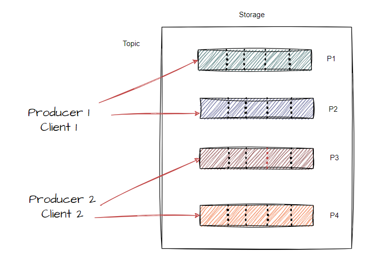

Event streaming:

* Capturing data in real time from event- sources like databases, sensors, mobile devices, cloud services and software applications in the form of stream of events.

* Even streams are stored durably for later retrieval manipulating processing and reacting to the event streamed in real time as well as retrospectively.

* Ensures continuous flow and interpretation of data so that right information is at right place at the right time.

**What can I use event streaming for??**

1. Process payments and transactions in real time such as stocks exchange , banks etc.
2. Track logistics info in real time.
3. React to customer interactions and orders such as in retail, the hotel and travel industry.
4. Capture and analyze sensor data from IoT devices or other equipment.

**Kafka is an even streaming platform.**

 * Kafka combines 3 capabilities.

1. To publish (write) and subscribe (read) stream of events.
2. To store stream of events durably and reliably for as long as you want.
3. To process stream of events as they occur or retrospectively.

* All these functionalities provided in a distributed, highly scalable, elastic, fault-tolerant and secure manner.

**How does Kafka work??**

* It's a distributed system consisting of servers and clients that communicate via high performance TCP network protocol.

**Servers**: 

* Kafka is run as a cluster of one or more servers that can span multiple data centers or cloud regions. Some of these servers from the storage layer called the brokers. 
* Other servers run Kafka Connect to continuously import and export data as event streams to integrate Kafka with your existing systems such as relational DBS as well as other Kafka clusters

**Clients**: They allow you to write distributed application and microservices that read write and process streams of events in parallel at scale and in fault tolerant manner even in case of network problems.

**Main concepts and Technology**:

Event: Record or message
             or
       something happened

* Writing or reading data in Kafka is in the form of events.

* Events has a key value and timestamp and optional metadata.

**Producers** :

* Clients that publish or write events to Kafka.

**Consumers :**

* Clients that subscribe to read or process events.

Producers and consumers are fully decoupled and agnostic to each other.

**Topics** :

 

* Events are organized and durably stored in topics .

     or

* Topic is a ordered collection of events .

* Topic in Kafka is always multi producer and multi subscriber.

* It can have 0, 1 or many producers and consumers to read and write.

* Topics are partitioned meaning a topic is spread over number of buckets located on different Kafka brokers.

* Events within same even key (example:2 customer or vehicle id) are written to same partition and Kafka guarantees that any consumer of a given topic partition will always read partition event in same order they are written.

* To make data fault tolerant and highly available every topic can be replicated even across geo regions or data centers.

