# AI Agents & Tool Use

> **From chatbot to autonomous systems — how LLMs become agents that think, plan, use tools, and get things done.**

---

## What is an AI Agent?

An AI Agent is an **LLM with superpowers**. It can reason, plan, use tools, remember past interactions, and take actions in the real world.

Think of it as an **intern with superpowers**: brilliant but needs guardrails. It can Google things, write code, send emails, query databases — but you still review the output before shipping to production.

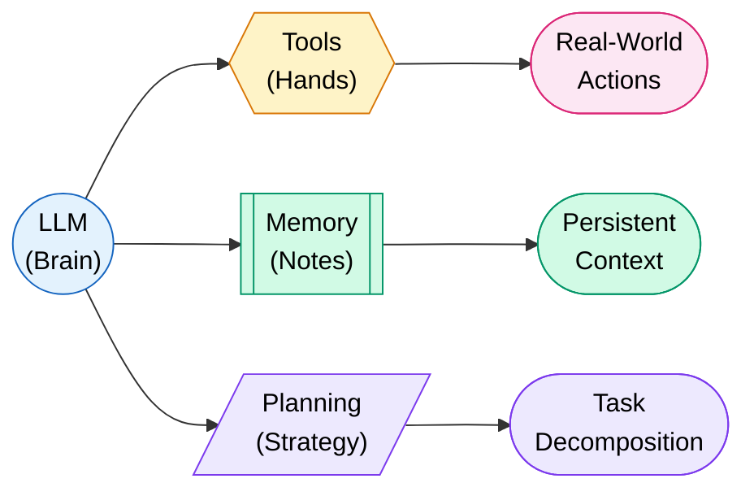

### Agent vs Chatbot

| Feature | Chatbot | Agent |
|---------|---------|-------|
| **Actions** | Only generates text | Calls tools, writes files, browses web |
| **Memory** | Forgets after session | Retains context across sessions |
| **Planning** | Single-turn response | Multi-step reasoning and execution |
| **Autonomy** | Waits for every prompt | Can execute complex tasks independently |
| **Error Recovery** | None | Retries, reflects, adapts |

!!! tip "The Key Insight"
    A chatbot *talks*. An agent *does*. The difference is the ability to take actions and observe results in a loop.

---

## Agent Architecture — The ReAct Loop

The most fundamental agent pattern is **ReAct** (Reason + Act). The agent thinks, acts, observes, then thinks again. It loops until the task is complete.

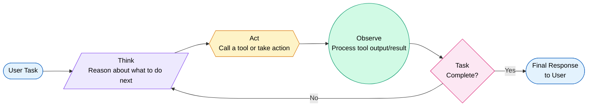

**Example trace:**

```
User: "What's the weather in Tokyo and should I bring an umbrella?"

Think: I need to check Tokyo's weather. I'll use the weather API.
Act:   weather_api(city="Tokyo")
Observe: {"temp": 18, "condition": "rain", "humidity": 85%}
Think: It's rainy. The user should bring an umbrella.
Respond: "It's 18C and raining in Tokyo. Yes, bring an umbrella!"
```

!!! info "Why ReAct Works"
    By forcing the model to *reason before acting*, we get more accurate tool calls. By observing results, the agent can self-correct. This is called **grounded reasoning**.

---

## Agent Patterns

### Pattern Comparison

| Pattern | How It Works | Best For | Weakness |
|---------|-------------|----------|----------|
| **ReAct** | Think-Act-Observe loop | General tasks, simple tool use | Can get stuck in loops |
| **Plan-and-Execute** | Plan all steps first, then execute | Complex multi-step tasks | Plan may be wrong upfront |
| **Reflection** | Execute, then critique and retry | Quality-sensitive tasks | Slower (double computation) |
| **Tree-of-Thought** | Explore multiple reasoning paths | Math, puzzles, ambiguous tasks | Expensive (many branches) |
| **Multi-Agent** | Multiple specialized agents collaborate | Complex, multi-domain tasks | Coordination overhead |

### ReAct (Reason + Act)

The default pattern. Agent interleaves reasoning with tool calls. Simple and effective for most tasks.

### Plan-and-Execute

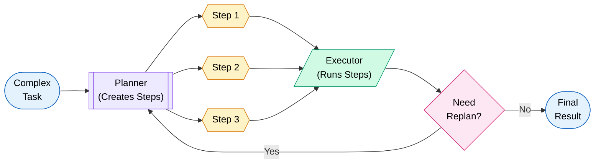

The planner creates all steps upfront. The executor handles each step. If something goes wrong, it replans. This separates "what to do" from "how to do it."

### Reflection / Self-Critique

The agent generates output, then critiques its own work. If the critique finds issues, it revises and tries again. Think of it as a built-in code review.

```
Generate -> Critique -> Revise -> Critique -> Accept
```

### Tree-of-Thought

Instead of one reasoning path, explore many. Rate each branch. Pick the best. Like a chess engine evaluating moves.

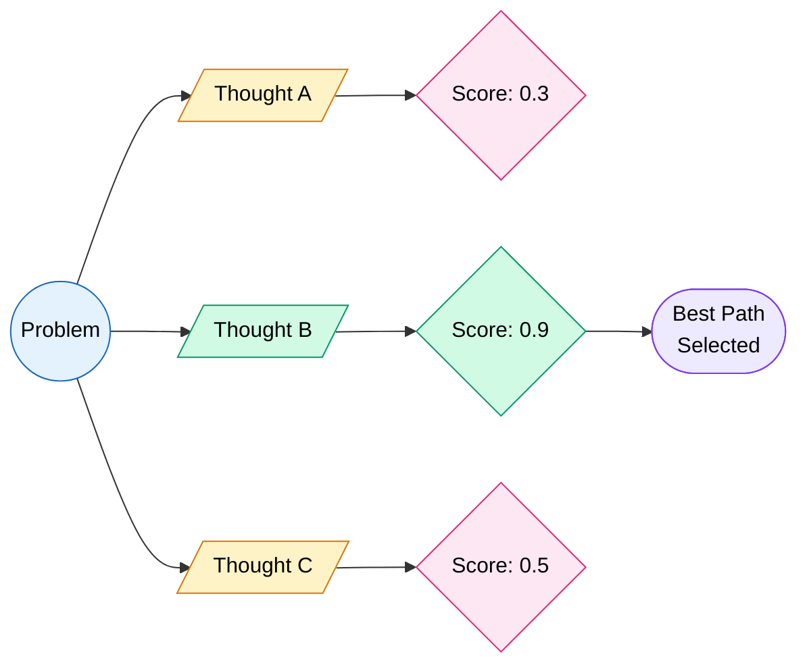

---

## Tool Use / Function Calling

This is how LLMs interact with the real world. The model doesn't execute code — it outputs structured JSON describing which tool to call with what arguments.

### How It Works

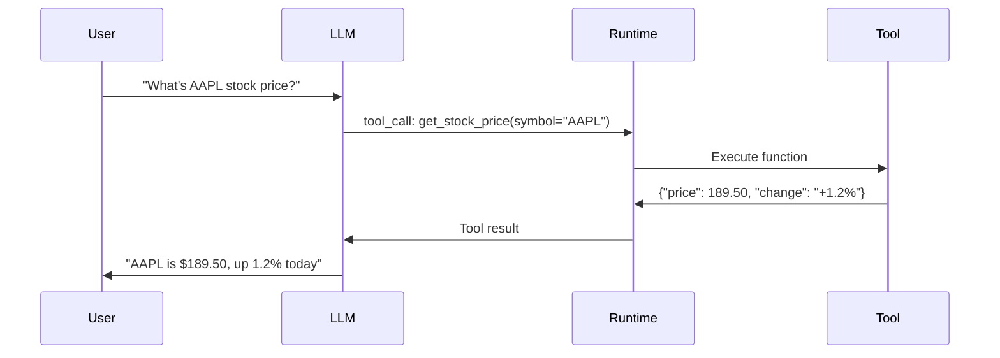

### Tool Definition (OpenAI Format)

```json
{
  "type": "function",
  "function": {
    "name": "get_weather",
    "description": "Get current weather for a city",
    "parameters": {
      "type": "object",
      "properties": {
        "city": {
          "type": "string",
          "description": "City name, e.g. 'San Francisco'"
        },
        "units": {
          "type": "string",
          "enum": ["celsius", "fahrenheit"],
          "description": "Temperature unit"
        }
      },
      "required": ["city"]
    }
  }
}
```

### Tool Definition (Anthropic Format)

```json
{
  "name": "get_weather",
  "description": "Get current weather for a city",
  "input_schema": {
    "type": "object",
    "properties": {
      "city": {
        "type": "string",
        "description": "City name, e.g. 'San Francisco'"
      },
      "units": {
        "type": "string",
        "enum": ["celsius", "fahrenheit"]
      }
    },
    "required": ["city"]
  }
}
```

### OpenAI vs Anthropic Tool Use

| Aspect | OpenAI Function Calling | Anthropic Tool Use |
|--------|------------------------|-------------------|
| **Schema Key** | `parameters` | `input_schema` |
| **Response** | `tool_calls` array in message | `tool_use` content block |
| **Tool Result** | Role: `tool`, `tool_call_id` ref | Role: `user`, `tool_result` block |
| **Parallel Calls** | Yes (multiple in one response) | Yes (multiple content blocks) |
| **Forcing Tool Use** | `tool_choice: {"name": "..."}` | `tool_choice: {"type": "tool", "name": "..."}` |

### Python Example — Anthropic Tool Use

```python
import anthropic

client = anthropic.Anthropic()

# Define tools
tools = [
    {
        "name": "get_stock_price",
        "description": "Gets the current stock price for a ticker symbol",
        "input_schema": {
            "type": "object",
            "properties": {
                "symbol": {
                    "type": "string",
                    "description": "Stock ticker symbol (e.g., AAPL, GOOGL)"
                }
            },
            "required": ["symbol"]
        }
    }
]

# Agent loop
messages = [{"role": "user", "content": "What's Apple's stock price?"}]

while True:
    response = client.messages.create(
        model="claude-sonnet-4-20250514",
        max_tokens=1024,
        tools=tools,
        messages=messages
    )

    # Check if model wants to use a tool
    if response.stop_reason == "tool_use":
        # Extract tool call
        tool_block = next(b for b in response.content if b.type == "tool_use")

        # Execute the tool (your implementation)
        result = execute_tool(tool_block.name, tool_block.input)

        # Feed result back
        messages.append({"role": "assistant", "content": response.content})
        messages.append({
            "role": "user",
            "content": [{
                "type": "tool_result",
                "tool_use_id": tool_block.id,
                "content": str(result)
            }]
        })
    else:
        # Model gave final answer
        print(response.content[0].text)
        break
```

!!! warning "Tool Descriptions Matter"
    The LLM decides which tool to use based on the `description` field. Vague descriptions = wrong tool calls. Be specific, include examples, mention edge cases.

---

## Memory Systems

Agents need memory to avoid repeating work, maintain context, and learn from experience.

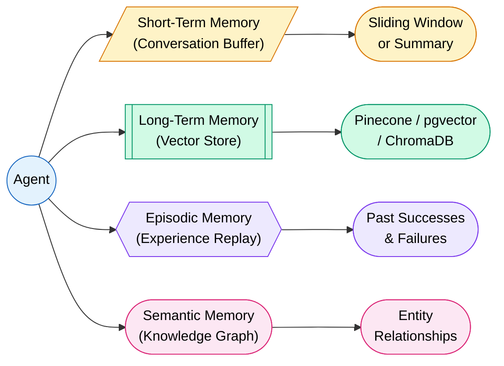

### Memory Types

| Type | What It Stores | Implementation | Analogy |
|------|---------------|----------------|---------|
| **Short-Term** | Current conversation | Message buffer, sliding window | Your working memory |
| **Long-Term** | Facts, documents, past data | Vector DB + RAG retrieval | Your filing cabinet |
| **Episodic** | Past task executions | Structured logs of success/failure | Your diary |
| **Semantic** | Entity relationships | Knowledge graphs | Your mental model |

### Why Memory Matters

Without memory, an agent:

- Forgets user preferences every session
- Repeats failed approaches
- Cannot build on previous work
- Loses context in long tasks (context window overflow)

!!! danger "Context Window is Not Memory"
    The context window is like RAM — it's fixed and expensive. Real memory requires external storage (vector DBs, files) with intelligent retrieval. An agent that stuffs everything into context will hit token limits fast.

---

## Planning & Reasoning

How agents break "Write me a full-stack app" into executable steps.

### Chain-of-Thought (CoT)

Force the model to reason step-by-step before answering.

```
Think step by step:
1. The user wants a REST API for a todo app
2. I need to create: models, routes, controllers, database schema
3. Let me start with the database schema...
```

### Tree-of-Thought (ToT)

Explore multiple reasoning paths, evaluate each, pick the best.

### Least-to-Most Prompting

Break a complex problem into simpler subproblems. Solve them in order, building on each result.

```
Complex: "Build a recommendation engine"
  -> Sub1: "What data do we have?"
  -> Sub2: "What algorithm fits this data?"
  -> Sub3: "How to serve recommendations at scale?"
  -> Sub4: "How to evaluate recommendation quality?"
```

### Hierarchical Task Decomposition

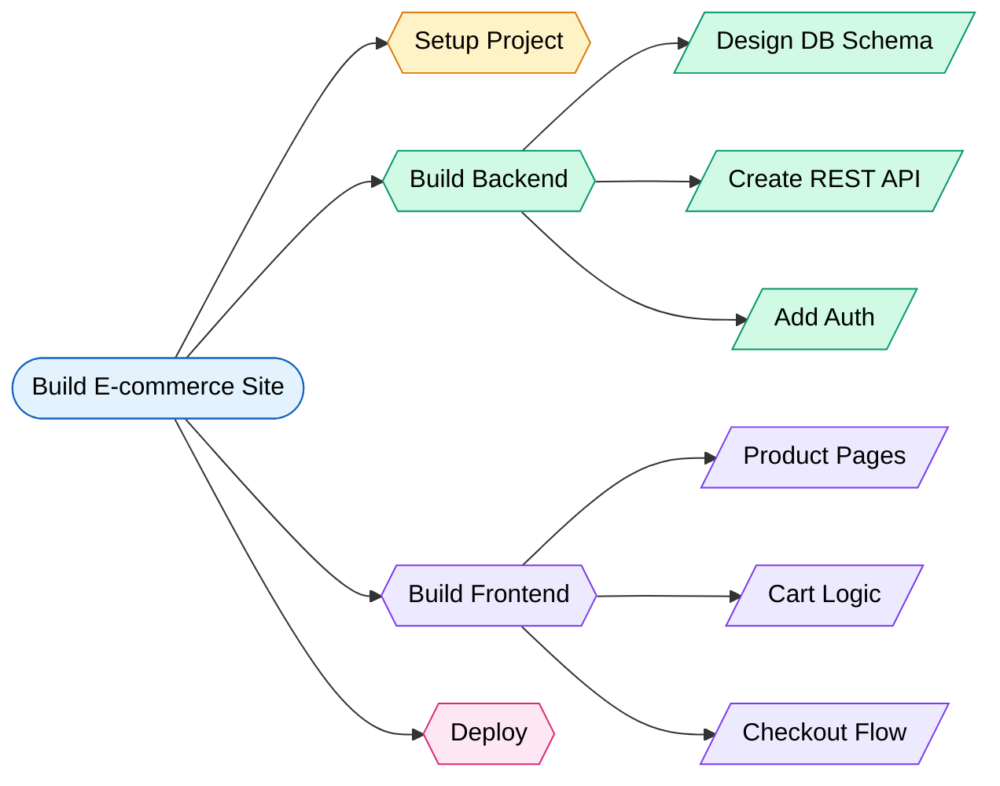

!!! tip "Planning Rule of Thumb"
    If a task takes more than 3 tool calls, the agent should plan first. If it takes more than 10, it should break the plan into phases with checkpoints.

---

## Multi-Agent Systems

One agent is powerful. Multiple specialized agents working together are unstoppable.

### Supervisor Pattern

One "boss" agent delegates to specialized workers.

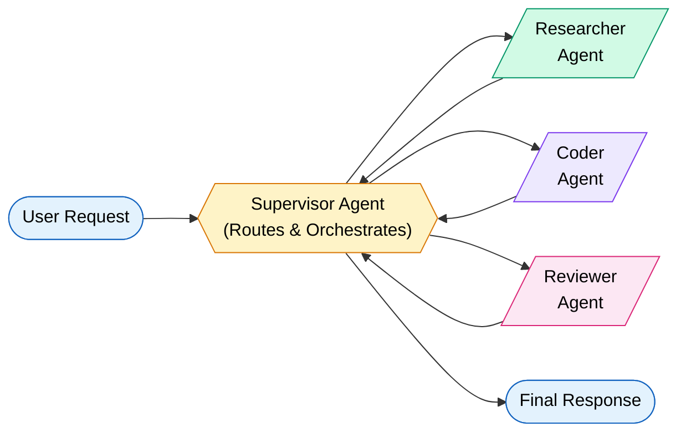

### Debate Pattern

Multiple agents argue different positions. A judge agent picks the best answer. Reduces hallucination through adversarial verification.

### Crew Pattern (CrewAI Style)

Agents with defined **roles**, **goals**, and **backstories** collaborate on a **task** with a shared **process** (sequential or hierarchical).

```python
from crewai import Agent, Task, Crew

researcher = Agent(
    role="Senior Research Analyst",
    goal="Find the latest AI trends for 2026",
    backstory="You're a veteran tech analyst at Gartner.",
    tools=[search_tool, web_scraper]
)

writer = Agent(
    role="Tech Content Writer",
    goal="Write an engaging blog post from research",
    backstory="You write for TechCrunch. Concise, punchy style."
)

research_task = Task(
    description="Research top 5 AI agent frameworks in 2026",
    agent=researcher
)

write_task = Task(
    description="Write a 1000-word blog post from the research",
    agent=writer
)

crew = Crew(
    agents=[researcher, writer],
    tasks=[research_task, write_task],
    verbose=True
)

result = crew.kickoff()
```

### Multi-Agent Collaboration Patterns

| Pattern | Agents | Communication | Best For |
|---------|--------|---------------|----------|
| **Supervisor** | 1 boss + N workers | Hub and spoke | Clear task routing |
| **Debate** | N peers + 1 judge | All-to-all | Accuracy-critical tasks |
| **Pipeline** | Sequential chain | Linear handoff | Content creation workflows |
| **Swarm** | Autonomous peers | Shared memory | Distributed exploration |

---

## Agent Frameworks

### Comparison Table

| Framework | Creator | Language | Strengths | Best For |
|-----------|---------|----------|-----------|----------|
| **LangChain/LangGraph** | LangChain | Python/JS | Graph-based workflows, state management | Complex stateful agents |
| **CrewAI** | CrewAI | Python | Role-based agents, easy multi-agent | Team-based task execution |
| **AutoGen** | Microsoft | Python | Conversation-based multi-agent | Research, code generation |
| **Claude Code/SDK** | Anthropic | Python/TS | Native tool use, managed agents | Production tool-using agents |
| **OpenAI Assistants** | OpenAI | Python/JS | File search, code interpreter built-in | Quick prototyping |
| **Semantic Kernel** | Microsoft | C#/Python | Enterprise integration, .NET native | Enterprise AI apps |
| **Haystack** | deepset | Python | Production NLP pipelines | RAG + agents combo |

### LangGraph — Stateful Agent Graphs

```python
from langgraph.graph import StateGraph, END
from typing import TypedDict, Annotated

class AgentState(TypedDict):
    messages: list
    next_step: str

def reasoning_node(state: AgentState):
    """LLM reasons about what to do next"""
    # Call LLM with current messages
    response = llm.invoke(state["messages"])
    return {"messages": state["messages"] + [response]}

def tool_node(state: AgentState):
    """Execute tool calls from LLM response"""
    # Parse and execute tool calls
    results = execute_tools(state["messages"][-1])
    return {"messages": state["messages"] + results}

def should_continue(state: AgentState):
    """Decide if we need more steps"""
    last_message = state["messages"][-1]
    if last_message.tool_calls:
        return "tools"
    return END

# Build the graph
graph = StateGraph(AgentState)
graph.add_node("reason", reasoning_node)
graph.add_node("tools", tool_node)
graph.add_edge("tools", "reason")
graph.add_conditional_edges("reason", should_continue)
graph.set_entry_point("reason")

agent = graph.compile()
```

### Anthropic Claude Agent SDK

```python
import anthropic

client = anthropic.Anthropic()

# Create a managed agent with tools
response = client.messages.create(
    model="claude-sonnet-4-20250514",
    max_tokens=4096,
    system="You are a helpful coding assistant. Use tools when needed.",
    tools=[
        {
            "name": "run_python",
            "description": "Execute Python code and return output",
            "input_schema": {
                "type": "object",
                "properties": {
                    "code": {"type": "string", "description": "Python code to run"}
                },
                "required": ["code"]
            }
        },
        {
            "name": "read_file",
            "description": "Read a file from the filesystem",
            "input_schema": {
                "type": "object",
                "properties": {
                    "path": {"type": "string", "description": "File path"}
                },
                "required": ["path"]
            }
        }
    ],
    messages=[{"role": "user", "content": "Find all TODO comments in main.py"}]
)
```

---

## MCP (Model Context Protocol)

MCP is an **open standard** for connecting AI agents to tools and data sources. Think of it as USB-C for AI — one protocol to connect to everything.

### Why MCP Matters

Before MCP: Every agent framework had its own tool format. Tools built for LangChain didn't work with CrewAI. N agents x M tools = N*M integrations.

After MCP: Build a tool once as an MCP server. Any MCP-compatible agent can use it. N agents + M tools = N+M integrations.

### Architecture

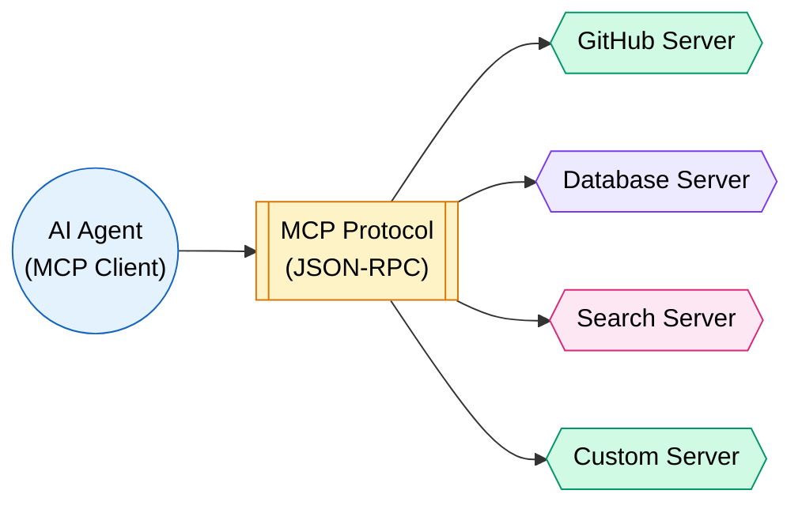

### MCP Concepts

| Concept | Description |
|---------|-------------|
| **Server** | Exposes tools, resources, and prompts via MCP protocol |
| **Client** | Agent or app that connects to MCP servers |
| **Tools** | Functions the agent can call (like REST endpoints) |
| **Resources** | Data the agent can read (like files or DB records) |
| **Prompts** | Pre-built prompt templates the server offers |
| **Transport** | stdio (local) or HTTP+SSE (remote) |

### MCP Server Example (Python)

```python
from mcp.server import Server
from mcp.types import Tool, TextContent

server = Server("my-tools")

@server.tool()
async def search_database(query: str, limit: int = 10) -> str:
    """Search the product database for matching items."""
    results = await db.search(query, limit=limit)
    return "\n".join(f"- {r.name}: ${r.price}" for r in results)

@server.tool()
async def send_email(to: str, subject: str, body: str) -> str:
    """Send an email to the specified address."""
    await email_client.send(to=to, subject=subject, body=body)
    return f"Email sent to {to}"

# Run the server
server.run()
```

!!! info "MCP is the Future of Agent Tooling"
    Claude Code, Cursor, Zed, and many IDEs already support MCP. If you're building agent tools today, build them as MCP servers. Your tools will work everywhere.

---

## Guardrails & Safety

Agents are powerful but dangerous without guardrails. An autonomous system that can execute code, send emails, and modify databases needs serious safety measures.

### Threat Model

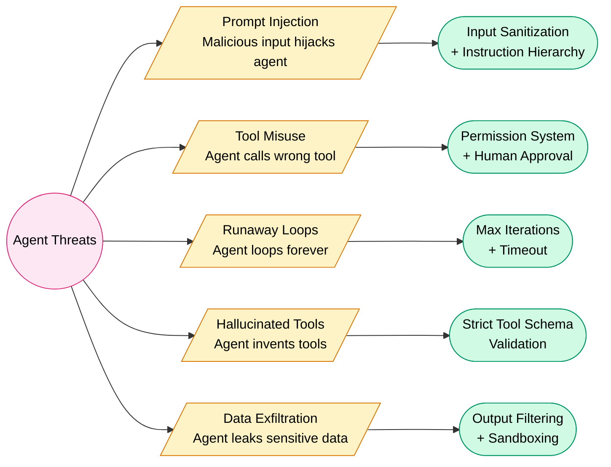

### Safety Checklist

| Guard | Implementation | Why |
|-------|---------------|-----|
| **Max iterations** | Cap loops at 10-25 steps | Prevents infinite loops |
| **Tool allowlist** | Only expose needed tools | Minimizes attack surface |
| **Human-in-the-loop** | Require approval for destructive actions | Catches mistakes before damage |
| **Output validation** | Schema-check all tool calls before execution | Prevents malformed calls |
| **Sandboxing** | Run tools in containers/VMs | Limits blast radius |
| **Rate limiting** | Throttle API calls and tool executions | Prevents runaway costs |
| **Audit logging** | Log every tool call and result | Enables post-incident analysis |

!!! danger "Never Trust Agent Output Blindly"
    An agent that can `rm -rf /` will eventually try it. Always sandbox destructive operations. Always require human approval for irreversible actions like sending emails, deleting data, or deploying code.

!!! warning "Prompt Injection is Real"
    If your agent processes user-provided content (emails, web pages, uploaded files), that content can contain instructions that hijack the agent. Always separate data from instructions. Use Anthropic's instruction hierarchy or similar defenses.

---

## Real-World Agent Examples

### Code Assistant Agent

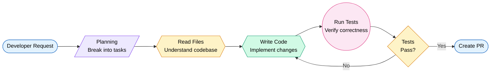

**Tools:** File read/write, terminal execution, git commands, web search, code analysis.

**Example:** Claude Code — an agent that reads your codebase, writes implementations, runs tests, and creates pull requests autonomously.

### Research Agent

**Tools:** Web search, PDF reader, note-taking, citation manager.

**Flow:** Query -> Search multiple sources -> Extract key findings -> Cross-reference -> Synthesize report.

### Customer Support Agent

**Tools:** Knowledge base search, ticket system, CRM lookup, escalation.

**Flow:** Understand query -> Search KB -> If answer found: respond. If not: gather info -> escalate to human.

### Data Analysis Agent

**Tools:** SQL execution, Python (pandas/matplotlib), file system, chart generation.

**Flow:** Understand question -> Write SQL -> Execute -> Analyze results -> Generate visualizations -> Write report.

---

## Building Your First Agent

Here's a complete, runnable agent using Claude's tool use:

```python
import anthropic
import json

client = anthropic.Anthropic()

# Define tools
tools = [
    {
        "name": "calculator",
        "description": "Perform mathematical calculations. Use for any math operation.",
        "input_schema": {
            "type": "object",
            "properties": {
                "expression": {
                    "type": "string",
                    "description": "Math expression to evaluate, e.g. '2 + 2' or 'sqrt(144)'"
                }
            },
            "required": ["expression"]
        }
    },
    {
        "name": "get_current_time",
        "description": "Get the current date and time in a specific timezone.",
        "input_schema": {
            "type": "object",
            "properties": {
                "timezone": {
                    "type": "string",
                    "description": "Timezone name, e.g. 'US/Eastern', 'Europe/London'"
                }
            },
            "required": ["timezone"]
        }
    }
]

# Tool implementations
def execute_tool(name: str, inputs: dict) -> str:
    if name == "calculator":
        try:
            # WARNING: eval is dangerous in production. Use a safe math parser.
            result = eval(inputs["expression"])
            return json.dumps({"result": result})
        except Exception as e:
            return json.dumps({"error": str(e)})
    elif name == "get_current_time":
        from datetime import datetime
        import pytz
        tz = pytz.timezone(inputs["timezone"])
        now = datetime.now(tz)
        return json.dumps({"time": now.strftime("%Y-%m-%d %H:%M:%S %Z")})
    return json.dumps({"error": f"Unknown tool: {name}"})

# Agent loop
def run_agent(user_message: str, max_iterations: int = 10):
    messages = [{"role": "user", "content": user_message}]

    for i in range(max_iterations):
        response = client.messages.create(
            model="claude-sonnet-4-20250514",
            max_tokens=1024,
            tools=tools,
            messages=messages
        )

        # If no tool use, we have our final answer
        if response.stop_reason == "end_turn":
            final_text = next(
                (b.text for b in response.content if hasattr(b, "text")), ""
            )
            return final_text

        # Process tool calls
        messages.append({"role": "assistant", "content": response.content})

        tool_results = []
        for block in response.content:
            if block.type == "tool_use":
                result = execute_tool(block.name, block.input)
                tool_results.append({
                    "type": "tool_result",
                    "tool_use_id": block.id,
                    "content": result
                })

        messages.append({"role": "user", "content": tool_results})

    return "Agent reached maximum iterations without completing."

# Run it
answer = run_agent("What's 1547 * 382, and what time is it in Tokyo?")
print(answer)
```

!!! tip "Key Takeaways from This Code"
    1. The agent loop is just a `while` loop with an LLM call inside.
    2. Stop when `stop_reason` is `end_turn` (model is done).
    3. Always set `max_iterations` to prevent infinite loops.
    4. Feed tool results back in the expected format (role: user, type: tool_result).

---

## Common Pitfalls

### The Top Mistakes When Building Agents

| Pitfall | What Happens | Fix |
|---------|-------------|-----|
| **Infinite loops** | Agent retries the same failing action forever | Max iterations + loop detection |
| **Context window overflow** | Agent accumulates too many messages and hits token limit | Summarize old messages, use external memory |
| **Hallucinated tool calls** | Agent invents tools that don't exist | Strict schema validation, clear tool list |
| **Over-engineering** | Using 5 agents for a task that needs 1 API call | Start simple. Add agents only when needed |
| **Poor tool descriptions** | Agent picks wrong tools or passes wrong arguments | Write descriptions like API docs. Include examples |
| **No error handling** | Tool fails and agent crashes | Wrap tool calls in try/catch, return error messages |
| **God-mode agents** | Agent has access to everything with no permissions | Principle of least privilege. Scope tools tightly |
| **Ignoring costs** | Each agent step = API call = money | Cache results, limit iterations, use cheaper models for simple steps |

### The Complexity Ladder

```
Simple chatbot     -> Add tools          -> Add memory
    -> Add planning    -> Add multi-agent    -> Add evaluation

Don't jump to multi-agent when a single tool call solves it.
```

!!! danger "The #1 Rule of Agent Engineering"
    Start with the simplest architecture that could possibly work. A single ReAct agent with 3 tools solves 80% of use cases. Multi-agent systems are for the other 20% — and they're 10x harder to debug.

!!! warning "Cost Awareness"
    A multi-agent system with 4 agents, each making 5 tool calls, using GPT-4 class models = 20+ API calls per user request. At $0.01-0.03 per call, that's $0.20-0.60 per request. Plan your architecture with cost in mind.

---

## Interview Questions

??? question "1. What is an AI Agent and how does it differ from a chatbot?"
    An AI Agent is an LLM augmented with tools, memory, and planning capabilities that can take autonomous actions. Key differences: (1) Agents can call tools and execute code, chatbots only generate text. (2) Agents maintain state across interactions via external memory. (3) Agents plan multi-step solutions and self-correct. (4) Agents operate in a loop (Think-Act-Observe) rather than single-turn request-response. A chatbot is reactive; an agent is proactive.

??? question "2. Explain the ReAct pattern and why it works better than pure Chain-of-Thought."
    ReAct (Reason + Act) interleaves reasoning with tool execution in a loop: Think -> Act -> Observe -> Think. It outperforms pure CoT because: (1) Grounding — observations from real tools prevent hallucination. (2) Adaptability — the agent adjusts its plan based on actual results. (3) Transparency — the reasoning trace is auditable. Pure CoT reasons entirely in the model's head with no external verification. ReAct verifies each step against reality.

??? question "3. How does function calling / tool use work in LLMs?"
    The LLM doesn't execute tools directly. It outputs structured JSON describing which function to call and with what arguments. The runtime: (1) Parses the tool call from the model's response. (2) Validates arguments against the tool's JSON schema. (3) Executes the function. (4) Returns the result to the model in the next message. The model then incorporates the result into its reasoning. Tool definitions include name, description, and parameter schema — the model uses these to decide when and how to call tools.

??? question "4. Compare short-term, long-term, and episodic memory in agents."
    Short-term memory: the current conversation buffer. Limited by context window. Lost after session. Implementation: message list with sliding window or summarization. Long-term memory: persistent facts and knowledge stored in vector databases. Retrieved via similarity search (RAG). Survives across sessions. Episodic memory: records of past task executions — what worked and what failed. Enables learning from experience. Implementation: structured logs indexed by task type. Each serves a different purpose: STM for current context, LTM for knowledge, episodic for experience.

??? question "5. What is MCP and why is it important for the agent ecosystem?"
    MCP (Model Context Protocol) is an open standard for connecting AI agents to tools and data sources. It defines a JSON-RPC based protocol with concepts like tools, resources, and prompts. Before MCP, every framework had its own tool format — N agents x M tools = NxM integrations. With MCP, you build a tool once as an MCP server, and any MCP client can use it (N+M integrations). It supports stdio transport for local tools and HTTP+SSE for remote. Claude Code, Cursor, and many IDEs support it. It's the "USB-C of AI tooling."

??? question "6. How do you prevent an agent from entering an infinite loop?"
    Multiple defenses: (1) Set a hard max_iterations cap (typically 10-25). (2) Implement loop detection — if the agent calls the same tool with the same args 3 times, force-stop. (3) Use a timeout per task (e.g., 5 minutes total). (4) Track token usage and abort if budget exceeded. (5) Implement exponential backoff on repeated failures. (6) Add a "stuck detector" that notices when the agent isn't making progress. In production, always combine multiple guards.

??? question "7. Explain the Plan-and-Execute pattern and when to use it over ReAct."
    Plan-and-Execute separates planning from execution. A planner LLM creates a full plan of steps. An executor LLM handles each step. If a step fails, the planner replans. Use it over ReAct when: (1) Tasks have 5+ steps that benefit from upfront structure. (2) You need a visible, auditable plan before execution. (3) Steps have dependencies that need coordination. (4) You want to use a cheaper model for execution and a smarter one for planning. ReAct is better for simple, reactive tasks where the next step depends heavily on the previous result.

??? question "8. What are the main multi-agent collaboration patterns?"
    Four main patterns: (1) Supervisor — one orchestrator routes tasks to specialist agents. Good for clear role separation. (2) Debate — multiple agents argue positions, a judge picks the best. Reduces hallucination through adversarial verification. (3) Pipeline — agents in sequence, each transforming output for the next (researcher -> writer -> editor). (4) Swarm — autonomous agents with shared memory, no central coordinator. Good for distributed exploration. Choose based on: task decomposability, accuracy requirements, and coordination complexity.

??? question "9. How do you handle prompt injection in agent systems?"
    Prompt injection is when malicious content in user-provided data hijacks the agent's instructions. Defenses: (1) Instruction hierarchy — system prompts take priority over user content. (2) Input sanitization — strip or escape potential injection patterns. (3) Data isolation — process untrusted content in separate, restricted agent calls. (4) Output filtering — validate tool calls against expected patterns. (5) Privilege separation — agents processing untrusted content get fewer tool permissions. (6) Canary tokens — embed detectable markers to identify when instructions leak. No single defense is sufficient; use defense in depth.

??? question "10. Compare LangGraph, CrewAI, and Anthropic's agent SDK."
    LangGraph: Graph-based state machines for complex agent workflows. Strengths: fine-grained control over state transitions, checkpointing, human-in-the-loop. Best for: complex, stateful workflows. CrewAI: Role-based multi-agent framework. Strengths: intuitive agent personas, easy multi-agent setup, built-in collaboration patterns. Best for: team-based task execution where agents have distinct roles. Anthropic SDK: Native tool use with minimal abstraction. Strengths: direct API access, low overhead, production-ready, managed agents feature. Best for: production systems needing reliability and simplicity over complex orchestration.

??? question "11. What is the 'hallucinated tool call' problem and how do you solve it?"
    The model sometimes invents tool names that don't exist, or passes arguments that don't match the schema. Solutions: (1) Strict schema validation before executing any tool call. (2) Return clear error messages ("Tool X doesn't exist. Available tools: A, B, C") so the model self-corrects. (3) Use `tool_choice` to constrain which tools can be called. (4) Keep the tool list small and well-described — fewer options means fewer mistakes. (5) In the system prompt, explicitly list available tools and their exact names. (6) Test with adversarial inputs that might confuse tool selection.

??? question "12. How do you manage context window limits in long-running agents?"
    Strategies: (1) Sliding window — keep only the last N messages, summarize older ones. (2) Hierarchical summarization — periodically compress conversation history into summaries. (3) External memory — store important facts in a vector DB, retrieve only what's relevant. (4) Selective context — only include tool results that are relevant to the current step. (5) Token budgeting — allocate portions of the context window (system: 20%, history: 40%, current: 40%). (6) Compaction — use a smaller model to summarize before passing to the main model. The key insight: treat context like RAM and use "disk" (external storage) for everything else.

??? question "13. Design a multi-agent system for automated code review."
    Architecture: (1) Supervisor agent receives PR diff and routes to specialists. (2) Security agent scans for vulnerabilities (SQL injection, XSS, hardcoded secrets). (3) Style agent checks coding standards, naming conventions, complexity. (4) Logic agent traces code paths for bugs, race conditions, edge cases. (5) Test agent verifies test coverage, suggests missing tests. (6) Summarizer agent collects all findings, deduplicates, prioritizes by severity, and generates the final review. Tools needed: git diff parser, AST analyzer, test runner, documentation lookup. Each specialist uses a focused system prompt and limited tools for their domain.

??? question "14. What are the cost optimization strategies for production agents?"
    Strategies: (1) Model tiering — use cheap models (Haiku) for simple steps, expensive models (Opus) for complex reasoning. (2) Caching — cache tool results for identical inputs. (3) Batching — group multiple tool calls into one when possible. (4) Early termination — detect when the task is complete and stop iterating. (5) Prompt compression — minimize system prompt tokens without losing capability. (6) Result truncation — summarize large tool outputs before feeding back. (7) Circuit breakers — abort expensive paths that aren't converging. (8) Async execution — run independent tool calls in parallel to reduce latency (same cost but better UX).

??? question "15. Walk through building a production-ready agent from scratch."
    Step 1: Define the task scope and required tools (start narrow). Step 2: Implement a basic ReAct loop with 2-3 tools. Step 3: Add guardrails — max iterations, timeout, output validation, error handling. Step 4: Add memory — conversation buffer for short-term, vector DB for long-term context. Step 5: Add observability — log every LLM call, tool call, and result for debugging. Step 6: Add evaluation — create test cases with expected outcomes, measure success rate. Step 7: Add human-in-the-loop for destructive actions. Step 8: Load test — verify costs at scale, add caching where needed. Step 9: Deploy with feature flags to gradually roll out. Step 10: Monitor in production — track latency, cost, success rate, and failure modes. The key principle: ship the simplest version first, then iterate based on real failure modes.
