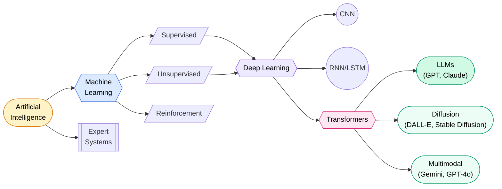
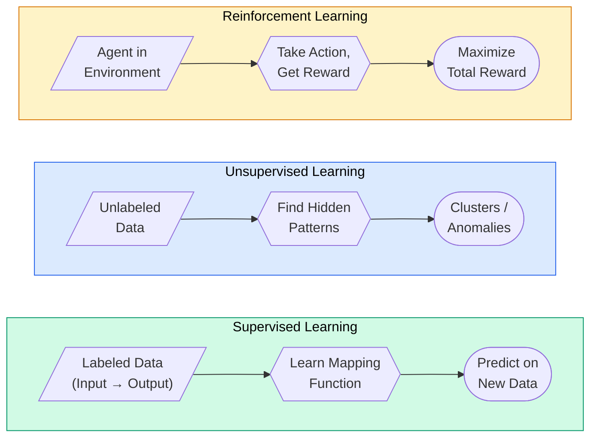
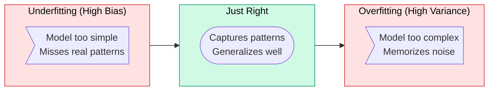
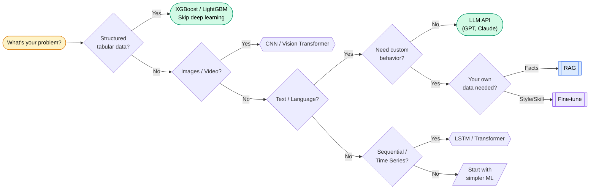

# AI & Machine Learning

> **From linear regression to GPT — everything a software engineer needs to know about AI/ML, explained so a fresher gets it and a 10-year vet finds value.**

---

## The AI Landscape

**AI** = machines that mimic human intelligence. **ML** = AI that learns from data instead of explicit rules. **Deep Learning** = ML with neural networks (many layers). **Generative AI** = models that create new content.

Think of it like cooking: AI is the kitchen, ML is learning recipes by tasting food, Deep Learning is a sous chef with incredible memory, GenAI is a chef that invents new dishes.

---

## What's in This Section

| Page | What You'll Learn | Who It's For |
|------|-------------------|-------------|
| **[Neural Networks & Deep Learning](neural-networks.md)** | How neurons compute, backpropagation, CNN for images, RNN for sequences | Everyone starting ML |
| **[Transformers & LLMs](transformers-llms.md)** | Attention mechanism, GPT vs BERT, how LLMs are trained, prompt engineering | Anyone working with AI APIs |
| **[RAG & Vector Databases](rag.md)** | Retrieval-augmented generation, chunking, embeddings, Pinecone/pgvector | Building AI-powered apps |
| **[AI Agents & Tools](agents.md)** | ReAct loop, function calling, multi-agent systems, LangChain/CrewAI | Building autonomous systems |
| **[MLOps & Production AI](mlops.md)** | Model serving, drift detection, monitoring, deployment patterns | Deploying ML to production |
| **[Fine-Tuning Guide](fine-tuning.md)** | LoRA, QLoRA, RLHF, when to fine-tune vs RAG, practical walkthrough | Customizing models |

---

## Supervised vs Unsupervised vs Reinforcement

| | Supervised | Unsupervised | Reinforcement |
|---|---|---|---|
| **Data** | Labeled (input → output) | Unlabeled (just input) | Environment + rewards |
| **Goal** | Predict output for new input | Find hidden patterns | Maximize cumulative reward |
| **Analogy** | Studying with answer key | Sorting a messy closet | Training a dog with treats |
| **Algorithms** | Linear Regression, SVM, Random Forest, XGBoost | K-Means, DBSCAN, PCA, Autoencoders | Q-Learning, PPO, DQN, A3C |
| **Use Cases** | Spam detection, price prediction, medical diagnosis | Customer segmentation, anomaly detection, recommendation | Game AI, robotics, ad bidding, autonomous driving |

### Semi-Supervised Learning

Small labeled dataset + large unlabeled dataset. Model learns patterns from unlabeled data and fine-tunes with labels. Real-world: medical imaging (labeling X-rays costs radiologist time — use 100 labeled + 10,000 unlabeled).

### Self-Supervised Learning

Model creates its own labels from the data. GPT predicts the next word. BERT masks random words and predicts them. This is how LLMs train on the entire internet without human labeling. The most important paradigm shift in modern AI.

---

## Core ML Algorithms

### Classification (Predicting Categories)

| Algorithm | How It Works | When to Use | Fun Analogy |
|-----------|-------------|-------------|-------------|
| **Logistic Regression** | Draws a line. Above = class A, below = class B. | Binary classification, baseline | Sorting mail: spam or not |
| **Decision Tree** | Asks yes/no questions in sequence | Interpretable results needed | 20 Questions game |
| **Random Forest** | 100+ decision trees vote. Majority wins. | Most tabular problems | Asking 100 experts, majority rules |
| **XGBoost** | Trees built sequentially, each fixing prior mistakes | Kaggle competitions, structured data | Student learning from wrong answers |
| **SVM** | Finds widest gap between classes | Small datasets, text classification | Building a wall between two groups |
| **KNN** | Looks at K nearest neighbors, majority class wins | Simple problems, baseline | "You are the average of your 5 closest friends" |

!!! tip "Which Algorithm Should I Pick?"
    Start with Logistic Regression (baseline). Try Random Forest next (usually good enough). XGBoost for competitions. Deep Learning for images/text/audio. Most production tabular ML is XGBoost or LightGBM.

### Regression (Predicting Numbers)

| Algorithm | Best For | Gotcha |
|-----------|---------|--------|
| **Linear Regression** | Simple relationships (price ~ area) | Assumes linear relationship |
| **Polynomial Regression** | Curved relationships | Overfits easily with high degree |
| **Ridge (L2)** | Too many features | Shrinks all weights, keeps all features |
| **Lasso (L1)** | Feature selection needed | Pushes some weights to exactly zero |
| **XGBoost Regressor** | Complex tabular data | Needs more tuning |

### Clustering (Finding Groups)

| Algorithm | How It Works | When to Use | Gotcha |
|-----------|-------------|-------------|--------|
| **K-Means** | Assign to K centroids, repeat | General-purpose clustering | Must choose K upfront |
| **DBSCAN** | Groups dense regions, marks sparse as noise | Irregular cluster shapes | Varying densities fail |
| **Hierarchical** | Builds tree of clusters (dendrogram) | When you want to visualize hierarchy | Slow on large datasets |
| **Gaussian Mixture** | Soft clustering (probability per cluster) | Overlapping clusters | Sensitive to initialization |

---

## Bias-Variance Tradeoff

The fundamental tension in all of machine learning.

| | High Bias (Underfitting) | High Variance (Overfitting) |
|---|---|---|
| **What** | Model too simple. Misses patterns. | Model too complex. Memorizes noise. |
| **Training accuracy** | Low | Very high |
| **Test accuracy** | Low | Low (drops from training) |
| **Analogy** | Studying only chapter titles | Memorizing answers without understanding |
| **Fix** | More features, complex model | More data, regularization, dropout |

### Regularization

- **L1 (Lasso)** — pushes some weights to zero. Built-in feature selection.
- **L2 (Ridge)** — shrinks all weights. Prevents any single feature from dominating.
- **Elastic Net** — L1 + L2 combined. Best of both.
- **Dropout** — randomly disable neurons during training. Forces redundancy.
- **Early stopping** — stop training when validation loss starts increasing.
- **Data augmentation** — artificially increase dataset (flip, rotate, crop images).

---

## Evaluation Metrics

### Classification

| Metric | What It Measures | When to Use |
|--------|-----------------|-------------|
| **Accuracy** | % correct overall | Balanced classes only |
| **Precision** | Of predicted positives, how many correct? | False positives costly (spam filter) |
| **Recall** | Of actual positives, how many found? | False negatives costly (cancer detection) |
| **F1 Score** | Harmonic mean of precision & recall | Imbalanced classes |
| **AUC-ROC** | Area under ROC curve | Comparing models, threshold-independent |
| **Confusion Matrix** | TP, FP, TN, FN breakdown | Understanding error types |

!!! danger "Accuracy Trap"
    Dataset with 95% negative, 5% positive. A model that always predicts "negative" gets 95% accuracy. Useless. Always check precision, recall, F1 for imbalanced datasets.

### Regression

| Metric | Formula | Interpretation |
|--------|---------|---------------|
| **MAE** | Mean |predicted - actual| | Average error in original units |
| **MSE** | Mean (predicted - actual)² | Penalizes large errors more |
| **RMSE** | √MSE | Same units as target variable |
| **R²** | 1 - (SS_res / SS_tot) | % of variance explained (1.0 = perfect) |

### LLM-Specific

| Metric | What It Measures |
|--------|-----------------|
| **Perplexity** | How surprised the model is. Lower = better. |
| **BLEU** | N-gram overlap with reference (translation) |
| **ROUGE** | Recall-oriented overlap (summarization) |
| **Human eval** | Human judges rate quality. Gold standard. |
| **LLM-as-judge** | Stronger model evaluates. Scalable alternative. |
| **MMLU** | Multi-task benchmark across 57 subjects |

---

## AI for Software Engineers

### When to Use What

### Integration Patterns

| Pattern | When | Tools |
|---------|------|-------|
| **API call** | Quick integration, hosted model | OpenAI API, Anthropic API, Google Vertex |
| **Self-hosted** | Data privacy, cost control, customization | Ollama, vLLM, TGI, llama.cpp |
| **Fine-tune** | Domain-specific behavior | LoRA + Hugging Face, OpenAI fine-tuning |
| **RAG** | Your data + LLM intelligence | LangChain, LlamaIndex, Spring AI |
| **Agents** | Multi-step autonomous tasks | LangGraph, CrewAI, Claude Code |

### Essential Libraries

| Library | Language | Purpose |
|---------|----------|---------|
| **scikit-learn** | Python | Classical ML (the first thing you learn) |
| **PyTorch** | Python | Deep learning, research favorite |
| **Hugging Face** | Python | Model hub, transformers, tokenizers |
| **LangChain** | Python/JS | LLM app framework, chains, agents, RAG |
| **LlamaIndex** | Python | Data ingestion, indexing, RAG pipelines |
| **Ollama** | CLI | Run LLMs locally (Llama, Mistral, Phi) |
| **Spring AI** | Java | Spring Boot integration for LLM APIs |
| **TensorFlow** | Python | Deep learning, production deployment |

---

## Quick Interview Q&A

??? question "1. Supervised vs unsupervised learning?"
    Supervised = labeled data, predict outputs (spam detection, price prediction). Unsupervised = unlabeled data, find patterns (clustering, anomaly detection). Semi-supervised = small labeled + large unlabeled. Self-supervised = model creates own labels (how LLMs train).

??? question "2. What is the bias-variance tradeoff?"
    Bias = underfitting (model too simple). Variance = overfitting (memorizes noise). Goal: minimize both. Tools: regularization (L1/L2), cross-validation, ensemble methods, more data.

??? question "3. Precision vs Recall — when does each matter?"
    Precision: "of my predictions, how many were right?" Matters when false positives are costly (spam filter marking real email as spam). Recall: "of all actual positives, how many did I catch?" Matters when false negatives are costly (missing a cancer diagnosis).

??? question "4. XGBoost vs Random Forest vs Neural Network?"
    XGBoost: sequential trees, best for structured/tabular data, wins Kaggle. Random Forest: parallel trees, more robust, less tuning needed. Neural Networks: best for unstructured data (images, text, audio), need more data and compute. For tabular data, XGBoost usually beats neural nets.

??? question "5. When would you NOT use deep learning?"
    Small datasets (<1000 rows). Tabular/structured data (XGBoost is better). Need interpretability (healthcare, finance). Latency constraints (<1ms). Limited compute budget. When a simple model solves the problem.

??? question "6. What is transfer learning?"
    Use a model pre-trained on a large dataset, adapt it to your task. Example: take ResNet trained on ImageNet (14M images), freeze early layers, retrain last layers on your 500 X-ray images. Works because early layers learn general features (edges, textures).

??? question "7. How do you handle imbalanced datasets?"
    Metrics: use F1/AUC, not accuracy. Data: oversample minority (SMOTE), undersample majority. Model: class weights, cost-sensitive learning. Ensemble: balanced bagging. Threshold: adjust classification threshold.

??? question "8. K-Means — how do you choose K?"
    Elbow method: plot inertia vs K, find the "elbow" where improvement slows. Silhouette score: measures cluster cohesion vs separation (-1 to 1, higher is better). Domain knowledge: sometimes K is obvious (customer tiers: bronze/silver/gold).

??? question "9. What is feature engineering?"
    Creating new input features from raw data. Examples: extract hour/day from timestamp, one-hot encode categories, log-transform skewed features, create ratios (price/sqft). Often matters more than algorithm choice. "Applied ML is 80% feature engineering."

??? question "10. Explain cross-validation."
    Split data into K folds. Train on K-1, test on remaining fold. Repeat K times. Average the scores. Gives reliable performance estimate. Prevents lucky/unlucky train-test splits. Standard: 5-fold or 10-fold CV.
