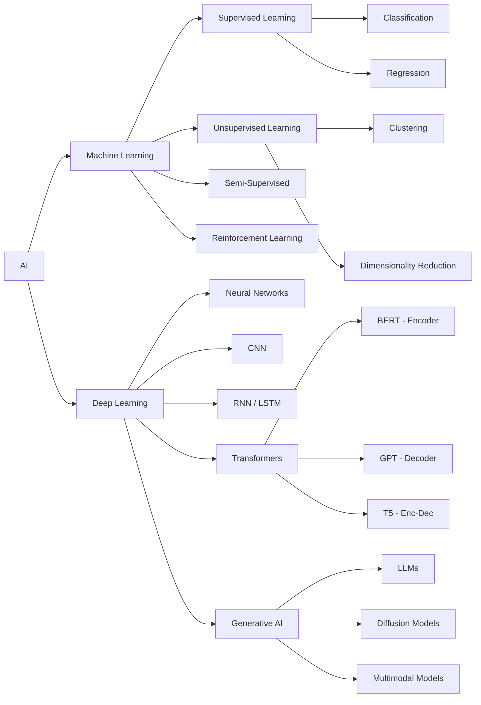
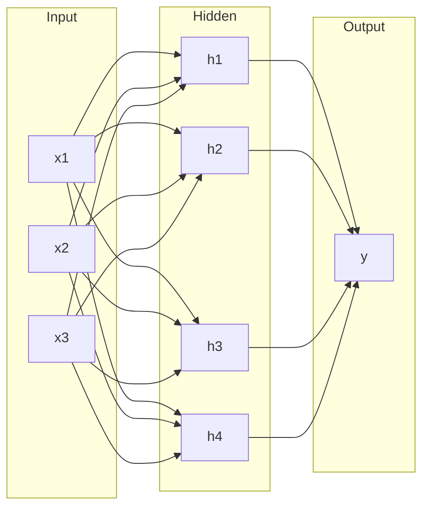
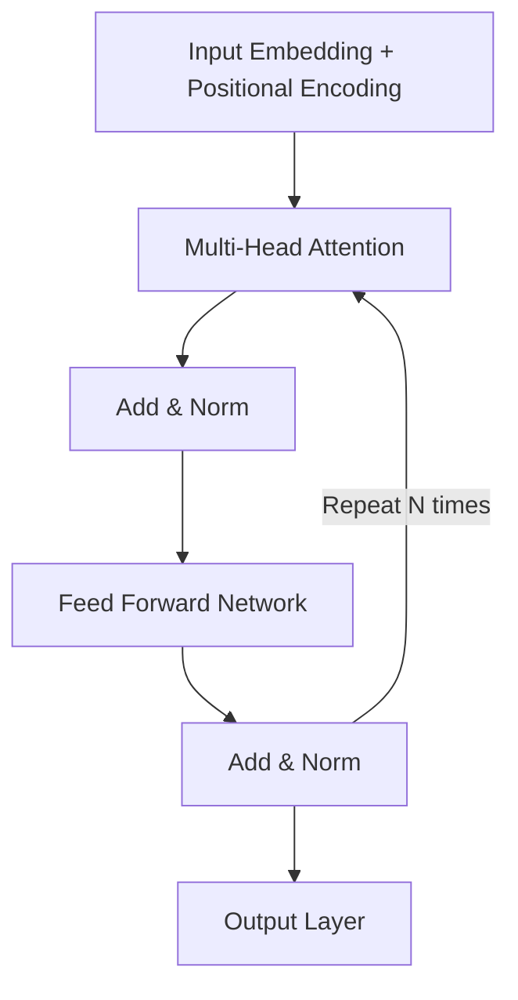
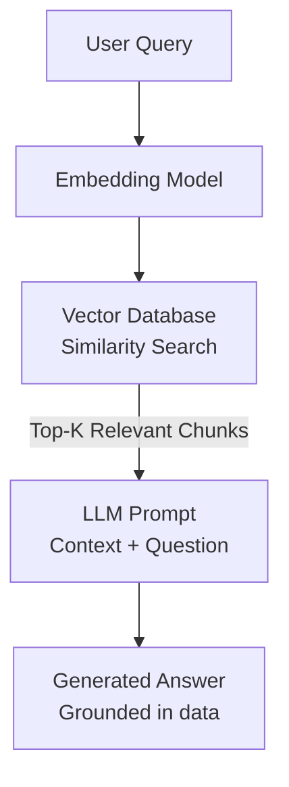
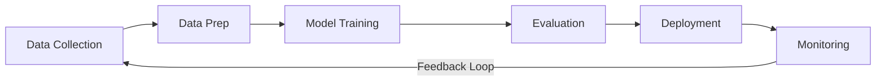

# AI & Machine Learning

## Landscape Overview



## Key Concepts

### Supervised vs Unsupervised Learning

| Aspect | Supervised | Unsupervised |
|---|---|---|
| **Data** | Labeled | Unlabeled |
| **Goal** | Predict output | Find patterns |
| **Examples** | Spam detection, price prediction | Clustering customers, anomaly detection |
| **Algorithms** | Linear Regression, SVM, Random Forest | K-Means, DBSCAN, PCA |

### Neural Networks

A neural network consists of layers of interconnected nodes (neurons):



**Activation Functions:**

| Function | Formula | Use Case |
|---|---|---|
| ReLU | `max(0, x)` | Hidden layers (default) |
| Sigmoid | `1 / (1 + e^-x)` | Binary classification |
| Softmax | `e^xi / Σe^xj` | Multi-class classification |
| Tanh | `(e^x - e^-x) / (e^x + e^-x)` | RNNs, normalized output |

## Transformers & Attention

The transformer architecture powers modern LLMs. The key innovation is the **self-attention mechanism**.

### Self-Attention

For each token, compute how much attention to pay to every other token:

```
Attention(Q, K, V) = softmax(QK^T / √d_k) × V
```

- **Q** (Query): What am I looking for?
- **K** (Key): What do I contain?
- **V** (Value): What information do I provide?

### Transformer Architecture



## Large Language Models (LLMs)

| Model | Creator | Parameters | Key Feature |
|---|---|---|---|
| GPT-4o | OpenAI | ~200B+ | Multimodal, reasoning |
| Claude | Anthropic | — | Safety-focused, long context |
| Gemini | Google | — | Multimodal, code generation |
| Llama 3 | Meta | 8B-405B | Open-source |
| Mistral | Mistral AI | 7B-8x22B | Efficient, open-source |

### Prompt Engineering

!!! tip "Effective Prompting Techniques"
    - **Zero-shot**: Direct instruction with no examples
    - **Few-shot**: Provide 2-3 examples before the actual task
    - **Chain-of-Thought**: Ask the model to "think step by step"
    - **System prompts**: Set role and behavior constraints
    - **Temperature**: Lower (0.0-0.3) for factual, higher (0.7-1.0) for creative

## RAG (Retrieval-Augmented Generation)

RAG combines a retrieval system with an LLM to ground responses in real data.



### Vector Databases

| Database | Type | Best For |
|---|---|---|
| **Pinecone** | Cloud-managed | Production RAG, easy setup |
| **Weaviate** | Open-source | Hybrid search, multi-tenancy |
| **ChromaDB** | Open-source | Quick prototyping, local dev |
| **Milvus** | Open-source | Large-scale, high-performance |
| **pgvector** | PostgreSQL ext. | Adding vectors to existing Postgres |

## MLOps

MLOps is DevOps for machine learning — automating the ML lifecycle.



### Key MLOps Tools

| Category | Tools |
|---|---|
| **Experiment Tracking** | MLflow, Weights & Biases, Neptune |
| **Feature Store** | Feast, Tecton, Hopsworks |
| **Model Registry** | MLflow, Vertex AI, SageMaker |
| **Serving** | TensorFlow Serving, Triton, BentoML |
| **Orchestration** | Kubeflow, Airflow, Prefect |
| **Monitoring** | Evidently AI, Arize, WhyLabs |

## AI for Software Engineers

### Common Integration Patterns

1. **API-based**: Call OpenAI / Anthropic / Google APIs directly
2. **Self-hosted**: Run open-source models (Llama, Mistral) with vLLM or Ollama
3. **Fine-tuning**: Customize a base model on your domain data
4. **RAG**: Augment LLMs with your organization's knowledge base
5. **Agents**: Build autonomous systems that use tools and plan actions

### Useful Libraries

| Library | Purpose |
|---|---|
| **LangChain** | LLM application framework, chains, agents |
| **LlamaIndex** | Data ingestion and RAG framework |
| **Hugging Face** | Model hub, tokenizers, transformers library |
| **scikit-learn** | Classical ML algorithms |
| **PyTorch** | Deep learning framework |
| **TensorFlow** | Deep learning framework |
| **Ollama** | Run LLMs locally |
