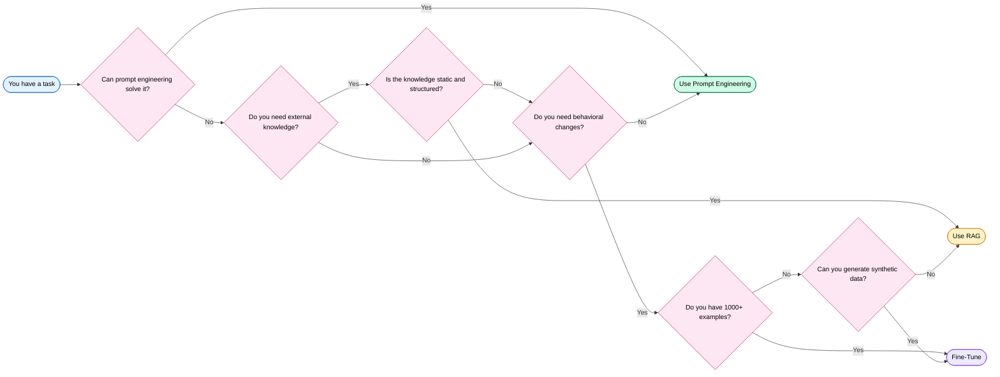
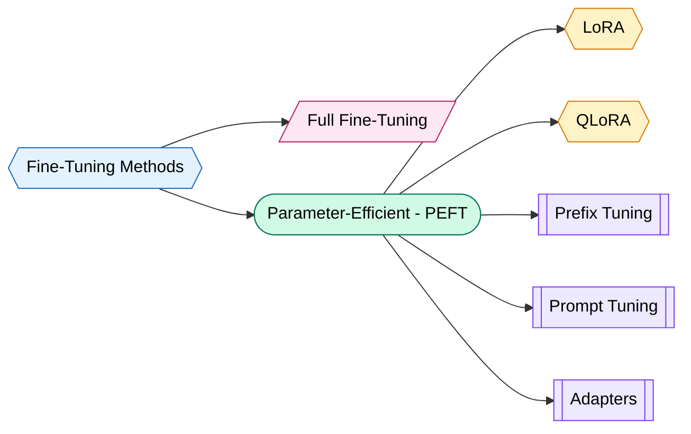
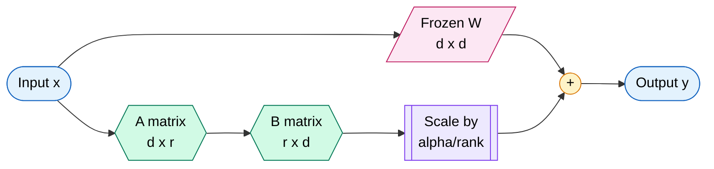
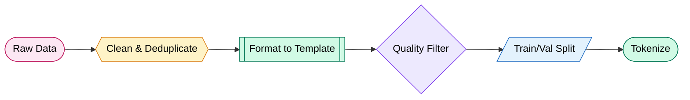
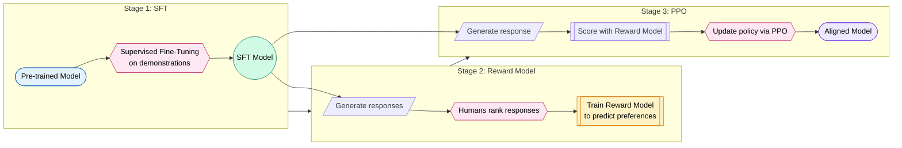
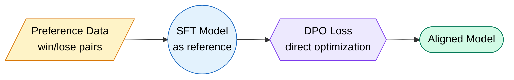
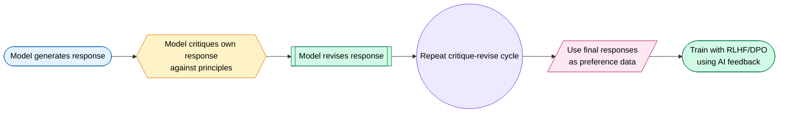
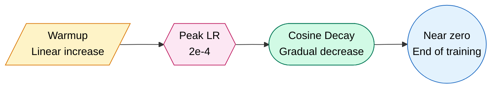
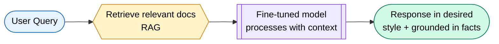

# Fine-Tuning LLMs

Fine-tuning is teaching an old model new tricks. You take a pre-trained LLM and specialize it on your domain. Think of it like hiring a brilliant generalist and giving them domain-specific training.

---

## When to Fine-Tune

Not every problem needs fine-tuning. Most don't. Here's the decision flowchart:



!!! tip "Rule of Thumb"
    Try prompt engineering first. Then RAG. Fine-tuning is for when you need the model to **behave differently**, not just **know more**.

| Approach | Best For | Data Needed | Cost | Latency |
|----------|----------|-------------|------|---------|
| Prompt Engineering | Format control, simple tasks | 0-10 examples | Lowest | Higher (long prompts) |
| RAG | Knowledge-heavy tasks | Documents | Medium | Medium |
| Fine-Tuning | Style/behavior changes | 1K-100K examples | High upfront | Lower at inference |
| Train from Scratch | Novel domains, new languages | Billions of tokens | Massive | Lowest |

---

## Fine-Tuning Methods

### The Landscape



### Comparison Table

| Method | Params Trained | Memory | Quality | Speed | Use Case |
|--------|---------------|--------|---------|-------|----------|
| **Full Fine-Tuning** | 100% | Very High | Best | Slowest | Unlimited budget |
| **LoRA** | 0.1-1% | Low | Near-full | Fast | Production standard |
| **QLoRA** | 0.1-1% | Very Low | Good | Medium | Consumer GPUs |
| **Prefix Tuning** | <0.1% | Very Low | Moderate | Fast | Simple adaptations |
| **Prompt Tuning** | <0.01% | Minimal | Lower | Fastest | Lightweight tasks |
| **Adapters** | 1-5% | Low | Good | Fast | Multi-task models |

### Full Fine-Tuning

Updates every parameter in the model. Like remodeling your entire house when you only needed a new kitchen.

- Requires 4-16x model size in GPU memory (optimizer states, gradients)
- A 7B model needs ~120GB VRAM for full fine-tuning in fp16
- Risk of catastrophic forgetting is highest

### Prefix Tuning

Prepends trainable "virtual tokens" to the key/value pairs in every attention layer. The original model stays frozen.

### Prompt Tuning

Even simpler: learns a small continuous embedding prepended to the input. Only works well for large models (10B+).

### Adapters

Small trainable modules inserted between transformer layers. Slightly more parameters than LoRA but very modular.

---

## LoRA Deep Dive

LoRA (Low-Rank Adaptation) is the most popular fine-tuning method. It's elegant, efficient, and mathematically beautiful.

### The Core Idea

Instead of updating the full weight matrix W (d x d), decompose the update into two smaller matrices:

```
W_new = W_frozen + (alpha/rank) * A x B
```

Where:

- `W_frozen` is the original weight matrix (stays frozen)
- `A` is shape (d x r) — the down-projection
- `B` is shape (r x d) — the up-projection  
- `r` (rank) is typically 8-64, much smaller than d (which could be 4096+)
- `alpha` is a scaling factor



### Why It Works

Neural network weight matrices are often low-rank during fine-tuning. The "task-specific knowledge" can be captured in a low-dimensional subspace. LoRA exploits this by only learning the low-rank delta.

**Parameter savings example:**

- Full matrix: 4096 x 4096 = 16.7M parameters
- LoRA rank 16: (4096 x 16) + (16 x 4096) = 131K parameters
- Reduction: **128x fewer parameters**

### Key Hyperparameters

| Parameter | Typical Value | Effect |
|-----------|--------------|--------|
| `r` (rank) | 8, 16, 32, 64 | Higher = more capacity, more memory |
| `lora_alpha` | 16, 32 | Scaling factor. Often set to 2x rank |
| `lora_dropout` | 0.05-0.1 | Regularization |
| `target_modules` | q_proj, v_proj, k_proj, o_proj | Which layers get LoRA |

!!! info "Target Modules"
    For most LLMs, applying LoRA to **all** linear layers (q, k, v, o, gate, up, down projections) gives best results. Starting with just q_proj and v_proj is a good baseline.

### Initialization

- Matrix A: initialized with random Gaussian values
- Matrix B: initialized to zeros
- This means at start: W_new = W + 0 = W (no change initially)

---

## QLoRA

QLoRA = Quantized base model + LoRA adapters. It's what lets you fine-tune a 65B model on a single 48GB GPU.

### How It Works


### Key Innovations

**1. NormalFloat4 (NF4) Quantization**

Normal float is information-theoretically optimal for normally distributed weights. Pre-trained model weights follow a normal distribution (zero-centered), so NF4 bins are placed to minimize quantization error for that distribution.

**2. Double Quantization**

Quantize the quantization constants themselves. Each 64-parameter block has a scaling factor. Those scaling factors get quantized too, saving ~0.37 bits per parameter.

**3. Paged Optimizers**

Use CPU memory as overflow when GPU runs out during gradient checkpointing spikes.

### Memory Comparison (7B model)

| Method | GPU Memory |
|--------|-----------|
| Full Fine-Tuning (fp16) | ~120 GB |
| LoRA (fp16 base) | ~28 GB |
| QLoRA (4-bit base) | ~6-10 GB |

!!! tip "Consumer GPU Fine-Tuning"
    QLoRA makes it possible to fine-tune a 7B model on a single RTX 3090 (24GB) or even a free Colab T4 (16GB). This democratized LLM fine-tuning.

---

## Data Preparation

Data quality beats data quantity. Every. Single. Time. 1,000 high-quality examples beat 100,000 noisy ones.

### Instruction Format

Most fine-tuning uses instruction-following format:

```json
{
  "messages": [
    {"role": "system", "content": "You are a helpful coding assistant."},
    {"role": "user", "content": "Write a Python function to reverse a string."},
    {"role": "assistant", "content": "def reverse_string(s):\n    return s[::-1]"}
  ]
}
```

### Common Formats

**Alpaca Format:**
```json
{
  "instruction": "Summarize the following text.",
  "input": "Long text here...",
  "output": "Concise summary."
}
```

**ShareGPT Format:**
```json
{
  "conversations": [
    {"from": "human", "value": "What is LoRA?"},
    {"from": "gpt", "value": "LoRA is a parameter-efficient..."}
  ]
}
```

**ChatML Format (used by many models):**
```
<|im_start|>system
You are a helpful assistant.<|im_end|>
<|im_start|>user
Hello!<|im_end|>
<|im_start|>assistant
Hi there!<|im_end|>
```

### Data Quality Checklist

!!! warning "Data Quality Rules"
    - Remove duplicates (exact and near-duplicate)
    - Remove contradictions
    - Ensure consistent formatting
    - Verify factual accuracy
    - Balance topic distribution
    - Include edge cases
    - Minimum 1,000 examples for meaningful fine-tuning
    - Target 5,000-50,000 for best results

### Data Preparation Pipeline



---

## RLHF (Reinforcement Learning from Human Feedback)

RLHF is how models learn to be helpful, harmless, and honest. It's the secret sauce behind ChatGPT's behavior. Think of it as teaching a model human preferences through a reward signal.

### The Three-Stage Pipeline



### Stage 1: Supervised Fine-Tuning (SFT)

Fine-tune the base model on high-quality demonstrations of desired behavior. Human contractors write ideal responses.

### Stage 2: Reward Model Training

1. Generate multiple responses for each prompt
2. Humans rank them (A > B > C)
3. Train a model to predict the ranking score
4. Reward model outputs a scalar score for any (prompt, response) pair

### Stage 3: PPO Optimization

Use the reward model as the environment's reward signal. Apply Proximal Policy Optimization to update the model:

- Generate responses from the current policy
- Score them with the reward model
- Update policy to maximize reward
- Add KL penalty to prevent divergence from SFT model

!!! danger "RLHF Challenges"
    - Reward hacking: model finds exploits in the reward model
    - Expensive: requires extensive human labeling ($$$)
    - Unstable training: PPO is finicky to tune
    - Mode collapse: model produces repetitive "safe" outputs

---

## DPO (Direct Preference Optimization)

DPO cuts out the middleman. No separate reward model. No PPO. Just directly optimize the model from preference pairs.

### How It Works

Given pairs of (preferred response, rejected response), DPO directly optimizes the policy using a clever mathematical insight:

The optimal policy under the RLHF objective has a closed-form relationship with the reward function. DPO uses this to derive a loss function that directly uses preference data.

```
Loss = -log(sigmoid(beta * (log(pi(y_w|x)/pi_ref(y_w|x)) - log(pi(y_l|x)/pi_ref(y_l|x)))))
```

Where:

- `y_w` = preferred (winning) response
- `y_l` = rejected (losing) response
- `pi` = current policy
- `pi_ref` = reference policy (SFT model)
- `beta` = temperature parameter



### DPO vs RLHF

| Aspect | RLHF | DPO |
|--------|------|-----|
| Reward Model | Required | Not needed |
| Training Stability | Tricky (PPO) | Stable (supervised loss) |
| Compute Cost | High (3 models in memory) | Lower (2 models) |
| Hyperparameter Sensitivity | Very sensitive | Less sensitive |
| Performance | Slightly better ceiling | Comparable |
| Implementation | Complex | Simple |

!!! tip "When to Choose DPO"
    DPO is now the default choice for alignment. It's simpler, cheaper, and nearly as effective. Use RLHF only when you have very large-scale resources and need maximum control over the reward signal.

---

## Constitutional AI

Anthropic's approach to alignment. Instead of relying purely on human labelers, teach the model to self-critique using a set of principles (a "constitution").

### The Process



### Example Principles

- "Choose the response that is most helpful while being honest and harmless."
- "Choose the response that is least likely to encourage illegal activity."
- "Choose the response that best demonstrates awareness of its own limitations."

### Why It Matters

- Scales better than pure human feedback
- Makes alignment principles explicit and auditable
- Reduces reliance on expensive human labeling
- Can handle edge cases that labelers might miss

!!! info "RLAIF (RL from AI Feedback)"
    Constitutional AI is a form of RLAIF — using AI-generated feedback instead of (or alongside) human feedback. The AI acts as its own judge, guided by constitutional principles.

---

## Practical Fine-Tuning Walkthrough

Here's a complete, runnable example of fine-tuning a model with LoRA using Hugging Face + PEFT.

### Step 1: Install Dependencies

```python
# pip install transformers peft datasets accelerate bitsandbytes trl
```

### Step 2: Load Model in 4-bit (QLoRA style)

```python
import torch
from transformers import (
    AutoModelForCausalLM,
    AutoTokenizer,
    BitsAndBytesConfig,
    TrainingArguments,
)
from peft import LoraConfig, get_peft_model, prepare_model_for_kbit_training
from trl import SFTTrainer
from datasets import load_dataset

# Quantization config for 4-bit loading
bnb_config = BitsAndBytesConfig(
    load_in_4bit=True,
    bnb_4bit_quant_type="nf4",
    bnb_4bit_compute_dtype=torch.bfloat16,
    bnb_4bit_use_double_quant=True,
)

# Load model and tokenizer
model_name = "mistralai/Mistral-7B-v0.1"
model = AutoModelForCausalLM.from_pretrained(
    model_name,
    quantization_config=bnb_config,
    device_map="auto",
    trust_remote_code=True,
)
tokenizer = AutoTokenizer.from_pretrained(model_name)
tokenizer.pad_token = tokenizer.eos_token
tokenizer.padding_side = "right"
```

### Step 3: Configure LoRA

```python
# Prepare model for training
model = prepare_model_for_kbit_training(model)

# LoRA configuration
lora_config = LoraConfig(
    r=16,                        # Rank
    lora_alpha=32,               # Alpha (scaling factor)
    target_modules=[             # Which layers to adapt
        "q_proj", "k_proj", "v_proj", "o_proj",
        "gate_proj", "up_proj", "down_proj",
    ],
    lora_dropout=0.05,
    bias="none",
    task_type="CAUSAL_LM",
)

# Apply LoRA to model
model = get_peft_model(model, lora_config)
model.print_trainable_parameters()
# Output: trainable params: 13,631,488 || all params: 3,752,071,168 || trainable%: 0.36%
```

### Step 4: Prepare Dataset

```python
# Load your dataset (example: using a custom dataset)
dataset = load_dataset("json", data_files="train_data.jsonl", split="train")

# Format function for chat template
def format_instruction(sample):
    return f"""<s>[INST] {sample['instruction']} [/INST] {sample['output']}</s>"""

# Or if using the chat template approach:
def format_chat(sample):
    messages = [
        {"role": "user", "content": sample["instruction"]},
        {"role": "assistant", "content": sample["output"]},
    ]
    return tokenizer.apply_chat_template(messages, tokenize=False)
```

### Step 5: Training Configuration

```python
training_args = TrainingArguments(
    output_dir="./results",
    num_train_epochs=3,
    per_device_train_batch_size=4,
    gradient_accumulation_steps=4,      # Effective batch size = 16
    learning_rate=2e-4,
    weight_decay=0.01,
    warmup_ratio=0.03,
    lr_scheduler_type="cosine",
    logging_steps=10,
    save_strategy="epoch",
    fp16=False,
    bf16=True,                          # Use bf16 if available
    optim="paged_adamw_8bit",           # Memory-efficient optimizer
    gradient_checkpointing=True,        # Trade compute for memory
    max_grad_norm=0.3,
    report_to="wandb",                  # Optional: track with W&B
)
```

### Step 6: Train

```python
trainer = SFTTrainer(
    model=model,
    train_dataset=dataset,
    formatting_func=format_instruction,
    args=training_args,
    max_seq_length=2048,
    packing=True,                       # Pack short examples together
)

# Start training
trainer.train()

# Save the LoRA adapter
trainer.save_model("./final_adapter")
tokenizer.save_pretrained("./final_adapter")
```

### Step 7: Inference with Fine-Tuned Model

```python
from peft import PeftModel

# Load base model + adapter
base_model = AutoModelForCausalLM.from_pretrained(
    model_name,
    quantization_config=bnb_config,
    device_map="auto",
)
model = PeftModel.from_pretrained(base_model, "./final_adapter")

# Generate
prompt = "[INST] Explain what LoRA is in one sentence. [/INST]"
inputs = tokenizer(prompt, return_tensors="pt").to("cuda")
outputs = model.generate(**inputs, max_new_tokens=100, temperature=0.7)
print(tokenizer.decode(outputs[0], skip_special_tokens=True))
```

---

## Hyperparameters

Getting hyperparameters right is the difference between a great model and a wasted GPU bill.

### The Big Ones

| Parameter | Recommended Start | Range | Notes |
|-----------|------------------|-------|-------|
| Learning Rate | 2e-4 | 1e-5 to 5e-4 | Most important. Too high = diverge. Too low = never learn. |
| Epochs | 3 | 1-5 | More epochs = more overfitting risk |
| Batch Size | 16 (effective) | 8-64 | Larger = more stable gradients |
| Warmup Ratio | 0.03 | 0.01-0.1 | Gentle start prevents instability |
| LoRA Rank | 16 | 4-64 | Higher for complex tasks |
| LoRA Alpha | 32 | 1x-2x rank | Scaling factor |
| Max Seq Length | 2048 | 512-8192 | Match your data distribution |
| Weight Decay | 0.01 | 0-0.1 | Light regularization |

### Learning Rate Schedules



!!! warning "Learning Rate is King"
    If your loss isn't decreasing: lower the learning rate. If it's decreasing too slowly: raise it slightly. The cosine schedule with warmup is your best friend.

### LoRA Rank Selection Guide

| Task Complexity | Recommended Rank | Examples |
|----------------|-----------------|----------|
| Simple style transfer | 4-8 | Tone change, formatting |
| Domain adaptation | 16-32 | Medical, legal, code |
| Complex behavior change | 32-64 | New capabilities, reasoning |
| Approaching full fine-tune | 128-256 | Major behavioral shifts |

---

## Evaluation

Training loss going down means nothing if your model is just memorizing. Proper evaluation is non-negotiable.

### Loss Curves

What to watch for:

- **Training loss decreasing, validation loss decreasing**: Good. Keep going.
- **Training loss decreasing, validation loss flat**: Learning rate too high or overfitting starting.
- **Training loss decreasing, validation loss increasing**: Overfitting. Stop training.
- **Both losses flat**: Learning rate too low or model has converged.

### Evaluation Methods

| Method | Measures | Effort | Reliability |
|--------|----------|--------|-------------|
| Perplexity / Loss | Language modeling quality | Low | Moderate |
| Benchmark suites (MMLU, HumanEval) | General capability | Low | Good for comparison |
| Human evaluation | Real-world quality | High | Best |
| LLM-as-judge (GPT-4) | Quality at scale | Medium | Good |
| A/B testing | User preference | High | Gold standard |
| Task-specific metrics | Domain accuracy | Medium | Task-dependent |

### Automated Evaluation Code

```python
from transformers import pipeline
import json

# Quick eval on a held-out test set
def evaluate_model(model, tokenizer, test_data, max_samples=100):
    results = []
    for sample in test_data[:max_samples]:
        prompt = format_instruction({"instruction": sample["instruction"], "output": ""})
        inputs = tokenizer(prompt, return_tensors="pt").to(model.device)
        
        with torch.no_grad():
            outputs = model.generate(
                **inputs, max_new_tokens=256, temperature=0.1
            )
        
        generated = tokenizer.decode(outputs[0], skip_special_tokens=True)
        results.append({
            "instruction": sample["instruction"],
            "expected": sample["output"],
            "generated": generated,
        })
    
    return results
```

!!! tip "Evaluation Best Practice"
    Always hold out 10-20% of your data for validation. Never evaluate on training data. Use multiple evaluation methods — no single metric tells the full story.

---

## Merging and Deployment

### Merging LoRA Adapters

Once training is done, merge the adapter weights back into the base model for faster inference:

```python
from peft import PeftModel
from transformers import AutoModelForCausalLM, AutoTokenizer

# Load base model in full precision
base_model = AutoModelForCausalLM.from_pretrained(
    "mistralai/Mistral-7B-v0.1",
    torch_dtype=torch.float16,
    device_map="auto",
)

# Load and merge adapter
model = PeftModel.from_pretrained(base_model, "./final_adapter")
merged_model = model.merge_and_unload()

# Save merged model
merged_model.save_pretrained("./merged_model")
tokenizer.save_pretrained("./merged_model")
```

### Export to GGUF (for llama.cpp / Ollama)

```bash
# Clone llama.cpp and use the conversion script
python convert_hf_to_gguf.py ./merged_model --outtype f16 --outfile model-f16.gguf

# Quantize for smaller size
./llama-quantize model-f16.gguf model-Q4_K_M.gguf Q4_K_M
```

### Serving Options

| Tool | Best For | Features |
|------|----------|----------|
| **vLLM** | Production serving | PagedAttention, continuous batching, high throughput |
| **Ollama** | Local development | Easy setup, GGUF support, API compatible |
| **TGI** | Hugging Face ecosystem | LoRA hot-swapping, token streaming |
| **llama.cpp** | Edge / CPU inference | Pure C++, minimal dependencies |

### Deploying with vLLM

```python
# pip install vllm
from vllm import LLM, SamplingParams

llm = LLM(model="./merged_model", tensor_parallel_size=1)
sampling_params = SamplingParams(temperature=0.7, max_tokens=256)

outputs = llm.generate(["Explain LoRA in one sentence."], sampling_params)
print(outputs[0].outputs[0].text)
```

### Creating an Ollama Modelfile

```dockerfile
FROM ./model-Q4_K_M.gguf

TEMPLATE """[INST] {{ .Prompt }} [/INST]"""

PARAMETER temperature 0.7
PARAMETER top_p 0.9
PARAMETER stop "[INST]"
PARAMETER stop "[/INST]"
```

```bash
ollama create my-finetuned-model -f Modelfile
ollama run my-finetuned-model
```

---

## Fine-Tuning vs RAG

This is the most common architectural decision in LLM applications.

### Decision Matrix

| Factor | Fine-Tuning | RAG |
|--------|-------------|-----|
| **Knowledge freshness** | Static (training time) | Dynamic (retrieval time) |
| **Behavioral change** | Excellent | Limited |
| **Hallucination control** | Moderate | Better (grounded) |
| **Latency** | Lower (no retrieval) | Higher (retrieval step) |
| **Setup cost** | High (GPU, data, time) | Medium (vector DB, embeddings) |
| **Maintenance** | Retrain for updates | Update documents |
| **Data privacy** | Data baked into weights | Documents stay separate |
| **Scalability** | Fixed at training | Add more documents anytime |
| **Explainability** | Black box | Can cite sources |
| **Best for** | Style, format, behavior | Knowledge, facts, citations |

### When to Combine Both



!!! tip "The Best of Both Worlds"
    Fine-tune for **behavior** (output format, tone, reasoning style). Use RAG for **knowledge** (facts, documents, recent info). Combining them gives you a model that acts the way you want AND knows what you need.

---

## Common Mistakes

!!! danger "Top Fine-Tuning Failures"

    **1. Overfitting on small datasets**  
    Training loss is 0.01 but the model is useless. You memorized 500 examples instead of learning patterns. Solution: more data, fewer epochs, higher dropout.

    **2. Wrong learning rate**  
    Too high: loss explodes or oscillates wildly. Too low: 10 hours of training for nothing. Always do a learning rate sweep on a small subset first.

    **3. Catastrophic forgetting**  
    Model becomes great at your task but forgets how to do everything else. Solution: mix in general-purpose data (5-10% of training set).

    **4. Training too long**  
    3 epochs is usually enough. 10 epochs on a small dataset = guaranteed overfitting. Watch validation loss religiously.

    **5. Bad data quality**  
    Garbage in, garbage out. One contradictory example can undo 100 good ones. Clean your data manually — there's no shortcut.

    **6. Wrong base model**  
    Fine-tuning a 1B model for complex reasoning won't work. The capability must exist in the base model. Fine-tuning activates, it doesn't create.

    **7. Ignoring the chat template**  
    Using the wrong prompt format during fine-tuning means the model never sees the pattern it expects at inference. Match your format exactly.

    **8. No evaluation set**  
    If you train on all your data with no holdout, you have no idea if the model actually generalized.

---

## Cost Estimates

### GPU Memory Requirements

| Model Size | Full FT (fp16) | LoRA (fp16) | QLoRA (4-bit) |
|-----------|----------------|-------------|---------------|
| 1.3B | ~12 GB | ~6 GB | ~3 GB |
| 7B | ~120 GB | ~28 GB | ~8 GB |
| 13B | ~200 GB | ~50 GB | ~14 GB |
| 34B | ~500 GB | ~120 GB | ~24 GB |
| 70B | ~1 TB | ~240 GB | ~48 GB |

### Cloud GPU Costs (approximate, 2024-2025)

| GPU | VRAM | Cost/Hour | Good For |
|-----|------|-----------|----------|
| T4 | 16 GB | $0.50-1.00 | QLoRA 7B (tight) |
| A10G | 24 GB | $1.00-1.50 | QLoRA 7B-13B |
| L4 | 24 GB | $0.80-1.20 | QLoRA 7B-13B |
| A100 40GB | 40 GB | $3.00-4.00 | LoRA 7B, QLoRA 34B |
| A100 80GB | 80 GB | $5.00-7.00 | LoRA 13B, QLoRA 70B |
| H100 | 80 GB | $8.00-12.00 | Full FT 7B, LoRA 34B |

### Realistic Training Time Estimates

| Scenario | Hardware | Time | Cost |
|----------|----------|------|------|
| QLoRA 7B, 10K examples, 3 epochs | 1x A100 40GB | ~2 hours | ~$8-12 |
| QLoRA 13B, 50K examples, 3 epochs | 1x A100 80GB | ~8 hours | ~$50-60 |
| LoRA 7B, 100K examples, 3 epochs | 2x A100 80GB | ~6 hours | ~$70-80 |
| Full FT 7B, 100K examples, 3 epochs | 4x A100 80GB | ~12 hours | ~$300+ |

!!! info "Free Options"
    Google Colab (free tier) gives you a T4 with 16GB — enough for QLoRA on 7B models with short sequences. Kaggle gives 2x T4. These are real options for experimentation.

### Cost-Saving Tips

1. **Start small**: Test on a 1-3B model first to validate your data and pipeline
2. **Use spot instances**: 60-80% cheaper, but can be interrupted
3. **Gradient checkpointing**: Trades compute for memory, lets you use cheaper GPUs
4. **Shorter sequences**: Reduce max_seq_length if your data allows it
5. **Pack examples**: Use sequence packing to minimize padding waste

---

## Interview Questions

??? question "1. What is LoRA and why is it more efficient than full fine-tuning?"
    LoRA (Low-Rank Adaptation) freezes the pre-trained model weights and injects trainable low-rank decomposition matrices into transformer layers. Instead of updating a full d x d weight matrix, it learns two smaller matrices A (d x r) and B (r x d) where r << d. The update is W_new = W + (alpha/r) * A * B. This reduces trainable parameters by 100-1000x while achieving comparable performance. It works because the weight updates during fine-tuning have low intrinsic rank — the task-specific information lives in a low-dimensional subspace. A 7B model goes from 7 billion trainable parameters to ~10-50 million.

??? question "2. Explain QLoRA. How does it enable fine-tuning on consumer GPUs?"
    QLoRA combines three innovations: (1) NormalFloat4 quantization — stores base model weights in 4-bit using a datatype optimized for normally-distributed values. (2) Double quantization — quantizes the quantization constants themselves, saving another ~0.37 bits per parameter. (3) Paged optimizers — uses CPU memory for gradient spikes. The base model loads in 4-bit (~4x smaller), while LoRA adapters train in 16-bit for accuracy. This lets you fine-tune a 7B model in ~8GB VRAM instead of ~120GB for full fine-tuning. A single RTX 3090 can fine-tune models that previously needed a cluster.

??? question "3. What is the difference between RLHF and DPO?"
    RLHF uses a three-stage process: SFT, reward model training, then PPO optimization. It requires maintaining three models simultaneously (policy, reference, reward) and is notoriously unstable. DPO (Direct Preference Optimization) eliminates the reward model entirely. It derives a loss function directly from preference pairs using the mathematical insight that the optimal RLHF policy has a closed-form relationship to the reward. DPO is simpler (just supervised learning on pairs), more stable, cheaper (two models instead of three), and achieves comparable results. DPO has become the standard for alignment fine-tuning.

??? question "4. When should you fine-tune vs use RAG?"
    Fine-tune when you need behavioral changes: different output format, tone, reasoning style, or domain-specific language patterns. The knowledge gets baked into the weights. Use RAG when you need factual grounding, especially with changing knowledge. RAG allows citations, is easier to update, and reduces hallucination on factual queries. Fine-tuning has lower inference latency (no retrieval step) but higher setup cost. Combine both when you need a model that behaves a certain way AND has access to specific knowledge.

??? question "5. What is catastrophic forgetting and how do you prevent it?"
    Catastrophic forgetting occurs when fine-tuning on a narrow domain causes the model to lose its general capabilities. The new gradients overwrite important pre-trained knowledge. Prevention strategies: (1) Mix 5-10% general-purpose data into training. (2) Use LoRA instead of full fine-tuning (frozen base preserves knowledge). (3) Lower learning rate. (4) Fewer training epochs. (5) Use regularization (weight decay, dropout). (6) Elastic Weight Consolidation (EWC) penalizes changes to important weights. LoRA naturally helps because the base model stays frozen.

??? question "6. How do you select the LoRA rank? What happens if it's too high or too low?"
    Rank (r) controls the capacity of the adaptation. Too low (r=2-4): underfits, can't capture complex task patterns. Too high (r=128+): wastes memory, risks overfitting, approaches full fine-tuning cost. Practical guidance: r=8 for simple style changes, r=16-32 for domain adaptation, r=64 for complex behaviors. The optimal rank depends on the "intrinsic dimensionality" of your task — how much new information the model needs to learn. Start with r=16 and tune from there. Alpha is typically set to 2x rank as a scaling factor.

??? question "7. Explain the RLHF pipeline end-to-end."
    Stage 1 (SFT): Fine-tune the base model on high-quality demonstrations written by humans. This gives the model baseline instruction-following ability. Stage 2 (Reward Model): Generate multiple responses per prompt, have humans rank them by preference (A > B > C), train a separate model to predict these rankings as a scalar score. Stage 3 (PPO): Use the reward model as the reward signal in reinforcement learning. The policy (LLM) generates responses, the reward model scores them, PPO updates the policy to maximize reward while adding a KL-divergence penalty to stay close to the SFT model. This prevents reward hacking and maintains coherence.

??? question "8. What is Constitutional AI and how does it differ from standard RLHF?"
    Constitutional AI (Anthropic's approach) replaces most human labeling with AI self-critique. The model generates responses, then critiques them against a set of principles ("the constitution"), then revises them. These revised responses become the preference data for RLHF/DPO training. Key differences: (1) Scales better — doesn't need thousands of human labelers. (2) Principles are explicit and auditable. (3) Handles edge cases that humans might not encounter. (4) More consistent than human judgment. It's a form of RLAIF (RL from AI Feedback) that makes the alignment criteria transparent.

??? question "9. How much training data do you need for fine-tuning?"
    Minimum viable: ~1,000 high-quality examples for basic adaptation. Sweet spot: 5,000-50,000 examples for most domain tasks. Diminishing returns after 100K unless the task is very diverse. Quality matters more than quantity — 1,000 perfect examples beat 100,000 noisy ones. For LoRA specifically, it can learn meaningful patterns from as few as 500 examples because it has fewer parameters to train. Key insight: the data should be diverse within your domain. 10,000 nearly-identical examples teach less than 2,000 diverse ones.

??? question "10. What are the most important hyperparameters for LoRA fine-tuning?"
    In order of importance: (1) Learning rate (2e-4 is a good start, most critical parameter). (2) Number of epochs (3 is standard, watch for overfitting). (3) LoRA rank (16 for most tasks). (4) Batch size (larger = more stable, 16-32 effective). (5) Warmup ratio (0.03, prevents early instability). (6) LoRA alpha (typically 2x rank). (7) Target modules (more modules = better quality but more memory). (8) Weight decay (0.01 for mild regularization). The learning rate scheduler matters too — cosine decay with warmup is the standard choice.

??? question "11. How do you evaluate a fine-tuned model properly?"
    Multi-faceted evaluation: (1) Hold out 10-20% as validation — track validation loss to detect overfitting. (2) Task-specific metrics on a separate test set (accuracy, F1, BLEU, etc.). (3) LLM-as-judge: use GPT-4 to rate outputs on criteria like helpfulness, accuracy, coherence. (4) Human evaluation for final assessment. (5) Regression testing: verify the model hasn't lost general capabilities. (6) A/B testing in production. Never evaluate only on training loss — a model can have perfect training loss while being completely overfit and useless on new inputs.

??? question "12. What is the difference between Prefix Tuning, Prompt Tuning, and LoRA?"
    Prefix Tuning: learns continuous vectors prepended to key/value pairs in every attention layer. Modifies the attention computation. Very few parameters (<0.1%). Prompt Tuning: even simpler — learns a small embedding prepended to the input token embeddings only. Only effective for large models (10B+). LoRA: learns low-rank updates to the weight matrices themselves. More expressive (0.1-1% of params). In terms of quality: LoRA > Prefix Tuning > Prompt Tuning. In terms of efficiency: Prompt Tuning > Prefix Tuning > LoRA. LoRA is the dominant choice because it offers the best quality-efficiency tradeoff.

??? question "13. How do you merge LoRA adapters and why would you want to?"
    Merging combines the LoRA weights back into the base model: W_merged = W_base + (alpha/r) * A * B. After merging, you have a single model with no adapter overhead. Reasons to merge: (1) Faster inference — no adapter computation. (2) Simpler deployment — single model file. (3) Export to formats like GGUF for llama.cpp/Ollama. (4) Stack multiple adapters trained for different tasks. You can also keep adapters separate for hot-swapping between tasks (e.g., TGI supports loading multiple LoRA adapters on one base model). Merging is irreversible — save both the adapter and merged model.

??? question "14. What are common signs that fine-tuning has gone wrong?"
    (1) Training loss drops to near-zero quickly: overfitting, need more data or regularization. (2) Model repeats training examples verbatim: memorization, not learning. (3) Loss oscillates wildly: learning rate too high. (4) Loss doesn't decrease: learning rate too low, or data format issue. (5) Model generates gibberish: catastrophic failure, check data format matches model's expected template. (6) Model is great at your task but terrible at everything else: catastrophic forgetting. (7) Validation loss increases while training loss decreases: classic overfitting — stop training earlier.

??? question "15. Compare the costs of fine-tuning different model sizes. When is a smaller fine-tuned model better than a larger general model?"
    Cost scales super-linearly with model size. QLoRA a 7B model: ~$10-15 on cloud GPUs. QLoRA a 70B model: ~$200-500. A fine-tuned 7B model often outperforms a general 70B model on specific tasks — this is the key economic insight. When your task is narrow and well-defined (classification, specific format extraction, domain Q&A), a fine-tuned small model wins on cost, latency, and often accuracy. The larger model wins when the task requires broad reasoning, handling diverse inputs, or zero-shot generalization. Rule of thumb: if >80% of your queries are similar, fine-tune a small model. If queries are diverse, use a larger general model with RAG.
