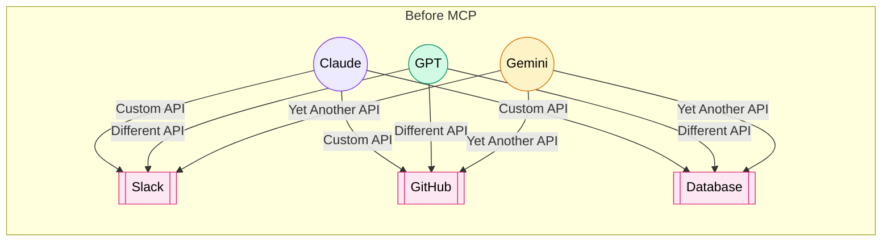
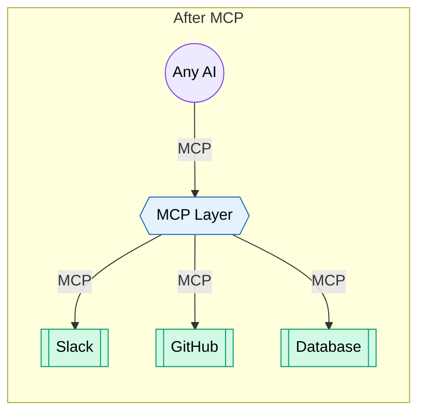
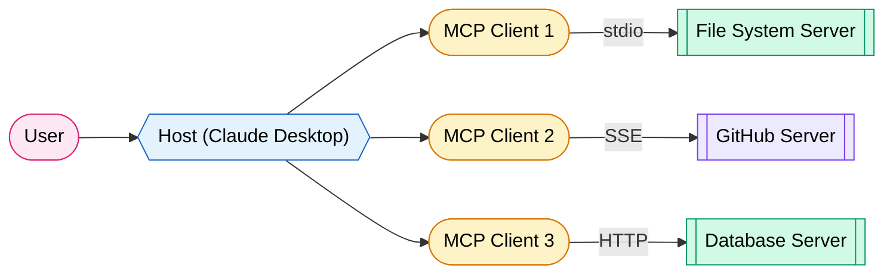
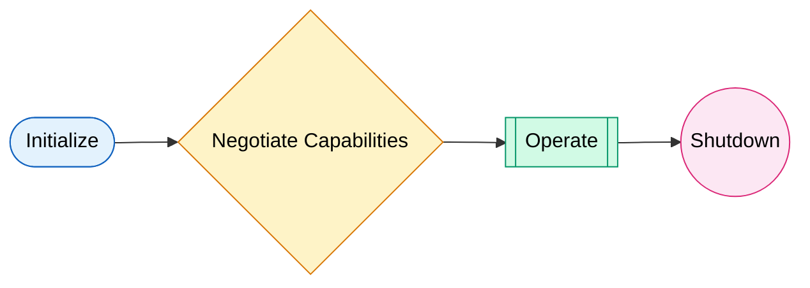
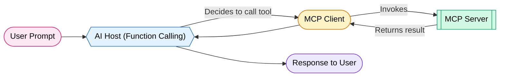
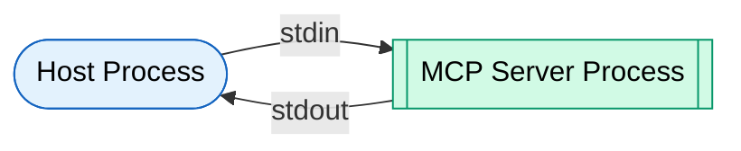
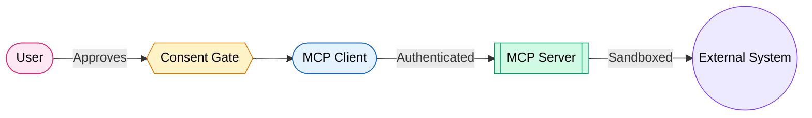
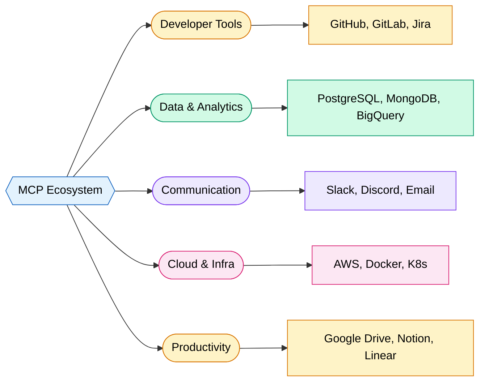
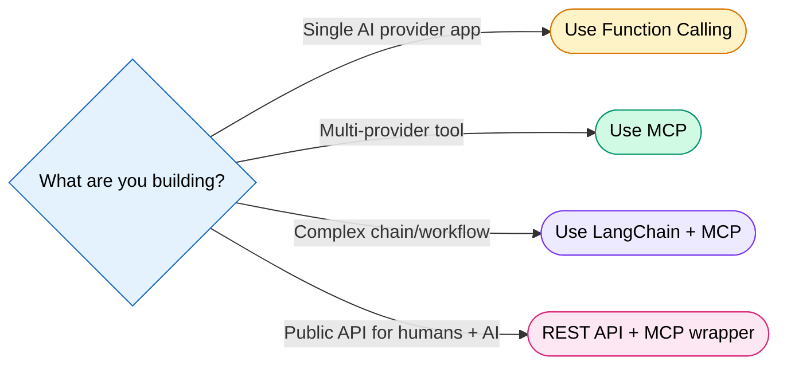
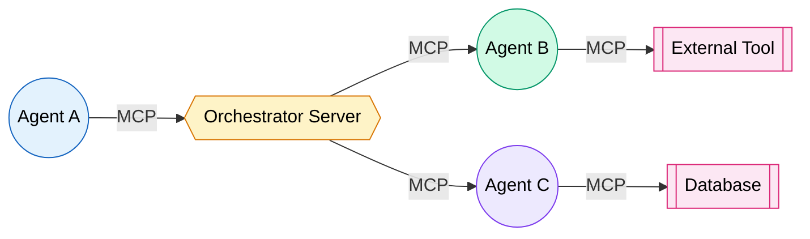

# Model Context Protocol (MCP)

## What is MCP

Every AI tool has its own integration. Slack has one API. GitHub has another. Your database has a third. You end up writing glue code for every single combination of AI model + external tool. It is the "N x M" problem — N models times M tools equals chaos.

MCP is the **USB-C port for AI**. One standard plug. Any device. Any charger.

!!! tip "The USB-C Analogy"
    Before USB-C: Every phone brand had its own charger. Micro-USB, Lightning, proprietary barrel plugs. Drawer full of cables.  
    After USB-C: One cable. One port. Everything connects.  
    MCP does this for AI integrations. One protocol. Any model. Any tool.

MCP is an **open standard** created by Anthropic (Nov 2024). It defines how AI applications discover, connect to, and use external tools and data sources through a unified interface. Instead of building custom integrations for every tool, you build one MCP server and every MCP-compatible AI client can use it.

### The Problem MCP Solves





---

## MCP Architecture

MCP uses a **Host → Client → Server** architecture. Three layers. Clean separation of concerns.

| Component | Role | Real-World Example |
|-----------|------|-------------------|
| **Host** | The AI application the user interacts with | Claude Desktop, VS Code, Cursor |
| **Client** | Maintains 1:1 connection with a server | Built into the host application |
| **Server** | Exposes tools, resources, and prompts | Your custom MCP server |



!!! info "Key Insight"
    Each client maintains exactly ONE connection to ONE server. A host can spawn multiple clients. This keeps things isolated — a buggy server cannot crash another server's connection.

### Transport Layer

MCP does not care how bytes travel between client and server. Three transport options:

- **stdio** — Standard input/output. Local processes. Zero network overhead.
- **SSE (Server-Sent Events)** — HTTP-based streaming. Works over networks. Server pushes events.
- **Streamable HTTP** — Newest transport. Stateless HTTP with optional streaming. Best for production deployments.

---

## Core Concepts

MCP servers expose four primitives to clients. Think of them as the four things a server can offer.

### The Four Primitives

| Primitive | Direction | Description | Analogy |
|-----------|-----------|-------------|---------|
| **Resources** | Server → Client | Read-only data exposure | A file system you can browse |
| **Tools** | Client → Server | Functions the AI can call | Buttons the AI can press |
| **Prompts** | Server → Client | Reusable prompt templates | Pre-written scripts |
| **Sampling** | Server → Client | Server asks the LLM to generate text | The tool asking the AI a question back |

### Resources

Resources expose data. Read-only. The AI can browse and retrieve them. Think of it like mounting a drive.

```python
@mcp.resource("file:///{path}")
async def read_file(path: str) -> str:
    """Expose local files as MCP resources."""
    with open(path, "r") as f:
        return f.read()
```

Examples: database schemas, file contents, API responses, configuration files, log entries.

### Tools

Tools are functions the AI can invoke. They DO things. Side effects allowed.

```python
@mcp.tool()
async def create_github_issue(title: str, body: str, repo: str) -> str:
    """Create a new GitHub issue."""
    # API call to GitHub
    response = await github_client.create_issue(repo, title, body)
    return f"Created issue #{response.number}: {response.html_url}"
```

Examples: send email, create ticket, run query, deploy code, write file.

### Prompts

Prompts are reusable templates. The server suggests how to use its tools effectively.

```python
@mcp.prompt()
async def debug_query(error_message: str) -> str:
    """Template for debugging database errors."""
    return f"""Analyze this database error and suggest fixes:
    
Error: {error_message}

Steps:
1. Identify the root cause
2. Check if it's a schema issue
3. Suggest a corrected query"""
```

### Sampling

Sampling flips the script. The SERVER asks the AI to generate something. Useful when a tool needs LLM reasoning mid-execution.

!!! warning "User Consent Required"
    Sampling always requires user approval. The server cannot silently make the AI generate text. This prevents infinite loops and runaway costs.

---

## How MCP Works

The protocol follows a strict lifecycle. Four phases. JSON-RPC 2.0 messages underneath.



### Phase 1: Initialization

Client sends `initialize` request with its protocol version and capabilities.

```json
{
  "jsonrpc": "2.0",
  "id": 1,
  "method": "initialize",
  "params": {
    "protocolVersion": "2025-03-26",
    "capabilities": { "sampling": {} },
    "clientInfo": { "name": "claude-desktop", "version": "1.0" }
  }
}
```

### Phase 2: Capability Negotiation

Server responds with what it supports. Client learns what tools, resources, and prompts are available.

```json
{
  "jsonrpc": "2.0",
  "id": 1,
  "result": {
    "protocolVersion": "2025-03-26",
    "capabilities": {
      "tools": { "listChanged": true },
      "resources": { "subscribe": true }
    },
    "serverInfo": { "name": "database-server", "version": "2.1" }
  }
}
```

Client then sends `initialized` notification. Handshake complete.

### Phase 3: Operation

Normal operation. Client discovers and invokes tools. Requests flow back and forth.

```json
// Client lists available tools
{ "method": "tools/list" }

// Client calls a tool
{
  "method": "tools/call",
  "params": {
    "name": "query_database",
    "arguments": { "sql": "SELECT * FROM users LIMIT 10" }
  }
}
```

### Phase 4: Shutdown

Either side can terminate. Clean disconnect. Resources freed.

!!! danger "Crash Recovery"
    If a server crashes mid-operation, the client handles it gracefully. The host can restart the server and re-initialize. Other servers remain unaffected — isolation by design.

---

## MCP vs Function Calling

These are NOT the same thing. MCP is a protocol. Function calling is a feature of individual model APIs.

| Aspect | MCP | Function Calling |
|--------|-----|-----------------|
| **Scope** | Open standard across all providers | Per-provider feature (OpenAI, Anthropic, etc.) |
| **Discovery** | Dynamic — tools discovered at runtime | Static — defined in each API call |
| **Multi-server** | Connect to many servers simultaneously | Single provider's tool definitions |
| **Standardization** | Universal schema | Each provider has its own format |
| **Reusability** | Build once, use everywhere | Rebuild for each provider |
| **State** | Persistent connection, context preserved | Stateless per API call |
| **Ecosystem** | Growing registry of shared servers | Vendor-locked tools |

!!! tip "They Work Together"
    MCP does not replace function calling. MCP servers expose tools. The AI host uses its native function calling to decide WHEN to invoke those tools. MCP is the plumbing. Function calling is the decision layer.



---

## Building an MCP Server

The Python SDK makes this dead simple. Install it, decorate your functions, run the server. That is it.

### Installation

```bash
pip install mcp[cli]
# or with uv (recommended)
uv add "mcp[cli]"
```

### Complete Example: Database Query Server

```python
"""MCP server that exposes a SQLite database for AI exploration."""
from mcp.server.fastmcp import FastMCP
import sqlite3
from contextlib import closing

# Create the MCP server
mcp = FastMCP(
    name="database-explorer",
    version="1.0.0"
)

DB_PATH = "/path/to/your/database.db"


@mcp.resource("schema://tables")
async def list_tables() -> str:
    """List all tables in the database."""
    with closing(sqlite3.connect(DB_PATH)) as conn:
        cursor = conn.execute(
            "SELECT name FROM sqlite_master WHERE type='table'"
        )
        tables = [row[0] for row in cursor.fetchall()]
    return "\n".join(tables)


@mcp.resource("schema://tables/{table_name}")
async def table_schema(table_name: str) -> str:
    """Get the CREATE TABLE statement for a specific table."""
    with closing(sqlite3.connect(DB_PATH)) as conn:
        cursor = conn.execute(
            "SELECT sql FROM sqlite_master WHERE name = ?", (table_name,)
        )
        result = cursor.fetchone()
    return result[0] if result else f"Table '{table_name}' not found"


@mcp.tool()
async def query_database(sql: str) -> str:
    """Execute a READ-ONLY SQL query and return results.
    
    Args:
        sql: The SQL query to execute. Must be a SELECT statement.
    """
    if not sql.strip().upper().startswith("SELECT"):
        return "Error: Only SELECT queries are allowed for safety."
    
    with closing(sqlite3.connect(DB_PATH)) as conn:
        conn.row_factory = sqlite3.Row
        try:
            cursor = conn.execute(sql)
            rows = cursor.fetchall()
            if not rows:
                return "No results found."
            
            # Format as markdown table
            headers = rows[0].keys()
            lines = ["| " + " | ".join(headers) + " |"]
            lines.append("| " + " | ".join(["---"] * len(headers)) + " |")
            for row in rows[:50]:  # Limit to 50 rows
                lines.append("| " + " | ".join(str(v) for v in row) + " |")
            
            return "\n".join(lines)
        except sqlite3.Error as e:
            return f"SQL Error: {e}"


@mcp.tool()
async def explain_query(sql: str) -> str:
    """Get the query execution plan for a SQL statement.
    
    Args:
        sql: The SQL query to analyze.
    """
    with closing(sqlite3.connect(DB_PATH)) as conn:
        try:
            cursor = conn.execute(f"EXPLAIN QUERY PLAN {sql}")
            plan = cursor.fetchall()
            return "\n".join(str(row) for row in plan)
        except sqlite3.Error as e:
            return f"Error: {e}"


@mcp.prompt()
async def analyze_table(table_name: str) -> str:
    """Generate a prompt to analyze a database table."""
    return f"""Please analyze the '{table_name}' table:
1. First, look at the schema using the schema resource
2. Run a SELECT query to sample some data
3. Identify potential issues (missing indexes, normalization problems)
4. Suggest optimizations"""


if __name__ == "__main__":
    mcp.run(transport="stdio")
```

### Running Your Server

```bash
# Run directly
python database_server.py

# Or use the MCP CLI for development
mcp dev database_server.py

# Install in Claude Desktop
mcp install database_server.py
```

!!! tip "The `mcp dev` Command"
    Running `mcp dev` launches an inspector UI in your browser. You can test tools, browse resources, and debug your server interactively. Use it during development. Always.

---

## Building an MCP Client

Most developers use existing hosts (Claude Desktop, VS Code). But you can build your own client.

### Configuration Example (Claude Desktop)

```json
{
  "mcpServers": {
    "database-explorer": {
      "command": "python",
      "args": ["/path/to/database_server.py"],
      "env": {
        "DB_PATH": "/path/to/production.db"
      }
    },
    "github": {
      "command": "npx",
      "args": ["-y", "@modelcontextprotocol/server-github"],
      "env": {
        "GITHUB_TOKEN": "ghp_your_token_here"
      }
    },
    "filesystem": {
      "command": "npx",
      "args": ["-y", "@modelcontextprotocol/server-filesystem", "/Users/me/projects"]
    }
  }
}
```

### Programmatic Client (Python)

```python
"""Build your own MCP client that connects to any server."""
from mcp import ClientSession, StdioServerParameters
from mcp.client.stdio import stdio_client

async def main():
    # Define how to connect to the server
    server_params = StdioServerParameters(
        command="python",
        args=["database_server.py"]
    )
    
    async with stdio_client(server_params) as (read, write):
        async with ClientSession(read, write) as session:
            # Initialize the connection
            await session.initialize()
            
            # Discover available tools
            tools = await session.list_tools()
            print(f"Available tools: {[t.name for t in tools.tools]}")
            
            # Call a tool
            result = await session.call_tool(
                "query_database",
                arguments={"sql": "SELECT COUNT(*) FROM users"}
            )
            print(f"Result: {result.content[0].text}")
            
            # List resources
            resources = await session.list_resources()
            for r in resources.resources:
                print(f"Resource: {r.uri} - {r.description}")

if __name__ == "__main__":
    import asyncio
    asyncio.run(main())
```

---

## MCP Server Examples

The ecosystem is growing fast. Here are the most useful servers available today.

| Server | What It Provides | Key Tools |
|--------|-----------------|-----------|
| **Filesystem** | Read/write/search local files | `read_file`, `write_file`, `search_files` |
| **GitHub** | Full GitHub API access | `create_issue`, `create_pr`, `search_repos` |
| **PostgreSQL** | Database exploration and queries | `query`, `list_tables`, `describe_table` |
| **Slack** | Message and channel management | `send_message`, `search_messages`, `list_channels` |
| **Brave Search** | Web search capabilities | `web_search`, `local_search` |
| **Puppeteer** | Browser automation | `navigate`, `screenshot`, `click`, `fill` |
| **Google Drive** | Document management | `search_files`, `read_file`, `create_doc` |
| **Docker** | Container management | `list_containers`, `run_container`, `logs` |
| **Kubernetes** | Cluster operations | `get_pods`, `describe_service`, `apply_manifest` |
| **Memory** | Persistent knowledge graph | `create_entity`, `create_relation`, `search` |

!!! info "Official vs Community"
    Anthropic maintains a set of reference servers at `github.com/modelcontextprotocol/servers`. Community servers number in the hundreds and cover everything from Spotify to smart home devices.

---

## Transport Protocols

Three ways to move bytes between client and server. Each fits a different deployment scenario.

### Comparison

| Transport | Network | State | Best For | Startup |
|-----------|---------|-------|----------|---------|
| **stdio** | Local only | Stateful | Desktop apps, dev tools | Process spawn |
| **SSE** | Remote OK | Stateful | Web apps, shared servers | HTTP connection |
| **Streamable HTTP** | Remote OK | Stateless (optionally stateful) | Production APIs, scale | HTTP request |

### stdio — Local Processes



The host spawns the server as a child process. Communication over stdin/stdout. Zero network latency. Perfect for local tools.

```json
{
  "command": "python",
  "args": ["my_server.py"],
  "transport": "stdio"
}
```

### SSE — Server-Sent Events

Client connects via HTTP. Server pushes events over a long-lived connection. Client sends requests via HTTP POST. Good for remote servers that need to push updates.

```json
{
  "url": "https://my-mcp-server.example.com/sse",
  "transport": "sse"
}
```

### Streamable HTTP — The Future

Newest transport. Each request is a standard HTTP POST. Server can respond with a single JSON response or upgrade to streaming. Stateless by default. Scales horizontally behind a load balancer.

```json
{
  "url": "https://api.example.com/mcp",
  "transport": "streamable-http"
}
```

!!! tip "When to Use What"
    - **Building a desktop plugin?** Use stdio. No network config needed.  
    - **Shared team server?** Use SSE. Easy to deploy, supports push notifications.  
    - **Production SaaS?** Use Streamable HTTP. Scales, no persistent connections to manage.

---

## Security

MCP takes security seriously. The protocol has built-in security boundaries at every layer.

### Security Principles



### Key Security Features

| Feature | Description |
|---------|-------------|
| **User Consent** | Users must approve tool invocations. No silent execution. |
| **Capability Scoping** | Servers declare what they can do. Clients grant only what's needed. |
| **Input Validation** | Servers validate all inputs. Never trust data from the AI blindly. |
| **Sandboxing** | Servers run in isolated processes. One compromise does not spread. |
| **Authentication** | OAuth 2.0 / API keys for remote servers. mTLS for sensitive deployments. |
| **Authorization** | Fine-grained permissions per tool, per user, per session. |

### OAuth 2.0 Flow for Remote Servers

```python
# Server-side auth configuration
from mcp.server.fastmcp import FastMCP

mcp = FastMCP(
    name="secure-server",
    auth={
        "type": "oauth2",
        "authorization_url": "https://auth.example.com/authorize",
        "token_url": "https://auth.example.com/token",
        "scopes": ["read:data", "write:data"]
    }
)
```

!!! danger "Never Trust AI-Generated Inputs"
    The AI might be tricked via prompt injection. Always validate, sanitize, and scope inputs server-side. If your tool runs SQL, use parameterized queries. If it writes files, restrict paths. Defense in depth.

!!! warning "Principle of Least Privilege"
    Grant the minimum access needed. A file server should not have write access unless explicitly required. A database server should be read-only by default. Always opt for the narrowest scope.

---

## MCP in Production

MCP is already deployed in production across major AI tools.

### Where MCP Runs Today

| Product | How It Uses MCP | Transport |
|---------|----------------|-----------|
| **Claude Desktop** | Connects to local and remote servers | stdio, SSE |
| **Claude Code** | CLI tool calling via MCP servers | stdio |
| **Cursor** | IDE extensions as MCP servers | stdio |
| **Windsurf** | AI coding with tool access | stdio |
| **VS Code (Copilot)** | Extension-based MCP support | stdio |
| **Zed** | Editor-native MCP integration | stdio |
| **Continue.dev** | Open-source AI coding assistant | stdio, SSE |

### Claude Desktop Configuration

Located at `~/Library/Application Support/Claude/claude_desktop_config.json` (macOS):

```json
{
  "mcpServers": {
    "filesystem": {
      "command": "npx",
      "args": ["-y", "@modelcontextprotocol/server-filesystem", "/Users/me/docs"]
    },
    "github": {
      "command": "npx",
      "args": ["-y", "@modelcontextprotocol/server-github"],
      "env": { "GITHUB_TOKEN": "ghp_xxx" }
    }
  }
}
```

### Claude Code Configuration

Located at `.claude/settings.json` in your project or `~/.claude/settings.json` globally:

```json
{
  "mcpServers": {
    "jira": {
      "command": "python",
      "args": ["/path/to/jira_mcp_server.py"],
      "env": { "JIRA_TOKEN": "xxx" }
    }
  }
}
```

---

## MCP Ecosystem

The MCP ecosystem is exploding. Hundreds of servers. Multiple registries. Active community.

### Where to Find Servers

| Source | URL | Content |
|--------|-----|---------|
| **Official Servers** | github.com/modelcontextprotocol/servers | Reference implementations by Anthropic |
| **MCP Hub** | mcphub.io | Community directory with ratings |
| **Awesome MCP** | github.com/punkpeye/awesome-mcp-servers | Curated list |
| **npm Registry** | npmjs.com (search @modelcontextprotocol) | Node.js servers |
| **PyPI** | pypi.org (search mcp-server) | Python servers |

### Categories of Available Servers



### Publishing Your Own Server

```bash
# Package your server
uv build

# Publish to PyPI
uv publish

# Or publish to npm (TypeScript servers)
npm publish --access public
```

---

## Building Real-World MCP Tools

Practical examples you can adapt for production use.

### Example 1: Slack Notifier

```python
"""MCP server for sending Slack notifications."""
from mcp.server.fastmcp import FastMCP
import httpx
import os

mcp = FastMCP(name="slack-notifier")

SLACK_WEBHOOK = os.environ["SLACK_WEBHOOK_URL"]


@mcp.tool()
async def send_slack_message(channel: str, message: str, urgent: bool = False) -> str:
    """Send a message to a Slack channel.
    
    Args:
        channel: The channel name (without #)
        message: The message text (supports Slack markdown)
        urgent: If True, adds @channel mention
    """
    if urgent:
        message = f"<!channel> {message}"
    
    payload = {"channel": f"#{channel}", "text": message}
    
    async with httpx.AsyncClient() as client:
        resp = await client.post(SLACK_WEBHOOK, json=payload)
        if resp.status_code == 200:
            return f"Message sent to #{channel}"
        return f"Failed: {resp.text}"


@mcp.tool()
async def send_slack_alert(
    title: str, 
    description: str, 
    severity: str, 
    channel: str = "alerts"
) -> str:
    """Send a formatted alert to Slack.
    
    Args:
        title: Alert title
        description: Detailed description
        severity: One of: critical, warning, info
        channel: Target channel (default: alerts)
    """
    emoji = {"critical": "🔴", "warning": "🟡", "info": "🔵"}.get(severity, "⚪")
    
    blocks = [
        {"type": "header", "text": {"type": "plain_text", "text": f"{emoji} {title}"}},
        {"type": "section", "text": {"type": "mrkdwn", "text": description}},
        {"type": "context", "elements": [
            {"type": "mrkdwn", "text": f"*Severity:* {severity.upper()}"}
        ]}
    ]
    
    async with httpx.AsyncClient() as client:
        resp = await client.post(SLACK_WEBHOOK, json={
            "channel": f"#{channel}", "blocks": blocks
        })
        return f"Alert sent: {resp.status_code}"
```

### Example 2: Jira Ticket Creator

```python
"""MCP server for Jira operations."""
from mcp.server.fastmcp import FastMCP
import httpx
import os

mcp = FastMCP(name="jira-tools")

JIRA_URL = os.environ["JIRA_URL"]
JIRA_EMAIL = os.environ["JIRA_EMAIL"]
JIRA_TOKEN = os.environ["JIRA_API_TOKEN"]


@mcp.tool()
async def create_jira_ticket(
    project: str,
    summary: str,
    description: str,
    issue_type: str = "Task",
    priority: str = "Medium",
    labels: list[str] | None = None
) -> str:
    """Create a new Jira ticket.
    
    Args:
        project: Project key (e.g., 'ENG', 'PLATFORM')
        summary: One-line summary of the issue
        description: Detailed description (supports Jira markdown)
        issue_type: Type of issue (Task, Bug, Story, Epic)
        priority: Priority level (Highest, High, Medium, Low, Lowest)
        labels: Optional list of labels to apply
    """
    payload = {
        "fields": {
            "project": {"key": project},
            "summary": summary,
            "description": description,
            "issuetype": {"name": issue_type},
            "priority": {"name": priority},
        }
    }
    if labels:
        payload["fields"]["labels"] = labels
    
    async with httpx.AsyncClient() as client:
        resp = await client.post(
            f"{JIRA_URL}/rest/api/3/issue",
            json=payload,
            auth=(JIRA_EMAIL, JIRA_TOKEN)
        )
        if resp.status_code == 201:
            key = resp.json()["key"]
            return f"Created {key}: {JIRA_URL}/browse/{key}"
        return f"Failed: {resp.text}"


@mcp.tool()
async def search_jira(jql: str, max_results: int = 10) -> str:
    """Search Jira using JQL.
    
    Args:
        jql: JQL query string (e.g., 'project = ENG AND status = Open')
        max_results: Maximum number of results to return
    """
    async with httpx.AsyncClient() as client:
        resp = await client.get(
            f"{JIRA_URL}/rest/api/3/search",
            params={"jql": jql, "maxResults": max_results},
            auth=(JIRA_EMAIL, JIRA_TOKEN)
        )
        issues = resp.json().get("issues", [])
        lines = [f"Found {len(issues)} issues:\n"]
        for issue in issues:
            key = issue["key"]
            summary = issue["fields"]["summary"]
            status = issue["fields"]["status"]["name"]
            lines.append(f"- [{key}] {summary} ({status})")
        return "\n".join(lines)
```

### Example 3: System Monitoring Dashboard

```python
"""MCP server for system monitoring and health checks."""
from mcp.server.fastmcp import FastMCP
import psutil
import platform
from datetime import datetime

mcp = FastMCP(name="system-monitor")


@mcp.tool()
async def system_health() -> str:
    """Get comprehensive system health metrics."""
    cpu = psutil.cpu_percent(interval=1)
    memory = psutil.virtual_memory()
    disk = psutil.disk_usage("/")
    
    return f"""System Health Report ({datetime.now().isoformat()})
━━━━━━━━━━━━━━━━━━━━━━━━━━━━━━━━━━━
| Metric       | Value              |
|--------------|--------------------|
| OS           | {platform.system()} {platform.release()} |
| CPU Usage    | {cpu}%             |
| Memory Used  | {memory.percent}% ({memory.used // 1_000_000_000}GB / {memory.total // 1_000_000_000}GB) |
| Disk Used    | {disk.percent}% ({disk.used // 1_000_000_000}GB / {disk.total // 1_000_000_000}GB) |
| Processes    | {len(psutil.pids())} running |
"""


@mcp.tool()
async def top_processes(n: int = 10) -> str:
    """Get the top N processes by CPU usage.
    
    Args:
        n: Number of processes to show (default 10)
    """
    procs = []
    for proc in psutil.process_iter(["pid", "name", "cpu_percent", "memory_percent"]):
        try:
            procs.append(proc.info)
        except (psutil.NoSuchProcess, psutil.AccessDenied):
            pass
    
    procs.sort(key=lambda x: x["cpu_percent"] or 0, reverse=True)
    
    lines = ["| PID | Name | CPU% | Mem% |", "|-----|------|------|------|"]
    for p in procs[:n]:
        lines.append(f"| {p['pid']} | {p['name'][:20]} | {p['cpu_percent']:.1f} | {p['memory_percent']:.1f} |")
    
    return "\n".join(lines)


@mcp.resource("metrics://cpu/history")
async def cpu_history() -> str:
    """Get CPU usage as a resource."""
    percentages = psutil.cpu_percent(interval=0.1, percpu=True)
    lines = [f"Core {i}: {p}%" for i, p in enumerate(percentages)]
    return "\n".join(lines)
```

---

## MCP vs Alternatives

MCP is not the only way to give AI tools superpowers. Here is how it compares.

| Criteria | MCP | OpenAI Plugins (deprecated) | LangChain Tools | Custom REST APIs |
|----------|-----|---------------------------|-----------------|-----------------|
| **Standardized** | Yes — open spec | Proprietary to OpenAI | Framework-specific | No standard |
| **Discovery** | Dynamic at runtime | Manifest file | Code-defined | Documentation |
| **Multi-provider** | Any AI that supports MCP | OpenAI only | Any (via adapters) | Any (manual) |
| **State Management** | Built-in sessions | Stateless | Framework handles | Build your own |
| **Ecosystem** | Growing rapidly | Dead (deprecated 2024) | Large but fragmented | N/A |
| **Complexity** | Low (decorators) | Medium (manifest + API) | Medium (chain config) | High (full API design) |
| **Security Model** | User consent + scoping | OAuth + OpenAI review | App-level | Build your own |
| **Bidirectional** | Yes (sampling) | No | No | No |

### Decision Matrix



!!! info "LangChain and MCP Are Friends"
    LangChain has MCP adapters. You can wrap any MCP server as a LangChain tool. Best of both worlds — MCP for the standard interface, LangChain for orchestration.

---

## Future of MCP

MCP is version 2025-03-26 as of this writing. The protocol is evolving fast.

### What is Coming

| Feature | Status | Impact |
|---------|--------|--------|
| **Elicitation** | Proposed | Servers can ask users clarifying questions |
| **Agent-to-Agent** | In discussion | MCP servers calling other MCP servers |
| **Multi-modal** | Early stage | Image, audio, video as first-class resources |
| **Server Registry** | Building | NPM-like discovery and installation |
| **Authentication Standard** | Evolving | Unified OAuth flow across all servers |
| **Composability** | Planned | Chain servers together declaratively |

### The Agent-to-Agent Vision



!!! tip "MCP as the Agent Communication Bus"
    The endgame: AI agents communicating with each other over MCP. Agent A can call Agent B as a tool. Agent B can call Agent C. A universal protocol for agent collaboration. This turns MCP from a "tool calling protocol" into an "agent orchestration protocol."

---

## Interview Questions

??? question "1. What is MCP and what problem does it solve?"
    MCP (Model Context Protocol) is an open standard by Anthropic that standardizes how AI applications connect to external tools and data sources. It solves the N x M integration problem — without MCP, every AI model needs custom integrations for every tool. MCP provides a universal interface (like USB-C for AI) so you build one server and any MCP-compatible client can use it.

??? question "2. Explain the MCP architecture — what are Hosts, Clients, and Servers?"
    **Host**: The AI application users interact with (Claude Desktop, Cursor, VS Code). **Client**: A component within the host that maintains a 1:1 connection with a single MCP server. Handles protocol communication. **Server**: A lightweight program that exposes tools, resources, and prompts via the MCP protocol. A host can have multiple clients, each connected to a different server.

??? question "3. What are the four core primitives in MCP?"
    1. **Resources** — Read-only data the AI can browse (files, schemas, configs). 2. **Tools** — Functions the AI can invoke that perform actions (send email, run query). 3. **Prompts** — Reusable prompt templates the server suggests. 4. **Sampling** — Allows the server to request LLM completions from the client (bidirectional communication).

??? question "4. How does MCP differ from function calling?"
    Function calling is a per-provider feature (OpenAI, Anthropic each have their own format). It defines tools statically in each API call. MCP is a standardized protocol where tools are discovered dynamically at runtime, can connect to multiple servers simultaneously, and works across any provider that supports MCP. They complement each other — the host uses function calling to decide when to invoke MCP tools.

??? question "5. Describe the MCP lifecycle phases."
    Four phases: 1. **Initialization** — Client sends protocol version and capabilities. 2. **Capability Negotiation** — Server responds with its supported features (tools, resources, prompts). Client sends `initialized` notification. 3. **Operation** — Normal request/response flow. Tool calls, resource reads, etc. 4. **Shutdown** — Either side terminates cleanly. Resources freed.

??? question "6. What transport protocols does MCP support and when would you use each?"
    **stdio** — Local processes. Best for desktop apps and dev tools. Zero network overhead. **SSE (Server-Sent Events)** — HTTP-based streaming for remote servers. Good for shared team servers with push notifications. **Streamable HTTP** — Stateless HTTP (newest). Best for production at scale — works behind load balancers, no persistent connections required.

??? question "7. How does MCP handle security?"
    Multiple layers: User consent (explicit approval for tool calls), capability scoping (servers declare what they do, clients grant only what's needed), input validation (server-side), process isolation (one server crash doesn't affect others), OAuth 2.0 for remote auth, and fine-grained per-tool permissions. Defense in depth against prompt injection.

??? question "8. What is Sampling in MCP and why does it require user consent?"
    Sampling allows the SERVER to request the AI to generate text. This flips the normal flow — instead of the AI calling the server, the server asks the AI for help. It requires user consent because: (a) it could create infinite loops, (b) it incurs costs, and (c) the user should control when their AI generates content on behalf of a tool.

??? question "9. How would you build an MCP server in Python? Walk through the key steps."
    1. Install `mcp[cli]` package. 2. Create a `FastMCP` instance with name and version. 3. Decorate functions with `@mcp.tool()` for callable tools, `@mcp.resource()` for data exposure, `@mcp.prompt()` for templates. 4. Add type hints and docstrings (these become the tool schema). 5. Run with `mcp.run(transport="stdio")`. 6. Test with `mcp dev server.py`. 7. Deploy via config in the host application.

??? question "10. How do you configure MCP servers in Claude Desktop vs Claude Code?"
    **Claude Desktop**: Edit `~/Library/Application Support/Claude/claude_desktop_config.json` (macOS). Add entries under `mcpServers` with `command`, `args`, and optional `env`. **Claude Code**: Edit `.claude/settings.json` in project root or `~/.claude/settings.json` globally. Same format. Both support stdio transport by default.

??? question "11. What happens if an MCP server crashes during operation?"
    The client handles it gracefully. Since each client has a 1:1 connection with its server, a crash only affects that one connection. Other servers remain operational. The host can detect the crash, restart the server process, and re-initialize the connection. This isolation is by design — no cascading failures.

??? question "12. Compare MCP with OpenAI's deprecated plugin system and LangChain tools."
    **MCP**: Open standard, dynamic discovery, multi-provider, built-in state, bidirectional (sampling). **OpenAI Plugins** (deprecated 2024): Proprietary, manifest-based, OpenAI-only, stateless. **LangChain Tools**: Framework-specific, code-defined, any provider via adapters, but no standard protocol. MCP is the most universal and forward-looking approach. LangChain has adapters to wrap MCP servers.

??? question "13. Explain the JSON-RPC 2.0 foundation of MCP. Why was it chosen?"
    MCP uses JSON-RPC 2.0 for all messages. Each message has `jsonrpc`, `method`, `params`, and an `id` (for requests) or no `id` (for notifications). It was chosen because: simple, language-agnostic, supports request/response and one-way notifications, well-understood, easy to debug, and has mature implementations in every language.

??? question "14. How would you secure an MCP server that connects to a production database?"
    Multiple measures: (a) Read-only database user with SELECT-only permissions. (b) Parameterized queries — never string-interpolate user input. (c) Query allowlisting or validation (reject DDL/DML). (d) Rate limiting to prevent abuse. (e) Result size limits (LIMIT clauses). (f) OAuth for remote access. (g) Audit logging of all queries. (h) Input sanitization on the server side, never trust AI-generated inputs.

??? question "15. What is the future direction of MCP? What features are being discussed?"
    Key developments: **Elicitation** (servers asking users clarifying questions), **Agent-to-Agent communication** (MCP servers calling other MCP servers, enabling agent orchestration), **Multi-modal support** (images, audio, video as resources), **Standard registry** (NPM-like discovery for MCP servers), **Improved auth standards** (unified OAuth flows), and **Composability** (declarative server chaining). MCP is evolving from a tool-calling protocol into an agent communication bus.
