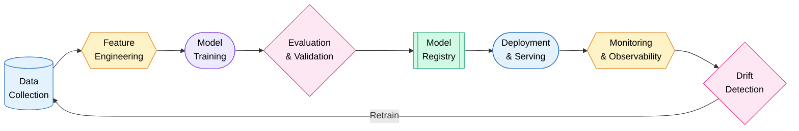
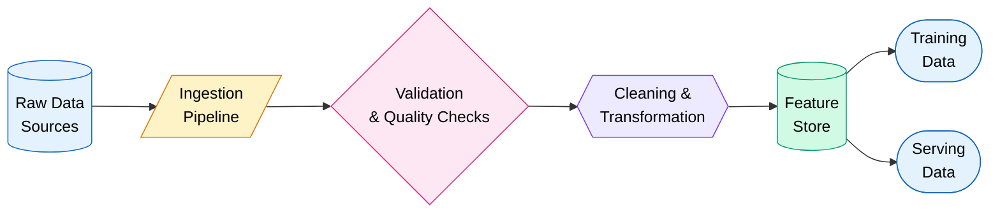
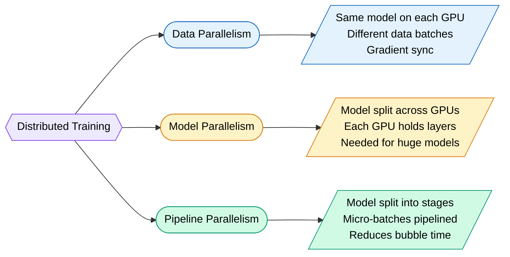
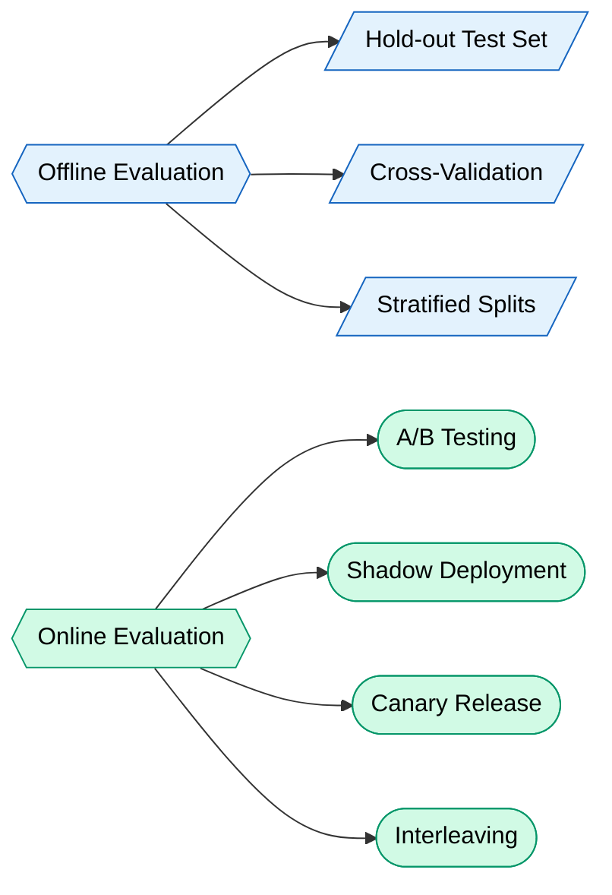
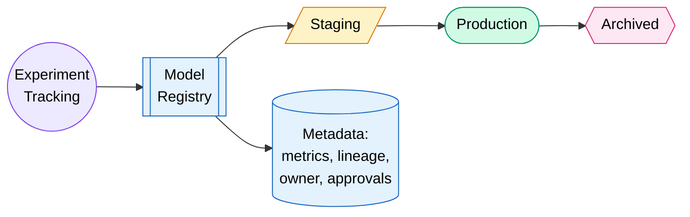
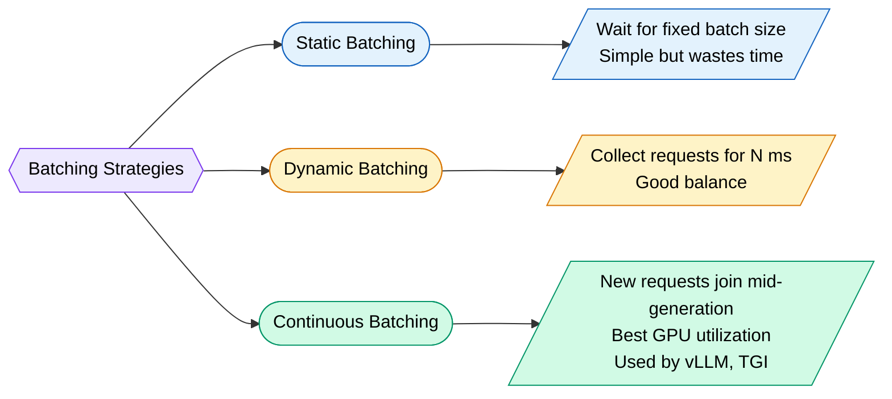
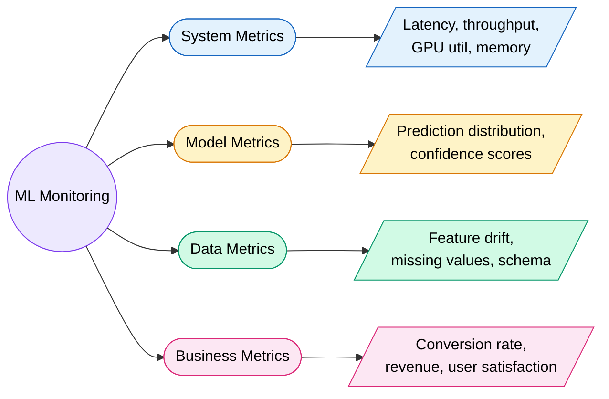
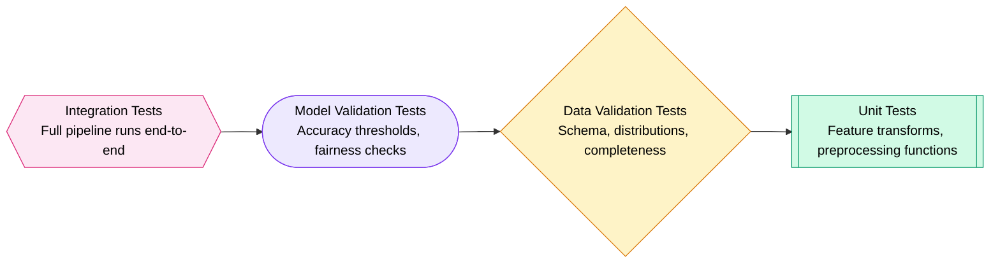
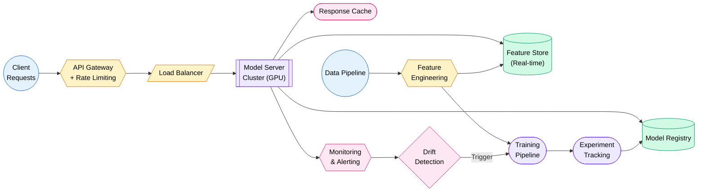

# MLOps & Production AI

> **Training a model is like building a race car in a garage. MLOps is everything needed to win actual races — fuel, pit stops, tire changes, telemetry, and keeping the engine alive at 200 mph.**

---

## What is MLOps

MLOps = DevOps principles applied to Machine Learning systems. It bridges the gap between "my model works in a notebook" and "my model serves 10M predictions per day reliably."

!!! danger "The Harsh Truth"
    87% of ML models never make it to production. The model is 5% of the work. The rest is data pipelines, infrastructure, monitoring, and keeping things from silently failing at 3 AM.

**Why ML in production is fundamentally different from traditional software:**

| Traditional Software | ML Systems |
|---------------------|------------|
| Code changes break things | Data changes break things silently |
| Deterministic outputs | Probabilistic outputs |
| Unit tests catch bugs | Models can be "correct" but useless |
| Deploy once, done | Models decay over time (concept drift) |
| Version code | Version code + data + model + config |
| Logs tell you what failed | Predictions look fine until revenue drops |

!!! tip "The ML Technical Debt Paper"
    Google's 2015 paper "Hidden Technical Debt in Machine Learning Systems" remains gospel. ML code is the tiny box in the center. Everything around it — data collection, feature extraction, monitoring, serving infrastructure — is where complexity lives.

---

## ML Lifecycle

The full pipeline is a loop, not a line. Models are never "done."



**Maturity Levels:**

- **Level 0** — Manual. Jupyter notebooks, manual deployment, no monitoring. "It works on my machine."
- **Level 1** — ML Pipeline Automation. Automated training, basic CI/CD, some monitoring.
- **Level 2** — CI/CD for ML. Automated testing, model validation gates, continuous training, full observability.

---

## Data Engineering for ML

Your model is only as good as your data. Garbage in, garbage out. But also: *slightly stale* data in, *catastrophically wrong predictions* out.

### Data Collection & Cleaning



**Key practices:**

- **Schema validation** — catch column type changes before they poison training
- **Null/outlier detection** — automated alerts when data distribution shifts
- **Deduplication** — duplicates bias your model toward repeated patterns
- **Labeling pipelines** — tools like Label Studio, Snorkel (programmatic labeling), or human annotation queues

### Data Versioning (DVC)

DVC (Data Version Control) works like Git but for datasets and models.

```bash
# Initialize DVC in your repo
dvc init

# Track a large dataset
dvc add data/training_set.parquet

# Push data to remote storage (S3, GCS, etc.)
dvc push

# Reproduce a specific experiment's data state
git checkout v1.2.0
dvc checkout
```

!!! info "Why Not Just Use Git LFS?"
    Git LFS stores files, DVC stores *pipelines*. DVC tracks how data was produced, not just the final artifact. You can reproduce any historical dataset state with its full lineage.

### Feature Stores

A feature store is a centralized repository for ML features. It solves the #1 pain: **training-serving skew** (features computed differently at training time vs serving time).

| Feature Store | Best For | Key Strength |
|--------------|----------|--------------|
| **Feast** | Open-source, flexible | Works with any infra |
| **Tecton** | Enterprise, real-time | Sub-10ms feature serving |
| **Hopsworks** | End-to-end platform | Built-in feature monitoring |
| **Vertex AI Feature Store** | GCP-native | Tight BigQuery integration |
| **SageMaker Feature Store** | AWS-native | Seamless with SageMaker pipelines |

**Feature engineering pipeline example:**

```python
from feast import FeatureStore, Entity, FeatureView, Field
from feast.types import Float32, Int64

# Define entity
customer = Entity(name="customer_id", join_keys=["customer_id"])

# Define feature view
customer_features = FeatureView(
    name="customer_features",
    entities=[customer],
    schema=[
        Field(name="total_purchases_30d", dtype=Float32),
        Field(name="avg_order_value", dtype=Float32),
        Field(name="days_since_last_purchase", dtype=Int64),
    ],
    source=bigquery_source,  # same source for training AND serving
    ttl=timedelta(days=1),
)
```

---

## Experiment Tracking

Without experiment tracking, ML research is just guessing with extra steps. You ran 47 experiments last month — which hyperparameters produced that 0.3% accuracy boost?

### Why You Need It

- **Reproducibility** — recreate any past result exactly
- **Comparison** — side-by-side metric visualization across runs
- **Collaboration** — your team knows what was tried and what failed
- **Audit trail** — required for regulated industries (finance, healthcare)

### Tools Comparison

| Tool | Self-Hosted | Cloud | Best For |
|------|:-----------:|:-----:|----------|
| **MLflow** | Yes | Yes | Open-source, general purpose |
| **Weights & Biases** | No | Yes | Beautiful UI, team collaboration |
| **Neptune** | No | Yes | Heavy experimentation teams |
| **CometML** | No | Yes | Production monitoring + tracking |
| **TensorBoard** | Yes | No | Quick local visualization |

### MLflow Example

```python
import mlflow

mlflow.set_experiment("fraud-detection-v2")

with mlflow.start_run(run_name="xgboost-tuned"):
    # Log hyperparameters
    mlflow.log_params({
        "max_depth": 6,
        "learning_rate": 0.01,
        "n_estimators": 1000,
        "subsample": 0.8,
    })
    
    # Train model
    model = train_xgboost(params)
    
    # Log metrics
    mlflow.log_metrics({
        "auc_roc": 0.943,
        "precision": 0.891,
        "recall": 0.867,
        "f1": 0.879,
    })
    
    # Log the model artifact
    mlflow.xgboost.log_model(model, "model")
    
    # Log custom artifacts (confusion matrix, feature importance plots)
    mlflow.log_artifact("confusion_matrix.png")
```

!!! tip "Track Everything"
    Log your data hash, git commit SHA, environment specs, and random seeds. Future-you will thank present-you when a stakeholder asks "why did last Tuesday's model perform better?"

---

## Model Training at Scale

Training a ResNet on your laptop is fine for learning. Training a 70B parameter LLM requires a different universe of tooling.

### Distributed Training Strategies



| Strategy | When to Use | Tools |
|----------|-------------|-------|
| **Data Parallelism** | Model fits on 1 GPU, want faster training | PyTorch DDP, Horovod |
| **Model Parallelism** | Model too large for 1 GPU | Megatron-LM, DeepSpeed |
| **Pipeline Parallelism** | Very deep models, multiple stages | GPipe, PipeDream |
| **FSDP** | Large models, memory-efficient | PyTorch FSDP |
| **ZeRO** | Optimizer state sharding | DeepSpeed ZeRO (Stage 1-3) |

### GPU Utilization Tips

!!! warning "GPU Utilization is Usually Terrible"
    Most training jobs achieve 30-50% GPU utilization. The GPU is idle waiting for data loading, gradient sync, or CPU preprocessing.

**Fixes:**

- **Prefetch data** — load next batch while current batch trains
- **Mixed precision (FP16/BF16)** — 2x memory savings, faster math units
- **Gradient accumulation** — simulate larger batches without more memory
- **Compile models** — `torch.compile()` fuses operations, reduces kernel launches
- **Profile first** — use PyTorch Profiler or NVIDIA Nsight to find bottlenecks

### Training Infrastructure

| Option | Pros | Cons |
|--------|------|------|
| **Cloud (AWS/GCP/Azure)** | Scale on demand, latest GPUs | Expensive at scale, egress costs |
| **On-prem** | Cheaper long-term, data stays local | Upfront capex, maintenance burden |
| **Hybrid** | Best of both worlds | Complexity of managing two environments |
| **Managed (SageMaker, Vertex)** | Handles orchestration | Vendor lock-in, less control |

---

## Model Evaluation

Your model has 95% accuracy. Congratulations. Is it useful? Maybe not.

### Offline vs Online Evaluation



### Deployment Strategies for Model Evaluation

| Strategy | How It Works | Risk Level |
|----------|-------------|:----------:|
| **Shadow Deployment** | New model runs alongside old, predictions logged but not served | Very Low |
| **Canary Release** | 1-5% traffic to new model, monitor closely | Low |
| **A/B Test** | 50/50 split, measure business metrics | Medium |
| **Blue-Green** | Instant switch between two full deployments | Medium |
| **Multi-Armed Bandit** | Dynamically route traffic to better-performing model | Low |

!!! danger "When Offline Metrics Lie"
    Your model crushed the test set but tanked in production. Common reasons:

    - **Data leakage** — test set accidentally contained future information
    - **Distribution shift** — production data looks nothing like training data
    - **Proxy metrics** — you optimized accuracy, but the business cares about revenue
    - **Feedback loops** — your model's predictions change user behavior, which changes future data

---

## Model Registry

A model registry is the "source of truth" for which models exist, which are production-ready, and who approved them.



### Tools

| Registry | Ecosystem | Key Feature |
|----------|-----------|-------------|
| **MLflow Model Registry** | Open-source | Stage transitions, annotations |
| **Vertex AI Model Registry** | GCP | Auto-scaling serving integration |
| **SageMaker Model Registry** | AWS | Approval workflows, lineage |
| **Neptune** | Cloud | Comparison dashboards |
| **Weights & Biases** | Cloud | Artifact versioning + linking |

### Best Practices

- **Immutable versions** — never overwrite a registered model
- **Promotion gates** — automated checks before staging-to-production
- **Metadata** — attach training data hash, evaluation metrics, owner
- **Rollback plan** — always keep the previous production model ready

---

## Model Serving

Getting predictions from a model to users. Sounds simple. It is not.

### Serving Patterns

| Pattern | Latency | Throughput | Use Case |
|---------|---------|------------|----------|
| **Real-time (Online)** | < 100ms | Medium | Fraud detection, recommendations |
| **Batch** | Minutes-hours | Very High | Email campaigns, risk scoring |
| **Streaming** | Near real-time | High | Anomaly detection on event streams |
| **Edge** | Ultra-low | Low | Mobile apps, IoT devices |

### Serving Infrastructure

| Tool | Strengths | Best For |
|------|-----------|----------|
| **TF Serving** | Mature, gRPC support | TensorFlow models |
| **Triton Inference Server** | Multi-framework, GPU optimized | High-throughput GPU serving |
| **vLLM** | PagedAttention, continuous batching | LLM serving |
| **BentoML** | Pythonic, easy packaging | Rapid prototyping to production |
| **Ray Serve** | Scalable, composable | Complex inference graphs |
| **Seldon Core** | Kubernetes-native | Enterprise ML deployment |
| **KServe** | Serverless, auto-scaling | Kubernetes-first teams |

### Latency vs Throughput Tradeoffs

!!! tip "The Batching Sweet Spot"
    Individual requests = lowest latency but worst GPU utilization. Large batches = highest throughput but higher latency. Dynamic batching (collecting requests over a short window) hits the sweet spot.

```python
# BentoML example: packaging and serving a model
import bentoml

@bentoml.service(
    resources={"gpu": 1},
    traffic={"timeout": 30, "concurrency": 32},
)
class FraudDetector:
    def __init__(self):
        self.model = bentoml.xgboost.load_model("fraud_model:latest")
    
    @bentoml.api(batchable=True, batch_dim=0, max_batch_size=64)
    def predict(self, features: np.ndarray) -> np.ndarray:
        return self.model.predict_proba(features)[:, 1]
```

---

## LLM Serving Specifically

LLMs are a special beast. They are autoregressive (generate one token at a time), memory-hungry, and expensive. Serving them efficiently is its own discipline.

### Key Challenges

- **KV Cache** — each token generation needs attention over all previous tokens. The KV cache stores precomputed key/value pairs. It grows linearly with sequence length.
- **Memory bandwidth bound** — LLM inference is limited by how fast you can read weights from GPU memory, not by compute.
- **Long sequences** — 128K context windows mean massive memory for a single request.

### Serving Frameworks

| Framework | Key Innovation | Best For |
|-----------|---------------|----------|
| **vLLM** | PagedAttention (virtual memory for KV cache) | Production LLM serving |
| **TGI (Text Generation Inference)** | Continuous batching, tensor parallelism | HuggingFace models |
| **Ollama** | Dead-simple local serving | Development, edge |
| **TensorRT-LLM** | NVIDIA-optimized kernels | Maximum throughput on NVIDIA |
| **llama.cpp** | CPU/Metal inference, GGUF format | Local, resource-constrained |

### Quantization

Reduce model precision to serve faster with less memory. The tradeoff is (usually small) quality loss.

| Method | Bits | Speed Gain | Quality Loss | Format |
|--------|:----:|:----------:|:------------:|--------|
| **FP16** | 16 | 2x vs FP32 | Negligible | Standard |
| **GPTQ** | 4 | ~3-4x | Small | GPU-optimized |
| **AWQ** | 4 | ~3-4x | Very small | Activation-aware |
| **GGUF** | 2-8 | Varies | Varies | CPU-friendly (llama.cpp) |
| **SmoothQuant** | 8 | ~2x | Minimal | W8A8 |

### Batching Strategies



!!! info "PagedAttention Explained Simply"
    Traditional serving allocates a contiguous block of GPU memory for each request's maximum possible sequence length. Most of it is wasted. PagedAttention treats KV cache like virtual memory — allocates small pages on demand, allows non-contiguous storage. Result: 2-4x more concurrent requests on the same GPU.

---

## Monitoring & Observability

Traditional software monitoring asks: "Is the server up?" ML monitoring asks: "Are the predictions still correct even though the server looks healthy?"

### What to Monitor



### Statistical Tests for Drift Detection

| Test | Detects | How It Works |
|------|---------|-------------|
| **KS Test (Kolmogorov-Smirnov)** | Distribution shift in continuous features | Compares CDFs of reference vs current |
| **PSI (Population Stability Index)** | Overall population shift | Bins distributions, measures divergence |
| **Chi-Square Test** | Shift in categorical features | Compares observed vs expected frequencies |
| **Jensen-Shannon Divergence** | Distribution difference | Symmetric version of KL divergence |
| **Page-Hinkley Test** | Change point in streaming data | Detects mean shifts in sequential data |

### Monitoring Tools

| Tool | Type | Strength |
|------|------|----------|
| **Evidently AI** | Open-source | Beautiful reports, drift dashboards |
| **Arize** | Cloud platform | Root cause analysis, embedding drift |
| **WhyLabs** | Cloud platform | Real-time profiling, anomaly detection |
| **Fiddler** | Enterprise | Explainability + monitoring |
| **Prometheus + Grafana** | General infra | Custom ML metrics via exporters |
| **NannyML** | Open-source | Estimates performance without ground truth |

!!! warning "The Silent Killer"
    A model can serve predictions with 100% uptime, zero errors, perfect latency — and still be catastrophically wrong. Unlike a crashed server, a drifted model fails silently. You need proactive drift detection, not just reactive alerting.

---

## Data & Model Drift

Drift is when the world changes but your model doesn't know. It is the #1 reason production models degrade over time.

### Types of Drift

| Type | Definition | Example |
|------|-----------|---------|
| **Data Drift (Covariate Shift)** | Input distribution changes | Users shift from desktop to mobile |
| **Concept Drift** | Relationship between input and output changes | "Spam" definition evolves |
| **Label Drift** | Target distribution changes | Fraud rate increases during holidays |
| **Feature Drift** | Individual features shift | Salary feature inflates over time |

### Real-World Examples

!!! danger "COVID: The Ultimate Drift Event"
    In March 2020, almost every production ML model broke simultaneously:

    - Demand forecasting models predicted normal shopping patterns
    - Fraud detection flagged legitimate bulk purchases as suspicious
    - Credit scoring models couldn't handle mass unemployment
    - Recommendation systems kept suggesting travel and restaurants

    Lesson: your model assumes the future looks like the past. Sometimes it doesn't.

### Detection and Response

```python
from evidently.metrics import DataDriftTable
from evidently.report import Report

# Compare current production data to training reference
drift_report = Report(metrics=[DataDriftTable()])
drift_report.run(
    reference_data=training_df,
    current_data=production_df_last_24h
)

# Check if drift detected
results = drift_report.as_dict()
drift_detected = results["metrics"][0]["result"]["dataset_drift"]

if drift_detected:
    alert_team()
    trigger_retraining_pipeline()
```

**When to retrain:**

- PSI > 0.2 on critical features
- Model accuracy drops below threshold (if ground truth available)
- Business metrics decline (conversion rate, revenue per user)
- Scheduled (weekly/monthly) regardless — cheap insurance

---

## CI/CD for ML

Traditional CI/CD tests code. ML CI/CD tests code + data + model quality. Three dimensions of correctness.

### Testing Pyramid for ML



### What to Test

**Data Tests:**
```python
def test_no_null_critical_features():
    """Critical features must never be null."""
    df = load_latest_training_data()
    critical = ["user_id", "transaction_amount", "timestamp"]
    for col in critical:
        assert df[col].isnull().sum() == 0, f"{col} has nulls!"

def test_feature_ranges():
    """Features must be within expected bounds."""
    df = load_latest_training_data()
    assert df["age"].between(0, 150).all()
    assert df["transaction_amount"].ge(0).all()

def test_data_freshness():
    """Training data must be recent."""
    latest = load_latest_training_data()["timestamp"].max()
    assert (datetime.now() - latest).days < 7
```

**Model Tests:**
```python
def test_model_accuracy_above_threshold():
    """New model must beat minimum accuracy."""
    model = load_candidate_model()
    metrics = evaluate(model, test_set)
    assert metrics["auc_roc"] > 0.90

def test_model_no_regression():
    """New model must not be worse than current production model."""
    candidate = evaluate(load_candidate_model(), test_set)
    production = evaluate(load_production_model(), test_set)
    assert candidate["auc_roc"] >= production["auc_roc"] - 0.01  # allow 1% tolerance

def test_model_fairness():
    """Model must not discriminate across protected groups."""
    predictions = model.predict(test_set)
    for group in ["gender", "race", "age_bucket"]:
        group_metrics = compute_group_metrics(predictions, test_set, group)
        assert max(group_metrics) - min(group_metrics) < 0.05
```

### GitHub Actions for ML

```yaml
# .github/workflows/ml-pipeline.yml
name: ML Pipeline CI/CD

on:
  push:
    paths: ['src/models/**', 'src/features/**', 'data/**']

jobs:
  data-validation:
    runs-on: ubuntu-latest
    steps:
      - uses: actions/checkout@v4
      - run: pip install -r requirements.txt
      - run: python tests/test_data_quality.py
      - run: dvc pull  # get latest data
      - run: python src/validate_schema.py

  train-and-evaluate:
    needs: data-validation
    runs-on: [self-hosted, gpu]
    steps:
      - uses: actions/checkout@v4
      - run: python src/train.py --config configs/prod.yaml
      - run: python src/evaluate.py --model outputs/model.pkl
      - run: python tests/test_model_quality.py
      
  deploy:
    needs: train-and-evaluate
    if: github.ref == 'refs/heads/main'
    steps:
      - run: python src/register_model.py --stage production
      - run: kubectl rollout restart deployment/model-server
```

---

## Cost Optimization

GPUs are expensive. A single A100 costs ~$2/hour. A training run on 64 GPUs for a week = $21,504. Every percentage point of efficiency matters.

### GPU Cost Strategies

| Strategy | Savings | Risk |
|----------|:-------:|:----:|
| **Spot/Preemptible Instances** | 60-90% | Interruption (use checkpointing) |
| **Reserved Instances** | 30-60% | Commitment required |
| **Right-sizing** | 20-40% | None if profiled correctly |
| **Mixed Precision Training** | 30-50% (time) | Negligible quality loss |
| **Gradient Checkpointing** | 2-4x batch size | 20-30% slower |

### Model Compression Techniques

| Technique | How It Works | Typical Compression |
|-----------|-------------|:-------------------:|
| **Quantization** | Reduce precision (FP32 to INT8) | 2-4x smaller |
| **Distillation** | Train small model to mimic large one | 3-10x smaller |
| **Pruning** | Remove unimportant weights | 2-5x smaller |
| **Low-Rank Factorization** | Decompose weight matrices | 2-3x smaller |
| **Architecture Search** | Find efficient architectures | Varies |

### Inference Cost Optimization

!!! tip "The Caching Insight"
    If 30% of your LLM queries are near-duplicates, a semantic cache (embedding similarity lookup) can save 30% of GPU costs. Tools: GPTCache, Redis + vector search.

```python
# Semantic caching example
import hashlib
from redis import Redis
from sentence_transformers import SentenceTransformer

encoder = SentenceTransformer("all-MiniLM-L6-v2")
cache = Redis()

def get_or_generate(prompt: str, threshold: float = 0.95):
    embedding = encoder.encode(prompt)
    
    # Check cache for similar prompts
    cached = vector_search(cache, embedding, threshold)
    if cached:
        return cached["response"]  # cache hit — $0 GPU cost
    
    # Cache miss — generate and store
    response = llm.generate(prompt)
    store_in_cache(cache, prompt, embedding, response)
    return response
```

---

## AI Ethics & Safety

Deploying AI without safety guardrails is like shipping a car without brakes. It might go fast, but the crash is inevitable.

### Threat Landscape

| Threat | What Happens | Mitigation |
|--------|-------------|------------|
| **Hallucination** | Model confidently generates false info | RAG grounding, confidence thresholds, citations |
| **Bias** | Model discriminates against groups | Fairness metrics, balanced training data, bias audits |
| **PII Leakage** | Model memorizes/outputs personal data | Data sanitization, differential privacy, output filtering |
| **Prompt Injection** | Attacker hijacks model behavior via input | Input validation, system prompt hardening, output guardrails |
| **Data Poisoning** | Attacker corrupts training data | Data provenance, anomaly detection on training data |
| **Model Stealing** | Attacker extracts model via API | Rate limiting, watermarking, output perturbation |

### Practical Mitigations

**Hallucination:**
```python
# Ground responses in retrieved facts
def safe_generate(query: str) -> str:
    # Retrieve relevant documents
    docs = vector_store.similarity_search(query, k=5)
    
    # Generate with grounding
    response = llm.generate(
        prompt=f"Answer based ONLY on these documents: {docs}\nQuery: {query}",
        temperature=0.1,  # lower temperature = less creative = fewer hallucinations
    )
    
    # Verify claims against source documents
    if not verify_claims(response, docs):
        return "I don't have enough information to answer this reliably."
    return response
```

**Prompt Injection Defense:**
```python
def sanitize_input(user_input: str) -> str:
    # Detect injection patterns
    injection_patterns = [
        "ignore previous instructions",
        "you are now",
        "system prompt",
        "disregard",
    ]
    for pattern in injection_patterns:
        if pattern.lower() in user_input.lower():
            raise SecurityException("Potential prompt injection detected")
    
    # Separate user content from system instructions
    return f"[USER_INPUT_START]{user_input}[USER_INPUT_END]"
```

!!! danger "Alignment is Not Solved"
    No amount of RLHF makes a model perfectly safe. Defense in depth: input filtering + system prompts + output filtering + human review for high-stakes decisions. Treat safety as layers, not a checkbox.

---

## Infrastructure Patterns

### Decision Matrix

| Factor | Cloud | On-Prem | Hybrid |
|--------|:-----:|:-------:|:------:|
| **Upfront Cost** | Low | High | Medium |
| **Long-term Cost (3+ years)** | High | Low | Medium |
| **GPU Availability** | Variable | Guaranteed | Both |
| **Data Sovereignty** | Challenging | Easy | Manageable |
| **Scale Elasticity** | Excellent | Limited | Good |
| **Operational Burden** | Low | High | Medium |

### Kubernetes for ML

```yaml
# Example: GPU-enabled ML serving pod
apiVersion: apps/v1
kind: Deployment
metadata:
  name: model-server
spec:
  replicas: 3
  template:
    spec:
      containers:
        - name: triton
          image: nvcr.io/nvidia/tritonserver:24.01-py3
          resources:
            limits:
              nvidia.com/gpu: 1
              memory: "16Gi"
            requests:
              nvidia.com/gpu: 1
              memory: "8Gi"
          ports:
            - containerPort: 8000  # HTTP
            - containerPort: 8001  # gRPC
      tolerations:
        - key: "nvidia.com/gpu"
          operator: "Exists"
          effect: "NoSchedule"
      nodeSelector:
        accelerator: nvidia-a100
---
apiVersion: autoscaling/v2
kind: HorizontalPodAutoscaler
metadata:
  name: model-server-hpa
spec:
  scaleTargetRef:
    apiVersion: apps/v1
    kind: Deployment
    name: model-server
  minReplicas: 2
  maxReplicas: 10
  metrics:
    - type: Pods
      pods:
        metric:
          name: gpu_utilization
        target:
          type: AverageValue
          averageValue: "70"
```

### Serverless Inference

| Platform | Cold Start | Max Timeout | Best For |
|----------|:----------:|:-----------:|----------|
| **AWS Lambda** | 1-10s | 15 min | Light models, preprocessing |
| **Google Cloud Run** | 1-5s | 60 min | Container-based, medium models |
| **Azure Container Instances** | 5-30s | Unlimited | Burst workloads |
| **Modal** | ~1s (warm GPUs) | Unlimited | GPU inference, ML-native |
| **Replicate** | Varies | Unlimited | Model sharing, quick deploy |

!!! info "When to Go Serverless"
    Serverless works great for bursty, low-traffic models (< 100 req/s). For sustained high traffic, dedicated GPU instances are cheaper. The break-even point is typically around 30-50% utilization.

### Full Production Architecture



---

## Interview Questions

??? question "1. What is MLOps and why is it different from DevOps?"
    MLOps applies DevOps principles to ML systems but adds three unique dimensions: **data versioning** (code alone doesn't reproduce results), **model decay** (models degrade over time even without code changes), and **experimental nature** (you can't unit-test whether a model is "good enough" the same way you test code correctness). Traditional DevOps manages code deployments; MLOps manages code + data + model artifacts + training pipelines + monitoring for statistical correctness.

??? question "2. Explain training-serving skew and how to prevent it."
    Training-serving skew occurs when features are computed differently during training vs inference. Example: training uses batch-computed 30-day averages from a data warehouse, but serving computes them in real-time with slightly different logic. Prevention: use a **feature store** (Feast, Tecton) that serves the same feature definitions to both training and serving. Also implement data validation checks that compare training feature distributions against serving-time distributions.

??? question "3. How would you detect and handle model drift in production?"
    Detection: Monitor input data distributions using statistical tests (KS test for continuous features, chi-square for categorical). Track PSI (Population Stability Index) — values > 0.2 indicate significant drift. Monitor prediction distribution changes and, when available, actual vs predicted outcomes. Handling: Set up automated alerts at thresholds. For gradual drift, schedule regular retraining (weekly/monthly). For sudden drift (like COVID), trigger immediate retraining with recent data, potentially with a shorter lookback window.

??? question "4. Compare data parallelism vs model parallelism in distributed training."
    **Data parallelism**: Same model replicated on each GPU. Different data batches processed simultaneously. Gradients synchronized via all-reduce. Works when model fits on one GPU. Scales to hundreds of GPUs easily. **Model parallelism**: Model split across GPUs (different layers on different devices). Required when model is too large for one GPU (70B+ parameters). More complex communication patterns. Higher inter-GPU bandwidth requirements. Often combined: model parallelism within a node, data parallelism across nodes.

??? question "5. What is PagedAttention and why does it matter for LLM serving?"
    PagedAttention (introduced by vLLM) applies virtual memory concepts to KV cache management. Traditional serving pre-allocates contiguous memory for the maximum sequence length per request — most of it wasted. PagedAttention allocates small fixed-size pages on demand and allows non-contiguous storage. Benefits: 2-4x more concurrent requests on the same GPU, near-zero memory waste, efficient memory sharing for beam search and parallel sampling.

??? question "6. Design a CI/CD pipeline for an ML system. What tests would you include?"
    Four layers: (1) **Data tests** — schema validation, null checks, distribution tests, freshness checks. (2) **Feature tests** — unit tests for transformation logic, integration tests for feature pipelines. (3) **Model tests** — minimum accuracy thresholds, no-regression tests vs current production model, fairness/bias checks across protected groups, latency benchmarks. (4) **Integration tests** — end-to-end pipeline runs, serving endpoint health checks, load testing. Trigger on: code changes (standard CI), data changes (data-aware CI), and scheduled intervals (catch drift).

??? question "7. How do you choose between real-time, batch, and streaming inference?"
    **Real-time**: User is waiting for a response. Latency < 100ms required. Examples: fraud detection, search ranking, chatbots. **Batch**: No immediate user waiting. Process large volumes efficiently. Examples: nightly recommendation updates, credit scoring for all customers, email campaigns. **Streaming**: Near real-time on continuous data. Examples: anomaly detection on IoT sensor streams, real-time personalization on click streams. Decision factors: latency SLA, cost tolerance, data freshness requirements, and request volume patterns.

??? question "8. Explain quantization tradeoffs for LLM deployment."
    Quantization reduces weight precision (FP32 to FP16/INT8/INT4). Tradeoffs: **Speed** — lower precision = faster matrix ops + less memory bandwidth needed. **Memory** — 4-bit model uses 8x less VRAM than FP32. **Quality** — some degradation, especially on reasoning tasks. Methods: GPTQ (post-training, GPU-optimized), AWQ (activation-aware, better quality preservation), GGUF (flexible bit-widths, CPU-friendly). Rule of thumb: FP16 is free lunch (negligible quality loss). INT8 is almost free. INT4 requires careful evaluation per use case.

??? question "9. What monitoring would you set up for a production ML system?"
    Four layers: (1) **Infrastructure** — latency p50/p95/p99, throughput, GPU utilization, memory, error rates. (2) **Data quality** — input feature distributions vs training baseline, missing values, schema violations. (3) **Model performance** — prediction distribution shifts, confidence score distributions, accuracy/precision/recall when ground truth available (often delayed). (4) **Business metrics** — conversion rates, revenue impact, user engagement. Alert thresholds at each layer. Use tools like Evidently for drift, Prometheus/Grafana for infra, and custom dashboards for business metrics.

??? question "10. How would you handle a scenario where offline model metrics are great but production performance is poor?"
    Systematic investigation: (1) **Data leakage** — check if test set has future information or overlap with training. (2) **Distribution mismatch** — compare production data distribution to training/test data. (3) **Feature engineering bugs** — verify features are computed identically in training and serving (training-serving skew). (4) **Proxy metric problem** — your offline metric (e.g., accuracy) may not correlate with the actual business goal. (5) **Feedback loops** — model predictions may change user behavior, invalidating the test set assumptions. Fix: deploy with shadow mode first, compare predictions against baseline model on real production traffic.

??? question "11. Describe strategies to reduce GPU inference costs by 50% or more."
    Combined approach: (1) **Quantization** — INT8 or INT4 reduces memory 2-4x, enabling larger batches. (2) **Dynamic batching** — increase GPU utilization from 30% to 80%+. (3) **Semantic caching** — cache responses for similar queries (30%+ hit rate is common). (4) **Model distillation** — train a smaller model that mimics the large one. (5) **Spot instances** — 60-90% cheaper for fault-tolerant workloads. (6) **Request routing** — route simple queries to smaller/cheaper models, complex ones to large models. (7) **Auto-scaling** — scale down during low-traffic hours instead of paying for idle GPUs.

??? question "12. What is a feature store and when would you not need one?"
    A feature store is centralized infrastructure for computing, storing, and serving ML features consistently across training and inference. You need one when: multiple models share features, training-serving skew is a problem, feature computation is expensive and reusable, or team needs feature discovery/sharing. You do NOT need one when: single model with simple features, batch-only inference (same code runs training and prediction), small team with few models, or features are trivially computed at serving time (no skew risk).

??? question "13. How do you ensure fairness and prevent bias in a production ML system?"
    Multi-stage approach: (1) **Data audit** — check for representation imbalances, historical bias in labels. (2) **Pre-processing** — re-sampling, re-weighting underrepresented groups. (3) **In-processing** — fairness constraints during training (equalized odds, demographic parity). (4) **Post-processing** — threshold adjustment per group to equalize outcomes. (5) **Monitoring** — continuous fairness metric tracking across protected attributes in production. (6) **Regular audits** — scheduled bias audits as data/model changes. Tools: Fairlearn, AI Fairness 360, What-If Tool. Key: define fairness criteria upfront with stakeholders — different definitions (equal opportunity vs demographic parity) lead to different solutions.

??? question "14. Explain canary deployments for ML models. How do they differ from traditional canary deployments?"
    ML canary deployments route a small percentage (1-5%) of traffic to the new model while monitoring both system metrics AND model-specific metrics. Differences from traditional: (1) **Longer evaluation period** — model quality issues may take days/weeks to surface (delayed labels). (2) **Statistical significance** — need enough samples to confidently compare model performance. (3) **Business metrics** — must monitor downstream impact, not just error rates. (4) **Rollback criteria** — include prediction distribution divergence, confidence score drops, and business KPI degradation. Implementation: use service mesh (Istio) or feature flags to control traffic split. Promote only after statistical significance reached on key metrics.

??? question "15. Design a system for continuous model retraining. What triggers retraining and what safeguards would you add?"
    Triggers: (1) **Scheduled** — weekly/monthly as baseline. (2) **Performance-based** — accuracy drops below threshold. (3) **Drift-based** — PSI > 0.2 on critical features. (4) **Data volume** — enough new labeled data accumulated. Safeguards: (1) **Automated validation** — new model must pass all quality gates (accuracy, fairness, latency). (2) **Champion-challenger** — new model must beat current production model. (3) **Gradual rollout** — canary deployment, not instant switch. (4) **Automatic rollback** — if business metrics decline within 24 hours, revert automatically. (5) **Human approval** — for high-stakes models, require human sign-off before full promotion. (6) **Data validation** — verify training data quality before training begins. Architecture: orchestrator (Airflow/Kubeflow) triggers pipeline, trains model, runs validation, registers in model registry, triggers canary deployment.
