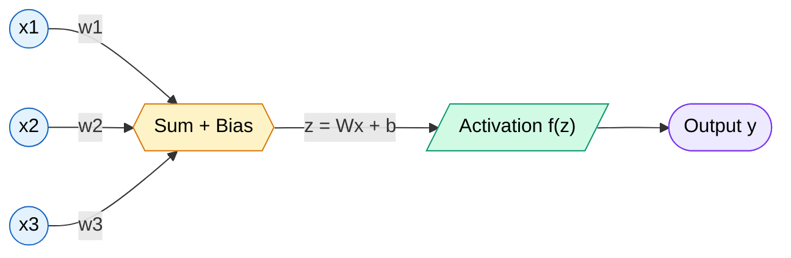
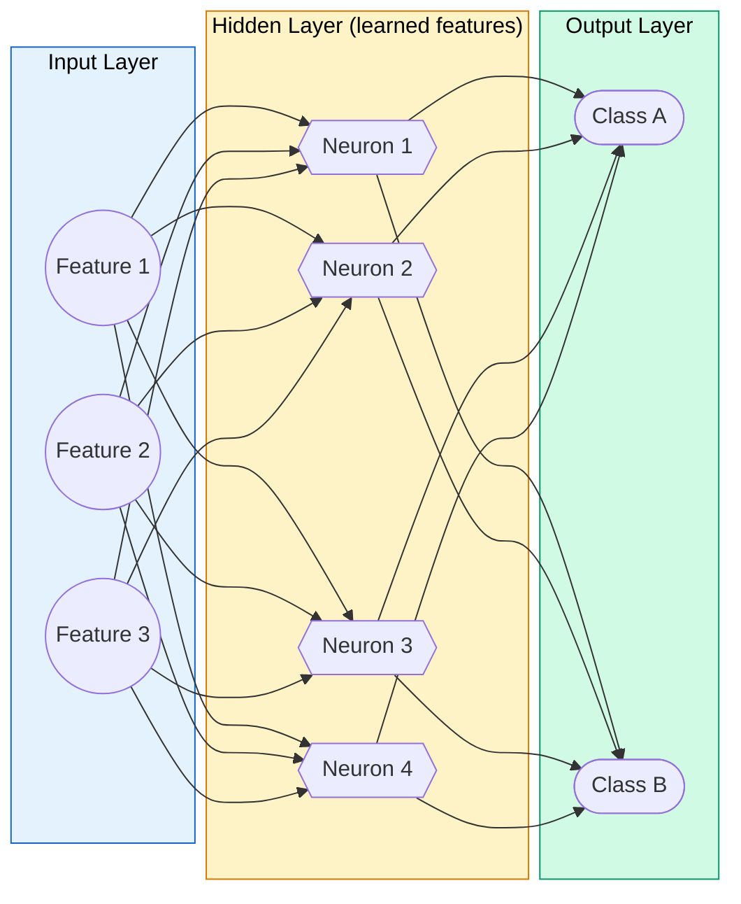
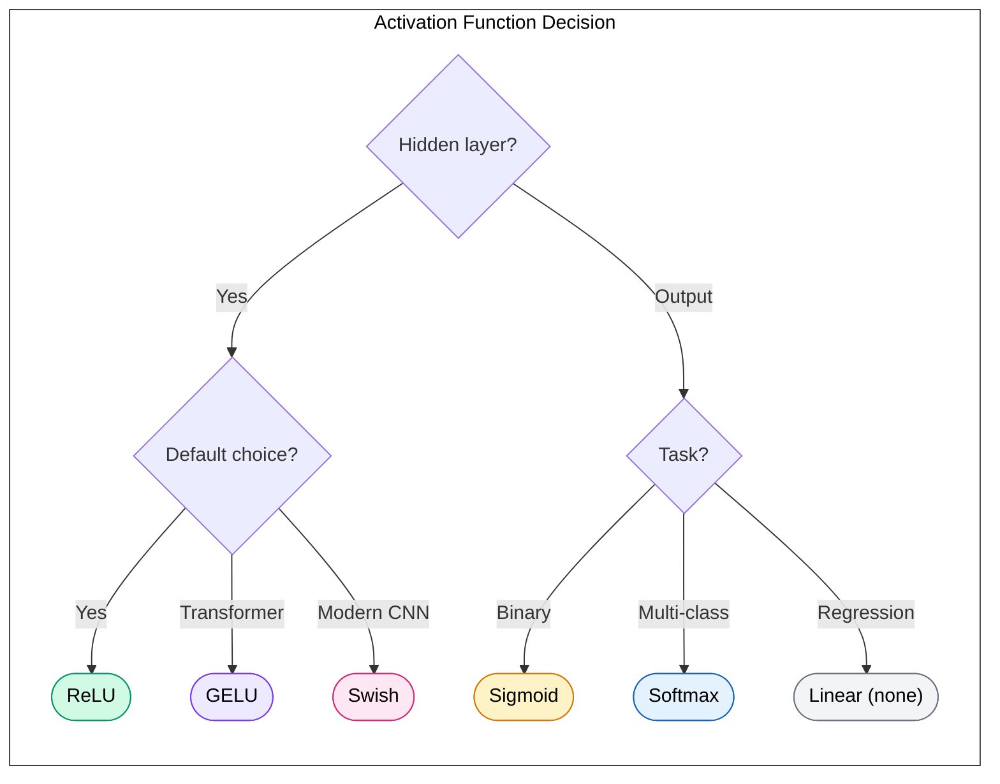
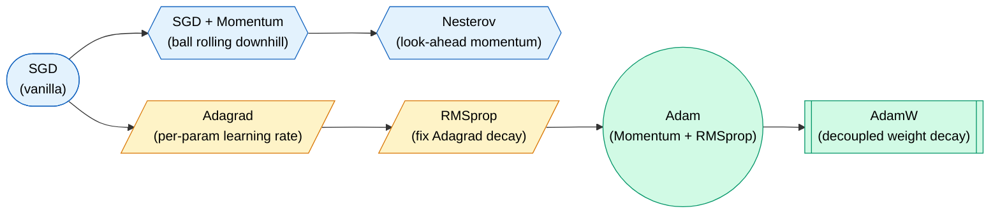
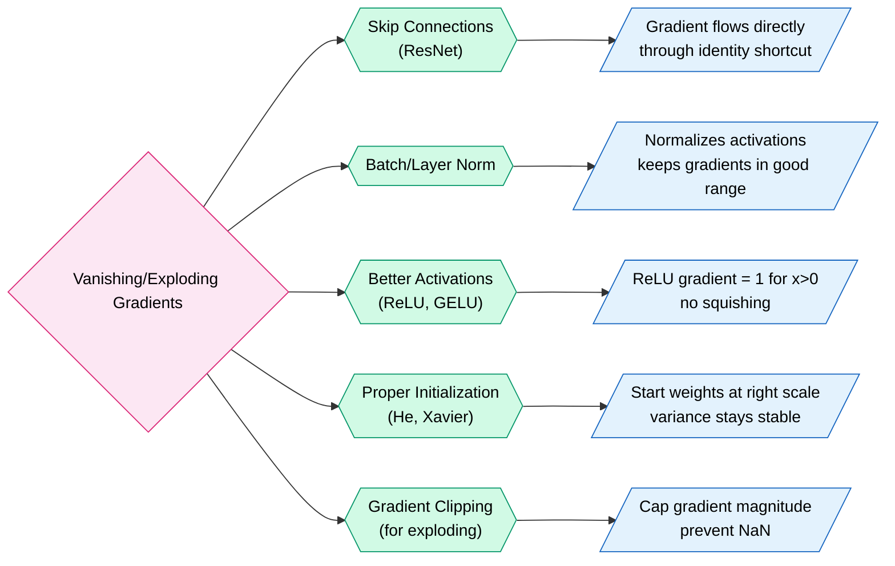
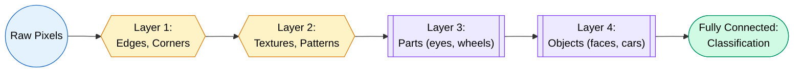
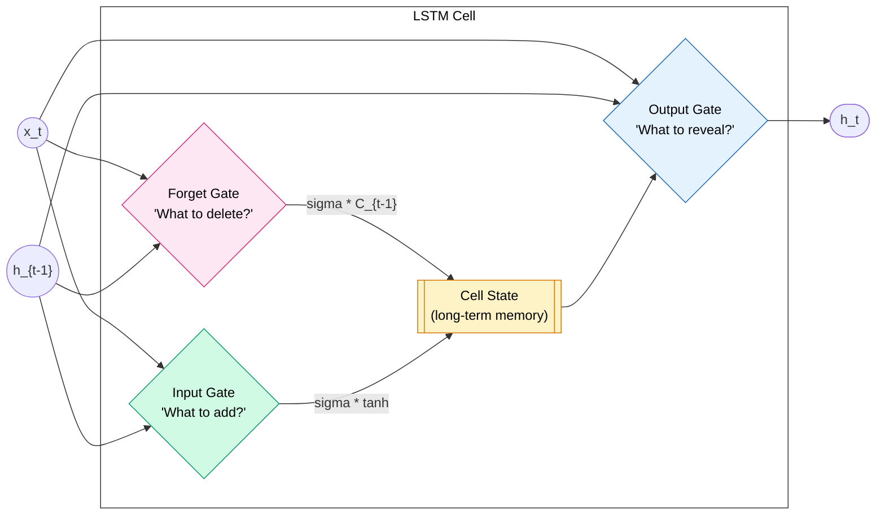

# Neural Networks & Deep Learning

> **From a single neuron to ResNets — the complete, interview-ready guide to neural networks. Written so a fresher gets the "aha!" moment and a senior finds the gotchas they forgot.**

---

## What is a Neural Network

A neural network is a function approximator. It takes inputs, applies a bunch of math, and produces outputs. That's it.

The building block is the **neuron** (or "perceptron"). Think of it as a tiny decision-maker:

1. It receives inputs (numbers).
2. It multiplies each input by a **weight** (how important is this input?).
3. It adds a **bias** (shift the decision boundary).
4. It passes the result through an **activation function** (introduce non-linearity).

$$output = f(w_1 x_1 + w_2 x_2 + ... + w_n x_n + b)$$

!!! tip "Analogy: The Hiring Manager"
    Imagine a hiring manager evaluating a candidate. Each input is a trait (GPA, experience, projects). Each weight is how much that manager *cares* about that trait. The bias is their default mood. The activation function is their final "hire / don't hire" decision.

### Clean Neuron Diagram



### Layer Architecture



!!! info "Why Multiple Layers?"
    A single neuron can only learn a straight line (linear boundary). Stack them into layers and you can approximate *any* continuous function. This is the **Universal Approximation Theorem**. More layers = more abstract features (edges → textures → faces → identities).

---

## Forward Pass & Backpropagation

### Forward Pass — Making a Prediction

Data flows left to right. Each layer transforms the input.

```
Input → Layer 1 (z = Wx + b, a = f(z)) → Layer 2 → ... → Output → Loss
```

**That's just function composition.** `output = f3(f2(f1(x)))`

### Backpropagation — The Blame Game

Once we have a prediction and a loss (how wrong we are), we need to figure out: **who's responsible?**

Backprop assigns "blame" to each weight by computing how much the loss would change if that weight changed slightly. This is the **gradient**.

!!! tip "Analogy: The Blame Game"
    Your startup lost money this quarter. The CEO asks: "Who caused this?" The answer traces back through the chain: bad marketing → wrong audience → weak data analysis. Backprop does the same thing — traces the error backward through each layer to find which weights need fixing.

### The Chain Rule — The Engine of Backprop

If `L = f(g(h(x)))`, then:

$$\frac{\partial L}{\partial x} = \frac{\partial L}{\partial f} \cdot \frac{\partial f}{\partial g} \cdot \frac{\partial g}{\partial h} \cdot \frac{\partial h}{\partial x}$$

Each layer computes its local gradient and passes it backward. That's it. No magic.

### Numerical Example (2-layer network)

```
Network: Input(1) → Hidden(1 neuron, ReLU) → Output(1 neuron, linear)
Goal: Predict y=1 from x=0.5

Forward Pass:
  Hidden: z1 = w1*x + b1 = 0.8*0.5 + 0.1 = 0.5
          a1 = ReLU(0.5) = 0.5
  Output: z2 = w2*a1 + b2 = 0.6*0.5 + 0.2 = 0.5
          y_hat = 0.5

Loss (MSE): L = (y - y_hat)^2 = (1 - 0.5)^2 = 0.25

Backward Pass:
  dL/dy_hat = 2*(y_hat - y) = 2*(0.5 - 1) = -1.0
  dL/dw2 = dL/dy_hat * a1 = -1.0 * 0.5 = -0.5
  dL/db2 = dL/dy_hat * 1 = -1.0
  dL/da1 = dL/dy_hat * w2 = -1.0 * 0.6 = -0.6
  dL/dz1 = dL/da1 * ReLU'(z1) = -0.6 * 1 = -0.6  (z1 > 0, so ReLU'=1)
  dL/dw1 = dL/dz1 * x = -0.6 * 0.5 = -0.3
  dL/db1 = dL/dz1 * 1 = -0.6

Weight Update (lr=0.1):
  w2 = 0.6 - 0.1*(-0.5) = 0.65   (moved in right direction!)
  w1 = 0.8 - 0.1*(-0.3) = 0.83
```

!!! danger "Gotcha: Gradients Flow Through Everything"
    If any operation in the forward pass is non-differentiable (e.g., hard thresholding), gradients die there. This is why we use smooth activations like ReLU (which is differentiable everywhere except at 0, and we just pick 0 there).

---

## Activation Functions

Activations introduce **non-linearity**. Without them, stacking layers is pointless — it's just matrix multiplication all the way down (linear * linear = still linear).

| Function | Formula | Range | Use Case | Gotcha |
|----------|---------|-------|----------|--------|
| **ReLU** | max(0, x) | [0, inf) | Default for hidden layers | Dead neurons (if input < 0 always) |
| **Leaky ReLU** | max(0.01x, x) | (-inf, inf) | Fix dead neurons | Marginal improvement |
| **Sigmoid** | 1/(1+e^-x) | (0, 1) | Binary classification output | Vanishing gradients, not zero-centered |
| **Tanh** | (e^x - e^-x)/(e^x + e^-x) | (-1, 1) | RNNs, zero-centered needed | Still saturates at extremes |
| **Softmax** | e^xi / sum(e^xj) | (0, 1), sums to 1 | Multi-class output layer | Not for hidden layers |
| **GELU** | x * phi(x) | (-0.17, inf) | Transformers (BERT, GPT) | Smooth, probabilistic gate |
| **Swish/SiLU** | x * sigmoid(x) | (-0.28, inf) | EfficientNet, modern CNNs | Slightly better than ReLU empirically |



!!! warning "Common Mistake"
    Never use Sigmoid/Tanh in hidden layers of deep networks. Gradients squish to near-zero as you go deeper (vanishing gradient problem). Use ReLU or GELU.

---

## Loss Functions

The loss function measures **how wrong your prediction is**. It's the signal that drives learning.

| Loss Function | Formula | Best For | Key Insight |
|---------------|---------|----------|-------------|
| **MSE** | mean((y - y_hat)^2) | Regression | Penalizes large errors heavily (quadratic) |
| **MAE** | mean(\|y - y_hat\|) | Regression (robust) | Less sensitive to outliers than MSE |
| **Cross-Entropy** | -sum(y * log(y_hat)) | Multi-class classification | Directly optimizes probability distribution |
| **Binary CE** | -(y*log(p) + (1-y)*log(1-p)) | Binary classification | Pair with sigmoid output |
| **Huber Loss** | MSE if \|e\|<delta, else MAE | Regression with outliers | Best of both MSE and MAE |
| **Focal Loss** | -alpha * (1-p)^gamma * log(p) | Imbalanced classification | Down-weights easy examples, focuses on hard ones |

!!! tip "How to Choose"
    - **Regression?** Start with MSE. Outliers? Use Huber.  
    - **Classification?** Cross-Entropy. Always.  
    - **Imbalanced classes?** Focal Loss (used in object detection like RetinaNet).  
    - **Never use MSE for classification** — it doesn't penalize confident wrong answers enough.

!!! danger "Gotcha: NaN from log(0)"
    Cross-entropy has `log(y_hat)`. If your model outputs exactly 0, you get -infinity. Always add a small epsilon: `log(y_hat + 1e-7)`. PyTorch's `CrossEntropyLoss` handles this internally.

---

## Optimizers

Optimizers decide **how to update weights** given the gradients. The gradient tells you the direction; the optimizer decides how far and how fast to move.

### The Family Tree



### Comparison Table

| Optimizer | How It Works | Pros | Cons | When to Use |
|-----------|-------------|------|------|-------------|
| **SGD** | w -= lr * grad | Simple, generalizes well | Slow, oscillates | Large-scale vision models |
| **SGD+Momentum** | velocity accumulates | Faster convergence | Extra hyperparameter | Most CNNs in practice |
| **RMSprop** | Adapts LR per parameter | Good for RNNs | Less popular now | RNNs, non-stationary |
| **Adam** | Momentum + adaptive LR | Works out-of-the-box | Can generalize worse | Default for most tasks |
| **AdamW** | Adam + proper weight decay | Best of Adam + regularization | Slightly more complex | Transformers, NLP, modern default |

!!! info "The Adam vs SGD Debate"
    Adam converges *faster* but SGD often finds *flatter* minima that generalize better. For research papers and ImageNet: SGD+Momentum. For everything else and quick iteration: AdamW.

### Learning Rate Schedules

The learning rate is the **most important hyperparameter**. Too high = diverge. Too low = never converge.

| Schedule | Behavior | Use Case |
|----------|----------|----------|
| **Constant** | Same LR throughout | Quick experiments |
| **Step Decay** | Divide LR by 10 every N epochs | Classic CNN training |
| **Cosine Annealing** | LR follows cosine curve down | Modern default |
| **Warmup + Cosine** | Start low, ramp up, then cosine down | Transformers (critical!) |
| **One-Cycle** | LR goes up then down in one cycle | Fast convergence (super-convergence) |

!!! warning "Transformers Need Warmup"
    Without warmup, Adam's adaptive estimates are way off in early steps (not enough history). This causes training instability. Always use warmup for Transformers (typically 1-10% of total steps).

---

## Vanishing and Exploding Gradients

### The Problem

In deep networks, gradients are multiplied layer by layer during backprop (chain rule). If each multiplication is:

- **< 1** → gradients shrink exponentially → **vanishing** (early layers stop learning)
- **> 1** → gradients grow exponentially → **exploding** (weights become NaN)

!!! danger "Why Sigmoid Causes Vanishing Gradients"
    Sigmoid's max derivative is 0.25 (at x=0). After 10 layers: 0.25^10 = 0.00000095. The gradient is essentially dead.

### Solutions



**Skip Connections (ResNet's key insight):**

Instead of learning `H(x)`, learn the *residual* `F(x) = H(x) - x`, so the output is `F(x) + x`.

Why this works: The gradient of `x + F(x)` with respect to x is `1 + dF/dx`. Even if `dF/dx` vanishes, the gradient is at least **1**. Gradients can always flow through the skip connection.

**Batch Normalization:**

Normalizes each layer's inputs to have mean=0, std=1. This keeps activations in the "sweet spot" where gradients are healthy. Also acts as mild regularization.

---

## CNN — Convolutional Neural Networks

### The Core Intuition

!!! tip "Analogy: The Detective with a Magnifying Glass"
    A CNN doesn't look at the whole image at once. It slides a small magnifying glass (kernel/filter) across the image, looking for patterns. First it finds edges, then combines edges into textures, textures into parts, parts into objects. Like a detective building a case from small clues.

### How Convolution Works

```
Input Image (5x5):        Kernel (3x3):         Output (slide kernel):
1 0 1 0 1                 1 0 1                 4 3 4
0 1 0 1 0                 0 1 0                 3 4 3
1 0 1 0 1     *           1 0 1           =     4 3 4
0 1 0 1 0
1 0 1 0 1

Computation for top-left output cell:
(1*1 + 0*0 + 1*1) + (0*0 + 1*1 + 0*0) + (1*1 + 0*0 + 1*1) = 4
```

### Feature Hierarchy



### Key CNN Components

| Component | What It Does | Why |
|-----------|-------------|-----|
| **Convolution** | Slides filter across input, dot product | Detects local patterns, translation invariant |
| **Padding** | Adds zeros around border | Preserves spatial dimensions |
| **Stride** | How many pixels to skip | Reduces spatial size (downsampling) |
| **Pooling (Max/Avg)** | Takes max/mean in a window | Reduces size, adds invariance |
| **1x1 Convolution** | Per-pixel channel mixing | Reduce/increase channels cheaply |

### Famous Architectures

| Architecture | Year | Key Innovation | Depth |
|-------------|------|----------------|-------|
| **AlexNet** | 2012 | GPU training, ReLU, Dropout | 8 |
| **VGG** | 2014 | Small 3x3 filters stacked deep | 16-19 |
| **GoogLeNet/Inception** | 2014 | Inception modules (parallel paths) | 22 |
| **ResNet** | 2015 | Skip connections (train 152 layers!) | 18-152 |
| **EfficientNet** | 2019 | Compound scaling (width/depth/resolution) | Variable |
| **ConvNeXt** | 2022 | Modernized ResNet (competes with ViT) | Variable |

### Transfer Learning (PyTorch Example)

```python
import torch
import torchvision.models as models
import torch.nn as nn

# Load pretrained ResNet (trained on ImageNet's 1.4M images)
model = models.resnet50(weights=models.ResNet50_Weights.IMAGENET1K_V2)

# Freeze all layers (don't train the feature extractor)
for param in model.parameters():
    param.requires_grad = False

# Replace the final classification head for your task (e.g., 10 classes)
model.fc = nn.Sequential(
    nn.Linear(2048, 512),
    nn.ReLU(),
    nn.Dropout(0.3),
    nn.Linear(512, 10)
)

# Only train the new head
optimizer = torch.optim.AdamW(model.fc.parameters(), lr=1e-3)
```

!!! tip "When to Freeze vs Fine-Tune"
    - **Small dataset, similar domain:** Freeze everything, only train the head.  
    - **Large dataset, different domain:** Unfreeze later layers, use small LR (1e-5).  
    - **Rule of thumb:** Always start frozen. Unfreeze if accuracy plateaus.

---

## RNN, LSTM, GRU

### Why Sequences Need Special Treatment

Standard neural nets have no memory. They process each input independently. But language, music, stock prices — they're all **sequences** where context matters.

!!! tip "Analogy: Reading a Sentence"
    "The bank is by the river." vs "The bank approved the loan." The word "bank" means different things based on context. An RNN maintains a hidden state — like short-term memory — that carries context forward.

### Vanilla RNN

```
h_t = tanh(W_hh * h_{t-1} + W_xh * x_t + b)
y_t = W_hy * h_t
```

**Problem:** Vanilla RNNs forget quickly. After ~10-20 timesteps, early information is lost (vanishing gradients through time).

### LSTM — Long Short-Term Memory

LSTM adds **gates** to control information flow. Think of it as a conveyor belt with workers who decide what to add, remove, or pass through.



**Gate intuitions:**

- **Forget Gate:** "Should I forget the previous subject now that a new sentence started?" (sigmoid → 0 = forget, 1 = keep)
- **Input Gate:** "Is this new word important enough to store?" (sigmoid gates what, tanh creates candidate)
- **Output Gate:** "What part of my memory is relevant for the current prediction?"

### GRU — Gated Recurrent Unit

GRU merges the forget and input gates into one **update gate**. Fewer parameters, similar performance.

| Feature | RNN | LSTM | GRU |
|---------|-----|------|-----|
| Parameters | Fewest | Most | Medium |
| Long-range memory | Poor | Excellent | Good |
| Training speed | Fastest | Slowest | Medium |
| Vanishing gradient | Severe | Solved | Mostly solved |

### When to Use RNNs vs Transformers

| Scenario | Best Choice | Why |
|----------|-------------|-----|
| Short sequences (<100 tokens) | LSTM/GRU | Simpler, less compute |
| Long sequences, lots of data | Transformer | Parallel training, better scaling |
| Real-time streaming | LSTM/GRU | Process one token at a time |
| NLP in 2024+ | Transformer | Strictly better with enough data |
| Time series (resource-constrained) | GRU | Small model, good enough |

!!! warning "RNNs Are Not Dead"
    Despite Transformers dominating NLP, LSTMs are still used in: real-time speech recognition, edge devices, small-scale time series, and anywhere O(n) sequential processing is needed (Transformers are O(n^2) in attention).

---

## Batch Normalization, Layer Normalization, Dropout

### Batch Normalization

**What:** Normalize activations across the *batch* dimension to mean=0, std=1. Then scale and shift with learned parameters (gamma, beta).

**Why it helps:**

- Reduces internal covariate shift (each layer sees stable input distributions)
- Allows higher learning rates
- Acts as mild regularizer (noise from batch statistics)

```python
# PyTorch
nn.BatchNorm2d(num_features=64)  # For CNNs (normalize per channel)
nn.BatchNorm1d(num_features=256) # For MLPs (normalize per feature)
```

!!! danger "BatchNorm Gotcha"
    BatchNorm behaves differently during training (uses batch stats) vs inference (uses running averages). Always call `model.eval()` before inference! Also breaks with batch_size=1.

### Layer Normalization

**What:** Normalize across the *feature* dimension (not batch). Each sample is normalized independently.

**Why:** No dependency on batch size. Essential for Transformers and RNNs where batch statistics don't make sense.

```python
nn.LayerNorm(normalized_shape=512)  # Normalize over last dimension
```

| Feature | BatchNorm | LayerNorm |
|---------|-----------|-----------|
| Normalizes across | Batch | Features |
| Depends on batch size | Yes | No |
| Best for | CNNs | Transformers, RNNs |
| Inference behavior | Uses running stats | Same as training |

### Dropout

**What:** During training, randomly zero out neurons with probability `p`. During inference, keep all neurons (scale by 1-p).

**Why:** Forces the network to not rely on any single neuron. Like training an ensemble of sub-networks.

!!! tip "Analogy: Group Project"
    Dropout is like randomly removing team members during practice. The remaining members learn to do each other's jobs. When everyone shows up for the final presentation, they're all well-rounded.

```python
nn.Dropout(p=0.3)   # Zero out 30% of activations
nn.Dropout2d(p=0.1) # Drop entire feature maps (for CNNs)
```

**Guidelines:** Use 0.1-0.3 for most layers. Up to 0.5 for large fully-connected layers. Don't use with BatchNorm in the same block (they fight each other).

---

## Practical Tips

### Learning Rate Finding

Use the **LR Range Test** (Leslie Smith): Start with a tiny LR and increase exponentially. Plot loss vs LR. Pick the LR where loss is decreasing fastest (not the minimum!).

```python
# PyTorch Lightning / FastAI make this easy
# Manual version:
lrs = torch.logspace(-7, 0, steps=100)
# Train one batch per LR, record loss, plot
```

### Batch Size Effects

| Batch Size | Effect | Trade-off |
|------------|--------|-----------|
| Small (8-32) | More noise, better generalization | Slower (less GPU utilization) |
| Large (256-4096) | Faster training, smoother gradients | May generalize worse, needs LR scaling |
| **Rule:** | Scale LR linearly with batch size | If batch_size 2x, LR 2x |

### When to Stop Training (Early Stopping)

Monitor **validation loss**. If it stops improving for N epochs (patience), stop. Training loss will keep going down (overfitting), but that's meaningless.

```python
# PyTorch pattern
best_val_loss = float('inf')
patience_counter = 0

for epoch in range(max_epochs):
    train_loss = train_one_epoch()
    val_loss = validate()
    
    if val_loss < best_val_loss:
        best_val_loss = val_loss
        patience_counter = 0
        torch.save(model.state_dict(), 'best_model.pt')
    else:
        patience_counter += 1
        if patience_counter >= patience:
            print("Early stopping!")
            break
```

### Data Augmentation

Free data! Apply random transformations that don't change the label:

- **Images:** Flip, rotate, crop, color jitter, cutout, mixup
- **Text:** Synonym replacement, back-translation, random deletion
- **Audio:** Time stretch, pitch shift, add noise

!!! info "Augmentation > More Data (Sometimes)"
    A well-augmented small dataset often beats a larger un-augmented one. Start with strong augmentation before spending money on labeling.

### Quick Debugging Checklist

1. **Can it overfit one batch?** If not, your model/loss is broken.
2. **Is your LR too high?** Loss oscillating wildly = reduce LR.
3. **NaN loss?** Check for log(0), exploding gradients, bad data.
4. **Val loss immediately higher than train?** You're overfitting from epoch 1 — too large model or not enough data.
5. **Both losses plateau?** Model too small, or LR too low.

---

## PyTorch Quick Reference

A complete working example: classify MNIST digits (28x28 grayscale images → 10 classes).

```python
import torch
import torch.nn as nn
import torch.optim as optim
from torch.utils.data import DataLoader
from torchvision import datasets, transforms

# --- 1. Data ---
transform = transforms.Compose([
    transforms.ToTensor(),
    transforms.Normalize((0.1307,), (0.3081,))  # MNIST mean/std
])

train_data = datasets.MNIST('./data', train=True, download=True, transform=transform)
test_data = datasets.MNIST('./data', train=False, transform=transform)

train_loader = DataLoader(train_data, batch_size=64, shuffle=True)
test_loader = DataLoader(test_data, batch_size=1000)

# --- 2. Model ---
class SimpleNet(nn.Module):
    def __init__(self):
        super().__init__()
        self.features = nn.Sequential(
            nn.Conv2d(1, 32, kernel_size=3, padding=1),  # 28x28 -> 28x28
            nn.BatchNorm2d(32),
            nn.ReLU(),
            nn.MaxPool2d(2),                              # 28x28 -> 14x14
            nn.Conv2d(32, 64, kernel_size=3, padding=1), # 14x14 -> 14x14
            nn.BatchNorm2d(64),
            nn.ReLU(),
            nn.MaxPool2d(2),                              # 14x14 -> 7x7
        )
        self.classifier = nn.Sequential(
            nn.Flatten(),
            nn.Linear(64 * 7 * 7, 128),
            nn.ReLU(),
            nn.Dropout(0.3),
            nn.Linear(128, 10)  # 10 digit classes
        )
    
    def forward(self, x):
        x = self.features(x)
        x = self.classifier(x)
        return x

# --- 3. Training Setup ---
device = torch.device('cuda' if torch.cuda.is_available() else 'cpu')
model = SimpleNet().to(device)
optimizer = optim.AdamW(model.parameters(), lr=1e-3, weight_decay=1e-4)
criterion = nn.CrossEntropyLoss()
scheduler = optim.lr_scheduler.CosineAnnealingLR(optimizer, T_max=10)

# --- 4. Training Loop ---
for epoch in range(10):
    model.train()
    total_loss = 0
    for batch_x, batch_y in train_loader:
        batch_x, batch_y = batch_x.to(device), batch_y.to(device)
        
        optimizer.zero_grad()
        output = model(batch_x)
        loss = criterion(output, batch_y)
        loss.backward()
        optimizer.step()
        total_loss += loss.item()
    
    scheduler.step()
    
    # Validation
    model.eval()
    correct = 0
    with torch.no_grad():
        for batch_x, batch_y in test_loader:
            batch_x, batch_y = batch_x.to(device), batch_y.to(device)
            preds = model(batch_x).argmax(dim=1)
            correct += (preds == batch_y).sum().item()
    
    acc = correct / len(test_data) * 100
    print(f"Epoch {epoch+1}: Loss={total_loss/len(train_loader):.4f}, Acc={acc:.1f}%")

# Expected: ~99%+ accuracy in 10 epochs
```

!!! tip "Key Patterns to Remember"
    - `model.train()` before training (enables dropout, batchnorm uses batch stats)
    - `model.eval()` before validation (disables dropout, batchnorm uses running stats)
    - `torch.no_grad()` during inference (saves memory, faster)
    - `optimizer.zero_grad()` before each backward pass (gradients accumulate by default!)

---

## Interview Questions

??? question "1. What is the Universal Approximation Theorem and what does it NOT guarantee?"
    **The theorem states:** A feedforward neural network with a single hidden layer containing a finite number of neurons can approximate any continuous function on a compact subset of R^n, given the right weights.

    **What it does NOT guarantee:**
    
    - It doesn't say how many neurons you need (could be astronomically many)
    - It doesn't say you can *find* those weights via gradient descent (only that they exist)
    - It doesn't say a single wide layer is *better* than multiple deep layers (in practice, depth is more parameter-efficient)
    - It doesn't apply to discrete/discontinuous functions
    
    **Practical implication:** Depth (multiple layers) is preferred over width because it creates a hierarchy of features and is exponentially more parameter-efficient for most real-world functions.

??? question "2. Explain backpropagation in simple terms. Why is it efficient?"
    **Simple explanation:** Backprop computes how much each weight contributed to the error, so we know how to adjust it. It works backward from the output to the input using the chain rule.

    **Why it's efficient:** Without backprop, you'd need to compute the gradient for each weight independently (perturb one weight, run forward pass, measure change — N forward passes for N weights). Backprop does it in **one forward + one backward pass** regardless of how many weights exist. This is O(N) instead of O(N^2).

    **Key insight:** It reuses intermediate computations. The gradient at layer L depends on the gradient at layer L+1, which we already computed. We just multiply by the local gradient and pass it back.

??? question "3. Why does ReLU work better than Sigmoid for deep networks?"
    **Three reasons:**

    1. **No vanishing gradient:** ReLU's gradient is either 0 or 1. Sigmoid's gradient is at most 0.25 and shrinks in deep networks. After 10 layers: Sigmoid gradient = 0.25^10 ~ 10^-6. ReLU gradient = 1^10 = 1.
    
    2. **Sparse activation:** ReLU zeros out negative inputs, creating sparse representations. This is more computationally efficient and can improve generalization.
    
    3. **Cheaper computation:** ReLU is just `max(0,x)` — one comparison. Sigmoid requires exponentiation.

    **ReLU's weakness:** "Dead neurons" — if a neuron's input is always negative, its gradient is always 0, and it never updates. Fix: Leaky ReLU, or careful initialization.

??? question "4. What is the difference between Batch Normalization and Layer Normalization? When do you use each?"
    **Batch Normalization:** Normalizes across the batch dimension for each feature/channel. Computes mean and variance using all examples in the batch.
    
    - Depends on batch size (breaks with batch_size=1)
    - Different behavior at train vs. inference time
    - Best for: CNNs (normalizes per feature map)

    **Layer Normalization:** Normalizes across the feature dimension for each individual example. Each sample is normalized independently.
    
    - Independent of batch size
    - Same behavior at train and inference time
    - Best for: Transformers, RNNs, online learning

    **Why Transformers use LayerNorm:** Transformer inputs have variable sequence lengths, and batch statistics across different-length sequences are meaningless. LayerNorm normalizes each token's representation independently.

??? question "5. Explain the vanishing gradient problem and three solutions."
    **The problem:** During backprop, gradients are multiplied through each layer (chain rule). If these multiplications are consistently < 1 (sigmoid derivatives, small weights), gradients shrink exponentially. Early layers get near-zero gradients and stop learning.

    **Three solutions:**

    1. **Residual/Skip Connections (ResNet):** Output = F(x) + x. Gradient of identity shortcut is always 1, providing a "gradient highway." Even if F(x)'s gradient vanishes, the total gradient is at least 1.

    2. **Better Activation Functions:** ReLU has gradient = 1 for positive inputs (no squishing). GELU is smooth and keeps gradients flowing.

    3. **Proper Initialization:** Xavier (for sigmoid/tanh) or He initialization (for ReLU) sets initial weights so that variance is preserved across layers. Without this, activations either explode or vanish from the start.

    **Bonus:** Batch/Layer Normalization keeps activations in a range where gradients are healthy.

??? question "6. What is the difference between Adam and SGD? When would you choose each?"
    **SGD:** `w = w - lr * gradient`. Simple. Each update uses only the current gradient.

    **Adam:** Maintains two running averages:
    
    - First moment (mean of gradients) — like momentum
    - Second moment (mean of squared gradients) — like RMSprop's adaptive LR
    
    Then uses both to compute the update. Effectively adapts the learning rate per-parameter.

    **When to use SGD:** When you want best generalization (flatter minima). Standard for ImageNet training, large-scale vision. Requires more LR tuning.

    **When to use Adam/AdamW:** Default for Transformers, NLP, GANs, smaller datasets, quick prototyping. Less sensitive to LR choice. AdamW (decoupled weight decay) is preferred over vanilla Adam.

    **Key insight:** Adam converges faster but can overfit more. SGD is slower but often finds solutions that generalize better to unseen data.

??? question "7. Explain how a CNN achieves translation invariance. Why is this important?"
    **Translation invariance** means the network recognizes a pattern regardless of where it appears in the image.

    **How CNN achieves it:**

    1. **Weight sharing:** The same kernel slides across the entire image. It detects the same pattern everywhere (a horizontal edge detector works whether the edge is top-left or bottom-right).

    2. **Pooling:** Max/average pooling summarizes a region into a single value. Small shifts in the input don't change the pooled output.

    3. **Hierarchical feature learning:** Lower layers detect local patterns (edges), higher layers combine them into position-invariant features (a "face" regardless of where in the image).

    **Why important:** Without it, the network would need to learn "cat in top-left" and "cat in bottom-right" as completely separate patterns. Translation invariance means it learns "cat" once and recognizes it anywhere.

??? question "8. What are the gates in an LSTM and why are they necessary?"
    **Three gates:**

    1. **Forget Gate (f_t):** Decides what to throw away from the cell state. Sigmoid output: 0 = forget completely, 1 = keep everything. *Example:* When a new subject appears in a sentence, forget the old subject's gender.

    2. **Input Gate (i_t):** Decides what new information to store. Has two parts: sigmoid (what to update) and tanh (candidate values). *Example:* The new subject's gender should be stored.

    3. **Output Gate (o_t):** Decides what part of the cell state to output as the hidden state. *Example:* If we see a verb, output information about the subject (for agreement).

    **Why necessary:** Vanilla RNNs multiply the hidden state by a weight matrix at every step. After many steps, this either vanishes or explodes. LSTM's cell state passes through *additive* operations (forget old + add new), which preserves gradients over long sequences. The gates learn *when* to remember, forget, and output — solving the long-range dependency problem.

??? question "9. What is transfer learning and when does it fail?"
    **Transfer learning:** Use a model pretrained on a large dataset (e.g., ImageNet) as a starting point for a new task. Reuse the learned feature representations instead of training from scratch.

    **Steps:**
    
    1. Load pretrained model (backbone)
    2. Replace the final layer(s) for your task
    3. Optionally freeze early layers
    4. Fine-tune on your dataset

    **When it works great:** Your domain is similar to the pretraining domain. Medical imaging with ImageNet features (both have edges, textures, shapes).

    **When it fails:**
    
    - **Domain mismatch:** Satellite imagery or microscopy is very different from ImageNet photos. Features like "fur texture" are useless.
    - **Task mismatch:** Pretraining was classification but you need dense prediction (segmentation). Though this still partially works.
    - **Very small target dataset:** Even frozen features can overfit with <100 examples.
    - **Negative transfer:** The pretrained features actually hurt performance. Happens when source and target domains are highly dissimilar.

??? question "10. Why do we need non-linear activation functions? What happens without them?"
    **Without activation functions (or with only linear ones):**
    
    Layer 1: y = W1*x + b1  
    Layer 2: y = W2*(W1*x + b1) + b2 = W2*W1*x + W2*b1 + b2 = W'*x + b'
    
    Multiple linear layers collapse into a single linear transformation. The network can only learn linear decision boundaries regardless of depth.

    **With non-linear activations:** Each layer can create a new non-linear transformation. Stacking these creates increasingly complex decision boundaries. The network can learn XOR, circles, spirals — any shape.

    **Proof it matters:** XOR is not linearly separable. A single linear layer cannot learn it. One hidden layer with non-linear activation can.

??? question "11. Explain dropout. Why does it work as regularization? What happens at test time?"
    **Training:** Randomly set each neuron's output to 0 with probability p. Each forward pass uses a different random subset of the network.

    **Why it regularizes:**
    
    1. **Prevents co-adaptation:** Neurons can't rely on specific other neurons being present. They must learn robust, independent features.
    2. **Implicit ensemble:** Each dropout mask creates a different sub-network. Training with dropout is like training 2^N different networks (where N is the number of neurons) and averaging their predictions.
    3. **Noise injection:** Adds stochasticity that prevents overfitting to training examples.

    **At test time:** No dropout is applied. All neurons are active. However, outputs are scaled by (1-p) to compensate for more neurons being active. (In practice, PyTorch uses "inverted dropout" — scales during training by 1/(1-p) so no change is needed at test time.)

    **Gotcha:** Don't use dropout with BatchNorm in the same block — the noise from dropout interferes with batch statistics estimation.

??? question "12. What is the learning rate warmup and why do Transformers need it?"
    **Warmup:** Start with a very small learning rate and linearly increase it to the target LR over the first K steps (e.g., first 1-10% of training).

    **Why Transformers need it:** Adam's adaptive learning rate relies on estimates of the first and second moments of gradients. In early training, these estimates are inaccurate (initialized at 0, slowly accumulating history). With a large LR and bad moment estimates, early updates can be wildly wrong, pushing the model into a bad region of the loss landscape it never recovers from.

    **Warmup gives Adam time to calibrate.** By the time the LR is high, Adam's moment estimates are reliable and can control the update magnitudes properly.

    **Also:** Transformers with attention can have very sharp loss landscapes early in training. Large steps early on can cause training divergence. Warmup smooths this.

??? question "13. Compare ResNet skip connections with dense connections (DenseNet). Trade-offs?"
    **ResNet (Residual):** Each block adds its input to its output: `y = F(x) + x`. Previous layer connects to the next via one skip.

    **DenseNet (Dense):** Each layer receives feature maps from ALL previous layers: `y = F([x0, x1, x2, ..., x_{l-1}])`. Concatenation instead of addition.

    | Aspect | ResNet | DenseNet |
    |--------|--------|----------|
    | Connection | Add input to output | Concatenate all previous |
    | Feature reuse | Implicit | Explicit (all features available) |
    | Parameters | More per block | Fewer (uses thin layers) |
    | Memory | Lower | Higher (stores all intermediate features) |
    | Gradient flow | Good (shortcut) | Excellent (direct path to every layer) |
    | Practical use | More common | Used in segmentation, smaller datasets |

    **DenseNet's advantage:** Maximum feature reuse, very strong gradient flow, fewer parameters. **Disadvantage:** Memory-intensive due to concatenation, less GPU-efficient.

??? question "14. What is the difference between model capacity, overfitting, and underfitting? How do you diagnose each?"
    **Model capacity:** How complex a function the model can represent. More parameters/layers = higher capacity.

    **Underfitting (high bias):**
    
    - Model too simple for the data
    - Both training AND validation loss are high
    - Fix: Bigger model, more layers, train longer, reduce regularization

    **Overfitting (high variance):**
    
    - Model memorizes training data, fails on new data
    - Training loss is low, validation loss is much higher
    - Fix: More data, augmentation, dropout, weight decay, early stopping, smaller model

    **Diagnosis recipe:**
    
    1. Train loss high, val loss high → underfitting
    2. Train loss low, val loss high → overfitting  
    3. Train loss low, val loss low → good fit
    4. Can't overfit a single batch → bug in model/code

    **Key insight:** Always start by trying to overfit. If you can't overfit, your model is broken. Once you can overfit, add regularization to close the train-val gap.

??? question "15. Design a CNN architecture for classifying 224x224 RGB images into 100 classes. Justify your choices."
    ```python
    class ImageClassifier(nn.Module):
        def __init__(self, num_classes=100):
            super().__init__()
            self.features = nn.Sequential(
                # Block 1: 224x224x3 -> 112x112x64
                nn.Conv2d(3, 64, kernel_size=7, stride=2, padding=3),
                nn.BatchNorm2d(64),
                nn.ReLU(),
                nn.MaxPool2d(3, stride=2, padding=1),  # -> 56x56x64
                
                # Block 2: 56x56x64 -> 28x28x128
                self._make_block(64, 128),
                nn.MaxPool2d(2),
                
                # Block 3: 28x28x128 -> 14x14x256
                self._make_block(128, 256),
                nn.MaxPool2d(2),
                
                # Block 4: 14x14x256 -> 7x7x512
                self._make_block(256, 512),
                nn.AdaptiveAvgPool2d(1),  # -> 1x1x512
            )
            self.classifier = nn.Sequential(
                nn.Flatten(),
                nn.Dropout(0.3),
                nn.Linear(512, num_classes)
            )
        
        def _make_block(self, in_ch, out_ch):
            return nn.Sequential(
                nn.Conv2d(in_ch, out_ch, 3, padding=1),
                nn.BatchNorm2d(out_ch),
                nn.ReLU(),
                nn.Conv2d(out_ch, out_ch, 3, padding=1),
                nn.BatchNorm2d(out_ch),
                nn.ReLU(),
            )
    ```

    **Justifications:**
    
    - **7x7 first conv with stride 2:** Quickly reduces spatial resolution while capturing large patterns (standard in ResNet)
    - **BatchNorm after every conv:** Stabilizes training, allows higher LR
    - **ReLU:** Default activation, no vanishing gradients
    - **Doubling channels while halving spatial:** Keeps computational cost roughly constant per layer
    - **AdaptiveAvgPool2d(1):** Removes dependence on input size, replaces large FC layers
    - **Dropout before final linear:** Regularization for the most parameter-heavy layer
    - **No skip connections:** For simplicity, but adding them (ResNet-style) would allow training deeper versions

    **In practice:** Just use a pretrained ResNet50 or EfficientNet-B0. You'd only design from scratch for educational purposes or very specialized hardware.
