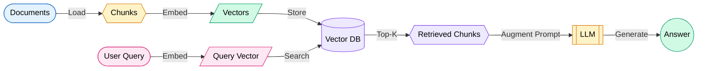
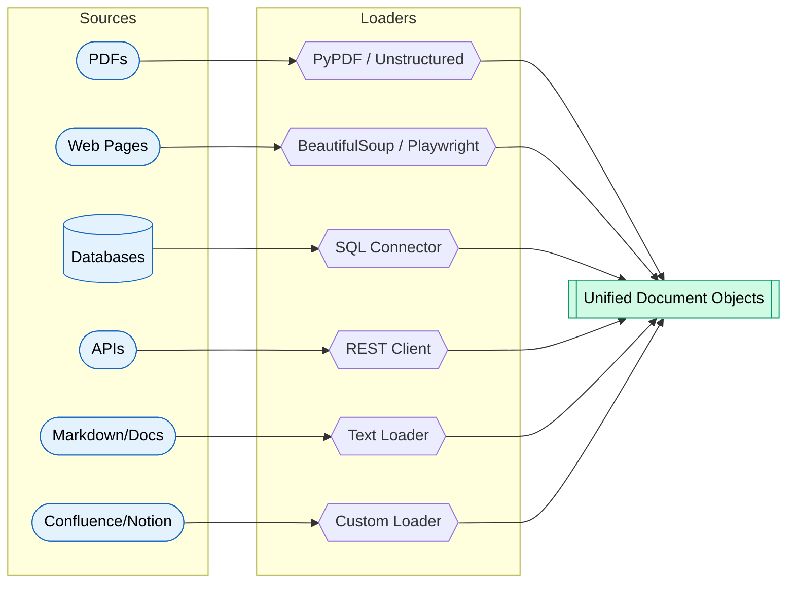
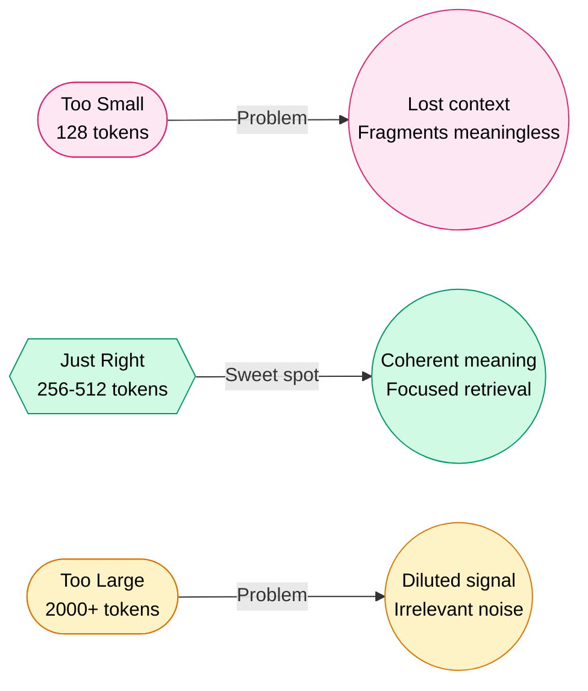
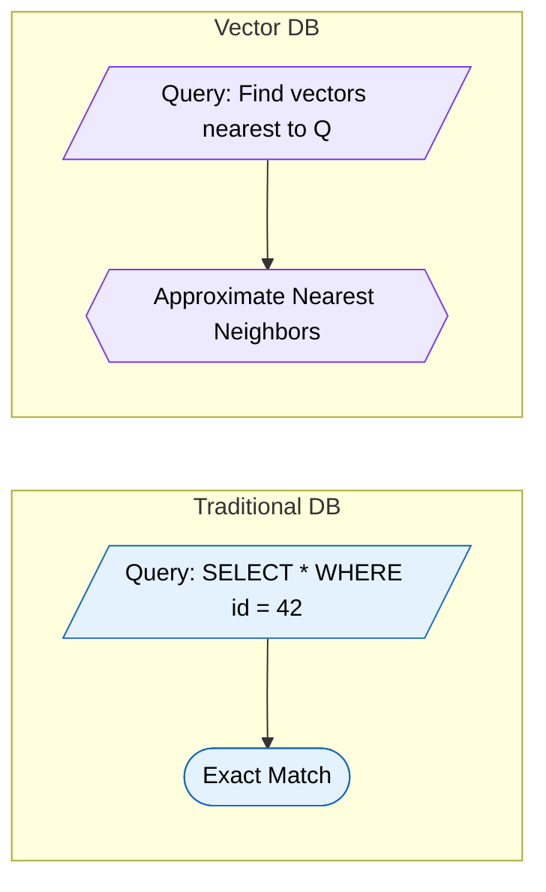
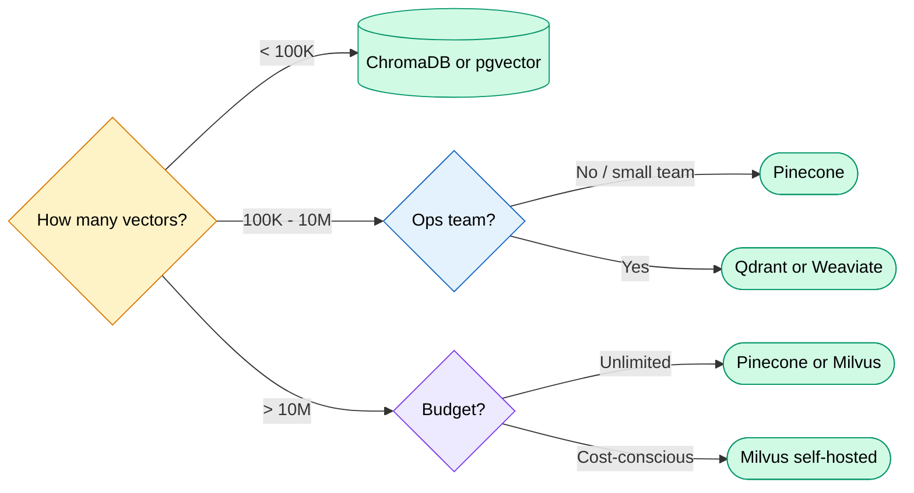
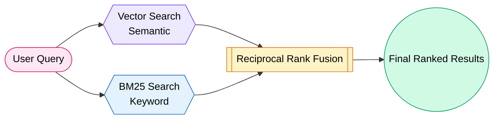
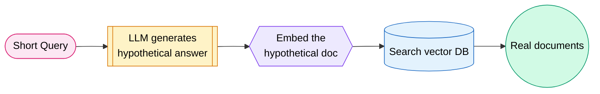
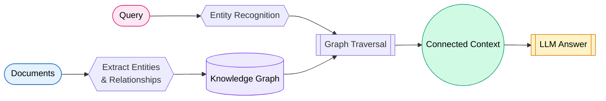
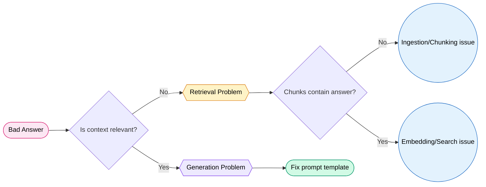
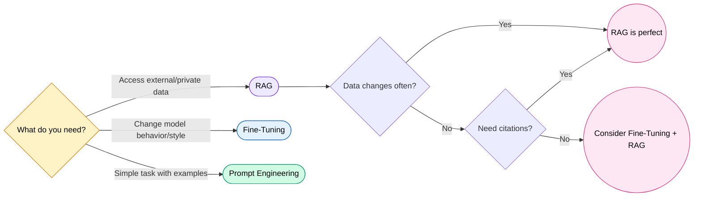

# RAG & Vector Databases

## Why RAG Exists

LLMs have three fatal flaws:

1. **Hallucination** -- They confidently invent facts. Ask GPT about your company's internal API and it will fabricate endpoints that sound real.
2. **Knowledge Cutoff** -- Training data has a date stamp. The model knows nothing after that date.
3. **Privacy** -- You cannot feed proprietary documents into a public model's training set.

RAG solves all three. Think of it as giving the AI an **open-book exam** instead of relying on memorization.

!!! tip "The Open-Book Analogy"
    Without RAG: Student takes a closed-book test, guesses when unsure.  
    With RAG: Student gets to flip through the textbook, finds the right page, then answers.

### When RAG Beats Fine-Tuning

| Scenario | RAG | Fine-Tuning |
|----------|-----|-------------|
| Data changes frequently | Best choice | Retrain every time |
| Need citations/sources | Built-in | Not possible |
| Limited training data | Works with any docs | Needs thousands of examples |
| Domain-specific behavior/tone | Moderate | Best choice |
| Cost | Low (no GPU training) | High (compute-intensive) |
| Latency | Slightly higher (retrieval step) | Lower (single inference) |

---

## RAG Architecture

The complete pipeline from raw documents to generated answers:



### Step-by-Step Breakdown

| Step | What Happens | Key Decision |
|------|-------------|--------------|
| 1. Ingest | Load raw documents (PDF, HTML, DB) | Which loader to use |
| 2. Chunk | Split into smaller pieces | Chunk size & overlap |
| 3. Embed | Convert text to dense vectors | Which embedding model |
| 4. Store | Index vectors in a database | Which vector DB |
| 5. Query | User asks a question | Query preprocessing |
| 6. Retrieve | Find most similar chunks | Top-K, threshold, reranking |
| 7. Generate | LLM produces answer using context | Prompt template design |

---

## Document Ingestion

### Common Document Sources



### LangChain Document Loaders

```python
from langchain_community.document_loaders import (
    PyPDFLoader,
    WebBaseLoader,
    TextLoader,
    CSVLoader,
    UnstructuredMarkdownLoader
)

# PDF
loader = PyPDFLoader("report.pdf")
docs = loader.load()  # Each page = one Document

# Web page
loader = WebBaseLoader("https://docs.example.com/api")
docs = loader.load()

# CSV with metadata
loader = CSVLoader("data.csv", metadata_columns=["source", "date"])
docs = loader.load()
```

### Metadata Extraction

Metadata is your secret weapon for filtering at retrieval time.

```python
# Each Document has: page_content + metadata
doc.metadata = {
    "source": "quarterly_report_q3.pdf",
    "page": 14,
    "author": "Finance Team",
    "date": "2024-10-01",
    "category": "financial"
}
```

!!! info "Why Metadata Matters"
    Without metadata, you search the entire corpus blindly. With metadata, you can filter: "only search documents from Q3 2024" or "only engineering docs." This dramatically improves relevance.

---

## Chunking Strategies

Chunking is where most RAG pipelines silently fail. Too small and you lose context. Too big and you dilute the signal with noise.

### Strategy Comparison

| Strategy | How It Works | Pros | Cons | Best For |
|----------|-------------|------|------|----------|
| **Fixed Size** | Split every N characters | Simple, predictable | Breaks mid-sentence | Quick prototypes |
| **Sentence** | Split on sentence boundaries | Preserves meaning | Uneven sizes | Clean prose |
| **Recursive** | Try large splits, then smaller | Respects structure | Needs tuning | General purpose |
| **Semantic** | Group by embedding similarity | Best coherence | Slow, expensive | High-quality RAG |
| **Parent-Child** | Small chunks linked to larger parent | Precise retrieval + full context | Complex implementation | Production systems |

### The Chunk Size Tradeoff



!!! warning "The Golden Rule of Chunking"
    Each chunk should be **independently meaningful**. If you read it in isolation, does it make sense? If not, your chunk size or strategy is wrong.

### Recursive Character Splitting (Most Popular)

```python
from langchain.text_splitter import RecursiveCharacterTextSplitter

splitter = RecursiveCharacterTextSplitter(
    chunk_size=512,
    chunk_overlap=50,
    separators=["\n\n", "\n", ". ", " ", ""]
)

# Tries "\n\n" first (paragraphs), falls back to smaller splits
chunks = splitter.split_documents(docs)
```

### Overlap: The Glue Between Chunks

Overlap ensures no information falls into the gap between two chunks. Typical overlap: 10-20% of chunk size.

```
Chunk 1: [============================]
Chunk 2:                    [============================]
                            ^--- overlap zone ---^
```

---

## Embeddings Deep Dive

### What Are Embeddings?

Embeddings convert text into dense numerical vectors. Similar meanings produce vectors that are geometrically close. Think of it as plotting sentences on a map where related ideas cluster together.

```
"The cat sat on the mat"  --> [0.12, -0.34, 0.78, ..., 0.23]  (768 dims)
"A feline rested on a rug" --> [0.11, -0.32, 0.76, ..., 0.25]  (nearby!)
"Stock markets crashed"    --> [-0.45, 0.67, -0.12, ..., 0.89] (far away)
```

### How Similarity Works: Cosine Similarity

Cosine similarity measures the angle between two vectors. Ignore magnitude, focus on direction.

$$\text{cosine\_similarity}(A, B) = \frac{A \cdot B}{\|A\| \times \|B\|}$$

- **1.0** = identical meaning
- **0.0** = completely unrelated
- **-1.0** = opposite meaning (rare in practice)

!!! tip "Intuition"
    Two arrows pointing the same direction = high similarity. Two arrows at right angles = unrelated. It does not matter how long the arrows are (magnitude), only the angle.

### Embedding Models Comparison

| Model | Dimensions | Context Window | Speed | Quality | Cost |
|-------|-----------|---------------|-------|---------|------|
| **OpenAI text-embedding-3-large** | 3072 | 8191 tokens | Fast | Excellent | $0.13/M tokens |
| **OpenAI text-embedding-3-small** | 1536 | 8191 tokens | Very Fast | Good | $0.02/M tokens |
| **Cohere embed-v3** | 1024 | 512 tokens | Fast | Excellent | $0.10/M tokens |
| **BGE-large-en-v1.5** | 1024 | 512 tokens | Moderate | Very Good | Free (local) |
| **all-MiniLM-L6-v2** | 384 | 256 tokens | Very Fast | Good | Free (local) |
| **GTE-large** | 1024 | 512 tokens | Moderate | Very Good | Free (local) |
| **Nomic embed-text** | 768 | 8192 tokens | Fast | Very Good | Free (local) |

!!! info "How to Choose"
    - **Prototyping / budget**: all-MiniLM-L6-v2 (fast, free, decent)
    - **Production / quality**: OpenAI text-embedding-3-large or Cohere embed-v3
    - **Privacy / air-gapped**: BGE-large or GTE-large (run locally)
    - **Long documents**: Nomic or OpenAI (large context windows)

### Generating Embeddings

```python
# OpenAI
from openai import OpenAI
client = OpenAI()

response = client.embeddings.create(
    model="text-embedding-3-small",
    input="What is retrieval augmented generation?"
)
vector = response.data[0].embedding  # List of 1536 floats

# Local with sentence-transformers
from sentence_transformers import SentenceTransformer

model = SentenceTransformer("all-MiniLM-L6-v2")
vector = model.encode("What is retrieval augmented generation?")
# numpy array of 384 floats
```

---

## Vector Databases

### What They Are

A vector database is purpose-built to store, index, and query high-dimensional vectors at scale. Regular databases find rows by exact match. Vector databases find rows by **similarity**.



### How Indexing Works (High-Level)

#### HNSW (Hierarchical Navigable Small World)

Think of it as a multi-level highway system:

- **Top layer**: Few nodes, long-distance connections (interstate highways)
- **Middle layers**: More nodes, medium connections (state roads)
- **Bottom layer**: All nodes, short connections (local streets)

Search starts at the top and "zooms in" layer by layer. Result: finds approximate nearest neighbors in O(log N) time.

#### IVF (Inverted File Index)

Think of it as organizing a library into sections:

1. Cluster all vectors into K groups (using k-means)
2. At query time, find the closest cluster centers
3. Only search within those clusters

Trades accuracy for speed. Search fewer vectors = faster results.

!!! tip "HNSW vs IVF"
    - **HNSW**: Higher memory, faster queries, better recall. Default choice.
    - **IVF**: Lower memory, needs training step, good for very large datasets (100M+ vectors).

### Vector Database Comparison

| Database | Type | Best For | Scaling | Filtering | Unique Strength |
|----------|------|----------|---------|-----------|-----------------|
| **Pinecone** | Managed SaaS | Production, zero-ops | Auto-scales | Excellent | Simplest to operate |
| **Weaviate** | Self-hosted / Cloud | Multimodal, GraphQL lovers | Horizontal | Excellent | Built-in vectorizer modules |
| **ChromaDB** | Embedded | Prototyping, small projects | Single node | Basic | 3 lines to start |
| **Milvus** | Self-hosted | Massive scale (billions) | Horizontal | Good | Battle-tested at scale |
| **pgvector** | PostgreSQL extension | Teams already on Postgres | Vertical | Full SQL | Zero new infrastructure |
| **Qdrant** | Self-hosted / Cloud | Filtering-heavy workloads | Horizontal | Best-in-class | Payload filtering + HNSW |

### When to Use Each



---

## Retrieval Strategies

### Similarity Search (Baseline)

Find the K vectors closest to the query vector. Simple but can return redundant results.

```python
results = vectorstore.similarity_search(query, k=5)
```

### MMR (Maximal Marginal Relevance)

Balances **relevance** and **diversity**. Avoids returning 5 chunks that all say the same thing.

$$MMR = \arg\max_{d \in R \setminus S} \left[ \lambda \cdot Sim(d, q) - (1-\lambda) \cdot \max_{d' \in S} Sim(d, d') \right]$$

- Lambda = 1.0: Pure relevance (same as similarity search)
- Lambda = 0.0: Maximum diversity (ignore relevance)
- Sweet spot: 0.5 - 0.7

```python
results = vectorstore.max_marginal_relevance_search(
    query, k=5, fetch_k=20, lambda_mult=0.6
)
```

### Hybrid Search (Vector + BM25 Keyword)

Combines semantic understanding (vectors) with exact keyword matching (BM25). Catches cases where semantic search misses specific terms.



!!! danger "When Semantic Search Fails"
    Query: "error code 0x8007045D"  
    Semantic search looks for meaning but this is an **exact string**. BM25 keyword search finds it instantly. Always consider hybrid for technical/code content.

### Reranking with Cross-Encoders

Cross-encoders score query-document pairs jointly. Much more accurate than bi-encoder similarity, but too slow to run on the entire corpus.

**Strategy**: Retrieve 20-50 candidates with fast vector search, then rerank the top results with a cross-encoder.

```python
from sentence_transformers import CrossEncoder

reranker = CrossEncoder("cross-encoder/ms-marco-MiniLM-L-6-v2")

# Score each (query, document) pair
pairs = [(query, doc.page_content) for doc in candidates]
scores = reranker.predict(pairs)

# Sort by reranker score
reranked = sorted(zip(candidates, scores), key=lambda x: x[1], reverse=True)
```

---

## Advanced RAG Techniques

### HyDE (Hypothetical Document Embeddings)

Problem: Short queries produce poor embeddings. Solution: Ask the LLM to generate a **hypothetical answer**, embed that instead.



!!! tip "Why HyDE Works"
    A hypothetical answer is closer in embedding space to real answers than a short question is. You are searching with the shape of an answer, not the shape of a question.

### Multi-Query Retrieval

Generate multiple reformulations of the user's question, retrieve for each, then combine results.

```python
# Original: "What are the benefits of microservices?"
# Generated queries:
# 1. "Why do companies adopt microservice architecture?"
# 2. "Advantages of microservices vs monolith"
# 3. "What problems does microservices solve?"
```

Each query retrieves different relevant chunks. Union of results = better coverage.

### Self-Query Retrieval

The LLM parses the user's question into a **structured query** with metadata filters.

```
User: "What did the finance team report about Q3 revenue?"

Parsed:
  - search_query: "Q3 revenue report"
  - filters: {author: "Finance Team", quarter: "Q3"}
```

### Parent-Child Retrieval

Store small chunks for precise matching. When retrieved, return the **parent chunk** (larger context) to the LLM.

```
Parent (2000 tokens): Full section about authentication
  ├── Child (200 tokens): OAuth 2.0 flow description
  ├── Child (200 tokens): Token refresh mechanism  
  └── Child (200 tokens): Security considerations

Search matches "token refresh" child → LLM gets the full parent
```

### Contextual Compression

After retrieval, compress each chunk to only the parts relevant to the query. Removes noise, fits more useful context into the LLM window.

### Graph RAG

Builds a knowledge graph from documents. Retrieval traverses relationships, not just vector similarity.



Best for: multi-hop reasoning ("What company acquired the firm that developed Product X?").

### RAPTOR (Recursive Abstractive Processing for Tree-Organized Retrieval)

Builds a tree of summaries:

1. Chunk documents at leaf level
2. Cluster similar chunks
3. Summarize each cluster (one level up)
4. Repeat until you have a single root summary

Query can match at any level: specific details (leaves) or high-level themes (root).

---

## RAG Evaluation

### Key Metrics

| Metric | What It Measures | Question It Answers |
|--------|-----------------|---------------------|
| **Faithfulness** | Is the answer grounded in retrieved context? | Did the LLM hallucinate? |
| **Answer Relevance** | Does the answer address the question? | Is it on-topic? |
| **Context Relevance** | Are retrieved chunks relevant to the query? | Is retrieval working? |
| **Context Recall** | Did retrieval find all relevant info? | Are we missing things? |
| **Answer Correctness** | Is the answer factually correct? | Is it right? |

### RAGAS Framework

RAGAS (Retrieval Augmented Generation Assessment) automates RAG evaluation.

```python
from ragas import evaluate
from ragas.metrics import (
    faithfulness,
    answer_relevancy,
    context_precision,
    context_recall,
)

result = evaluate(
    dataset=eval_dataset,  # questions + ground truth + contexts + answers
    metrics=[
        faithfulness,       # 0-1: answer supported by context
        answer_relevancy,   # 0-1: answer addresses the question
        context_precision,  # 0-1: retrieved contexts are relevant
        context_recall,     # 0-1: all relevant info was retrieved
    ],
)

print(result)
# {'faithfulness': 0.87, 'answer_relevancy': 0.92, ...}
```

!!! warning "Evaluation Anti-Pattern"
    Do NOT evaluate RAG only with "does the answer look good?" You need ground truth test sets. Build a golden dataset of 50-100 question/answer pairs manually. This is the single best investment for RAG quality.

### Debugging Retrieval



---

## Production RAG

### Caching

Cache at multiple levels:

- **Embedding cache**: Same text should not be re-embedded
- **Query cache**: Exact same question returns cached answer
- **Semantic cache**: Similar questions (cosine > 0.95) return cached answer

```python
from langchain.cache import InMemoryCache
from langchain.globals import set_llm_cache

set_llm_cache(InMemoryCache())
```

### Streaming

Stream the LLM response token-by-token. Users see words appear immediately instead of waiting 5-10 seconds.

```python
for chunk in llm.stream(prompt):
    print(chunk.content, end="", flush=True)
```

### Error Handling

| Failure Mode | Impact | Mitigation |
|-------------|--------|------------|
| Vector DB down | No retrieval | Fallback to keyword search or cached results |
| Embedding API timeout | Cannot vectorize query | Retry with backoff, local fallback model |
| LLM rate limited | No generation | Queue requests, use cheaper model as fallback |
| No relevant chunks found | Hallucinated answer | Detect low similarity scores, say "I don't know" |

!!! danger "The Worst Production Bug"
    LLM happily generates an answer even when retrieved context is irrelevant. Always check similarity scores. If the best match has cosine similarity < 0.3, return "I don't have enough information" instead of hallucinating.

### Cost Optimization

| Strategy | Savings | Tradeoff |
|----------|---------|----------|
| Smaller embedding model | 5-10x on embedding costs | Slight quality drop |
| Semantic caching | 50-80% fewer LLM calls | Stale answers for dynamic data |
| Reduce top-K from 10 to 4 | Fewer tokens in prompt | Might miss relevant context |
| Use cheaper LLM for simple queries | 10-30x per query | Lower quality on complex questions |
| Batch embedding calls | Lower API overhead | Slight latency increase |

### Monitoring Retrieval Quality

Track these metrics in production:

- **Retrieval latency** (p50, p95, p99)
- **Average similarity score** of top-K results
- **Empty result rate** (queries with no relevant chunks)
- **User feedback** (thumbs up/down on answers)
- **Context utilization** (how much of retrieved context appears in answer)

---

## Complete Code Example

A full RAG pipeline using LangChain, from document loading to query answering.

```python
"""
Complete RAG Pipeline with LangChain
"""
from langchain_community.document_loaders import PyPDFLoader, DirectoryLoader
from langchain.text_splitter import RecursiveCharacterTextSplitter
from langchain_openai import OpenAIEmbeddings, ChatOpenAI
from langchain_community.vectorstores import Chroma
from langchain.chains import RetrievalQA
from langchain.prompts import PromptTemplate

# ============================================
# STEP 1: Load Documents
# ============================================
loader = DirectoryLoader(
    "./documents/",
    glob="**/*.pdf",
    loader_cls=PyPDFLoader
)
documents = loader.load()
print(f"Loaded {len(documents)} pages")

# ============================================
# STEP 2: Chunk Documents
# ============================================
splitter = RecursiveCharacterTextSplitter(
    chunk_size=512,
    chunk_overlap=50,
    separators=["\n\n", "\n", ". ", " ", ""]
)
chunks = splitter.split_documents(documents)
print(f"Created {len(chunks)} chunks")

# ============================================
# STEP 3: Create Embeddings & Store
# ============================================
embeddings = OpenAIEmbeddings(model="text-embedding-3-small")

vectorstore = Chroma.from_documents(
    documents=chunks,
    embedding=embeddings,
    persist_directory="./chroma_db",
    collection_name="my_docs"
)
print("Vector store created and persisted")

# ============================================
# STEP 4: Create Retriever
# ============================================
retriever = vectorstore.as_retriever(
    search_type="mmr",        # Maximal Marginal Relevance
    search_kwargs={
        "k": 5,              # Return 5 chunks
        "fetch_k": 20,       # Consider 20 candidates
        "lambda_mult": 0.6   # Balance relevance/diversity
    }
)

# ============================================
# STEP 5: Build RAG Chain
# ============================================
prompt_template = PromptTemplate.from_template("""
Use the following context to answer the question. 
If the context doesn't contain the answer, say "I don't have enough information."

Context:
{context}

Question: {question}

Answer:""")

llm = ChatOpenAI(model="gpt-4o", temperature=0)

rag_chain = RetrievalQA.from_chain_type(
    llm=llm,
    chain_type="stuff",  # Stuff all chunks into one prompt
    retriever=retriever,
    chain_type_kwargs={"prompt": prompt_template},
    return_source_documents=True
)

# ============================================
# STEP 6: Query
# ============================================
result = rag_chain.invoke({"query": "What is our refund policy?"})

print("Answer:", result["result"])
print("\nSources:")
for doc in result["source_documents"]:
    print(f"  - {doc.metadata['source']} (page {doc.metadata.get('page', '?')})")
```

---

## RAG vs Fine-Tuning vs Prompt Engineering

### Decision Matrix



### Detailed Comparison

| Dimension | Prompt Engineering | RAG | Fine-Tuning |
|-----------|-------------------|-----|-------------|
| **Setup time** | Minutes | Hours-Days | Days-Weeks |
| **Cost** | Zero (just tokens) | Low-Medium | High (GPU hours) |
| **Knowledge update** | Edit prompt | Update vector DB | Retrain model |
| **Hallucination control** | Low | High (grounded) | Medium |
| **Custom behavior** | Limited | Limited | Excellent |
| **Latency** | Lowest | Medium (retrieval) | Low |
| **Maintenance** | Low | Medium | High |
| **Data privacy** | In prompt only | Full control | Full control |
| **Scalability** | Prompt size limit | Millions of docs | Fixed at training |
| **Citations** | Not possible | Built-in | Not possible |

!!! tip "The Winning Combo"
    Many production systems use all three together:  
    **Fine-tuned model** (for domain tone) + **RAG** (for factual answers) + **Prompt engineering** (for output format).

---

## Common Pitfalls

### The RAG Hall of Shame

!!! danger "1. Wrong Chunk Size"
    Using 100-token chunks for legal documents where a single clause spans 500 tokens. The model gets sentence fragments and hallucinates the rest.  
    **Fix**: Analyze your documents. Match chunk size to the natural unit of meaning.

!!! danger "2. Poor Embedding Model Choice"
    Using all-MiniLM (trained on English web text) for medical research papers in French.  
    **Fix**: Use multilingual models for non-English. Use domain-specific models when available.

!!! danger "3. No Reranking"
    Trusting raw vector similarity. Bi-encoders are fast but imprecise.  
    **Fix**: Add a cross-encoder reranker. It costs 50ms but dramatically improves top-5 quality.

!!! danger "4. Context Window Overflow"
    Stuffing 20 chunks into GPT-3.5 with a 4K window. Half your context gets silently truncated.  
    **Fix**: Count tokens. Use `map-reduce` or `refine` chains for large context. Or use models with larger windows.

!!! danger "5. Stale Data"
    Your vector DB was indexed 6 months ago. Users ask about last week's policy changes.  
    **Fix**: Build incremental indexing pipelines. Track document freshness. Alert on stale indices.

!!! danger "6. Ignoring Metadata Filtering"
    Searching the entire corpus when the user clearly asks about a specific product/date/team.  
    **Fix**: Implement self-query or explicit metadata filters. Parse intent from the question.

!!! danger "7. No Fallback for Low-Confidence Retrieval"
    Returning an answer even when the best similarity score is 0.15.  
    **Fix**: Set a similarity threshold. Below it, respond with "I don't have information about that."

!!! warning "8. Single Retrieval Strategy"
    Using only vector search. Missing results that require keyword matching (error codes, product SKUs, UUIDs).  
    **Fix**: Implement hybrid search (vector + BM25). Fuse results with reciprocal rank fusion.

!!! warning "9. Not Evaluating Systematically"
    "It seems to work fine" is not evaluation.  
    **Fix**: Build a golden test set. Run RAGAS. Track metrics over time. Catch regressions.

!!! warning "10. Embedding All Document Types the Same Way"
    Tables, code, prose, and images all chunked and embedded identically.  
    **Fix**: Use specialized parsers for tables (convert to markdown). Use code-specific embeddings for code. Use multimodal embeddings for images.

---

## Interview Questions

??? question "1. What is RAG and why is it needed?"
    **RAG (Retrieval-Augmented Generation)** combines information retrieval with text generation. Instead of relying solely on the LLM's parametric memory, RAG fetches relevant documents from an external knowledge base and includes them in the prompt.

    It solves three core LLM problems: (1) **Hallucination** -- grounding answers in real documents; (2) **Knowledge cutoff** -- accessing information newer than training data; (3) **Privacy** -- keeping proprietary data out of model weights while still using it for answers.

??? question "2. Explain the complete RAG pipeline step by step."
    1. **Ingest**: Load documents from various sources (PDF, web, DB)
    2. **Chunk**: Split documents into smaller, meaningful pieces (256-512 tokens typical)
    3. **Embed**: Convert each chunk into a dense vector using an embedding model
    4. **Store**: Index vectors in a vector database with metadata
    5. **Query**: When a user asks a question, embed the query into the same vector space
    6. **Retrieve**: Find top-K most similar chunks via approximate nearest neighbor search
    7. **Generate**: Pass retrieved chunks as context to the LLM along with the question
    
    The LLM generates an answer grounded in the retrieved context rather than relying on memorized knowledge.

??? question "3. How does cosine similarity work for vector search?"
    Cosine similarity measures the cosine of the angle between two vectors. It equals the dot product divided by the product of magnitudes. Range is -1 to 1 (in practice 0 to 1 for text embeddings).

    Two vectors with cosine similarity near 1.0 point in the same direction, meaning their texts are semantically similar. It ignores vector magnitude (length), focusing only on direction. This makes it ideal for comparing texts of different lengths since longer documents produce larger magnitude vectors but the direction still captures meaning.

??? question "4. Compare HNSW and IVF indexing strategies."
    **HNSW** builds a multi-layered graph where each node connects to nearby neighbors. Search navigates from coarse (top layer, few nodes) to fine (bottom layer, all nodes). It offers excellent recall (95-99%), O(log N) search time, but uses more memory (stores the graph structure). No training required.

    **IVF** clusters vectors into K partitions using k-means. At query time, it identifies the closest clusters and only searches within those. Lower memory usage but requires a training step (clustering). Accuracy depends on the number of clusters probed (nprobe parameter). Better suited for very large datasets (100M+) where memory is a constraint.

??? question "5. What chunking strategy would you choose for a legal document corpus?"
    For legal documents, I would use **recursive chunking with large chunk sizes (1000-1500 tokens)** and **significant overlap (200-300 tokens)**. Legal clauses are long and interconnected; small chunks break contractual conditions mid-sentence.

    Additionally, I would implement **parent-child retrieval**: store smaller chunks (300 tokens) for precise matching but return the full section (1500 tokens) as context. This gives the LLM enough surrounding text to interpret legal language correctly. Metadata should capture section headers, clause numbers, and document type for filtering.

??? question "6. Explain Maximal Marginal Relevance (MMR). When would you use it?"
    MMR balances relevance and diversity when selecting documents. The formula iteratively picks documents that are similar to the query (high relevance) but dissimilar to already-selected documents (high diversity).

    Lambda parameter controls the tradeoff: lambda=1.0 is pure relevance (may return redundant chunks), lambda=0.0 is pure diversity (may miss the most relevant chunks).

    **Use MMR when**: Your corpus has many similar/overlapping documents (e.g., multiple versions of a policy, FAQ with repeated themes). Without MMR, you waste context window space on near-duplicate information.

??? question "7. What is hybrid search and why is it important?"
    Hybrid search combines dense vector search (semantic similarity) with sparse keyword search (BM25/TF-IDF). Results are fused using techniques like Reciprocal Rank Fusion (RRF).

    **Why it matters**: Vector search excels at understanding meaning ("automobile" matches "car") but fails on exact terms (error codes, product IDs, proper nouns). BM25 excels at exact matching but misses semantic similarity. Together they cover each other's blind spots.

    In practice, hybrid search consistently outperforms either method alone, especially for technical content with specific identifiers.

??? question "8. How does HyDE improve retrieval quality?"
    HyDE (Hypothetical Document Embeddings) addresses the asymmetry between questions and answers in embedding space. A short question like "refund policy?" lives far from detailed answer passages.

    The process: (1) LLM generates a hypothetical answer to the query (may contain inaccuracies); (2) This hypothetical document is embedded; (3) The embedding is used for retrieval.

    The hypothetical answer is structurally similar to real answers in the corpus, producing an embedding closer to relevant documents. Even if the hypothetical content is wrong, its vector neighborhood is correct. This is especially effective for short or vague queries.

??? question "9. How would you evaluate a RAG system in production?"
    **Offline evaluation**: Build a golden test set (50-100 question/answer/context triples). Use RAGAS framework to measure faithfulness (answer grounded in context?), answer relevancy (on-topic?), context precision (relevant chunks?), and context recall (all info retrieved?).

    **Online evaluation**: Track retrieval latency (p95), average similarity scores, empty-result rate, user feedback (thumbs up/down), and answer length distribution. Set up alerts for degradation.

    **A/B testing**: When changing chunking strategy, embedding model, or retrieval params, run both versions and compare metrics on the same queries. Never change multiple variables simultaneously.

??? question "10. When would you choose RAG over fine-tuning?"
    Choose **RAG** when: data changes frequently (avoid retraining), you need citations/sources, you have limited labeled data, privacy requires data to stay external, or you want quick iteration (hours vs. weeks).

    Choose **fine-tuning** when: you need to change model behavior/tone/style, responses follow a specific format consistently, the knowledge is static, or latency is critical (no retrieval step).

    Choose **both** when: you need domain-specific language style AND access to a large, changing knowledge base. Fine-tune for behavior, RAG for factual grounding.

??? question "11. Explain the parent-child retrieval strategy."
    Parent-child retrieval splits indexing from context delivery. **Child chunks** (small, 100-200 tokens) are embedded and stored for search. Each child has a pointer to its **parent chunk** (large, 1000-2000 tokens).

    At retrieval time: (1) Query matches against small child chunks (precise matching); (2) Instead of returning the child, return the parent (rich context).

    **Benefit**: Small chunks give precise vector similarity (less noise diluting the embedding). Large parents give the LLM enough context to generate a complete, accurate answer. You get the best of both worlds: precision in search, completeness in generation.

??? question "12. What are the most common RAG failure modes and how do you debug them?"
    **Retrieval failures**: (1) Wrong chunk size -- chunks too small lose context, too large dilute signal; (2) Poor embedding model -- domain mismatch or wrong language; (3) No hybrid search -- misses exact-match queries.

    **Generation failures**: (1) LLM ignores context and hallucinates; (2) Context window overflow truncates important chunks; (3) Poor prompt template doesn't instruct the model to stay grounded.

    **Debugging process**: Check if the correct chunk exists in the DB (ingestion issue?). Check if it ranks in top-K (retrieval issue?). Check if the LLM uses it (generation issue?). Fix the earliest failure in the pipeline.

??? question "13. How do you handle cost optimization for a production RAG system?"
    **Embedding costs**: Use smaller models (text-embedding-3-small vs large), batch calls, cache embeddings for unchanged documents.

    **LLM costs**: Implement semantic caching (similar queries return cached answers), reduce top-K to minimize prompt tokens, use cheaper models for simple queries with routing logic, stream responses to reduce perceived latency.

    **Infrastructure**: Use pgvector if already on Postgres (no new service). Scale vector DB reads horizontally. Implement TTL on cached answers for freshness. Monitor cost-per-query and set budgets.

??? question "14. What is Graph RAG and when should you use it?"
    Graph RAG builds a knowledge graph from documents (entities as nodes, relationships as edges) and uses graph traversal for retrieval instead of (or alongside) vector similarity.

    **When to use**: (1) Multi-hop reasoning ("Who manages the team that built Feature X?"); (2) Entity-relationship-heavy domains (legal, medical, organizational); (3) When connections between concepts matter more than text similarity.

    **How it works**: Extract entities and relations using an LLM, build the graph, at query time identify entities in the question, traverse the graph to find connected context, augment the prompt with structured relationship information.

??? question "15. Design a RAG system for a company with 10,000 internal documents that update weekly."
    **Architecture**: 
    
    - **Ingestion**: Scheduled weekly pipeline using Apache Airflow. Detect changed documents via checksums. Incremental re-indexing (only changed docs). Use Unstructured.io for parsing diverse formats (PDF, DOCX, HTML).
    - **Chunking**: Recursive with 512 tokens, 50 overlap. Parent-child for long documents. Preserve document metadata (team, date, category, version).
    - **Embedding**: OpenAI text-embedding-3-small for cost efficiency at scale. Cache embeddings with document hash as key.
    - **Vector DB**: Qdrant (excellent filtering, horizontal scaling). Separate collections per document category.
    - **Retrieval**: Hybrid search (vector + BM25). Self-query for metadata filtering. Cross-encoder reranking on top-10 candidates.
    - **Generation**: GPT-4o with streaming. Similarity threshold of 0.35 -- below it, say "I don't know." Include source citations.
    - **Monitoring**: Track retrieval latency, similarity scores, empty-result rate, user feedback. Weekly RAGAS evaluation against golden test set. Alert on metric degradation.
    - **Cost controls**: Semantic caching with 24h TTL. Query routing (simple queries to GPT-4o-mini). Embedding batch processing during off-peak hours.
