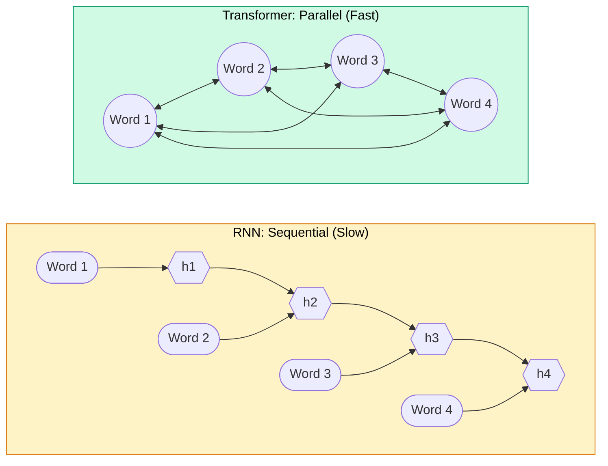
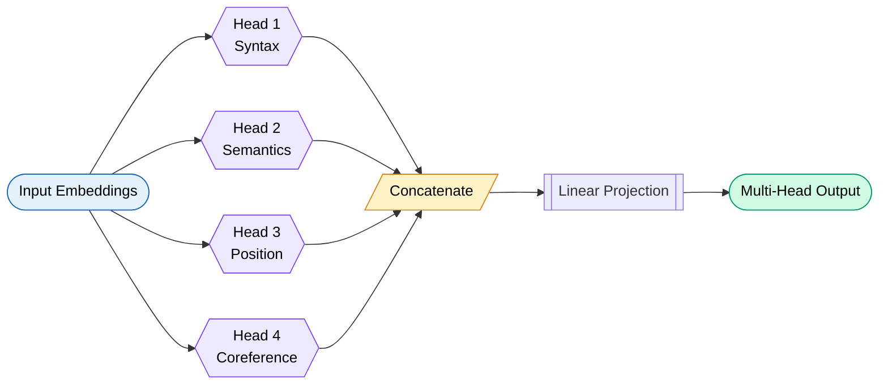
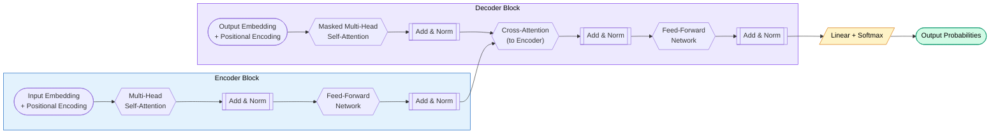
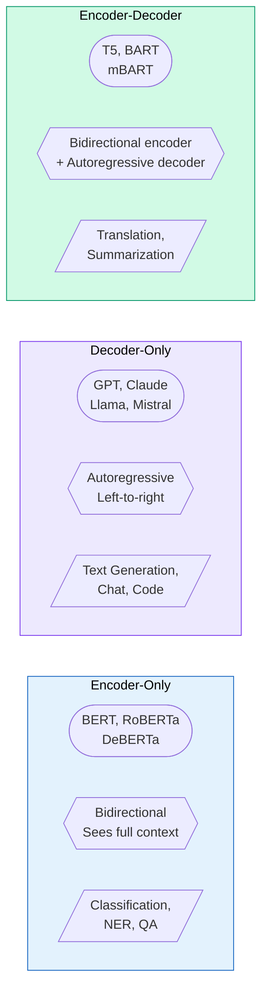
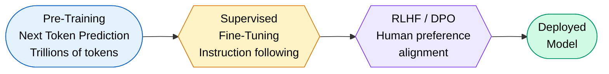
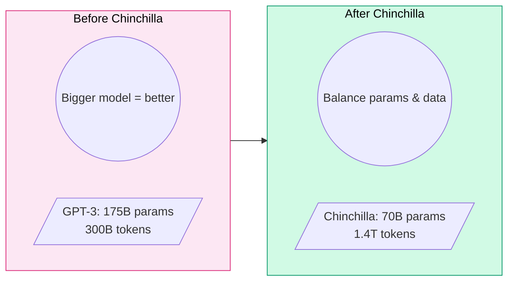

# Transformers & Large Language Models

> **From "Attention Is All You Need" to GPT-4o and Claude — how the transformer architecture revolutionized AI, explained so you can ace any interview AND build production systems.**

---

## Why Transformers

Before 2017, sequence modeling meant RNNs and LSTMs. They processed tokens one-by-one, left to right. Like reading a book by looking at one word at a time through a keyhole.

**The RNN bottleneck:**

- Sequential processing = no parallelism = slow training
- Long-range dependencies get "forgotten" (vanishing gradients)
- Hidden state is a fixed-size bottleneck — all context must squeeze through it



In June 2017, Vaswani et al. published **"Attention Is All You Need"**. The key insight: you don't need recurrence at all. Let every token attend to every other token in parallel. Training went from days to hours. Performance leaped.

!!! tip "The One-Liner"
    Transformers replaced sequential processing with parallel attention. Every word can "look at" every other word simultaneously.

---

## Self-Attention Mechanism

### The Party Analogy

Imagine you're at a party (the input sequence). You are one word in a sentence.

- **Query (Q):** "What am I looking for?" — your question to the room
- **Key (K):** "What do I have to offer?" — everyone's name tag
- **Value (V):** "What information do I carry?" — the actual conversation content

You look at everyone's name tag (Q dot K), figure out who's relevant to you (softmax), then take a weighted mix of their conversations (multiply by V). That's attention.

### Scaled Dot-Product Attention

$$
\text{Attention}(Q, K, V) = \text{softmax}\left(\frac{QK^T}{\sqrt{d_k}}\right)V
$$

| Symbol | Meaning |
|--------|---------|
| Q | Query matrix (what am I looking for?) |
| K | Key matrix (what do I contain?) |
| V | Value matrix (what info do I carry?) |
| d_k | Dimension of keys (scaling factor) |
| QK^T | Dot product = similarity score |
| softmax | Normalize scores to probabilities |

!!! warning "Why divide by sqrt(d_k)?"
    Without scaling, dot products grow large with high dimensions. Large values push softmax into regions with tiny gradients. Division by sqrt(d_k) keeps gradients healthy. It's numerical stability, not magic.

### Walkthrough: "The cat sat on the mat"

For the word **"sat"**:

1. Compute Q for "sat", K and V for all words
2. Dot product Q_sat with K_the, K_cat, K_sat, K_on, K_the, K_mat
3. Highest scores likely: "cat" (subject doing the sitting) and "mat" (location)
4. Softmax normalizes these scores
5. Weighted sum of V vectors = context-aware representation of "sat"

Now "sat" knows WHO sat (cat) and WHERE (mat). Without recurrence. In one step.

### Multi-Head Attention

One attention head captures one type of relationship. Multiple heads capture different patterns simultaneously.



Each head has its own Q, K, V weight matrices. GPT-3 uses 96 heads. Each head has dimension d_model/n_heads. Outputs are concatenated and projected back.

!!! info "Multi-Head Formula"
    MultiHead(Q, K, V) = Concat(head_1, ..., head_h) * W_O  
    where head_i = Attention(Q * W_i^Q, K * W_i^K, V * W_i^V)

---

## Positional Encoding

Transformers process all tokens simultaneously. That's their superpower (parallelism) and their weakness (no sense of word order). "Dog bites man" and "Man bites dog" would look identical without position info.

### Sinusoidal Encoding (Original)

The original paper uses sine and cosine functions of different frequencies:

$$
PE_{(pos, 2i)} = \sin\left(\frac{pos}{10000^{2i/d_{model}}}\right)
$$

$$
PE_{(pos, 2i+1)} = \cos\left(\frac{pos}{10000^{2i/d_{model}}}\right)
$$

Why sine/cosine? Because relative positions can be represented as linear transformations. Position 5 relative to position 3 is always the same rotation, regardless of absolute position.

### Modern Approaches

| Method | How It Works | Used By |
|--------|-------------|---------|
| **Sinusoidal** | Fixed sin/cos patterns added to embeddings | Original Transformer |
| **Learned** | Position embeddings trained with model | GPT-2, BERT |
| **RoPE** (Rotary) | Rotates Q and K vectors by position angle | Llama, Qwen, Mistral |
| **ALiBi** | Adds linear bias to attention scores based on distance | BLOOM, MPT |
| **Relative** | Encodes distance between tokens, not absolute position | T5, DeBERTa |

!!! tip "RoPE is Dominant Now"
    RoPE (Rotary Position Embedding) multiplies Q and K by rotation matrices. It encodes relative position naturally, generalizes to longer sequences, and works beautifully with linear attention. Almost every modern open model uses it.

!!! danger "ALiBi's Trick"
    ALiBi doesn't modify embeddings at all. It simply penalizes attention scores by distance: closer tokens get higher scores. No learned parameters. Shockingly effective for length generalization.

---

## Transformer Architecture



### Key Components

**Residual Connections (Add):** Output = Layer(x) + x. Helps gradients flow through deep networks. Without them, 96-layer models wouldn't train.

**Layer Normalization (Norm):** Normalizes across features (not batch). Stabilizes training. Modern models use Pre-LN (norm before attention) rather than Post-LN (norm after).

**Feed-Forward Network (FFN):** Two linear transformations with activation between them.

```
FFN(x) = max(0, xW_1 + b_1)W_2 + b_2
```

This is where the model stores "knowledge." Attention routes information; FFN processes it. Think: attention is the postal system, FFN is the workers at each office.

!!! info "Modern FFN Variants"
    - **SwiGLU** (used in Llama, Mistral): Gated activation. Better than ReLU.
    - **MoE** (Mixture of Experts, used in Mixtral, GPT-4): Only activates a subset of FFN parameters per token. 8 experts, pick top-2. Cheap inference, massive capacity.

---

## Encoder vs Decoder Models



| Aspect | Encoder (BERT) | Decoder (GPT) | Encoder-Decoder (T5) |
|--------|---------------|---------------|---------------------|
| **Attention** | Bidirectional (sees all tokens) | Causal (sees only past tokens) | Both |
| **Training** | Masked language model (fill in blanks) | Next token prediction | Span corruption + generation |
| **Strengths** | Understanding, classification | Generation, reasoning | Translation, summarization |
| **Limitation** | Can't generate text naturally | Can't "see the future" | More parameters for same task |
| **Examples** | BERT, RoBERTa, DeBERTa | GPT-4, Claude, Llama 3 | T5, FLAN-T5, BART |

!!! tip "Why Decoder-Only Won"
    Decoder-only models scale better. One architecture handles everything: generation, classification, reasoning, code. The "next token prediction" objective is universal. That's why GPT-4, Claude, Llama, and Gemini are all decoder-only.

---

## Tokenization

Models don't see words. They see **tokens** — sub-word units. "unhappiness" might become ["un", "happiness"] or ["un", "happ", "iness"].

### Why Tokenization Matters

- Determines vocabulary size (affects model size and efficiency)
- Affects how well the model handles rare words, code, non-English text
- A bad tokenizer wastes context window on redundant tokens

### Methods

| Method | How It Works | Used By |
|--------|-------------|---------|
| **BPE** (Byte-Pair Encoding) | Iteratively merges most frequent character pairs | GPT-2, GPT-4 |
| **WordPiece** | Similar to BPE but maximizes likelihood | BERT |
| **SentencePiece** | Language-agnostic, works on raw text (no pre-tokenization) | Llama, T5, Gemini |
| **Tiktoken** | Optimized BPE implementation with byte-level fallback | GPT-4, Claude |

### Token vs Word Count

```
"I'm learning transformers!" 
Words:   4
Tokens:  5  ("I", "'m", " learning", " transform", "ers", "!")
         Actually 6 with the punctuation
```

!!! warning "Token Economics"
    You pay per token, not per word. Code is expensive (many short tokens). English averages ~1.3 tokens/word. Chinese averages ~2 tokens/character for older tokenizers. A 100K context window is roughly 75K words.

---

## The LLM Landscape

| Model | Maker | Parameters | Context | Open? | Strengths |
|-------|-------|-----------|---------|-------|-----------|
| **GPT-4o** | OpenAI | Unknown (~1.8T MoE?) | 128K | Closed | Multimodal, speed, tooling ecosystem |
| **Claude 4** | Anthropic | Unknown | 200K | Closed | Long context, safety, reasoning, code |
| **Gemini 2.5** | Google | Unknown | 1M+ | Closed | Massive context, multimodal, search integration |
| **Llama 3.1** | Meta | 8B / 70B / 405B | 128K | Open weights | Best open model, strong multilingual |
| **Mistral Large** | Mistral | Unknown | 128K | Closed | Efficient, strong coding and reasoning |
| **Mixtral 8x22B** | Mistral | 176B (39B active) | 64K | Open weights | MoE efficiency, fast inference |
| **DeepSeek-V3** | DeepSeek | 671B (37B active) | 128K | Open weights | MoE, cost-efficient training, strong math |
| **Qwen 2.5** | Alibaba | 0.5B to 72B | 128K | Open weights | Multilingual, strong at code |

!!! info "Open Weights vs Open Source"
    "Open weights" means you can download and run the model. "Open source" means you also get training code, data, and full reproducibility. Most "open" models are open-weights only. Llama 3 has a custom license (not truly OSI-open).

---

## How LLMs Are Trained



### Stage 1: Pre-Training

- **Objective:** Predict the next token given all previous tokens
- **Data:** Trillions of tokens from the internet, books, code, papers
- **Compute:** Thousands of GPUs for weeks/months. GPT-4 training cost estimated at $100M+
- **Result:** A "base model" — great at completing text, terrible at following instructions

The base model is like a brilliant student who has read everything but has never been told what a "question" is.

### Stage 2: Supervised Fine-Tuning (SFT)

- Human-written examples of ideal responses to instructions
- Typically 10K-100K high-quality examples
- Teaches the model to be helpful, follow instructions, format outputs

### Stage 3: Alignment

**RLHF (Reinforcement Learning from Human Feedback):**

1. Generate multiple responses to a prompt
2. Humans rank responses (A > B > C)
3. Train a reward model to predict human preferences
4. Optimize the LLM policy using PPO to maximize reward

**Constitutional AI (Anthropic's approach):**

- Model critiques its own responses against a set of principles
- Self-improvement loop reduces need for human labelers
- Principles like "be helpful," "be harmless," "be honest"

**DPO (Direct Preference Optimization):**

- Skip the reward model entirely
- Directly optimize the policy from preference pairs
- Simpler, more stable, increasingly popular
- Used by Llama 3, Zephyr, and many others

!!! danger "Alignment Tax"
    Alignment makes models safer but slightly less capable on benchmarks. It's a deliberate tradeoff. The base model "knows" harmful things; alignment teaches it when NOT to say them.

---

## Prompt Engineering

### Prompting Strategies

| Strategy | Description | When to Use |
|----------|-------------|-------------|
| **Zero-shot** | Just ask the question | Simple tasks the model already knows |
| **Few-shot** | Provide 2-5 examples first | When you need a specific format/style |
| **Chain-of-Thought** | "Let's think step by step" | Math, logic, multi-step reasoning |
| **ReAct** | Thought-Action-Observation loop | Agent tasks with tool use |
| **System Prompt** | Set role and constraints | All production deployments |
| **Self-Consistency** | Sample N chains, majority vote | When accuracy > latency |

### Chain-of-Thought Example

```
Without CoT: "What's 17 * 24?" -> "__(often wrong)__"

With CoT: "What's 17 * 24? Think step by step."
-> "17 * 24 = 17 * 20 + 17 * 4 = 340 + 68 = 408" (correct!)
```

### Sampling Parameters

| Parameter | What It Does | Low Value | High Value |
|-----------|-------------|-----------|------------|
| **Temperature** | Randomness of sampling | Deterministic, focused | Creative, diverse |
| **Top-p** (nucleus) | Cumulative probability threshold | Conservative (0.1) | Expansive (0.95) |
| **Top-k** | Number of candidates to consider | Very focused (5) | Wide selection (100) |
| **Frequency penalty** | Penalize repeated tokens | Allow repetition (0) | Force variety (2.0) |

!!! tip "Production Settings"
    For factual tasks: temperature=0, top_p=1. For creative writing: temperature=0.8, top_p=0.95. Never set both temperature=0 AND top_k=1 — it's redundant. Temperature=0 already makes output deterministic.

---

## Context Windows

The context window is the maximum number of tokens a model can process in a single forward pass. It's like the model's "working memory."

| Model | Context Window | Roughly Equivalent To |
|-------|---------------|----------------------|
| GPT-3 (original) | 2K tokens | 1.5 pages |
| GPT-4 | 8K / 128K tokens | 6 pages / 300 pages |
| Claude 4 | 200K tokens | A full novel |
| Gemini 2.5 | 1M+ tokens | Multiple textbooks |

### Why Context Length is Hard

Attention is O(n^2) in sequence length. Doubling context = 4x memory and compute. That's why extending context is an active research area.

### Solutions for Long Context

| Technique | How It Works |
|-----------|-------------|
| **Sliding Window** | Each layer only attends to nearby tokens (Mistral uses 4096 window) |
| **RoPE Scaling** | Interpolate or extend rotary embeddings to unseen positions |
| **Ring Attention** | Distribute long sequences across devices in a ring topology |
| **Sparse Attention** | Attend to subset of tokens (local + global tokens) |
| **Recurrent Memory** | Compress earlier context into memory tokens |

!!! warning "Long Context vs Retrieval"
    Just because a model HAS 200K context doesn't mean it uses it perfectly. Retrieval (RAG) often beats stuffing everything in context. The "lost in the middle" problem: models attend best to the beginning and end, less to the middle.

---

## Scaling Laws

### Chinchilla Scaling (2022)

DeepMind's Chinchilla paper showed: **for a given compute budget, you should scale data and model size equally.**

Previous models (like GPT-3 175B) were undertrained — too many parameters, not enough data. Chinchilla (70B) matched GPT-3 performance with 4x more training data and 3x fewer parameters.



### Key Scaling Insights

- **Compute-optimal ratio:** ~20 tokens per parameter (Chinchilla rule)
- **Loss scales as power law** with compute, data, and parameters
- **Inference cost matters too:** Llama 3 70B trained on 15T tokens (overtraining) because a smaller model with more training is cheaper to serve
- **Emergent abilities:** Some capabilities appear suddenly at certain scales (debated)

!!! info "Why Bigger Isn't Always Better"
    A 7B model trained on 2T tokens often beats a 70B model trained on 200B tokens — and it's 10x cheaper to run. Modern strategy: overtrain smaller models well beyond Chinchilla-optimal.

---

## Inference Optimization

Training happens once. Inference happens millions of times. Optimization here directly saves money.

### KV Cache

During autoregressive generation, recompute Q for only the new token but reuse K and V from all previous tokens. Without KV cache, generating N tokens is O(N^2). With it, O(N).

**Problem:** KV cache grows linearly with sequence length and batch size. A 70B model with 128K context needs ~40GB just for KV cache.

### Speculative Decoding

Use a small "draft" model to generate N candidate tokens quickly. Then verify all N tokens with the large model in a single forward pass. If most are correct, you get N tokens for the cost of 1 large-model call.

- Draft model: 1B parameters, very fast
- Verify model: 70B parameters, accurate
- Typical speedup: 2-3x with no quality loss

### Flash Attention

Standard attention materializes the full N x N attention matrix in GPU memory. Flash Attention tiles the computation to keep everything in fast SRAM. Result: 2-4x speedup, less memory, exact same output. Not an approximation — pure IO optimization.

### Quantization

Reduce model precision from float16 to int8 or int4. Smaller model = faster inference + less memory.

| Format | Bits | Quality Loss | Speedup | Tool |
|--------|------|-------------|---------|------|
| FP16 | 16 | Baseline | 1x | - |
| GPTQ | 4 | Minimal | 2-3x | AutoGPTQ |
| AWQ | 4 | Less than GPTQ | 2-3x | AutoAWQ |
| GGUF | 2-8 | Varies | 2-4x | llama.cpp |
| bitsandbytes | 4/8 | Minimal | 2x | Hugging Face |

### Serving Frameworks

| Framework | Key Feature |
|-----------|-------------|
| **vLLM** | PagedAttention — manages KV cache like virtual memory. Best throughput. |
| **TGI** (Text Generation Inference) | Hugging Face's production server. Tensor parallelism built-in. |
| **TensorRT-LLM** | NVIDIA's optimized runtime. Best single-GPU performance. |
| **Ollama** | Run models locally with one command. Great for development. |
| **llama.cpp** | CPU inference with quantization. Runs on laptops. |

!!! tip "Production Stack 2025"
    vLLM + AWQ quantization + Flash Attention + speculative decoding = state-of-the-art serving. For 70B models: tensor parallel across 2-4 GPUs with continuous batching.

---

## Open vs Closed Models

| Dimension | Open Weights (Llama, Mistral) | Closed API (GPT-4, Claude) |
|-----------|-------------------------------|---------------------------|
| **Cost** | GPU infrastructure + engineering | Pay per token |
| **Control** | Full control over model, data privacy | Vendor controls everything |
| **Customization** | Fine-tune, merge, quantize freely | Limited fine-tuning options |
| **Quality** | Catching up fast (Llama 3 405B competitive) | Generally still leading |
| **Latency** | You control the hardware | Network round-trip + queue |
| **Maintenance** | You own updates, security, scaling | Vendor handles everything |
| **Data Privacy** | Data never leaves your infrastructure | Data sent to third party |
| **Compliance** | Easier for regulated industries | May not meet requirements |

### When to Self-Host

- **Regulated industries** (healthcare, finance): data can't leave your infrastructure
- **High volume**: >$5K/month in API costs often means self-hosting is cheaper
- **Low latency**: need <100ms time-to-first-token
- **Custom models**: heavily fine-tuned for your domain
- **Offline environments**: edge deployment, air-gapped systems

### When to Use APIs

- **Prototyping**: get started in minutes, not days
- **Low volume**: don't justify GPU infrastructure
- **Frontier quality**: need the absolute best model available
- **Multi-modal**: vision + audio + code in one API
- **Small team**: no ML ops expertise in-house

!!! danger "The Hidden Cost of Self-Hosting"
    The model is free. The 8x H100 GPUs ($250K), the engineers to manage them, the redundancy, the monitoring, the model updates — that's where the cost hides. Do the math honestly before committing.

---

## Interview Questions

??? question "1. Explain the self-attention mechanism. Why is it O(n^2)?"
    Self-attention computes pairwise interactions between all tokens. For each token, we compute dot products with every other token's key vector. With N tokens, that's N x N comparisons, making it O(n^2) in both time and memory. The formula is: Attention(Q,K,V) = softmax(QK^T / sqrt(d_k)) * V. The QK^T matrix multiplication produces an N x N attention matrix. This is why long context is expensive.

??? question "2. What is the difference between self-attention and cross-attention?"
    In self-attention, Q, K, and V all come from the same sequence — the input attends to itself. In cross-attention, Q comes from one sequence (decoder) while K and V come from another (encoder output). Cross-attention is how the decoder "looks at" encoder representations. Used in encoder-decoder models like T5 for translation, and in multimodal models where text attends to image features.

??? question "3. Why do we need positional encoding? Compare RoPE and ALiBi."
    Transformers process all tokens in parallel with no inherent notion of order. Without positional encoding, "dog bites man" = "man bites dog." RoPE rotates Q and K vectors by position-dependent angles, encoding relative position through the angle difference. It's learned-free and extends well. ALiBi adds a linear bias to attention scores proportional to distance — no parameters, no embedding modification. RoPE is more popular (Llama, Mistral). ALiBi generalizes better to unseen lengths but is less common now.

??? question "4. Explain the training pipeline: pre-training, SFT, RLHF, and DPO."
    Pre-training: Next-token prediction on trillions of tokens. Creates a base model that can complete text but won't follow instructions. SFT: Fine-tune on ~100K curated instruction-response pairs. Model learns to be helpful. RLHF: Generate multiple responses, have humans rank them, train a reward model, then optimize the LLM with PPO. DPO: Skip the reward model, directly optimize from preference pairs — simpler and more stable. Each stage builds on the previous one.

??? question "5. What is the KV cache and why does it matter for inference?"
    During autoregressive generation, each new token needs attention over ALL previous tokens. Without caching, generating token N requires recomputing K and V for all N-1 previous tokens — O(N^2) total work for a sequence. KV cache stores previously computed key and value vectors, so each new token only computes its own Q and looks up cached K/V. Reduces generation from O(N^2) to O(N). The tradeoff: KV cache consumes linear memory per sequence per layer, which is why long-context serving is memory-bound.

??? question "6. Compare encoder-only, decoder-only, and encoder-decoder architectures. Why did decoder-only win?"
    Encoder-only (BERT): bidirectional attention, great for classification/understanding, can't generate. Decoder-only (GPT): causal/left-to-right attention, next-token generation, handles everything via prompting. Encoder-decoder (T5): encoder sees full context, decoder generates — great for translation. Decoder-only won because: (1) one architecture scales to all tasks, (2) scaling laws favor it, (3) next-token prediction is the universal training objective, (4) simpler to train and serve at scale.

??? question "7. Explain Flash Attention. Is it an approximation?"
    Flash Attention is NOT an approximation — it produces the exact same output as standard attention. It's a pure IO optimization. Standard attention materializes the full N x N attention matrix in slow GPU HBM (high-bandwidth memory). Flash Attention tiles the computation into blocks that fit in fast GPU SRAM, computes softmax incrementally (using the online softmax trick), and never materializes the full matrix. Result: 2-4x speedup, memory usage from O(N^2) to O(N), same mathematical output.

??? question "8. What are the Chinchilla scaling laws and how did they change LLM training?"
    Chinchilla (DeepMind, 2022) showed that for a fixed compute budget, you should scale model size and training data equally. The optimal ratio is roughly 20 tokens per parameter. Before Chinchilla, the community built huge models with insufficient data (GPT-3: 175B params, 300B tokens). Chinchilla (70B params, 1.4T tokens) matched GPT-3 with 3x fewer parameters. This shifted the field toward smaller, better-trained models. Modern trend: overtrain (Llama 3: 70B on 15T tokens) because inference cost matters more than training cost.

??? question "9. Explain quantization. How can a 4-bit model nearly match a 16-bit model?"
    Quantization reduces numerical precision of model weights. 16-bit uses 2 bytes per parameter; 4-bit uses 0.5 bytes — 4x reduction. It works because neural network weights are robust to small perturbations. Methods: GPTQ (post-training, one calibration pass), AWQ (activation-aware, protects salient weights), GGUF (mixed precision per layer). Quality is preserved because: (1) outlier weights are kept at higher precision, (2) calibration data ensures quantization error is minimized on real inputs, (3) some redundancy in weights is harmless to remove.

??? question "10. What is speculative decoding and when would you use it?"
    Speculative decoding uses a small, fast draft model to generate N candidate tokens, then verifies all N with the large model in a single parallel forward pass. If the draft model predicted correctly (which it often does for common continuations), you get N tokens for the cost of one large-model inference. Rejection sampling ensures output quality equals the large model exactly. Use when: latency matters more than throughput, draft model matches large model's distribution well, and you can afford running two models. Typical speedup: 2-3x with zero quality loss.

??? question "11. How does temperature affect LLM output? What about top-p and top-k?"
    Temperature scales logits before softmax: logits/T. T=0: argmax (greedy, deterministic). T=1: natural distribution. T>1: flatter distribution (more random). T<1: sharper distribution (more confident). Top-p (nucleus sampling): only consider tokens whose cumulative probability exceeds p. Top-p=0.9 means ignore the bottom 10% probability mass. Top-k: only consider the k most probable tokens. These are all sampling strategies applied AFTER the forward pass. They don't change what the model "knows" — they change how it chooses among options.

??? question "12. Explain Mixture of Experts (MoE). Why is it efficient?"
    MoE replaces the single FFN layer with multiple "expert" FFN layers plus a router. For each token, the router selects top-k experts (typically 2 out of 8). Only those 2 experts process the token. Total parameters: huge (enables capacity). Active parameters per token: small (enables speed). Mixtral 8x22B has 176B total parameters but only 39B active per token — so it runs at 40B-model speeds with 176B-model quality. Challenge: load balancing (experts should be used equally), routing collapse, training instability.

??? question "13. What is the 'lost in the middle' problem? How do you mitigate it?"
    Research shows LLMs attend most to the beginning and end of their context, with degraded retrieval of information placed in the middle. In 128K-token contexts, facts in the middle may be overlooked. Mitigations: (1) Place critical information at the start or end, (2) Use RAG to retrieve relevant chunks and place them prominently, (3) Structured prompts with clear section headings, (4) Recursive summarization of long documents, (5) Models trained specifically for long-context tasks (like Claude) show less degradation.

??? question "14. Compare RLHF and DPO. When would you choose each?"
    RLHF: Train a reward model on human preferences, then optimize LLM with PPO. Complex pipeline (4 models: reference, policy, reward, value). Unstable training. But: more flexible, reward model can be reused, handles complex preference landscapes. DPO: Directly optimize from preference pairs without a reward model. Treats the policy itself as an implicit reward model. Simpler (2 models: reference, policy). More stable. But: may overfit to preference data format, less flexible for online learning. Choose DPO for simplicity and stability. Choose RLHF when you need online feedback or complex reward signals.

??? question "15. You need to deploy a model for a production chatbot serving 1000 requests/minute. Walk through your architecture decisions."
    First: open vs closed? If data privacy allows, start with Claude/GPT-4 API for fastest iteration. For self-hosting: choose model size (70B for quality, 7B for speed). Quantize with AWQ to 4-bit. Serve with vLLM (PagedAttention for efficient KV cache, continuous batching for throughput). Hardware: 2x A100 80GB for 70B-4bit with tensor parallelism. Add speculative decoding if latency-critical. Monitor: track tokens/second, time-to-first-token, error rates. Scaling: horizontal with load balancer, prefill and decode on separate pools. Fallbacks: secondary model for overload, graceful degradation. Cache common prompts/responses. Set request timeouts and implement streaming.
