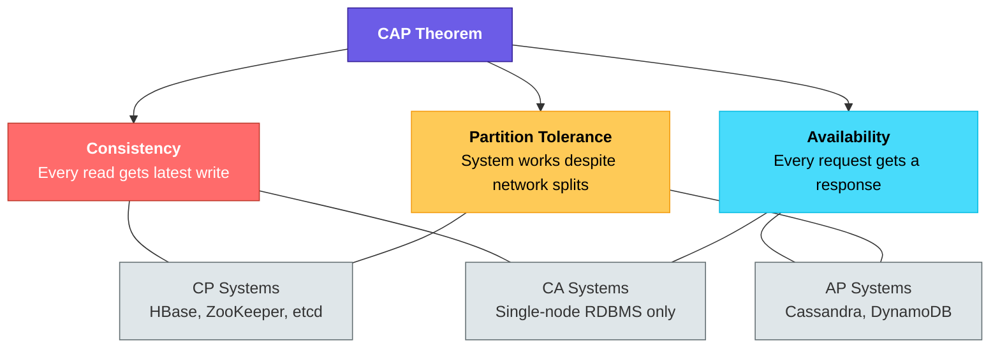
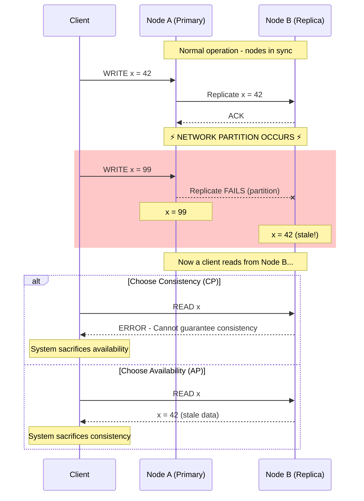
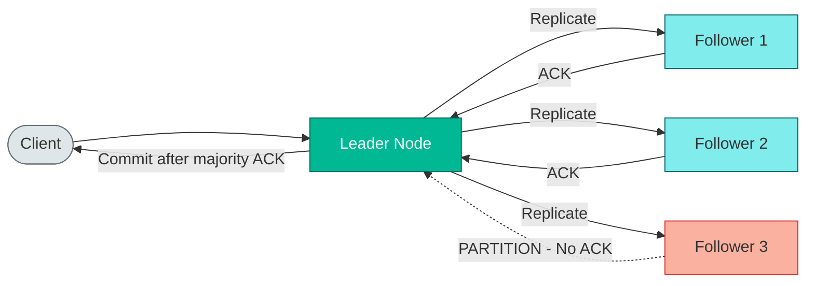
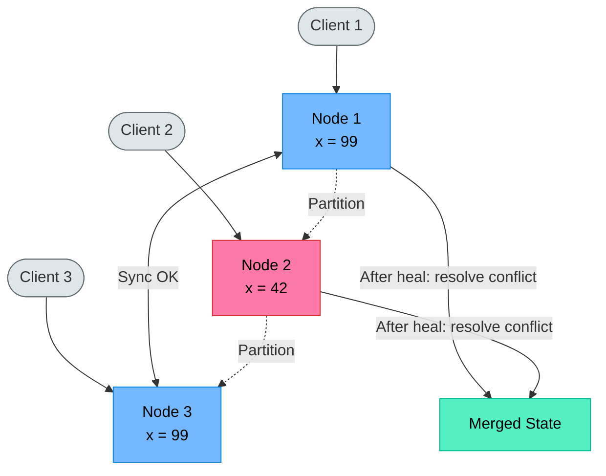
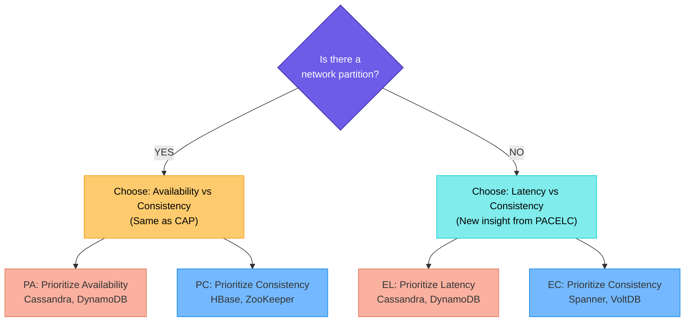
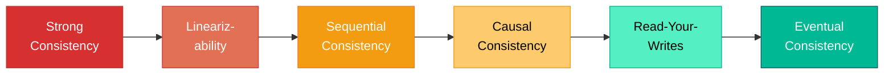
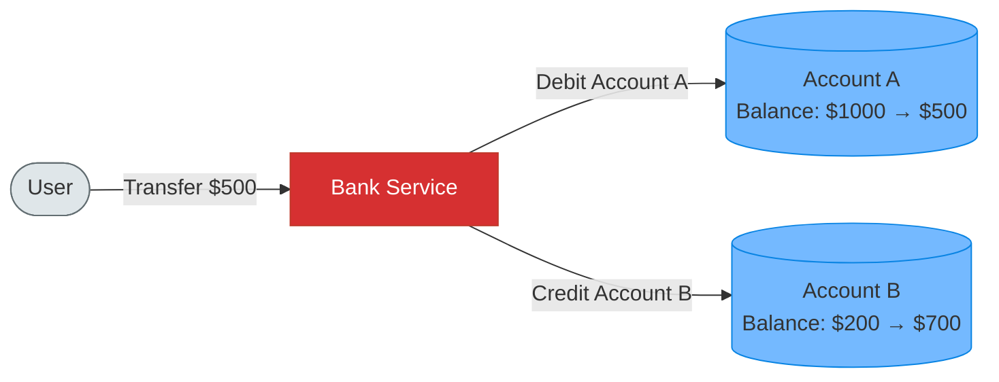

# CAP Theorem

!!! tip "Interview Essential"
    The CAP theorem is asked in **literally every system design interview** at FAANG companies. You must be able to explain it clearly, give real-world examples, and discuss trade-offs. Interviewers often follow up with PACELC and consistency models.

---

## What is the CAP Theorem?

The **CAP theorem** (also known as Brewer's theorem, proposed by Eric Brewer in 2000) states that a distributed data store can provide at most **two out of three** guarantees simultaneously:

| Property | Definition |
|----------|-----------|
| **Consistency (C)** | Every read receives the most recent write or an error. All nodes see the same data at the same time. |
| **Availability (A)** | Every request receives a non-error response, without guaranteeing it contains the most recent write. |
| **Partition Tolerance (P)** | The system continues to operate despite arbitrary message loss or failure of part of the network. |

```mermaid
graph TD
    CAP["<b>CAP Theorem</b>"]
    C["<b>Consistency</b><br/>Every read gets latest write"]
    A["<b>Availability</b><br/>Every request gets a response"]
    P["<b>Partition Tolerance</b><br/>System works despite network splits"]

    CAP --> C
    CAP --> A
    CAP --> P

    CP["CP Systems<br/>HBase, ZooKeeper, etcd"]
    AP["AP Systems<br/>Cassandra, DynamoDB"]
    CA["CA Systems<br/>Single-node RDBMS only"]

    C --- CP
    P --- CP
    A --- AP
    P --- AP
    C --- CA
    A --- CA

    style C fill:#ff6b6b,stroke:#c0392b,color:#fff
    style A fill:#48dbfb,stroke:#0abde3,color:#000
    style P fill:#feca57,stroke:#f39c12,color:#000
    style CP fill:#dfe6e9,stroke:#636e72
    style AP fill:#dfe6e9,stroke:#636e72
    style CA fill:#dfe6e9,stroke:#636e72
    style CAP fill:#6c5ce7,stroke:#341f97,color:#fff
```

---

## Why You Can Only Choose 2 out of 3

In any distributed system, **network partitions are inevitable**. Cables get cut, switches fail, and data centers lose connectivity. Since P is non-negotiable, the real choice is between **C and A** during a partition.

### Network Partition Scenario Walkthrough

```mermaid
sequenceDiagram
    participant Client
    participant Node_A as Node A (Primary)
    participant Node_B as Node B (Replica)

    Note over Node_A, Node_B: Normal operation - nodes in sync
    Client->>Node_A: WRITE x = 42
    Node_A->>Node_B: Replicate x = 42
    Node_B-->>Node_A: ACK

    Note over Node_A, Node_B: ⚡ NETWORK PARTITION OCCURS ⚡
    rect rgb(255, 200, 200)
        Client->>Node_A: WRITE x = 99
        Node_A--xNode_B: Replicate FAILS (partition)
        Note over Node_A: x = 99
        Note over Node_B: x = 42 (stale!)
    end

    Note over Node_A, Node_B: Now a client reads from Node B...
    alt Choose Consistency (CP)
        Client->>Node_B: READ x
        Node_B-->>Client: ERROR - Cannot guarantee consistency
        Note over Client: System sacrifices availability
    else Choose Availability (AP)
        Client->>Node_B: READ x
        Node_B-->>Client: x = 42 (stale data)
        Note over Client: System sacrifices consistency
    end
```

**Key insight:** During a partition, if Node B receives a read request:

- **CP choice:** Refuse the request (sacrifice availability) to prevent returning stale data
- **AP choice:** Return stale data (sacrifice consistency) to remain available

---

## CP Systems — Consistency + Partition Tolerance

CP systems **prioritize consistency** over availability. During a network partition, they will refuse requests rather than serve stale data.

### Characteristics

- Requests may timeout or return errors during partitions
- Strong consistency guarantees when operational
- Use leader-based replication with quorum writes

### Examples

| System | How It Achieves CP |
|--------|-------------------|
| **HBase** | Uses ZooKeeper for leader election; region servers stop serving if they cannot reach the master |
| **MongoDB** (majority write concern) | Writes must be acknowledged by a majority of replicas; reads from primary only |
| **ZooKeeper** | Uses ZAB protocol; requires majority quorum to serve reads/writes |
| **etcd** | Raft consensus; leader must communicate with majority to commit |
| **Redis Cluster** (with WAIT) | Can be configured to refuse writes if insufficient replicas acknowledge |
| **Google Spanner** | TrueTime + Paxos gives external consistency with global distribution |

```mermaid
graph LR
    Client([Client]) --> Leader[Leader Node]
    Leader -->|"Replicate"| F1[Follower 1]
    Leader -->|"Replicate"| F2[Follower 2]
    Leader -->|"Replicate"| F3[Follower 3]

    F1 -->|"ACK"| Leader
    F2 -->|"ACK"| Leader
    F3 -.->|"PARTITION - No ACK"| Leader

    Leader -->|"Commit after majority ACK"| Client

    style Leader fill:#00b894,stroke:#00695c,color:#fff
    style F1 fill:#81ecec,stroke:#006266
    style F2 fill:#81ecec,stroke:#006266
    style F3 fill:#fab1a0,stroke:#d63031
    style Client fill:#dfe6e9,stroke:#636e72
```

---

## AP Systems — Availability + Partition Tolerance

AP systems **prioritize availability** over consistency. Every node always accepts reads and writes, even during partitions, potentially serving stale data.

### Characteristics

- Always respond to requests, even with potentially outdated data
- Use conflict resolution strategies (last-write-wins, vector clocks, CRDTs)
- Eventually converge to a consistent state once the partition heals

### Examples

| System | How It Achieves AP |
|--------|-------------------|
| **Cassandra** | Tunable consistency; default is eventual consistency with gossip protocol |
| **DynamoDB** | Multi-AZ replication; eventually consistent reads by default |
| **CouchDB** | Multi-version concurrency control; conflict resolution on read |
| **Riak** | Vector clocks for conflict detection; sibling resolution |
| **DNS** | Serves cached records even when authoritative servers are unreachable |
| **Amazon S3** | Prioritizes availability; eventual consistency for overwrite PUTs (now strong) |

```mermaid
graph TD
    C1([Client 1]) --> N1[Node 1<br/>x = 99]
    C2([Client 2]) --> N2[Node 2<br/>x = 42]
    C3([Client 3]) --> N3[Node 3<br/>x = 99]

    N1 -.->|"Partition"| N2
    N1 <-->|"Sync OK"| N3
    N2 -.->|"Partition"| N3

    N1 -->|"After heal: resolve conflict"| Merged[Merged State]
    N2 -->|"After heal: resolve conflict"| Merged

    style N1 fill:#74b9ff,stroke:#0984e3,color:#000
    style N2 fill:#fd79a8,stroke:#d63031,color:#000
    style N3 fill:#74b9ff,stroke:#0984e3,color:#000
    style Merged fill:#55efc4,stroke:#00b894,color:#000
    style C1 fill:#dfe6e9,stroke:#636e72
    style C2 fill:#dfe6e9,stroke:#636e72
    style C3 fill:#dfe6e9,stroke:#636e72
```

---

## CA Systems — Why They Don't Really Exist

A **CA system** provides consistency and availability but cannot tolerate network partitions. In theory, this means:

- Every read gets the latest write (Consistency)
- Every request gets a response (Availability)
- But the system **fails entirely** if any network issue occurs

!!! warning "CA Is a Myth in Distributed Systems"
    In any real distributed system, **network partitions will happen**. A system that cannot handle partitions is effectively a single-node system. Traditional single-node relational databases (PostgreSQL on one server, MySQL on one machine) are technically CA — but they are **not distributed**.

**Why you should mention this in interviews:**

- Shows you understand that P is not optional in distributed systems
- Demonstrates awareness that "choosing CA" means giving up distribution entirely
- Some interviewers will try to trap you by asking "what about a CA distributed system?"

---

## PACELC Theorem — Extending CAP

The **PACELC theorem** (proposed by Daniel Abadi, 2012) extends CAP by addressing what happens when there is **no partition**:

> **P**artition → choose **A**vailability or **C**onsistency  
> **E**lse (no partition) → choose **L**atency or **C**onsistency

```mermaid
flowchart TD
    Start{Is there a<br/>network partition?}
    Start -->|"YES"| Partition["Choose: Availability vs Consistency<br/>(Same as CAP)"]
    Start -->|"NO"| Normal["Choose: Latency vs Consistency<br/>(New insight from PACELC)"]

    Partition --> PA["PA: Prioritize Availability<br/>Cassandra, DynamoDB"]
    Partition --> PC["PC: Prioritize Consistency<br/>HBase, ZooKeeper"]

    Normal --> EL["EL: Prioritize Latency<br/>Cassandra, DynamoDB"]
    Normal --> EC["EC: Prioritize Consistency<br/>Spanner, VoltDB"]

    style Start fill:#6c5ce7,stroke:#341f97,color:#fff
    style Partition fill:#fdcb6e,stroke:#f39c12,color:#000
    style Normal fill:#81ecec,stroke:#00cec9,color:#000
    style PA fill:#fab1a0,stroke:#e17055
    style PC fill:#74b9ff,stroke:#0984e3
    style EL fill:#fab1a0,stroke:#e17055
    style EC fill:#74b9ff,stroke:#0984e3
```

### PACELC Classifications

| System | If Partition (PA/PC) | Else (EL/EC) | Full Classification |
|--------|---------------------|--------------|-------------------|
| Cassandra | PA | EL | PA/EL |
| DynamoDB | PA | EL | PA/EL |
| CouchDB | PA | EL | PA/EL |
| MongoDB | PC | EC | PC/EC |
| HBase | PC | EC | PC/EC |
| ZooKeeper | PC | EC | PC/EC |
| Google Spanner | PC | EC | PC/EC |
| PNUTS (Yahoo) | PC | EL | PC/EL |
| Cosmos DB | PA | EL/EC (tunable) | PA/EL or PA/EC |

**Key takeaway:** Even when there's no failure, you still face a trade-off between low latency and strong consistency due to replication overhead.

---

## Consistency Models Spectrum

Consistency models range from **strongest** (expensive, slow) to **weakest** (cheap, fast):

```mermaid
graph LR
    Strong["Strong<br/>Consistency"] --> Lin["Lineariz-<br/>ability"] --> Seq["Sequential<br/>Consistency"] --> Causal["Causal<br/>Consistency"] --> RYW["Read-Your-<br/>Writes"] --> Eventual["Eventual<br/>Consistency"]

    style Strong fill:#d63031,stroke:#c0392b,color:#fff
    style Lin fill:#e17055,stroke:#d63031,color:#fff
    style Seq fill:#f39c12,stroke:#e67e22,color:#fff
    style Causal fill:#fdcb6e,stroke:#f39c12,color:#000
    style RYW fill:#55efc4,stroke:#00b894,color:#000
    style Eventual fill:#00b894,stroke:#006266,color:#fff
```

### Strong Consistency

Every read returns the value of the most recent write. Equivalent to having a single copy of the data.

- **Cost:** High latency, lower throughput
- **Real-world example:** Google Spanner — uses TrueTime (GPS + atomic clocks) to provide external consistency across global data centers

### Linearizability

The strongest single-object consistency. Operations appear to take effect at a single instant between invocation and completion. All operations are totally ordered.

- **Cost:** Requires coordination (consensus protocols)
- **Real-world example:** etcd — all operations go through the Raft leader, providing linearizable reads/writes for Kubernetes configuration

### Sequential Consistency

All operations appear to execute in some sequential order, and each process's operations appear in the order specified by its program.

- **Cost:** Less expensive than linearizability; no real-time ordering guarantee
- **Real-world example:** ZooKeeper — provides sequential consistency for writes (all writes go through the leader in order) with the option for linearizable reads via `sync`

### Causal Consistency

Operations that are causally related are seen by all nodes in the same order. Concurrent operations may be seen in different orders by different nodes.

- **Cost:** Moderate; needs causal dependency tracking (vector clocks)
- **Real-world example:** MongoDB (causal sessions) — causal consistency sessions ensure that reads reflect prior writes in the same session, even across replica set members

### Read-Your-Writes Consistency

A process always sees its own writes. After a write, subsequent reads by the same client will reflect that write.

- **Cost:** Low; requires sticky sessions or session tokens
- **Real-world example:** DynamoDB (consistent reads in same session) — after a write, using the session token ensures the user sees their own update immediately

### Eventual Consistency

If no new updates are made, all replicas will eventually converge to the same value. No ordering guarantees.

- **Cost:** Lowest latency, highest availability
- **Real-world example:** DNS — after updating a DNS record, it propagates across the globe over minutes/hours; Amazon S3 — objects eventually become consistent across all regions

---

## Real-World Trade-offs

### Banking Systems — Strong Consistency Needed

```mermaid
graph LR
    User([User]) -->|"Transfer $500"| Bank[Bank Service]
    Bank -->|"Debit Account A"| DB1[(Account A<br/>Balance: $1000 → $500)]
    Bank -->|"Credit Account B"| DB2[(Account B<br/>Balance: $200 → $700)]

    style Bank fill:#d63031,stroke:#c0392b,color:#fff
    style DB1 fill:#74b9ff,stroke:#0984e3
    style DB2 fill:#74b9ff,stroke:#0984e3
    style User fill:#dfe6e9,stroke:#636e72
```

- **Requirement:** Cannot show incorrect balances or allow double-spending
- **Choice:** CP with strong consistency (e.g., Google Spanner, CockroachDB)
- **Trade-off:** Accept higher latency and potential unavailability during partitions
- **Pattern:** Two-phase commit, saga pattern with compensating transactions

### Social Media Feeds — Eventual Consistency OK

- **Requirement:** Show posts/likes/comments to millions of concurrent users
- **Choice:** AP with eventual consistency (e.g., Cassandra for timeline storage)
- **Trade-off:** A user might see an old like count for a few seconds — acceptable
- **Pattern:** Fan-out on write with async propagation

### Shopping Cart — Availability Over Consistency

- **Requirement:** Never lose items a customer added to cart, even during outages
- **Choice:** AP with conflict resolution (e.g., DynamoDB with last-write-wins or CRDTs)
- **Trade-off:** Two browser tabs might show slightly different cart states temporarily
- **Pattern:** Amazon's original Dynamo paper — "always writable" design philosophy

---

## Comparison Table

| System | CP/AP | Consistency Model | Primary Use Case |
|--------|-------|-------------------|-----------------|
| **Google Spanner** | CP | Strong (External) | Global financial transactions |
| **etcd** | CP | Linearizable | Kubernetes config, distributed locks |
| **ZooKeeper** | CP | Sequential | Leader election, distributed coordination |
| **HBase** | CP | Strong | Real-time random read/write on big data |
| **MongoDB** | CP | Causal (tunable) | General-purpose document store |
| **CockroachDB** | CP | Serializable | Geo-distributed SQL |
| **Cassandra** | AP | Eventual (tunable) | High-write throughput, time-series |
| **DynamoDB** | AP | Eventual (default) | Serverless apps, shopping carts |
| **CouchDB** | AP | Eventual | Offline-first mobile apps |
| **Riak** | AP | Eventual | Session storage, user preferences |
| **Redis Cluster** | CP/AP (config) | Eventual to Strong | Caching, real-time analytics |
| **Cosmos DB** | Tunable | 5 consistency levels | Multi-model global apps |

---

## Interview Questions

??? question "A network partition occurs in your distributed database. Reads to one partition are returning stale data. What happened and how would you handle it?"
    This is a classic AP behavior. During a partition, the system prioritized availability over consistency. The node serving reads cannot reach the primary/leader to get the latest data but still responds.
    
    **To handle it:**
    
    - If consistency is critical (e.g., banking), switch to CP behavior: reject reads that cannot be verified as current
    - If availability is critical (e.g., social media), accept stale reads and reconcile after partition heals
    - Implement read-repair or anti-entropy mechanisms for eventual convergence
    - Use version vectors or timestamps to detect and resolve conflicts post-partition

??? question "Why can't we build a distributed system that is both fully consistent and fully available?"
    Because network partitions are inevitable in distributed systems (hardware fails, cables get cut, packets get lost). During a partition, a node receiving a request must either:
    
    1. Wait for the partition to heal to ensure consistency (sacrificing availability), or
    2. Respond immediately with potentially stale data (sacrificing consistency)
    
    This was formally proven by Gilbert and Lynch in 2002. The FLP impossibility result further shows that consensus is impossible in asynchronous systems with even one faulty process.

??? question "You're designing a system for a global e-commerce platform. How do you decide between CP and AP for different components?"
    Different components have different requirements:
    
    - **Inventory/Payment:** CP — cannot oversell items or double-charge. Use strong consistency with distributed transactions.
    - **Product Catalog:** AP — slightly stale prices for a few seconds is acceptable. Use eventual consistency with CDN caching.
    - **Shopping Cart:** AP — Amazon's Dynamo paper showed that "always writable" carts increase revenue. Merge conflicts on checkout.
    - **User Sessions:** AP — availability is critical; session data can be reconstructed.
    - **Order History:** CP — users expect to see their orders immediately after placement. Use read-your-writes consistency.

??? question "Explain the PACELC theorem and why it matters beyond CAP."
    PACELC extends CAP by noting that even when there is NO partition (the normal case), you still face a trade-off between latency and consistency. Replicating data synchronously gives consistency but adds latency; replicating asynchronously gives low latency but risks inconsistency.
    
    Example: Cassandra is PA/EL — during partitions it chooses availability, and during normal operation it chooses low latency (async replication). MongoDB is PC/EC — during partitions it chooses consistency, and normally it still prioritizes consistency over latency (synchronous majority writes).
    
    This matters because systems spend 99.9%+ of their time NOT in a partition state, so the EL/EC trade-off affects everyday performance more than the PA/PC choice.

??? question "What is the difference between linearizability and sequential consistency?"
    **Linearizability** requires that operations appear to take effect at a single point in real time between their invocation and response. It respects real-time ordering.
    
    **Sequential consistency** only requires that all processes see operations in the same order, and that order is consistent with each process's program order. It does NOT require real-time ordering.
    
    **Example:** If Process A writes x=1 at time T=1, and Process B reads x at time T=2:
    
    - Linearizability: Process B MUST see x=1 (real-time ordering respected)
    - Sequential consistency: Process B MAY see x=0 if the system reorders the operations (as long as all processes agree on the order)
    
    Linearizability is more expensive because it requires clock synchronization or coordination.

??? question "How does Cassandra achieve tunable consistency?"
    Cassandra allows you to set consistency levels per-query using replication factor (N), write consistency (W), and read consistency (R):
    
    - **R + W > N** → Strong consistency (e.g., QUORUM reads + QUORUM writes with RF=3: 2+2 > 3)
    - **R + W <= N** → Eventual consistency (e.g., ONE read + ONE write: 1+1 < 3)
    
    Common configurations:
    
    - `ONE/ONE`: Fastest, least consistent (AP behavior)
    - `QUORUM/QUORUM`: Good balance of consistency and performance
    - `ALL/ALL`: Strongest consistency but lowest availability (single node failure blocks operations)
    
    This tunability means Cassandra can act as CP or AP depending on the query.

??? question "Your system uses eventual consistency. A user writes a post but doesn't see it when they refresh. How do you fix this without switching to strong consistency?"
    Implement **read-your-writes consistency** without requiring global strong consistency:
    
    1. **Sticky sessions:** Route the user's reads to the same node that accepted their write
    2. **Session tokens:** Include a logical timestamp/version in the client session; the read node waits until it has at least that version
    3. **Read from leader:** For the writing user only, read from the leader node; other users can read from replicas
    4. **Client-side cache:** Merge the local write into the response until the server catches up
    
    This gives the user a consistent experience while maintaining eventual consistency for the overall system — a practical middle ground used by Facebook, Twitter, and LinkedIn.

??? question "How does Google Spanner achieve strong consistency across global data centers without sacrificing too much latency?"
    Google Spanner uses **TrueTime** — a globally synchronized clock using GPS receivers and atomic clocks in every data center. This enables:
    
    1. **External consistency:** Transactions are assigned timestamps that respect real-time ordering
    2. **Lock-free reads:** Read-only transactions can read at a timestamp without acquiring locks
    3. **Wait-out uncertainty:** After a commit, Spanner waits out the clock uncertainty interval (typically <7ms) before reporting success
    
    The Paxos consensus protocol handles replication across zones. TrueTime's tight uncertainty bounds mean the wait time is minimal, giving both consistency and acceptable latency.
    
    **Trade-off:** Requires specialized hardware (GPS/atomic clocks) that most organizations cannot replicate — which is why CockroachDB uses hybrid logical clocks as an approximation.
