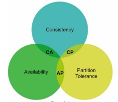

* It is the Desirable property of distributed System with replicated data.

  

  C - Consistency
  A - Availability
  P - Partition Tolerance

* We can use CA , CP or AP. but not CAP.
* Why we cannot use all the three at once??
* Consistency: After successful write in any node, the data should be same in any other node.
* Availability: All nodes should be available.
* Partition Tolerance: a partition indicates a communication break between two nodes.
  Partition tolerance means the system continues to operate despite network partitions.

*Master-Slave*
   
* When there is some partition issue, then there will be no consistence then only AP.
* When one node is down, then there is no Availability , then only CP.

* data from master to slave is asynchronous.
* less writes,more reads
* If the user access the data currently, he wrote something and if he immediately accesses the data , then it the data will be 
   accessed from slave.
*  If he accesses the data even before the data is sent from master to slave.So whatever we have written in master will not be available in slave. So he will not able to get it think it as a bug or inconsistency.
* This is not a consistent system.

*Sharding*

* In this case there is no master and slave, but all data is divided into different segments.
* Figuring out the sharding key is the important task.
* Suppose we want to store user info, then we can take username as the sharding key. For example the username starting with A-I will
  be in shard-1, J-S in shard-2 and T-Z in shard-3.
* So all the data is distributed. Through this approach we can scale both the read and write operations by n times. In this case n is 3. so we can scale this by 3 time.
* The problem in this setup is :
   * If most data is pushed into shard-1, then this particular instance will have heavy load.
   * If the data in the shards be joined then there should be a network call between the shards.

