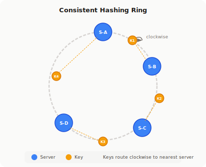
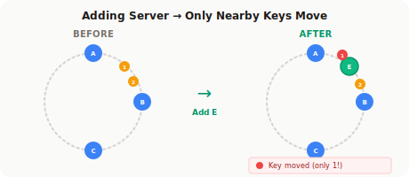

# Consistent Hashing

!!! danger "Real Incident: Memcached at Facebook, 2010"
    Facebook had 1000+ Memcached servers. Adding one server with naive `hash % N` invalidated **billions of cache entries** simultaneously. Thundering herd → database crushed → partial outage. They switched to consistent hashing. Problem solved.

---

## Why This Comes Up in Interviews

Every time you say "let's distribute data across N servers" in a system design interview, the interviewer is waiting for you to explain HOW. If you say `hash % N`, you've failed. Consistent hashing is the foundation of:

- Distributed caches (Memcached, Redis Cluster)
- Distributed databases (DynamoDB, Cassandra)
- CDNs (Akamai)
- Load balancers (consistent routing)
- Distributed file systems

---

## The Problem: Why `hash % N` Breaks

**Setup:** 4 cache servers. Key "user:123" → `hash("user:123") % 4 = 2` → goes to Server 2.

**Now add a 5th server:** `hash("user:123") % 5 = 3` → goes to Server 3.

| Servers | Keys that MOVE | Cache Hit Rate After |
|---|---|---|
| 4 → 5 | ~80% of all keys | ~20% (catastrophic) |
| 10 → 11 | ~90% of all keys | ~10% |
| 100 → 101 | ~99% of all keys | ~1% |

**The math:** When going from N to N+1 servers, `(N)/(N+1)` fraction of keys remap. For N=100, that's 99% of keys moving.

**What happens in production:**

1. 99% of cache keys miss simultaneously
2. All requests flood the database
3. Database can't handle 100x normal load
4. Cascading failure → outage

This is called a **thundering herd** or **cache stampede**. Consistent hashing reduces key movement from ~100% to ~1/N.

---

## How the Hash Ring Works



**The idea:** Instead of `hash % N`, place both servers and keys on a circular hash space (0 to 2³² - 1). Each key is assigned to the first server encountered moving clockwise.

**Step by step:**

1. Hash each server name to get its position on the ring
    - `hash("ServerA") = 0x3A...` → position 230°
    - `hash("ServerB") = 0x7F...` → position 120°
    - `hash("ServerC") = 0xB2...` → position 45°

2. Hash each key to get its position
    - `hash("user:123") = 0x55...` → position 180°

3. Walk clockwise from key position → first server hit owns that key
    - "user:123" at 180° → walks clockwise → hits ServerA at 230°

---

## Adding/Removing a Server



**Add ServerD at position 200°:**

- Only keys between 180° and 200° move (from ServerA to ServerD)
- All other keys stay exactly where they are
- **~1/N keys move** instead of ~100%

**Remove ServerB at position 120°:**

- Only ServerB's keys (between previous server and 120°) move to next server clockwise
- Everything else untouched

**Back-of-envelope:** With 100 servers and 10 billion keys, adding a server moves ~100M keys (1%). With `hash % N`, you'd move ~9.9 billion keys (99%).

---

## Virtual Nodes — Why You Always Need Them

**The problem with basic consistent hashing:** With 3 servers on a ring, one might own 60% of the space, another 25%, another 15%. Distribution is wildly uneven.

**Mathematical reason:** When placing N points randomly on a circle, the expected maximum gap is O(log N / N), but variance is very high for small N.

**Solution: Virtual Nodes (Vnodes)**

Each physical server gets 100-200 positions on the ring:

```
ServerA → hash("ServerA-0"), hash("ServerA-1"), ..., hash("ServerA-149")
ServerB → hash("ServerB-0"), hash("ServerB-1"), ..., hash("ServerB-149")
```

| Vnodes per server | Load variance | Key redistribution on removal |
|---|---|---|
| 1 | 50%+ (unusable) | All to one neighbor |
| 10 | ~20% | Somewhat spread |
| 100 | ~10% | Well distributed |
| 150 | ~5-7% | Production standard |
| 200 | <5% | Diminishing returns beyond this |

**Critical insight for interviews:** When a server with 150 vnodes is removed, its keys are distributed across ALL remaining servers (not just one neighbor). Each remaining server absorbs roughly 1/(N-1) of the dead server's load.

---

## Back-of-Envelope: Capacity Planning

**Scenario:** Design a distributed cache for 50M keys across 20 servers.

| Parameter | Value | Reasoning |
|---|---|---|
| Keys per server | ~2.5M | 50M / 20 (with vnodes, ±5%) |
| Vnodes per server | 150 | Standard for <5% variance |
| Total ring positions | 3000 | 20 × 150 |
| Keys moved on add | ~2.5M | 50M / 20 = 1/N |
| Keys moved on remove | ~2.5M | Same, spread across 19 remaining |
| Memory for ring metadata | ~150KB | 3000 entries × (hash + server pointer) |

---

## Replication on the Ring

For fault tolerance, replicate each key to the **next K distinct physical servers** clockwise.

| Replication Factor | Behavior | Used By |
|---|---|---|
| RF = 1 | No redundancy. Node death = data loss. | Test environments |
| RF = 3 | Survives 2 simultaneous failures. Standard. | DynamoDB, Cassandra |
| RF = 3 + rack-aware | Next 3 servers in DIFFERENT racks/AZs | Production systems |

**Why "distinct physical servers":** With vnodes, consecutive ring positions might belong to the same physical server. You must skip until you find K distinct physical machines.

**Consistency trade-off (connects to CAP):**

- Write to W replicas before ACK
- Read from R replicas
- If W + R > RF → strong consistency (guaranteed overlap)
- DynamoDB default: RF=3, W=2, R=2 → strongly consistent reads available

---

## Handling Hotspots

**Problem:** Even with vnodes, some keys are naturally "hot" (celebrity accounts, viral content).

| Strategy | How | Used By |
|---|---|---|
| **Micro-sharding** | Split hot key into sub-keys (user:123:0, user:123:1, ...) | Instagram |
| **Read replicas per partition** | Multiple read replicas for hot partition | DynamoDB |
| **Application-level caching** | L1 cache in front of distributed cache | Facebook TAO |
| **Key-aware routing** | Route hot keys to beefier nodes | Custom solutions |

---

## How Real Systems Implement It

| System | Implementation Details |
|---|---|
| **DynamoDB** | Consistent hashing with "partition splits" — hot partitions automatically split. No manual vnodes. |
| **Cassandra** | Token ring. Each node owns a range. Vnodes (default 256 per node). Murmur3 hash. |
| **Memcached** | Client-side consistent hashing (ketama algorithm). Server doesn't know about ring. |
| **Redis Cluster** | 16384 hash slots. Slots assigned to nodes. Not classic consistent hashing but similar concept. |
| **Akamai CDN** | Consistent hashing for content routing to edge servers. |
| **Discord** | Route messages to guild servers using consistent hashing on guild_id. |

---

## Consistent Hashing vs Alternatives

| Approach | Key Movement | Complexity | Best For |
|---|---|---|---|
| **hash % N** | ~100% on any change | Trivial | Never changes (fixed N) |
| **Consistent Hashing** | ~1/N | Medium | Caches, DBs, CDNs |
| **Rendezvous (HRW) Hashing** | ~1/N | Medium | When K replicas needed elegantly |
| **Jump Consistent Hash** | ~1/N | Low | Sequential server IDs, no removal |

**Rendezvous hashing** (Highest Random Weight): For each key, compute score with every server. Pick highest. Elegant for K replicas (pick top K). Used by some CDNs. Downside: O(N) per lookup vs O(log N) for ring.

---

## Interview Framework: How to Present This

**When the interviewer asks "How do you distribute data across servers?":**

> **Step 1 — State the problem:** "With simple modular hashing, adding or removing any server remaps nearly all keys, causing a cache stampede that can take down the database."
>
> **Step 2 — Introduce the ring:** "I'd use consistent hashing — place servers and keys on a hash ring. Each key belongs to the next server clockwise. Adding a server only moves ~1/N of keys."
>
> **Step 3 — Address distribution:** "To ensure even load, each server gets 100-200 virtual nodes on the ring, reducing variance to under 5%."
>
> **Step 4 — Replication:** "For fault tolerance, each key is replicated to the next 2-3 distinct physical servers clockwise, giving us RF=3."
>
> **Step 5 — Connect to consistency:** "With RF=3, I can configure W=2, R=2 for strong consistency, or W=1, R=1 for availability-optimized eventual consistency."

---

## Common Follow-Up Questions

| Question | Strong Answer |
|---|---|
| "What if a server is slow but not dead?" | "Virtual node reassignment — temporarily remove its vnodes from the ring. Or use a gossip protocol with phi-accrual failure detection." |
| "How do you handle a celebrity/hot key?" | "Micro-shard: append random suffix to key, scatter reads across multiple partitions, aggregate at application layer." |
| "How does this work with auto-scaling?" | "Controlled scaling — add one server at a time, let data rebalance (~1/N movement), then add next. Monitor rebalance completion before proceeding." |
| "Memory overhead of the ring?" | "Negligible. 200 servers × 150 vnodes = 30K entries. Each entry is a hash + pointer. Under 1MB total." |

---

## Quick Recall

| Question | Answer |
|---|---|
| Why not hash % N? | Adding 1 server remaps ~100% of keys → cache stampede |
| How much moves with consistent hashing? | ~1/N keys (N = number of servers) |
| Virtual nodes purpose? | Even distribution + spread load on failure |
| How many vnodes? | 100-200 per server (<5% variance) |
| Replication? | Next K distinct physical servers clockwise |
| Strong consistency formula? | W + R > RF (e.g., W=2, R=2, RF=3) |
| Real systems? | DynamoDB, Cassandra, Memcached, Redis Cluster, Akamai |
