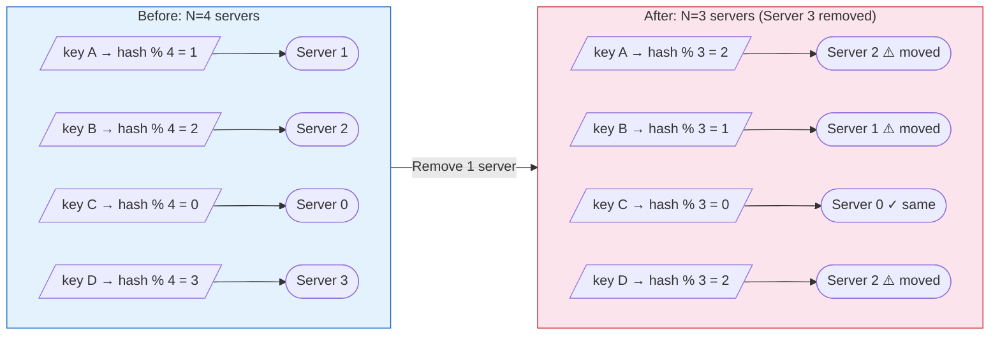
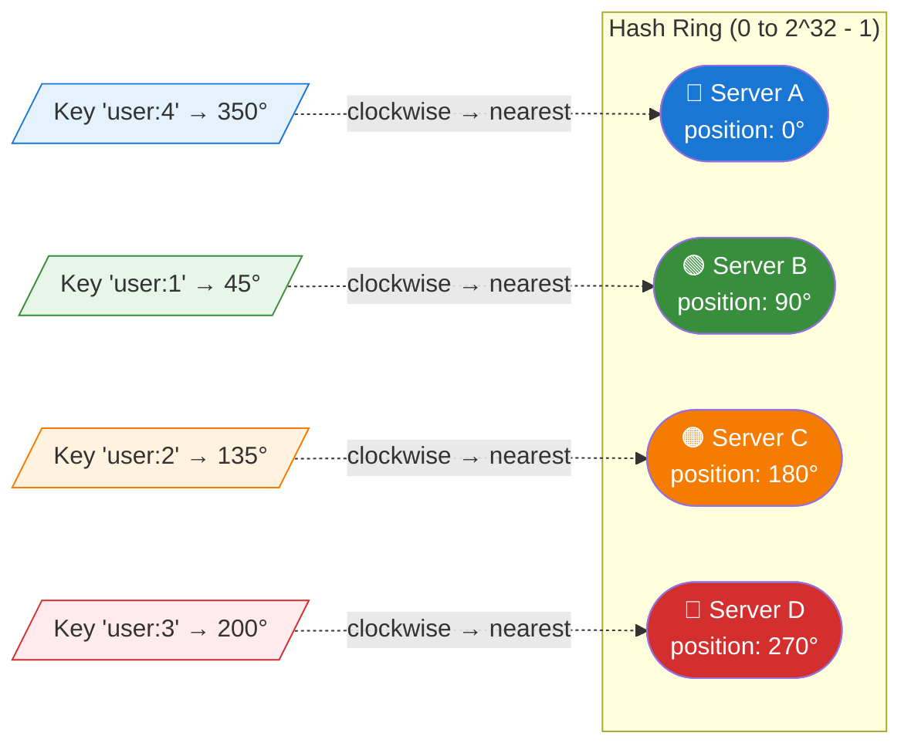
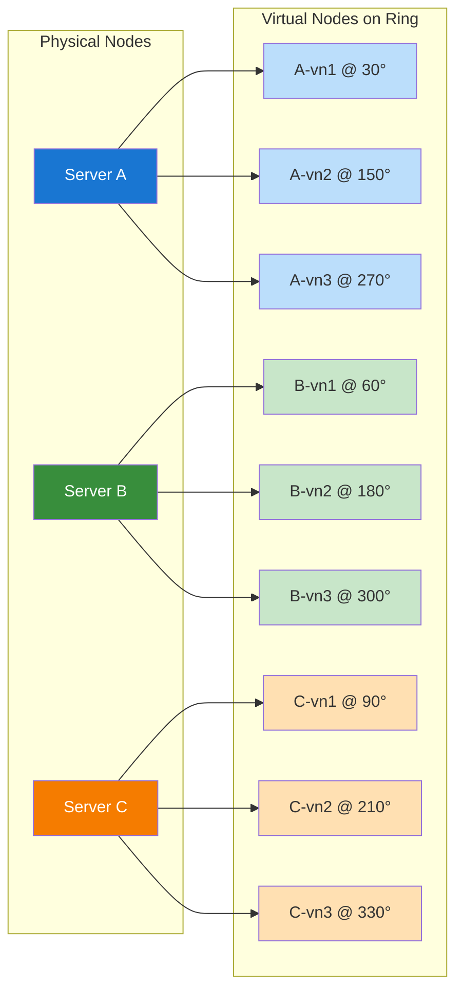
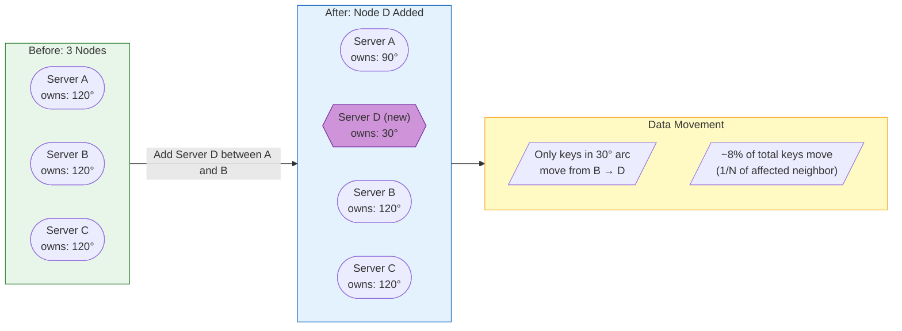

# Consistent Hashing

!!! tip "Why This Matters in Interviews"
    Consistent hashing is a **top-tier system design topic** asked at FAANG companies. It appears in questions about designing distributed caches, databases, CDNs, and load balancers. Understanding it demonstrates your ability to reason about data distribution, fault tolerance, and horizontal scaling — all critical for senior engineering roles.

---

## The Problem with Naive Hashing

With naive (modulo-based) hashing, a key is assigned to a server using:

```
server = hash(key) % N
```

This works fine **until N changes**. Adding or removing a single server causes nearly **all keys** to remap, leading to massive cache misses and data movement.

**Example:** With 4 servers, key "user:123" hashes to server 2. If a server goes down (N=3), it now maps to server 0. This affects the majority of keys, not just the ones on the failed server.



**Impact:** ~75% of keys are remapped when going from 4 to 3 servers. In general, `(N-1)/N` keys move — catastrophic for caches.

---

## How Consistent Hashing Works

Consistent hashing places both **servers** and **keys** on a circular hash space (the "hash ring"). A key is assigned to the **first server encountered clockwise** from its position on the ring.



### Key Properties

| Property | Description |
|----------|-------------|
| **Minimal disruption** | When a node joins/leaves, only keys between it and its predecessor are affected |
| **Proportional load** | Each node handles roughly `1/N` of the key space |
| **Deterministic** | Same key always maps to the same node (given the same ring state) |

---

## Virtual Nodes (Vnodes)

### The Problem with Basic Consistent Hashing

With only a few physical nodes, the ring can become **unbalanced** — one server may own a much larger arc than others, receiving disproportionate traffic.

### The Solution

Each physical node is mapped to **multiple positions** on the ring (virtual nodes). Typically 100-200 virtual nodes per physical node.



### Benefits of Virtual Nodes

- **Better load distribution** — keys are spread more evenly
- **Heterogeneous hardware** — powerful servers get more vnodes
- **Smoother rebalancing** — adding a node steals small chunks from many nodes, not one large chunk from one neighbor

---

## Adding and Removing Nodes

### Adding a Node

When **Server D** is added between Server A and Server B, only the keys in the arc between A and D move to D. All other keys stay in place.



### Removing a Node

When a node is removed, its keys transfer to the **next clockwise node**. Only `1/N` of total keys are affected.

| Operation | Keys Affected | Direction |
|-----------|--------------|-----------|
| Add node | ~`K/N` keys move **to** new node | From next clockwise neighbor |
| Remove node | ~`K/N` keys move **from** removed node | To next clockwise neighbor |

---

## Real-World Usage

| System | How It Uses Consistent Hashing |
|--------|-------------------------------|
| **Amazon DynamoDB** | Partitions data across storage nodes; uses virtual nodes for load balancing |
| **Apache Cassandra** | Token ring assigns partition ranges to nodes; vnodes enabled by default |
| **Redis Cluster** | Uses 16384 hash slots (a variant of consistent hashing) mapped to nodes |
| **Akamai CDN** | Routes content requests to nearest/optimal edge servers |
| **Memcached** (client-side) | Clients use consistent hashing to select cache server for each key |
| **Nginx** | Upstream consistent hashing for sticky load balancing |
| **Discord** | Routes users to specific gateway servers for WebSocket connections |

---

## Java Implementation (Simplified)

```java
import java.util.*;
import java.security.MessageDigest;
import java.security.NoSuchAlgorithmException;

public class ConsistentHashRing<T> {

    private final TreeMap<Long, T> ring = new TreeMap<>();
    private final int virtualNodes;

    public ConsistentHashRing(int virtualNodes) {
        this.virtualNodes = virtualNodes;
    }

    /**
     * Add a node with its virtual nodes to the ring.
     */
    public void addNode(T node) {
        for (int i = 0; i < virtualNodes; i++) {
            long hash = hash(node.toString() + "-vn" + i);
            ring.put(hash, node);
        }
    }

    /**
     * Remove a node and all its virtual nodes from the ring.
     */
    public void removeNode(T node) {
        for (int i = 0; i < virtualNodes; i++) {
            long hash = hash(node.toString() + "-vn" + i);
            ring.remove(hash);
        }
    }

    /**
     * Get the node responsible for the given key.
     * Finds the first node clockwise from the key's hash position.
     */
    public T getNode(String key) {
        if (ring.isEmpty()) {
            return null;
        }
        long hash = hash(key);
        // ceilingEntry: smallest key >= hash (clockwise search)
        Map.Entry<Long, T> entry = ring.ceilingEntry(hash);
        if (entry == null) {
            // Wrap around to the first entry (circular ring)
            entry = ring.firstEntry();
        }
        return entry.getValue();
    }

    /**
     * MD5-based hash function returning a long value.
     */
    private long hash(String key) {
        try {
            MessageDigest md = MessageDigest.getInstance("MD5");
            byte[] digest = md.digest(key.getBytes());
            // Use first 8 bytes for a long hash
            long hash = 0;
            for (int i = 0; i < 8; i++) {
                hash = (hash << 8) | (digest[i] & 0xFF);
            }
            return hash;
        } catch (NoSuchAlgorithmException e) {
            throw new RuntimeException(e);
        }
    }

    // --- Usage Example ---
    public static void main(String[] args) {
        ConsistentHashRing<String> ring = new ConsistentHashRing<>(150);

        ring.addNode("server-1");
        ring.addNode("server-2");
        ring.addNode("server-3");

        // Route keys
        System.out.println("user:100 → " + ring.getNode("user:100"));
        System.out.println("user:200 → " + ring.getNode("user:200"));
        System.out.println("user:300 → " + ring.getNode("user:300"));

        // Simulate node failure
        ring.removeNode("server-2");
        System.out.println("\nAfter removing server-2:");
        System.out.println("user:100 → " + ring.getNode("user:100"));
        System.out.println("user:200 → " + ring.getNode("user:200"));
    }
}
```

**Key design decisions:**

- `TreeMap` provides O(log N) lookup via `ceilingEntry()`
- 150 virtual nodes per physical node gives good balance
- MD5 gives uniform distribution (not used for security here)

---

## Comparison: Hashing Strategies

| Criteria | Naive Hash (mod N) | Consistent Hashing | Rendezvous Hashing |
|----------|-------------------|-------------------|-------------------|
| **Remapping on node change** | ~100% of keys | ~K/N keys | ~K/N keys |
| **Lookup complexity** | O(1) | O(log N) with TreeMap | O(N) — must check all nodes |
| **Memory overhead** | None | Virtual node entries | None |
| **Load balance** | Depends on hash | Good with vnodes | Naturally balanced |
| **Implementation** | Trivial | Moderate | Simple |
| **Use case** | Fixed-size pools | Dynamic clusters | Small node sets, replication |
| **Replication support** | Manual | Walk ring for N successors | Top-K highest scores |

---

## Common Interview Questions

??? question "What happens when a node goes down in consistent hashing?"
    When a node fails, only the keys assigned to that node need to be reassigned. They move to the **next node clockwise** on the ring. This means only approximately `1/N` of the total keys are affected (where N is the number of nodes), compared to naive hashing where nearly all keys would be remapped.

    With **replication** (common in production systems like Cassandra), the data is already replicated to successor nodes, so there may be zero data movement — the next node simply starts serving those requests directly.

??? question "How do you handle hotspots or uneven load distribution?"
    There are several strategies:

    1. **Virtual nodes** — Map each physical node to 100-200 positions on the ring to ensure statistical uniformity.
    2. **Weighted vnodes** — Assign more virtual nodes to more powerful servers.
    3. **Bounded-load consistent hashing** (Google, 2017) — Set a capacity cap per node; if a node is overloaded, the key routes to the next available node clockwise.
    4. **Split hot partitions** — Detect hot keys and add random suffixes to spread them across multiple nodes.

??? question "How does consistent hashing support replication?"
    To replicate data to R nodes, you **walk clockwise** from the key's position and assign the key to the next R distinct physical nodes (skipping virtual nodes that belong to the same physical server).

    For example, with replication factor 3: a key at position 45 degrees is stored on the first 3 unique physical nodes found clockwise. This gives both **redundancy** and **fault tolerance** — if one node fails, the data is still available on the other replicas.

??? question "Why use a TreeMap in the Java implementation?"
    A `TreeMap` is a Red-Black tree that maintains sorted order. This is critical because:

    - **`ceilingEntry(hash)`** finds the nearest clockwise node in O(log N) time
    - It naturally handles the ring structure — if no ceiling entry exists, wrap to `firstEntry()`
    - Insertions and deletions (adding/removing nodes) are also O(log N)

    Alternative: An array of sorted positions with binary search achieves similar O(log N) lookups but has O(N) insertions.

??? question "How does Redis Cluster differ from classic consistent hashing?"
    Redis Cluster uses **hash slots** rather than a full consistent hash ring:

    - The key space is divided into exactly **16,384 slots**
    - Each key is mapped to a slot via `CRC16(key) % 16384`
    - Slots are assigned to nodes (not a continuous ring)
    - Rebalancing moves specific slots between nodes

    This is simpler to reason about and manage. The cluster can move individual slots during resharding, and clients cache a slot-to-node mapping table for O(1) routing.

??? question "What is the difference between consistent hashing and rendezvous hashing?"
    **Consistent hashing** places nodes on a ring and assigns keys to the nearest clockwise node. **Rendezvous hashing** (Highest Random Weight) computes a score for each `(key, node)` pair and assigns the key to the node with the highest score.

    | Aspect | Consistent Hashing | Rendezvous Hashing |
    |--------|-------------------|-------------------|
    | Lookup | O(log N) | O(N) |
    | Memory | O(N * vnodes) | O(N) |
    | Balance | Needs vnodes | Naturally uniform |
    | Simplicity | Moderate | Very simple |

    Rendezvous hashing is preferred when N is small (e.g., choosing among a few replicas) and consistent hashing is preferred for large-scale systems where O(N) lookup is too expensive.

??? question "How would you design a distributed cache using consistent hashing?"
    A production-ready design includes:

    1. **Hash ring with vnodes** — 150+ vnodes per physical node using a uniform hash (e.g., MD5, xxHash)
    2. **Client-side routing** — Clients maintain a copy of the ring and route directly to the correct cache node
    3. **Replication** — Store each key on R successor nodes for fault tolerance
    4. **Failure detection** — Use gossip protocol or heartbeats; remove failed nodes from ring
    5. **Rebalancing** — When nodes join/leave, only transfer affected key ranges
    6. **Consistency** — Use quorum reads/writes (R + W > N) for strong consistency, or eventual consistency with conflict resolution

??? question "How many virtual nodes should you use, and what are the trade-offs?"
    The number of virtual nodes involves a trade-off:

    - **Too few (< 50):** Poor load balance, high variance between nodes
    - **Sweet spot (100-200):** Good balance with manageable memory overhead
    - **Too many (> 500):** Diminishing returns on balance; increased memory usage and slower node add/remove operations

    **Rule of thumb:** Start with 150 vnodes. With 150 vnodes and 10 physical nodes, you have 1500 points on the ring, giving a standard deviation of ~5% in load distribution.

    For heterogeneous hardware, assign vnodes proportional to capacity: a server with 2x RAM gets 2x vnodes.

??? question "What happens during a network partition in a system using consistent hashing?"
    Consistent hashing itself does not solve network partitions — it is a **data placement** strategy, not a consensus protocol. However, systems built on it handle partitions differently:

    - **Dynamo/Cassandra (AP):** Continue accepting writes on both sides of the partition. Use vector clocks or last-write-wins for conflict resolution during reconciliation.
    - **Redis Cluster (CP-leaning):** Nodes on the minority side stop accepting writes after a timeout. The majority side continues serving.
    - **Key insight:** The ring determines *where* data lives; the replication and consensus protocols determine *availability* and *consistency* guarantees during failures.

---

## Key Takeaways

!!! success "Interview Cheat Sheet"
    - Consistent hashing minimizes key remapping to **K/N** when nodes change
    - **Virtual nodes** solve the load imbalance problem
    - Use a **TreeMap** (sorted map) for O(log N) clockwise lookups
    - Real systems (DynamoDB, Cassandra) combine consistent hashing with replication and failure detection
    - Know the trade-offs vs. rendezvous hashing and Redis-style hash slots
    - Always discuss **virtual nodes** and **replication** — interviewers expect depth beyond the basic ring concept
