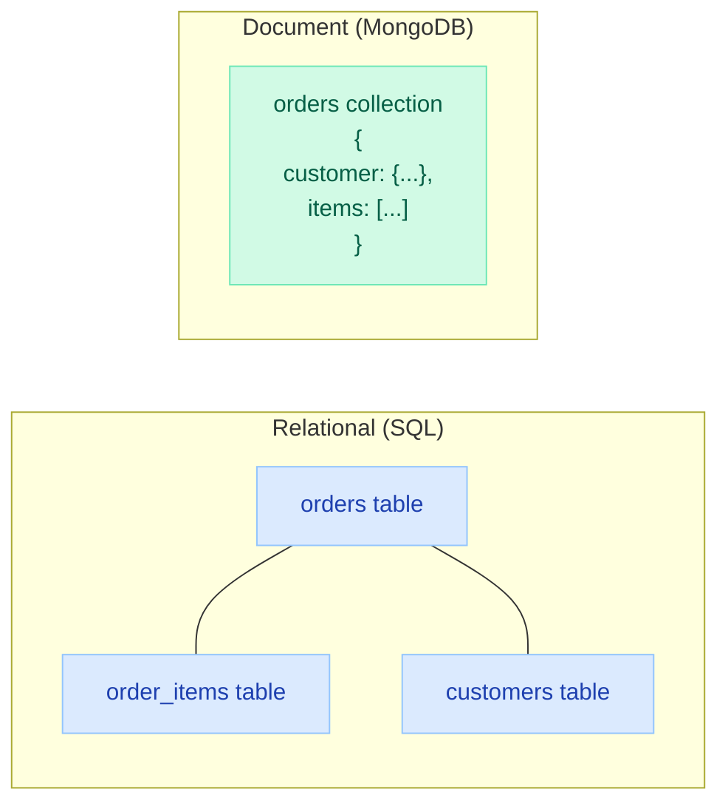
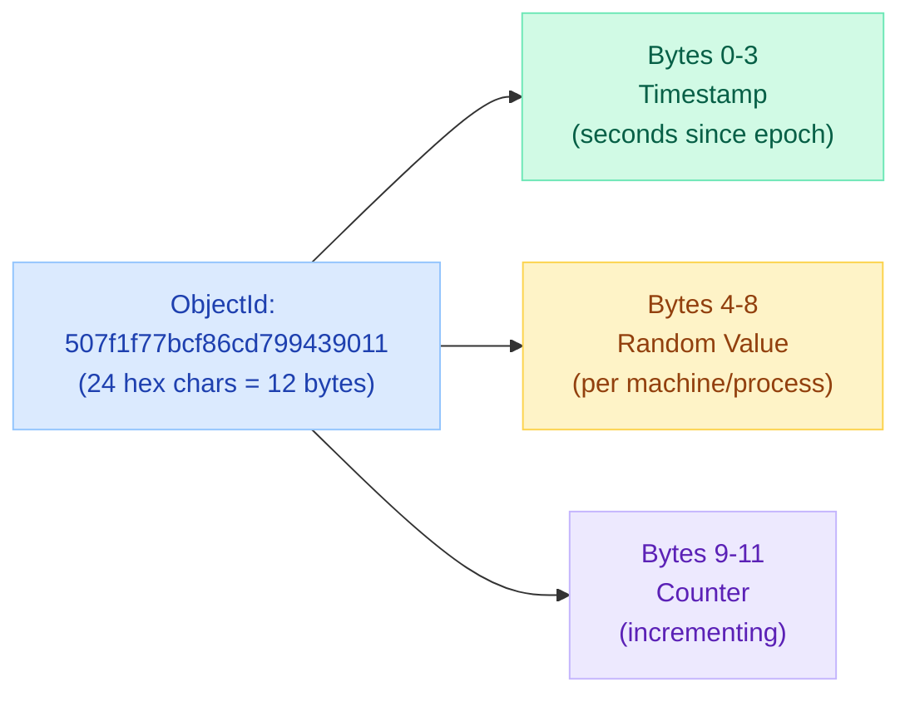
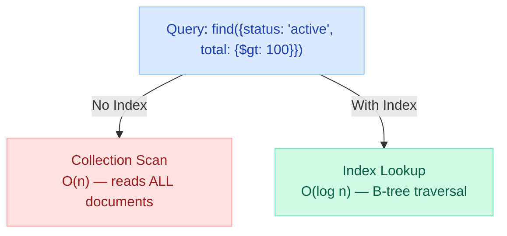
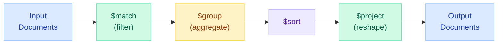
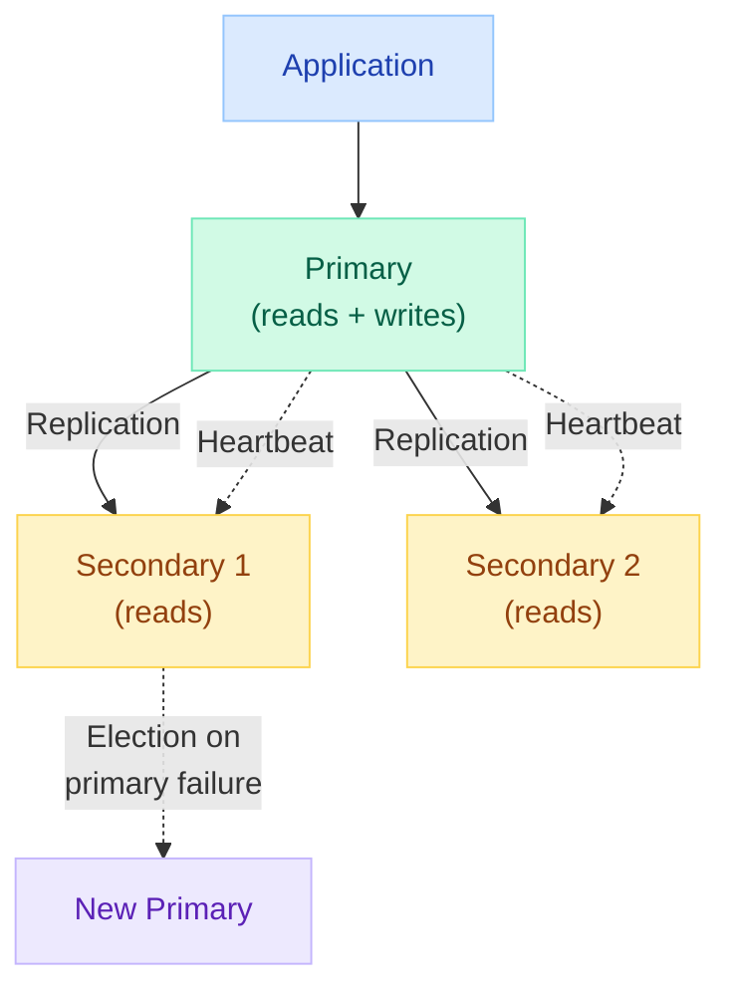
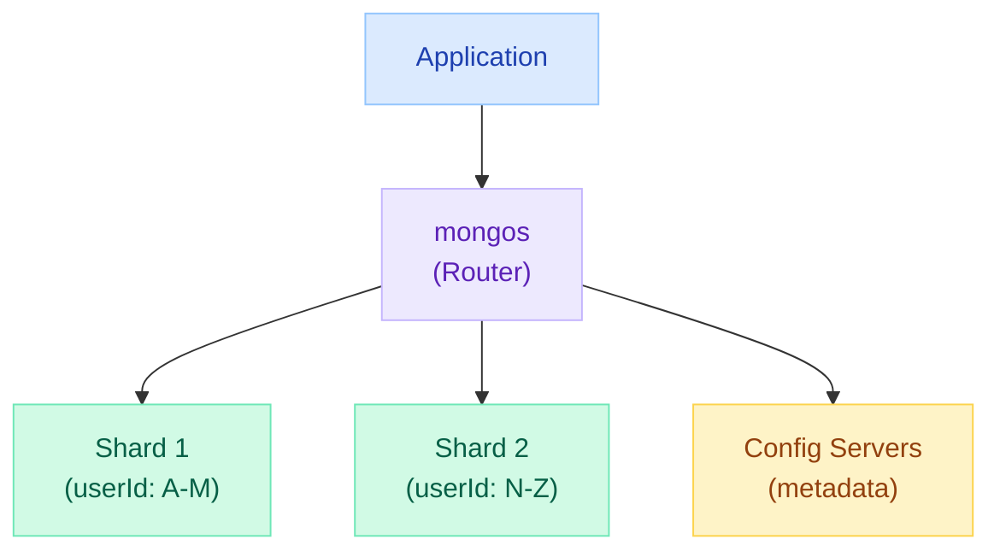
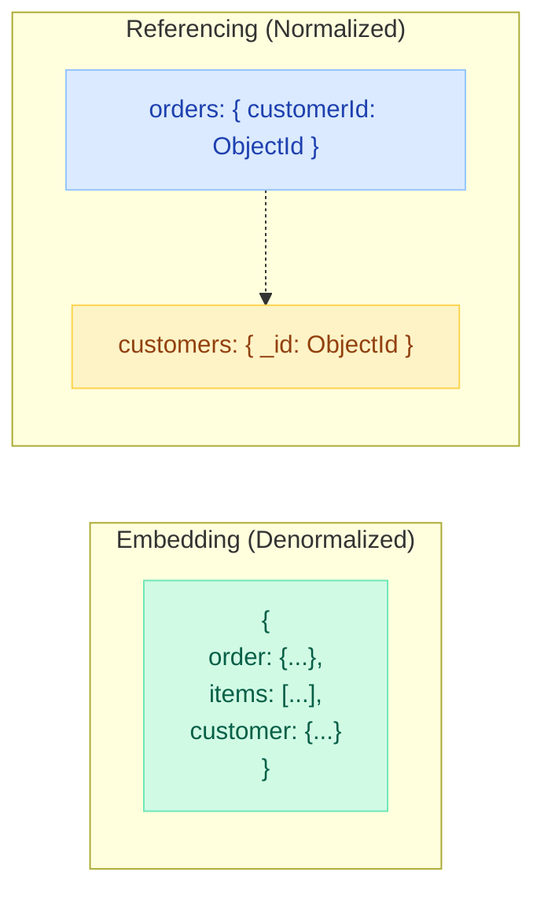
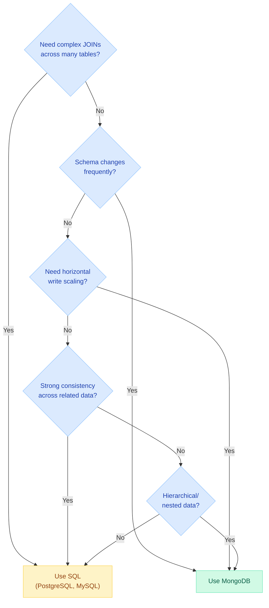

# MongoDB — Document Database Deep Dive

> **Why Netflix Chose MongoDB:** Netflix migrated their content metadata from Oracle to MongoDB to handle 200M+ subscribers with unpredictable content schemas. Each title has different attributes (TV series have seasons/episodes; movies have directors/runtime). A rigid relational schema couldn't keep up with weekly schema changes. MongoDB's flexible document model solved this.

---

!!! abstract "When to Reach for MongoDB"
    MongoDB excels when your data has variable structure, you need horizontal scaling, and relationships are mostly hierarchical (embedded documents). Think: content catalogs, user profiles, IoT event streams, real-time analytics.

---

## Document Model vs Relational



| Feature | Relational (SQL) | MongoDB |
|---|---|---|
| **Data unit** | Row (fixed columns) | Document (flexible JSON/BSON) |
| **Schema** | Rigid, predefined | Flexible, per-document |
| **Relationships** | Foreign keys + JOINs | Embedded documents or `$lookup` |
| **Scaling** | Vertical (scale up) | Horizontal (sharding) |
| **Transactions** | Full ACID since day 1 | Multi-document ACID since 4.0 |
| **Query language** | SQL | MQL (MongoDB Query Language) |
| **Best for** | Complex relationships, reporting | Variable schemas, high write throughput |
| **Storage** | Tables/rows/columns | Collections/documents/fields |

### MongoDB Terminology Mapping

| SQL Term | MongoDB Term |
|---|---|
| Database | Database |
| Table | Collection |
| Row | Document |
| Column | Field |
| Primary Key | `_id` field |
| Index | Index |
| JOIN | `$lookup` (aggregation) or embedding |
| Schema | Validation rules (optional) |

---

## BSON Format & ObjectId

MongoDB stores data in **BSON** (Binary JSON) — a binary-encoded extension of JSON.

### BSON vs JSON

| Feature | JSON | BSON |
|---|---|---|
| Format | Text | Binary |
| Types | 6 types (string, number, boolean, null, array, object) | 20+ types (Date, Decimal128, Binary, ObjectId, etc.) |
| Size | Larger (text encoding) | Compact (binary) |
| Speed | Parse from text | Direct memory mapping |
| Max size | N/A | 16 MB per document |

### ObjectId Structure



```javascript
// ObjectId properties
const id = ObjectId("507f1f77bcf86cd799439011");
id.getTimestamp(); // 2012-10-17T20:46:22Z (embedded creation time!)
id.toString();     // "507f1f77bcf86cd799439011"
```

**Key facts about ObjectId:**

- 12 bytes, globally unique without coordination
- Sortable by creation time (timestamp is first 4 bytes)
- Auto-generated by driver if `_id` not specified
- You can use any unique value as `_id` (UUID, natural key, etc.)

---

## CRUD Operations

### Create

```javascript
// Insert one document
db.orders.insertOne({
  customerId: ObjectId("64a1b2c3d4e5f6a7b8c9d0e1"),
  items: [
    { product: "MacBook Pro", quantity: 1, price: 2499.99 },
    { product: "USB-C Hub", quantity: 2, price: 49.99 }
  ],
  total: 2599.97,
  status: "pending",
  createdAt: new Date(),
  shippingAddress: {
    street: "123 Main St",
    city: "San Francisco",
    state: "CA",
    zip: "94102"
  }
});

// Insert many
db.orders.insertMany([
  { /* order1 */ },
  { /* order2 */ },
  { /* order3 */ }
]);
```

### Read (Find)

```javascript
// Find one by ID
db.orders.findOne({ _id: ObjectId("507f1f77bcf86cd799439011") });

// Find with conditions
db.orders.find({
  status: "pending",
  total: { $gte: 100 },
  "shippingAddress.state": "CA"
});

// Projection (select specific fields)
db.orders.find(
  { status: "pending" },
  { customerId: 1, total: 1, status: 1, _id: 0 }
);

// Sorting, limiting, skipping
db.orders.find({ status: "shipped" })
  .sort({ createdAt: -1 })
  .skip(20)
  .limit(10);
```

### Update

```javascript
// Update one
db.orders.updateOne(
  { _id: ObjectId("507f1f77bcf86cd799439011") },
  {
    $set: { status: "shipped", shippedAt: new Date() },
    $push: { timeline: { event: "shipped", at: new Date() } }
  }
);

// Update many
db.orders.updateMany(
  { status: "pending", createdAt: { $lt: new Date("2024-01-01") } },
  { $set: { status: "cancelled" } }
);

// Upsert (insert if not exists)
db.metrics.updateOne(
  { date: "2024-03-15", metric: "page_views" },
  { $inc: { count: 1 } },
  { upsert: true }
);
```

### Delete

```javascript
// Delete one
db.orders.deleteOne({ _id: ObjectId("507f1f77bcf86cd799439011") });

// Delete many
db.orders.deleteMany({ status: "cancelled", createdAt: { $lt: new Date("2023-01-01") } });
```

### Query Operators

| Operator | Meaning | Example |
|---|---|---|
| `$eq` | Equal | `{ status: { $eq: "active" } }` |
| `$ne` | Not equal | `{ status: { $ne: "deleted" } }` |
| `$gt`, `$gte` | Greater than (or equal) | `{ total: { $gte: 100 } }` |
| `$lt`, `$lte` | Less than (or equal) | `{ age: { $lt: 30 } }` |
| `$in` | In array | `{ status: { $in: ["pending", "active"] } }` |
| `$nin` | Not in array | `{ status: { $nin: ["deleted"] } }` |
| `$and` | Logical AND | `{ $and: [{age: {$gte:18}}, {age: {$lte:65}}] }` |
| `$or` | Logical OR | `{ $or: [{status: "a"}, {total: {$lt:10}}] }` |
| `$exists` | Field exists | `{ email: { $exists: true } }` |
| `$regex` | Pattern match | `{ name: { $regex: /^john/i } }` |
| `$elemMatch` | Array element match | `{ items: { $elemMatch: { qty: {$gt:5} } } }` |

---

## Indexing

Indexes are critical for MongoDB performance. Without indexes, MongoDB performs a **collection scan** (reads every document).



### Index Types

| Type | Use Case | Example |
|---|---|---|
| **Single Field** | Query on one field | `db.orders.createIndex({ status: 1 })` |
| **Compound** | Query on multiple fields | `db.orders.createIndex({ status: 1, createdAt: -1 })` |
| **Multikey** | Index array fields | `db.products.createIndex({ tags: 1 })` |
| **Text** | Full-text search | `db.articles.createIndex({ title: "text", body: "text" })` |
| **Geospatial** | Location queries | `db.places.createIndex({ location: "2dsphere" })` |
| **Hashed** | Shard key distribution | `db.users.createIndex({ userId: "hashed" })` |
| **TTL** | Auto-expire documents | `db.sessions.createIndex({ expiresAt: 1 }, { expireAfterSeconds: 0 })` |
| **Unique** | Enforce uniqueness | `db.users.createIndex({ email: 1 }, { unique: true })` |
| **Partial** | Index subset of documents | `db.orders.createIndex({ total: 1 }, { partialFilterExpression: { status: "active" } })` |

### Compound Index Order Matters (ESR Rule)

**E**quality -> **S**ort -> **R**ange

```javascript
// Query: find active orders over $100, sorted by date
db.orders.find({ status: "active", total: { $gt: 100 } }).sort({ createdAt: -1 });

// Optimal index: Equality fields first, then Sort, then Range
db.orders.createIndex({ status: 1, createdAt: -1, total: 1 });
//                      ^Equality    ^Sort           ^Range
```

### explain() for Query Analysis

```javascript
db.orders.find({ status: "pending" }).explain("executionStats");
// Look for:
// - "stage": "IXSCAN" (good) vs "COLLSCAN" (bad)
// - "nReturned" vs "totalDocsExamined" ratio
// - "executionTimeMillis"
```

---

## Aggregation Pipeline

The aggregation pipeline processes documents through a sequence of stages. Each stage transforms the document stream.



### Common Pipeline Stages

| Stage | Purpose | SQL Equivalent |
|---|---|---|
| `$match` | Filter documents | `WHERE` |
| `$group` | Aggregate values | `GROUP BY` |
| `$project` | Reshape/select fields | `SELECT` |
| `$sort` | Order results | `ORDER BY` |
| `$limit` | Limit results | `LIMIT` |
| `$skip` | Skip results | `OFFSET` |
| `$unwind` | Flatten arrays | Lateral join |
| `$lookup` | Join collections | `JOIN` |
| `$addFields` | Add computed fields | Computed column |
| `$facet` | Multiple pipelines in parallel | N/A |
| `$bucket` | Group into ranges | Range-based GROUP BY |

### Real-World Aggregation Examples

```javascript
// Revenue by category for last 30 days
db.orders.aggregate([
  // Stage 1: Filter recent completed orders
  { $match: {
      status: "completed",
      createdAt: { $gte: new Date(Date.now() - 30*24*60*60*1000) }
  }},

  // Stage 2: Flatten items array
  { $unwind: "$items" },

  // Stage 3: Group by category
  { $group: {
      _id: "$items.category",
      totalRevenue: { $sum: { $multiply: ["$items.price", "$items.quantity"] } },
      orderCount: { $sum: 1 },
      avgOrderValue: { $avg: "$items.price" }
  }},

  // Stage 4: Sort by revenue
  { $sort: { totalRevenue: -1 } },

  // Stage 5: Reshape output
  { $project: {
      category: "$_id",
      totalRevenue: { $round: ["$totalRevenue", 2] },
      orderCount: 1,
      avgOrderValue: { $round: ["$avgOrderValue", 2] },
      _id: 0
  }}
]);
```

### $lookup (JOIN equivalent)

```javascript
// Join orders with customer data
db.orders.aggregate([
  { $lookup: {
      from: "customers",
      localField: "customerId",
      foreignField: "_id",
      as: "customer"
  }},
  { $unwind: "$customer" }, // Convert array to object
  { $project: {
      orderId: "$_id",
      total: 1,
      customerName: "$customer.name",
      customerEmail: "$customer.email"
  }}
]);
```

### $facet (Multiple Aggregations in One Query)

```javascript
// Dashboard data in a single query
db.orders.aggregate([
  { $facet: {
      "statusBreakdown": [
        { $group: { _id: "$status", count: { $sum: 1 } } }
      ],
      "revenueByMonth": [
        { $group: {
            _id: { $dateToString: { format: "%Y-%m", date: "$createdAt" } },
            revenue: { $sum: "$total" }
        }},
        { $sort: { _id: 1 } }
      ],
      "topCustomers": [
        { $group: { _id: "$customerId", totalSpent: { $sum: "$total" } } },
        { $sort: { totalSpent: -1 } },
        { $limit: 5 }
      ]
  }}
]);
```

---

## Replica Sets and Sharding

### Replica Sets (High Availability)



| Feature | Description |
|---|---|
| Minimum nodes | 3 (1 primary + 2 secondary, or 1 primary + 1 secondary + 1 arbiter) |
| Write concern | `w: "majority"` — acknowledged after majority of nodes confirm |
| Read preference | Primary (default), Secondary, PrimaryPreferred, Nearest |
| Failover | Automatic election (10-12 seconds) |
| Oplog | Capped collection that records all write operations for replication |

### Sharding (Horizontal Scaling)



| Shard Key Strategy | Pros | Cons |
|---|---|---|
| **Hashed** | Even distribution | No range queries on shard key |
| **Range** | Efficient range queries | Hot spots if sequential (timestamps) |
| **Zone/Tag** | Geographic locality | Manual management |

```javascript
// Enable sharding
sh.enableSharding("ecommerce");
sh.shardCollection("ecommerce.orders", { customerId: "hashed" });
```

---

## Schema Design Patterns

### Embedding vs Referencing



| Factor | Embed | Reference |
|---|---|---|
| **Read pattern** | Always read together | Read independently |
| **Data size** | Small/bounded subdocuments | Large or unbounded |
| **Update pattern** | Updated together | Updated independently |
| **Cardinality** | 1:few (embed many side) | 1:many or many:many |
| **Document size** | Under 16 MB | Could exceed 16 MB |
| **Consistency** | Atomic (single document) | Requires transactions |

### Schema Design Patterns

| Pattern | When to Use | Example |
|---|---|---|
| **Embedded** | Tightly coupled data, read together | Order with line items |
| **Subset** | Only need recent/top-N of a large array | Product with latest 10 reviews embedded |
| **Computed** | Avoid expensive aggregations on read | Pre-computed totals, averages |
| **Bucket** | Time-series data, IoT measurements | Group sensor readings by hour |
| **Outlier** | 99% small, 1% huge | Most users have 5 posts; some have 50K |
| **Extended Ref** | Need some fields from related doc | Embed `customerName` + `customerId` |

### Example: Blog Post Schema

```javascript
// Embedded pattern (good for bounded data)
{
  _id: ObjectId("..."),
  title: "MongoDB Schema Design",
  author: {
    _id: ObjectId("..."),
    name: "Jane Smith",
    avatar: "/img/jane.jpg"  // Extended reference
  },
  content: "...",
  tags: ["mongodb", "nosql", "schema-design"],
  comments: [   // Embed if bounded (e.g., max 50)
    { user: "Bob", text: "Great post!", createdAt: new Date() },
    { user: "Alice", text: "Very helpful", createdAt: new Date() }
  ],
  stats: {      // Computed pattern
    views: 1524,
    likes: 47,
    commentCount: 2
  },
  createdAt: new Date(),
  updatedAt: new Date()
}
```

---

## Transactions in MongoDB (4.0+)

Multi-document transactions provide ACID guarantees across multiple documents and collections.

```java
// Spring Data MongoDB transaction
@Transactional
public void transferFunds(String fromAccount, String toAccount, BigDecimal amount) {
    Account from = accountRepo.findById(fromAccount).orElseThrow();
    Account to = accountRepo.findById(toAccount).orElseThrow();

    if (from.getBalance().compareTo(amount) < 0) {
        throw new InsufficientFundsException();
    }

    from.debit(amount);
    to.credit(amount);

    accountRepo.save(from);
    accountRepo.save(to);
    // Both or neither — ACID guaranteed
}
```

```javascript
// Native MongoDB transaction
const session = client.startSession();
try {
  session.startTransaction({
    readConcern: { level: "snapshot" },
    writeConcern: { w: "majority" }
  });

  db.accounts.updateOne(
    { _id: fromAccount },
    { $inc: { balance: -amount } },
    { session }
  );

  db.accounts.updateOne(
    { _id: toAccount },
    { $inc: { balance: amount } },
    { session }
  );

  session.commitTransaction();
} catch (error) {
  session.abortTransaction();
  throw error;
} finally {
  session.endSession();
}
```

!!! warning "Transaction Limitations"
    - Max 60 seconds runtime (configurable)
    - Performance overhead (snapshot isolation)
    - Not designed for long-running operations
    - If you need transactions frequently, reconsider your schema (embedding may eliminate the need)

---

## Spring Data MongoDB Integration

### Configuration

```yaml
# application.yml
spring:
  data:
    mongodb:
      uri: mongodb://localhost:27017/ecommerce
      # or individual properties:
      host: localhost
      port: 27017
      database: ecommerce
      authentication-database: admin
      username: app_user
      password: ${MONGO_PASSWORD}
```

### Entity Mapping

```java
@Document(collection = "orders")
@CompoundIndex(name = "status_date_idx", def = "{'status': 1, 'createdAt': -1}")
public class Order {

    @Id
    private String id; // Maps to _id (ObjectId if String)

    @Indexed
    private String customerId;

    @Field("items") // Custom field name
    private List<OrderItem> lineItems;

    private BigDecimal total;

    @Indexed
    private OrderStatus status;

    @CreatedDate
    private Instant createdAt;

    @LastModifiedDate
    private Instant updatedAt;

    @Version
    private Long version; // Optimistic locking
}

// Embedded document (no @Document, no @Id)
public class OrderItem {
    private String productId;
    private String productName;
    private int quantity;
    private BigDecimal price;
}
```

### Repository

```java
public interface OrderRepository extends MongoRepository<Order, String> {

    List<Order> findByStatusAndTotalGreaterThan(OrderStatus status, BigDecimal minTotal);

    @Query("{ 'status': ?0, 'createdAt': { $gte: ?1 } }")
    List<Order> findRecentByStatus(OrderStatus status, Instant since);

    @Query(value = "{ 'customerId': ?0 }", fields = "{ 'total': 1, 'status': 1 }")
    List<Order> findOrderSummariesByCustomer(String customerId);

    @Aggregation(pipeline = {
        "{ $match: { status: 'COMPLETED' } }",
        "{ $group: { _id: '$customerId', totalSpent: { $sum: '$total' } } }",
        "{ $sort: { totalSpent: -1 } }",
        "{ $limit: 10 }"
    })
    List<CustomerSpending> findTopSpenders();
}
```

### MongoTemplate for Complex Operations

```java
@Service
public class OrderAnalyticsService {

    @Autowired
    private MongoTemplate mongoTemplate;

    public List<CategoryRevenue> getRevenueByCategory(Instant since) {
        Aggregation agg = Aggregation.newAggregation(
            match(Criteria.where("status").is("COMPLETED")
                          .and("createdAt").gte(since)),
            unwind("lineItems"),
            group("lineItems.category")
                .sum(ArithmeticOperators.Multiply.valueOf("lineItems.price")
                    .multiplyBy("lineItems.quantity")).as("revenue")
                .count().as("orderCount"),
            sort(Sort.Direction.DESC, "revenue"),
            project()
                .and("_id").as("category")
                .andInclude("revenue", "orderCount")
                .andExclude("_id")
        );

        return mongoTemplate.aggregate(agg, "orders", CategoryRevenue.class)
            .getMappedResults();
    }
}
```

---

## When to Choose MongoDB vs SQL



| Choose MongoDB | Choose SQL |
|---|---|
| Variable/evolving schema | Fixed, well-known schema |
| High write throughput | Complex transactions across tables |
| Hierarchical data (nested) | Heavy reporting/analytics with JOINs |
| Horizontal scaling needed | Strict referential integrity |
| Rapid prototyping | Financial/banking (strong ACID) |
| Content management, catalogs | ERP, inventory with relationships |
| IoT / time-series data | Multi-table aggregations |
| Geospatial queries | Mature tooling ecosystem |

---

## Interview Questions

??? question "Q: How does MongoDB handle schema flexibility, and what are the trade-offs?"
    MongoDB is schema-less at the database level — documents in the same collection can have different fields. This provides:

    **Benefits:** (1) Faster development iterations. (2) Handles polymorphic data (different product types with different attributes). (3) No costly ALTER TABLE migrations. (4) Natural fit for semi-structured data.

    **Trade-offs:** (1) Application must handle schema validation (or use MongoDB Schema Validation rules). (2) Inconsistent data possible if multiple services write differently. (3) No compile-time safety for field names. (4) Query planning harder without guaranteed schema.

    **Best practice:** Use schema validation rules in production (`$jsonSchema` validator) to enforce structure while retaining flexibility for optional fields.

??? question "Q: Explain the difference between embedding and referencing in MongoDB schema design. When would you use each?"
    **Embedding:** Nest related data within the parent document. Use when: (1) Data is always read together. (2) Cardinality is bounded (1:few). (3) Child data doesn't need independent access. (4) Updates are atomic (single document).

    **Referencing:** Store ObjectId references to other collections. Use when: (1) Data is accessed independently. (2) Cardinality is unbounded (1:millions). (3) Document would exceed 16 MB. (4) Many-to-many relationships. (5) Data is updated independently.

    **Rule of thumb:** If you would use JOIN every time you read, embed. If you read the related data <20% of the time, reference.

    Example: Order with items -> embed (always read together). User with orders -> reference (user has thousands of orders over time).

??? question "Q: What is the aggregation pipeline in MongoDB? How does it compare to SQL?"
    The aggregation pipeline processes documents through a sequence of stages, where each stage transforms the document stream. It's MongoDB's equivalent to complex SQL queries with GROUP BY, HAVING, and subqueries.

    Key stages: `$match` (WHERE), `$group` (GROUP BY), `$project` (SELECT), `$sort` (ORDER BY), `$lookup` (JOIN), `$unwind` (flatten arrays), `$facet` (multiple parallel pipelines).

    Advantages over SQL: (1) Pipeline stages are composable and reorderable. (2) Can process nested/array data natively. (3) `$facet` runs multiple aggregations in one pass. (4) Stages can be conditionally added programmatically.

    Performance tip: Put `$match` early (uses indexes), then `$project` to reduce document size before expensive stages.

??? question "Q: How does MongoDB achieve high availability and horizontal scaling?"
    **High Availability (Replica Sets):** Minimum 3 nodes. One primary handles writes; secondaries replicate asynchronously. On primary failure, automatic election chooses new primary (10-12 sec failover). Write concern `w: majority` ensures durability.

    **Horizontal Scaling (Sharding):** Data distributed across shards by shard key. `mongos` routers direct queries to correct shard(s). Two strategies: (1) Hashed sharding — even distribution, no range queries on key. (2) Range sharding — efficient ranges, possible hot spots.

    Choosing shard key is critical: high cardinality, even distribution, matches query patterns. Bad shard key (e.g., timestamp) causes all writes to hit one shard.

??? question "Q: When would you choose MongoDB over PostgreSQL for a new project?"
    Choose MongoDB when: (1) Schema evolves frequently (startup, MVP). (2) Data is naturally hierarchical/nested (catalogs, CMS). (3) Need horizontal write scaling beyond single node. (4) Geospatial queries are primary use case. (5) Variable structure per document (polymorphic entities). (6) High write throughput with eventual consistency acceptable.

    Choose PostgreSQL when: (1) Complex relationships requiring JOINs. (2) Need strong ACID across multiple tables. (3) Reporting/analytics with complex aggregations. (4) Team expertise is SQL-centric. (5) JSON flexibility needed within relational model (JSONB). (6) Extensions matter (PostGIS, full-text search, etc.).

    Both support JSON, indexing, replication, and transactions. The deciding factor is usually your access patterns and relationship complexity.

---

## Quick Recall

| Concept | Key Point |
|---|---|
| **Document max size** | 16 MB (BSON) |
| **ObjectId** | 12 bytes: timestamp + random + counter (sortable by time) |
| **Embedding rule** | Embed if always read together and bounded cardinality |
| **Referencing rule** | Reference if independent access or unbounded growth |
| **ESR indexing** | Equality, Sort, Range — field order in compound indexes |
| **Aggregation** | Pipeline of stages: $match -> $group -> $sort -> $project |
| **$lookup** | LEFT OUTER JOIN equivalent (aggregation stage) |
| **Replica Set** | 3+ nodes, automatic failover, write to primary only |
| **Sharding** | Horizontal scaling by shard key, use hashed for even distribution |
| **Transactions** | Multi-document ACID since 4.0, 60-second limit |
| **Spring Data** | `@Document`, `MongoRepository`, `MongoTemplate` |
| **Write concern** | `w: "majority"` for durability across replica set |

---

## See Also

- [SQL vs NoSQL](../sqlvsnosql.md) — High-level comparison of database paradigms
- [SQL Fundamentals](sql.md) — Relational database reference
- [Database Sharding](../systemdesign/database-sharding.md) — General sharding concepts
- [Distributed Caching](../distributedCaching.md) — Caching layer in front of MongoDB
- [Spring Data JPA](../springboot/spring-data-jpa.md) — Comparison with relational Spring Data
