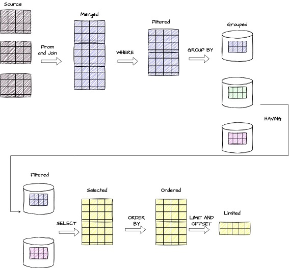
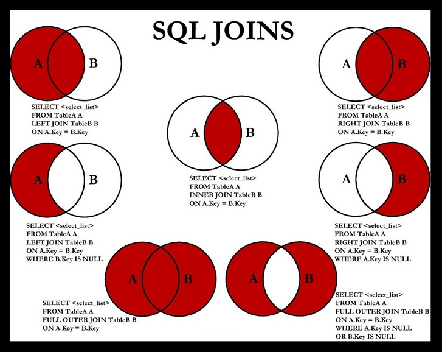

## SQL

SQL:

Statements in SQL:

DDL -Create, Alter, Drop and Truncate

DML- Select, Insert, Update and delete

DCL – Grant, Revoke

TCL – Commit, Rollback

## ACID Properties

Atomicity: means either successful or not.

Consistency: data should be consistent.

Isolation: ensures that transaction is isolated from other transaction.

Durability: means once a transaction has been committed, it will remain in case of errors or power loss.

## Difference between SQL and No SQL

**SQL**: Data will be in rows and columns , Schema is constant ,vertical scalable.

Ex: MySQL, Oracle ,PostgreSQL

**NO SQL**: Large data, Faster Delivery and data which change frequently.

Ex: Cassandra ,HBase (wide columns)

MongoDB(document)

Redis ,Dynamo( key value)

Infinite Dynamo (graph)

## Difference between my sql vs postgresql

| Sql                                | Postgresql                                  |
|------------------------------------|---------------------------------------------|
| Sql compliant                      | Partial sql compliant                       |
| Read and write operation is faster | When we huge transactions go for postgresql |
| Complex queries, json and xml      | Json , and cascading is supported           |

## Difference between JDBC and Hibernate

| JDBC                                                     | Hibernate                                  |
|----------------------------------------------------------|--------------------------------------------|
| Data base specific                                       | Hibernate is database independent          |
| Does not support caching                                 | Support caching                            |
| Low performance                                          | Better performance                         |
| User is responsible for creating and closing connection. | Hibernate is responsible.                  |
| Does not support lazy loading                            | Supports lazy loading , exception handling |

## Primary Key vs Unique Key

| Primary Key                       | Unique Key                                                       |
|-----------------------------------|------------------------------------------------------------------|
| Used to identify a row in a table | Used to identify a column in a table and it prevents duplicates. |
| One Primary key per table         | Can have more than one unique key per table.                     |
| Cannot accept null                | Can accept only one null value.                                  |
| Cannot be changed or deleted      | Unique key values can be modified.                               |
| It adds a clustered index         | It adds a non-clustered index.                                   |

## Clustered Index vs Non-Clustered Index

| Clustered Index                                                      | Non-Clustered Index                                                                        |
|----------------------------------------------------------------------|--------------------------------------------------------------------------------------------|
| This will arrange the rows physically in the memory in sorted order. | This will not arrange the rows physically in sorted order.                                 |
| This will be fast in searching for the range of values.              | This will be fast in searching for the values that are not in the range.                   |
| Leaf node of clustered index contains table data.                    | Leaf nodes of non-clustered index contains pointers to get the pointers that contain data. |

## Delete, Drop and Truncate

**Delete:**

* It is a DML statement.
* Remove rows one by one.
* We can use "where" condition and delete a particular row.
* DELETE may leave fragmented space that requires additional maintenance to reclaim.

```sql
          delete
          from Student;
```          

```sql          
          delete
          from Student
          where id = 10;
``` 

**Drop**

* It is a DDL statement
* Deletes the entire table along with the structure.

``` sql
           drop table Student;
```

**Truncate**

* It is a DDL statement.
* It will also delete the rows, but it will delete all the rows at once.
* However, TRUNCATE is generally faster than DELETE because it deallocates the space used by the table and its data in a
  more efficient way.

          truncate table Student;



## Joins




Sure, let's go through the different types of joins in SQL using the users and orders tables you described. We'll cover INNER JOIN, LEFT JOIN, RIGHT JOIN, FULL OUTER JOIN, CROSS JOIN, and SELF JOIN.

Here are the example tables:

**users table**

| id  | name    | email             |
|-----|---------|-------------------|
| 1   | Alice   | alice@gmail.com   |
| 2   | Bob     | bob@gmail.com     |
| 3   | Charlie | charlie@gmail.com |


**orders table**

| order_id | order_name  | user_id |
|----------|-------------|---------|
| 101      | electronics | 1       |
| 102      | Toys        | 1       |
| 103      | Tv          | 2       |
| 104      | Furniture   | 4       |


1.**INNER JOIN**
   This join returns only the rows where there is a match between the users and orders tables based on the user_id.

```sql


SELECT users.id, users.name, users.email, orders.order_id, orders.order_name
FROM users
INNER JOIN orders ON users.id = orders.user_id;
```

Output

| id | name  | email           | order_id | order_name  |
|----|-------|-----------------|----------|-------------|
| 1  | Alice | alice@gmail.com | 101      | electronics |
| 1  | Alice | alice@gmail.com | 102      | Toys        |
| 2  | Bob   | bob@gmail.com   | 103      | Tv          |

Number of rows: 3


2.**LEFT JOIN (or LEFT OUTER JOIN)**
   This join returns all rows from the users table and the matched rows from the orders table. If there is no match, the result is NULL on the side of the orders table.

```sql
SELECT users.id, users.name, users.email, orders.order_id, orders.order_name
FROM users
LEFT JOIN orders ON users.id = orders.user_id;
```

Output

| id    | name        | email                 | order_id | order_name  |
|-------|-------------|-----------------------|----------|-------------|
| 1     | Alice       | alice@gmail.com       | 101      | electronics |
| 1     | Alice       | alice@gmail.com       | 102      | Toys        |
| 2     | Bob         | bob@gmail.com         | 103      | Tv          |
| **3** | **Charlie** | **charlie@gmail.com** | **null** | **null**    |

Number of rows: 4

3.**RIGHT JOIN (or RIGHT OUTER JOIN)**
   This join returns all rows from the orders table and the matched rows from the users table. If there is no match, the result is NULL on the side of the users table.

```sql

SELECT users.id, users.name, users.email, orders.order_id, orders.order_name
FROM users
RIGHT JOIN orders ON users.id = orders.user_id;
```

Output

| id   | name  | email           | order_id | order_name  |
|------|-------|-----------------|----------|-------------|
| 1    | Alice | alice@gmail.com | 101      | electronics |
| 1    | Alice | alice@gmail.com | 102      | Toys        |
| 2    | Bob   | bob@gmail.com   | 103      | Tv          |
| null | null  | null            | 104      | Furniture   |

Number of rows: 4

4.**FULL OUTER JOIN**
   This join returns all rows when there is a match in either the users or orders tables. If there is no match, the result is NULL on the side where there is no match.

```sql

SELECT users.id, users.name, users.email, orders.order_id, orders.order_name
FROM users
FULL OUTER JOIN orders ON users.id = orders.user_id;
```

Output

| id   | name    | email             | order_id | order_name  |
|------|---------|-------------------|----------|-------------|
| 1    | Alice   | alice@gmail.com   | 101      | electronics |
| 1    | Alice   | alice@gmail.com   | 102      | Toys        |
| 2    | Bob     | bob@gmail.com     | 103      | Tv          |
| 3    | Charlie | charlie@gmail.com | null     | null        |
| null | null    | null              | 104      | Furniture   |

Number of rows: 5

5.**CROSS JOIN**
   This join returns the Cartesian product of the users and orders tables, which means each row from the users table is combined with each row from the orders table.

```sql
SELECT users.id, users.name, users.email, orders.order_id, orders.order_name
FROM users
CROSS JOIN orders;
```

Output

| id | name    | email             | order_id | order_name  |
|----|---------|-------------------|----------|-------------|
| 1  | Alice   | alice@gmail.com   | 101      | electronics |
| 1  | Alice   | alice@gmail.com   | 102      | Toys        |
| 1  | Alice   | alice@gmail.com   | 103      | Tv          |
| 1  | Alice   | alice@gmail.com   | 104      | Furniture   |
| 2  | Bob     | bob@gmail.com     | 101      | electronics |
| 2  | Bob     | bob@gmail.com     | 102      | Toys        |
| 2  | Bob     | bob@gmail.com     | 103      | Tv          |
| 2  | Bob     | bob@gmail.com     | 104      | Furniture   |
| 3  | Charlie | charlie@gmail.com | 101      | electronics |
| 3  | Charlie | charlie@gmail.com | 102      | Toys        |
| 3  | Charlie | charlie@gmail.com | 103      | Tv          |
| 3  | Charlie | charlie@gmail.com | 104      | Furniture   |

Number of rows: 12

6.**SELF JOIN**
   This join is used to join a table with itself. Here, we'll demonstrate finding pairs of users, which might not be directly relevant to orders, but is useful to understand the concept.

| emp_id | name    | manager_id |
|--------|---------|------------|
| 1      | John    | 3          |
| 2      | Sara    | 3          |
| 3      | Michael | null       |
| 4      | Kate    | 2          |
| 5      | James   | 2          |

```sql

SELECT e1.emp_id AS employee_id, e1.emp_name AS employee_name, e2.emp_id AS manager_id, e2.emp_name AS manager_name
FROM Employee e1
       LEFT JOIN Employee e2 ON e1.mgr_id = e2.emp_id;
```

Output

| emp_id | name    | manager_id | manager_name |
|--------|---------|------------|--------------|
| 1      | John    | 3          | Michael      |
| 2      | Sara    | 3          | Michael      |
| 3      | Michael | null       | null         |
| 4      | Kate    | 2          | Sara         |
| 5      | James   | 2          | Sara         |

Number of rows: 6

* It's essential to carefully choose the type of join based on the specific requirements of your query and the
  relationship between the tables.
* While INNER JOIN and NATURAL JOIN can be convenient, they have their advantages and
  disadvantages, and understanding their behavior is crucial for writing efficient and accurate SQL queries

## Join vs Union

**JOIN**:

* The JOIN operation is used to combine rows from two or more tables based on a related column between them.
* It is employed when you want to retrieve data from multiple tables based on a common condition or relationship.
* There are different types of joins, including INNER JOIN, LEFT JOIN, RIGHT JOIN, and FULL JOIN, each with its specific
behavior.
Example of INNER JOIN:

```sql
SELECT *
FROM table1
INNER JOIN table2 ON table1.column_name = table2.column_name;
```
**UNION**:
* The UNION operation is used to combine the result sets of two or more SELECT statements into a single result set.
* It is employed when you want to combine rows from different tables or queries that have similar structures.
* The columns in the SELECT statements being unioned must have the same data types in corresponding positions.
* Duplicate rows are automatically eliminated in the result set unless UNION ALL is used.

* Example of UNION:

```sql

SELECT column1, column2
FROM table1
UNION
SELECT column1, column2
FROM table2;
```
Key differences:

* JOIN is used to retrieve data from multiple tables based on a common condition, while UNION is used to combine the
  results of two or more SELECT statements.
* JOIN operates on rows, combining columns from different tables based on a specified condition, while UNION operates on
  columns, combining rows from different SELECT statements with similar structures.
* The result of a JOIN is a single table containing columns from both tables, while the result of a UNION is a single
  table with rows from the combined result sets.

## WHERE VS HAVING

```sql
SELECT product, region, SUM(total_sales) as total
FROM sales
WHERE sales_date >= '2022-01-01'
  AND sales_date <= '2022-12-31'
GROUP BY product, region
HAVING SUM(total_sales) > 1000;
```

## Aggregate Functions

## SubQuery
* It is a SELECT query within another query
* Sub query used for filtering in the where (or) having clause is known as **Inner Query**.
* Sub query inside another Sub query is **Nested query**.
* Scalar Sub Query
   * Returns a single value.
   * mostly aggregate functions (count,max,min,sum,avg)
   * operators >,<,>=,<=
```sql
    select  name from employee
    where salary <
          (select avg(salary))
          from employee
```

* Multiple Sub Query
   * 
* Correlated Sub Query

## Normalization

* Denormalized data set: All the different type of data is bundled together into a single file or a table.
* Effectively designing a database such that we can avoid data redundancy.
* There is a step-by-step process you need to follow in order to normalize your database

**Different levels of normalization:**

* 1 NF, 2NF, 3NF, 4NF, 5NF, BCNF (Boyce-Codd NF)

**1NF**

* Every column/attribute need to have a single value.
* Each row should be unique.Either through a single or multiple columns. Not mandatory to have primary key.

**2NF**

* Must be in 1NF.
* All non-key attributes must be fully dependent on candidate key  ( for example : Order Number + Product code)
* Every table should have primary key and relationship between the tables should be formed using foreign key.

**3NF**

* Must be in 2NF.
* Avoid Transitive dependencies.

## Indexing

1. How Table data(rows) are actually stored?
2. What type of indexing present?
3. Understanding the data structure used for indexing and how it works?

## Nth highest salary

``` sql

      create table empsalary( id  int ,  salary int);
      insert into empsalary values(1,1000);
      insert into empsalary values(2,1000);
      insert into empsalary  values(3,10000);
```

Using max function:

```sql
     select max(salary)
     from empsalary
     where salary <
           (select max(salary) from empsalary)
```

Using Limit:

```sql
    SELECT *
    from empsalary e
    ORDER BY salary DESC limit 1,1; -->( for my sql 2nd highest salary)

SELECT *
FROM empsalary e
ORDER BY salary DESC
OFFSET 2 LIMIT 1;
    (in postgres)
```

Without using Limit:

```sql
    select distinct(salary)
    from empsalary e
    where n - 1 =
          (select count(salary) from empsalary e2 where e2.salary > e.salary)
```

for second highest it is 2-1 = where 1 = (select count(salary) from empsalary e2 where e2.salary > e.salary)

Using dense_rank:

```sql
    select distinct(salary)
    from (select salary,
                 dense_rank()
                     over(order by salary desc) as salary_rank
          from empsalary) as temp
    where salary_rank = 2
```

Using not in:

```sql
     select max(salary)
     from empsalary e
     where salary
               not in (select max(salary) from empsalary e)
```

## Duplicate rows in a table

```sql
    select salary, count(*)
    from empsalary e
    group by salary
    having count(*) > 1
```

## Delete duplicate rows from a table

```sql
    delete
    from empsalary
    where salary in
          (select salary from (select salary, count(*) from empsalary e group by salary having count(*) > 1) as temp)
```

## Maximum marks from each department

```sql
     select s.ROLL_NO, s.NAME, d.MARKS, d.SUBJECT
     from STUDENT s
              join MARKS d
                   on s.ROLL_NO = d.ROLL_NO
     where d.marks = (select max(MARKS)
                      from MARKS dd
                      group by dd.SUBJECT
                      having dd.SUBJECT = d.SUBJECT)
```

## Count of employees in each department

```sql
    select count(*), dept_name
    from employee
             join department on e.dept_id = d.id
    group by e.dept_id;
```

## Stored Procedure

* 