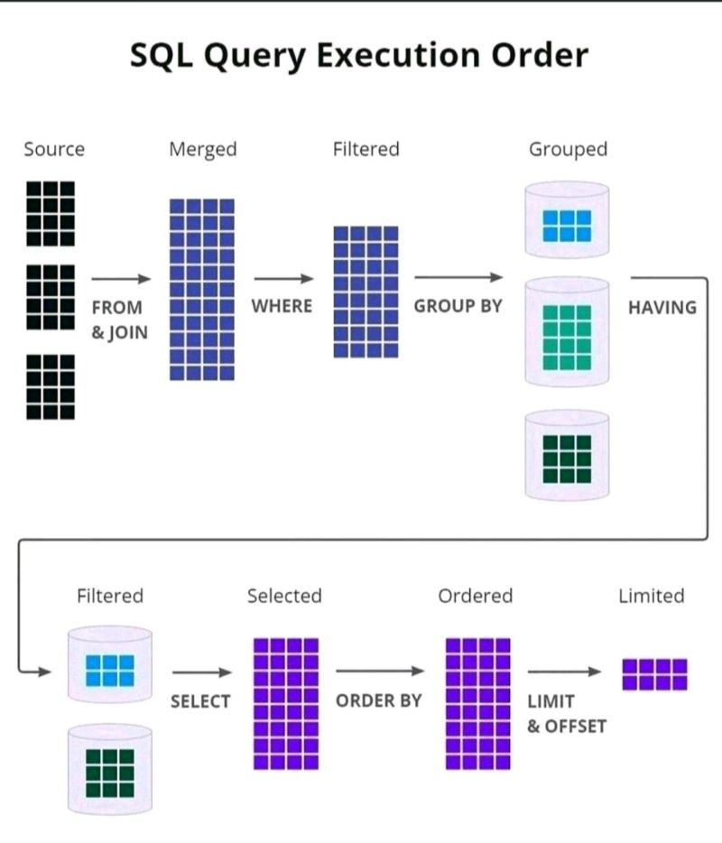

## SQL

SQL:

Statements in SQL:

DDL -Create, Alter, Drop and Truncate

DML- Select, Insert, Update and delete

DCL – Grant, Revoke

TCL – Commit, Rollback

## ACID Properties

Atomicity: means either successful or not.

Consistency: data should be consistent.

Isolation: ensures that transaction is isolated from other transaction.

Durability: means once a transaction has been committed, it will remain in case of errors or power loss.

## Difference between SQL and No SQL

**SQL**: Data will be in rows and columns , Schema is constant ,vertical scalable.

Ex: MySQL, Oracle ,PostgreSQL

**NO SQL**: Large data, Faster Delivery and data which change frequently.

Ex: Cassandra ,HBase (wide columns)

MongoDB(document)

Redis ,Dynamo( key value)

Infinite Dynamo (graph)

## Difference between my sql vs postgresql

| Sql                                | Postgresql                                  |
|------------------------------------|---------------------------------------------|
| Sql compliant                      | Partial sql compliant                       |
| Read and write operation is faster | When we huge transactions go for postgresql |
| Complex queries, json and xml      | Json , and cascading is supported           |

## Difference between JDBC and Hibernate

| JDBC                                                     | Hibernate                                  |
|----------------------------------------------------------|--------------------------------------------|
| Data base specific                                       | Hibernate is database independent          |
| Does not support caching                                 | Support caching                            |
| Low performance                                          | Better performance                         |
| User is responsible for creating and closing connection. | Hibernate is responsible.                  |
| Does not support lazy loading                            | Supports lazy loading , exception handling |

## Primary Key vs Unique Key

| Primary Key                       | Unique Key                                                       |
|-----------------------------------|------------------------------------------------------------------|
| Used to identify a row in a table | Used to identify a column in a table and it prevents duplicates. |
| One Primary key per table         | Can have more than one unique key per table.                     |
| Cannot accept null                | Can accept only one null value.                                  |
| Cannot be changed or deleted      | Unique key values can be modified.                               |
| It adds a clustered index         | It adds a non-clustered index.                                   |

## Clustered Index vs Non-Clustered Index

| Clustered Index                                                      | Non-Clustered Index                                                                        |
|----------------------------------------------------------------------|--------------------------------------------------------------------------------------------|
| This will arrange the rows physically in the memory in sorted order. | This will not arrange the rows physically in sorted order.                                 |
| This will be fast in searching for the range of values.              | This will be fast in searching for the values that are not in the range.                   |
| Leaf node of clustered index contains table data.                    | Leaf nodes of non-clustered index contains pointers to get the pointers that contain data. |

## Delete, Drop and Truncate

**Delete:**

* It is a DML statement.
* Remove rows one by one.
* We can use "where" condition and delete a particular row.
* DELETE may leave fragmented space that requires additional maintenance to reclaim.

          delete from Student;
          delete from Student where id = 10;

**Drop**

* It is a DDL statement
* Deletes the entire table along with the structure.

           drop table Student;

**Truncate**

* It is a DDL statement.
* It will also delete the rows, but it will delete all the rows at once.
* However, TRUNCATE is generally faster than DELETE because it deallocates the space used by the table and its data in a more efficient way.
      
          truncate table Student;

## Joins

## Aggregate Functions

## SubQuery

## Normalization

* Denormalized data set: All the different type of data is bundled together into a single file or a table.
* Effectively designing a database such that we can avoid data redundancy.
* There is a step-by-step process you need to follow in order to normalize your database

**Different levels of normalization:**
* 1 NF, 2NF, 3NF, 4NF, 5NF, BCNF (Boyce-Codd NF)

**1NF**

* Every column/attribute need to have a single value.
* Each row should be unique.Either through a single or multiple columns. Not mandatory to have primary key.

**2NF**

* Must be in 1NF.
* All non-key attributes must be fully dependent on candidate key  ( for example : Order Number + Product code)
* Every table should have primary key and relationship between the tables should be formed using foreign key.

**3NF**

* Must be in 2NF.
* Avoid Transitive dependencies.

## Indexing

1. How Table data(rows) are actually stored?
2. What type of indexing present?
3. Understanding the data structure used for indexing and how it works?

## Nth highest salary

    select max(salary) from employee where salary < (Select max(salary) from employee where salary)

  (or)

    select max(salary) from employee group by marks order by marks desc limit 1,1;    

  i.e( n-1,1) if 3rd highest(2,1)

  (or)

    select top 1 salary from(select top 3 salary from employee order by desc) order by asc;

## Maximum marks from each department

    CREATE TABLE STUDENT ( ROLL_NO INT PRIMARY KEY, NAME VARCHAR(20));

    INSERT INTO STUDENT VALUES (1,'NIKHIL');

    INSERT INTO STUDENT VALUES (2,'VARUN');

    INSERT INTO STUDENT VALUES (3,'NISHANT');

    INSERT INTO STUDENT VALUES (4,'VISHAL');

    CREATE TABLE MARKS ( ROLL_NO INT, SUBJECT VARCHAR(20), MARKS INT);

    INSERT INTO MARKS VALUES('1','MATHS','92');

    INSERT INTO MARKS VALUES('1','SCIENCE','80');

    INSERT INTO MARKS VALUES('1','ENGLISH','98');

    INSERT INTO MARKS VALUES('1','HINDI','81');

    INSERT INTO MARKS VALUES('2','MATHS','89');

    INSERT INTO MARKS VALUES('2','SCIENCE','100');

    INSERT INTO MARKS VALUES('2','ENGLISH','81');

     select s.ROLL_NO,s.NAME,d.MARKS,d.SUBJECT from STUDENT s join MARKS d

     on s.ROLL_NO=d.ROLL_NO

     where d.marks=(select max(MARKS) from MARKS dd

    group by dd.SUBJECT having dd.SUBJECT =d.SUBJECT)

## Count of employees in each department

    select count(*), dept_name

    from employee

    join department on e.dept_id=d.id

    group by e.dept_id;

## Delete duplicate rows from a table

Using common type element

    With CTE as (Select * ROW NUMBER() OVER(Partition BY first name, last name order by first name, last name) 
    rn from table_name );

    delete from CTE where rn>1;

## 2nd Highest Salary

    SELECT Salary FROM
    (SELECT Salary FROM Employee ORDER BY salary DESC LIMIT 2) AS Emp
    ORDER BY salary LIMIT 1;
