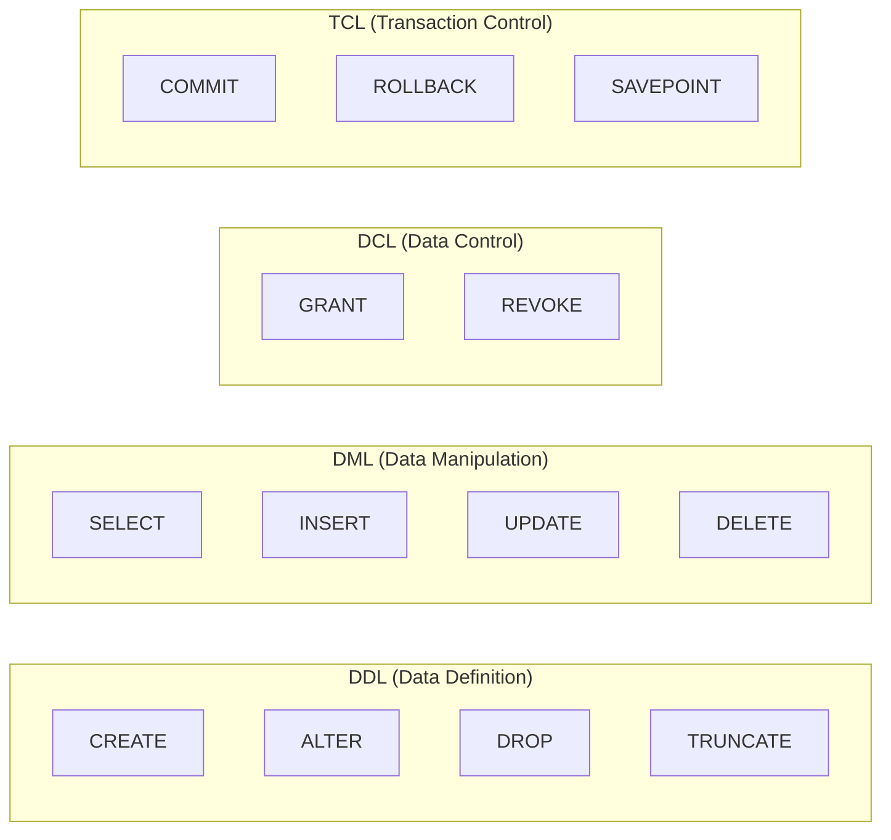
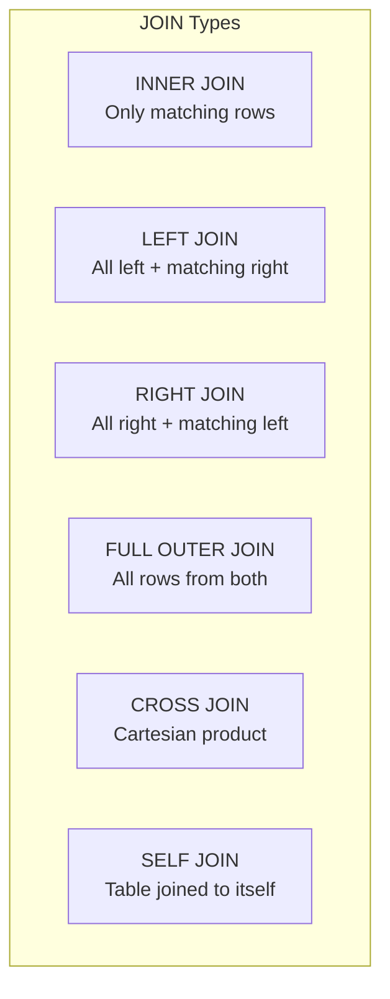
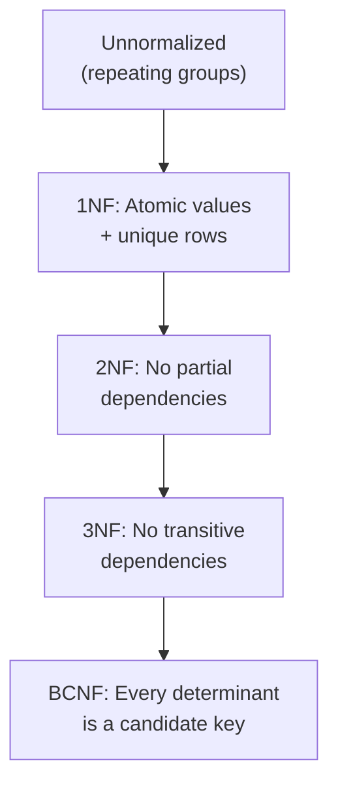
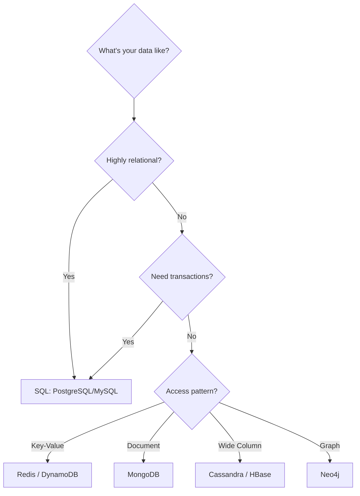

# SQL — The Complete Interview Guide

> SQL is the one skill every backend engineer uses daily but few master. Senior interviews test whether you can write efficient queries, optimize slow ones, and explain why your index strategy works — not just recall syntax.

---

## SQL Statement Categories


```mermaid
flowchart LR
    subgraph DDL["DDL (Data Definition)"]
        CREATE
        ALTER
        DROP
        TRUNCATE
    end
    subgraph DML["DML (Data Manipulation)"]
        SELECT
        INSERT
        UPDATE
        DELETE
    end
    subgraph DCL["DCL (Data Control)"]
        GRANT
        REVOKE
    end
    subgraph TCL["TCL (Transaction Control)"]
        COMMIT
        ROLLBACK
        SAVEPOINT
    end
```

| Category | Commands | Rollback? |
|----------|----------|-----------|
| **DDL** | CREATE, ALTER, DROP, TRUNCATE | No (auto-commit) |
| **DML** | SELECT, INSERT, UPDATE, DELETE | Yes |
| **DCL** | GRANT, REVOKE | No |
| **TCL** | COMMIT, ROLLBACK, SAVEPOINT | Controls rollback |

---

## ACID Properties

Every relational database guarantees ACID for transactions:

| Property | Meaning | What Breaks Without It |
|----------|---------|----------------------|
| **Atomicity** | All operations in a transaction succeed or all fail | Partial transfer: money debited but not credited |
| **Consistency** | Transaction moves DB from one valid state to another | Violated constraints, impossible data states |
| **Isolation** | Concurrent transactions don't interfere | Dirty reads, phantom rows, lost updates |
| **Durability** | Committed data survives crashes | Data loss after power failure |

```sql
-- Atomicity example: bank transfer
BEGIN TRANSACTION;
    UPDATE accounts SET balance = balance - 500 WHERE id = 1;
    UPDATE accounts SET balance = balance + 500 WHERE id = 2;
COMMIT;
-- If either UPDATE fails, both are rolled back
```

### Isolation Levels

| Level | Dirty Read | Non-Repeatable Read | Phantom Read | Performance |
|-------|-----------|--------------------|--------------| ------------|
| READ UNCOMMITTED | Yes | Yes | Yes | Fastest |
| READ COMMITTED | No | Yes | Yes | Default (PostgreSQL, Oracle) |
| REPEATABLE READ | No | No | Yes | Default (MySQL InnoDB) |
| SERIALIZABLE | No | No | No | Slowest |

```sql
-- Set isolation level
SET TRANSACTION ISOLATION LEVEL REPEATABLE READ;
BEGIN;
    SELECT balance FROM accounts WHERE id = 1; -- always returns same value within txn
COMMIT;
```

---

## Joins — Visual Guide


```mermaid
flowchart TD
    subgraph "JOIN Types"
        INNER["INNER JOIN<br/>Only matching rows"]
        LEFT["LEFT JOIN<br/>All left + matching right"]
        RIGHT["RIGHT JOIN<br/>All right + matching left"]
        FULL["FULL OUTER JOIN<br/>All rows from both"]
        CROSS["CROSS JOIN<br/>Cartesian product"]
        SELF["SELF JOIN<br/>Table joined to itself"]
    end
```

**Sample Tables:**

```
┌─────────────────────────────┐     ┌──────────────────────────────┐
│         users               │     │          orders              │
├────┬─────────┬──────────────┤     ├──────────┬───────────┬───────┤
│ id │ name    │ email        │     │ order_id │ product   │user_id│
├────┼─────────┼──────────────┤     ├──────────┼───────────┼───────┤
│ 1  │ Alice   │ alice@g.com  │     │ 101      │ Laptop    │ 1     │
│ 2  │ Bob     │ bob@g.com    │     │ 102      │ Phone     │ 1     │
│ 3  │ Charlie │ charlie@g.com│     │ 103      │ TV        │ 2     │
└────┴─────────┴──────────────┘     │ 104      │ Tablet    │ 4     │
                                    └──────────┴───────────┴───────┘
```

### INNER JOIN

Returns only rows where there's a match in **both** tables.

```sql
SELECT u.name, o.product
FROM users u
INNER JOIN orders o ON u.id = o.user_id;
```

```
Result:                          Venn Diagram:
┌───────┬─────────┐            ┌─────────────────────────┐
│ name  │ product │            │  users  ┌──────┐ orders │
├───────┼─────────┤            │         │██████│        │
│ Alice │ Laptop  │            │         │██████│        │
│ Alice │ Phone   │            │         └──────┘        │
│ Bob   │ TV      │            └─────────────────────────┘
└───────┴─────────┘             Only the intersection
```

### LEFT JOIN

Returns **all** rows from the left table + matching rows from right (NULL if no match).

```sql
SELECT u.name, o.product
FROM users u
LEFT JOIN orders o ON u.id = o.user_id;
```

```
Result:                          Venn Diagram:
┌─────────┬─────────┐          ┌─────────────────────────┐
│ name    │ product │          │  ┌──────────────┐ orders │
├─────────┼─────────┤          │  │██████████████│        │
│ Alice   │ Laptop  │          │  │████users█████│        │
│ Alice   │ Phone   │          │  │██████████████│        │
│ Bob     │ TV      │          │  └──────────────┘        │
│ Charlie │ NULL    │          └─────────────────────────┘
└─────────┴─────────┘           All left + matching right
```

### RIGHT JOIN

Returns **all** rows from the right table + matching rows from left.

```sql
SELECT u.name, o.product
FROM users u
RIGHT JOIN orders o ON u.id = o.user_id;
```

```
Result:
┌───────┬─────────┐
│ name  │ product │
├───────┼─────────┤
│ Alice │ Laptop  │
│ Alice │ Phone   │
│ Bob   │ TV      │
│ NULL  │ Tablet  │  ← user_id=4 doesn't exist in users
└───────┴─────────┘
```

### FULL OUTER JOIN

Returns **all** rows from both tables (NULL where no match exists).

```sql
SELECT u.name, o.product
FROM users u
FULL OUTER JOIN orders o ON u.id = o.user_id;
```

```
Result:
┌─────────┬─────────┐
│ name    │ product │
├─────────┼─────────┤
│ Alice   │ Laptop  │
│ Alice   │ Phone   │
│ Bob     │ TV      │
│ Charlie │ NULL    │  ← no orders
│ NULL    │ Tablet  │  ← no matching user
└─────────┴─────────┘
```

### CROSS JOIN

Returns **every combination** of rows (Cartesian product). Rarely used intentionally.

```sql
SELECT u.name, o.product
FROM users u CROSS JOIN orders o;
-- Result: 3 users × 4 orders = 12 rows
```

### SELF JOIN

A table joined to itself — used for hierarchical data.

```sql
-- Find each employee's manager
SELECT e.name AS employee, m.name AS manager
FROM employees e
LEFT JOIN employees m ON e.manager_id = m.id;
```

---

## Window Functions

Window functions perform calculations across a set of rows **related to the current row** without collapsing them (unlike GROUP BY).

```sql
-- Syntax
function_name() OVER (
    PARTITION BY column     -- groups (like GROUP BY, but keeps rows)
    ORDER BY column         -- sort within partition
    ROWS/RANGE frame       -- which rows to include
)
```

### ROW_NUMBER, RANK, DENSE_RANK

```sql
SELECT name, department, salary,
    ROW_NUMBER() OVER (PARTITION BY department ORDER BY salary DESC) as row_num,
    RANK()       OVER (PARTITION BY department ORDER BY salary DESC) as rank,
    DENSE_RANK() OVER (PARTITION BY department ORDER BY salary DESC) as dense_rank
FROM employees;
```

```
┌───────┬────────┬────────┬─────────┬──────┬────────────┐
│ name  │ dept   │ salary │ row_num │ rank │ dense_rank │
├───────┼────────┼────────┼─────────┼──────┼────────────┤
│ Alice │ Eng    │ 150000 │ 1       │ 1    │ 1          │
│ Bob   │ Eng    │ 150000 │ 2       │ 1    │ 1          │  ← tie
│ Carol │ Eng    │ 130000 │ 3       │ 3    │ 2          │  ← rank skips, dense doesn't
│ Dave  │ Sales  │ 120000 │ 1       │ 1    │ 1          │
└───────┴────────┴────────┴─────────┴──────┴────────────┘
```

| Function | Ties | Gaps |
|----------|------|------|
| ROW_NUMBER | Arbitrary order for ties | No gaps (1,2,3,4) |
| RANK | Same rank for ties | Gaps after ties (1,1,3,4) |
| DENSE_RANK | Same rank for ties | No gaps (1,1,2,3) |

### LAG / LEAD

Access previous or next row values without self-join:

```sql
SELECT date, revenue,
    LAG(revenue, 1) OVER (ORDER BY date) as prev_day,
    revenue - LAG(revenue, 1) OVER (ORDER BY date) as daily_change,
    LEAD(revenue, 1) OVER (ORDER BY date) as next_day
FROM daily_sales;
```

### Running Total / Moving Average

```sql
SELECT date, amount,
    SUM(amount) OVER (ORDER BY date ROWS UNBOUNDED PRECEDING) as running_total,
    AVG(amount) OVER (ORDER BY date ROWS BETWEEN 6 PRECEDING AND CURRENT ROW) as moving_avg_7d
FROM transactions;
```

### NTILE — Percentile Buckets

```sql
-- Divide employees into salary quartiles
SELECT name, salary,
    NTILE(4) OVER (ORDER BY salary) as quartile
FROM employees;
```

---

## Subqueries & CTEs

### Subquery Types

| Type | Location | Returns |
|------|----------|---------|
| **Scalar** | SELECT, WHERE | Single value |
| **Row** | WHERE | Single row |
| **Table** | FROM | Result set |
| **Correlated** | WHERE | References outer query |

```sql
-- Scalar subquery: employees earning above average
SELECT name, salary
FROM employees
WHERE salary > (SELECT AVG(salary) FROM employees);

-- Correlated subquery: employees earning above their department average
SELECT name, salary, department
FROM employees e
WHERE salary > (
    SELECT AVG(salary)
    FROM employees
    WHERE department = e.department  -- references outer query
);

-- EXISTS: more efficient than IN for large subquery results
SELECT name FROM customers c
WHERE EXISTS (
    SELECT 1 FROM orders WHERE customer_id = c.id AND total > 1000
);
```

### Common Table Expressions (CTEs)

```sql
-- Readable alternative to nested subqueries
WITH high_value_orders AS (
    SELECT customer_id, SUM(total) as total_spent
    FROM orders
    WHERE order_date >= '2025-01-01'
    GROUP BY customer_id
    HAVING SUM(total) > 10000
),
customer_details AS (
    SELECT c.id, c.name, c.tier
    FROM customers c
    JOIN high_value_orders h ON c.id = h.customer_id
)
SELECT * FROM customer_details WHERE tier != 'ENTERPRISE';
```

### Recursive CTE — Hierarchical Data

```sql
-- Org chart: find all reports under a manager
WITH RECURSIVE org_tree AS (
    -- Base case
    SELECT id, name, manager_id, 1 as depth
    FROM employees WHERE id = 1  -- CEO
    
    UNION ALL
    
    -- Recursive case
    SELECT e.id, e.name, e.manager_id, ot.depth + 1
    FROM employees e
    JOIN org_tree ot ON e.manager_id = ot.id
    WHERE ot.depth < 10  -- safety limit
)
SELECT * FROM org_tree ORDER BY depth, name;
```

---

## Indexing Deep Dive

### How Indexes Work — B+ Tree

```
                        ┌───────────────┐
                        │   [30 | 60]   │          ← Root node
                        └───┬───┬───┬───┘
                           ╱    │    ╲
              ┌────────────┐ ┌────────────┐ ┌────────────┐
              │ [10|20|30] │ │ [40|50|60] │ │ [70|80|90] │  ← Internal nodes
              └──┬──┬──┬───┘ └──┬──┬──┬───┘ └──┬──┬──┬───┘
                ╱   │   ╲      ╱   │   ╲      ╱   │   ╲
            ┌──┐ ┌──┐ ┌──┐ ┌──┐ ┌──┐ ┌──┐ ┌──┐ ┌──┐ ┌──┐
            │10│→│20│→│30│→│40│→│50│→│60│→│70│→│80│→│90│  ← Leaf nodes (data)
            └──┘ └──┘ └──┘ └──┘ └──┘ └──┘ └──┘ └──┘ └──┘
                        Linked list for range scans →→→
```

**Why B+ Tree?**

- Balanced: every leaf is at the same depth → O(log n) lookups
- Leaf nodes linked: efficient range scans (`BETWEEN`, `ORDER BY`)
- High fan-out: few disk reads to reach any record (3-4 levels for millions of rows)

### Clustered vs Non-Clustered Index

| | Clustered Index | Non-Clustered Index |
|---|---|---|
| **Physical order** | Rows stored in index order | Separate structure pointing to rows |
| **Per table** | Only ONE (usually Primary Key) | Many allowed |
| **Leaf nodes** | Contain actual row data | Contain pointers to row data |
| **Best for** | Range queries, sequential access | Point lookups, covering queries |
| **Analogy** | Book pages in order (Table of Contents IS the book) | Back-of-book index (pointer to page numbers) |

```sql
-- Clustered index (implicit on PRIMARY KEY in most DBs)
CREATE TABLE orders (
    id BIGINT PRIMARY KEY,  -- clustered index on id
    customer_id INT,
    total DECIMAL(10,2),
    created_at TIMESTAMP
);

-- Non-clustered indexes
CREATE INDEX idx_customer ON orders(customer_id);
CREATE INDEX idx_created ON orders(created_at);
```

### Composite Index & the Leftmost Prefix Rule

```sql
CREATE INDEX idx_composite ON orders(customer_id, created_at, status);

-- ✅ Uses index (leftmost prefix)
WHERE customer_id = 42
WHERE customer_id = 42 AND created_at > '2025-01-01'
WHERE customer_id = 42 AND created_at > '2025-01-01' AND status = 'SHIPPED'

-- ❌ Cannot use index (skips leftmost column)
WHERE created_at > '2025-01-01'
WHERE status = 'SHIPPED'
WHERE created_at > '2025-01-01' AND status = 'SHIPPED'
```

### Covering Index

When an index contains ALL columns needed for a query — no table lookup required:

```sql
CREATE INDEX idx_covering ON orders(customer_id, created_at, total);

-- Index-only scan (no table access needed)
SELECT customer_id, created_at, total
FROM orders
WHERE customer_id = 42 AND created_at > '2025-01-01';
```

### When NOT to Index

| Scenario | Why |
|----------|-----|
| Small tables (<1000 rows) | Full scan is faster than index lookup |
| Columns with low cardinality | Boolean, status with 3 values — index scan hits most rows anyway |
| Write-heavy tables | Every INSERT/UPDATE must update all indexes |
| Columns rarely in WHERE/JOIN | Index takes space but never gets used |

---

## Query Optimization

### Reading EXPLAIN Plans

```sql
EXPLAIN ANALYZE
SELECT u.name, COUNT(o.id), SUM(o.total)
FROM users u
JOIN orders o ON u.id = o.user_id
WHERE u.status = 'active' AND o.created_at > '2025-01-01'
GROUP BY u.name
ORDER BY SUM(o.total) DESC
LIMIT 100;
```

**Key things to look for:**

| EXPLAIN Term | Meaning | Good/Bad |
|-------------|---------|----------|
| Seq Scan | Reading every row | Bad on large tables |
| Index Scan | Using index to find rows | Good |
| Index Only Scan | All data from index | Best |
| Bitmap Index Scan | Combines multiple indexes | Good for OR conditions |
| Hash Join | Hash table for joins | Good for large joins |
| Nested Loop | Loop per row | Good for small result sets |
| Sort | Sorting in memory/disk | Check if index can avoid |
| Rows (estimated vs actual) | | Large gap = stale statistics |

### Optimization Checklist

```sql
-- BEFORE: 30 seconds
SELECT u.name, COUNT(o.id), SUM(o.total)
FROM users u
LEFT JOIN orders o ON u.id = o.user_id
WHERE o.created_at > '2025-01-01'
AND u.status = 'active'
GROUP BY u.name
ORDER BY SUM(o.total) DESC
LIMIT 100;

-- Problems:
-- 1. LEFT JOIN + WHERE on right table = effectively INNER JOIN (confusing optimizer)
-- 2. No index on orders(user_id, created_at)
-- 3. No index on users(status)
-- 4. GROUP BY on name (not unique) instead of PK

-- AFTER: 50ms
-- Step 1: Add indexes
CREATE INDEX idx_orders_user_date ON orders(user_id, created_at);
CREATE INDEX idx_users_status ON users(status) INCLUDE (name);

-- Step 2: Fix the query
SELECT u.name, COUNT(o.id), SUM(o.total)
FROM users u
INNER JOIN orders o ON u.id = o.user_id  -- LEFT→INNER (WHERE already filters NULLs)
WHERE u.status = 'active'
AND o.created_at > '2025-01-01'
GROUP BY u.id, u.name  -- PK in GROUP BY helps optimizer
ORDER BY SUM(o.total) DESC
LIMIT 100;
```

### Common Optimization Patterns

| Problem | Solution |
|---------|----------|
| `SELECT *` | Select only needed columns |
| `WHERE function(column)` | Rewrite so column is bare: `WHERE column > DATE_SUB(NOW(), INTERVAL 7 DAY)` |
| `LIKE '%search%'` | Full-text index or search engine (Elasticsearch) |
| `OR` conditions | UNION ALL or bitmap indexes |
| Correlated subquery | Rewrite as JOIN |
| `ORDER BY` + `LIMIT` without index | Add index matching ORDER BY |
| N+1 queries (ORM) | JOIN or batch fetch |

---

## Normalization

### Normal Forms — Quick Reference


```mermaid
flowchart TD
    UNF["Unnormalized<br/>(repeating groups)"]
    NF1["1NF: Atomic values<br/> + unique rows"]
    NF2["2NF: No partial<br/>dependencies"]
    NF3["3NF: No transitive<br/>dependencies"]
    BCNF["BCNF: Every determinant<br/>is a candidate key"]
    
    UNF --> NF1 --> NF2 --> NF3 --> BCNF
```

| Form | Rule | Violation Example |
|------|------|-------------------|
| **1NF** | Atomic values, unique rows | `skills = "Java, Python"` in one cell |
| **2NF** | No partial dependency on composite key | `{student_id, course_id} → teacher_name` (depends only on course_id) |
| **3NF** | No transitive dependency | `employee → department → department_location` |
| **BCNF** | Every determinant is a candidate key | Edge case of 3NF with overlapping keys |

```sql
-- Violation of 2NF:
-- order_items(order_id, product_id, product_name, quantity)
-- product_name depends only on product_id, not the full key

-- Fix: separate table
-- order_items(order_id, product_id, quantity)
-- products(product_id, product_name)
```

**When to denormalize:**

- Read-heavy workloads where JOINs are expensive
- Reporting/analytics (star schema)
- Caching computed values (materialized views)
- Microservice boundaries (each service owns its data)

---

## Transactions & Locking

### Lock Types

| Lock | Compatibility | Use Case |
|------|--------------|----------|
| **Shared (S)** | Multiple readers OK | SELECT ... FOR SHARE |
| **Exclusive (X)** | Blocks all others | UPDATE, DELETE, SELECT FOR UPDATE |
| **Row-level** | Only locks affected rows | InnoDB default |
| **Table-level** | Locks entire table | MyISAM, DDL operations |

### Deadlock Example & Prevention

```sql
-- Transaction 1:
BEGIN;
UPDATE accounts SET balance = balance - 100 WHERE id = 1;  -- locks row 1
UPDATE accounts SET balance = balance + 100 WHERE id = 2;  -- waits for row 2

-- Transaction 2 (concurrent):
BEGIN;
UPDATE accounts SET balance = balance - 50 WHERE id = 2;   -- locks row 2
UPDATE accounts SET balance = balance + 50 WHERE id = 1;   -- waits for row 1
-- DEADLOCK!
```

**Prevention:** Always acquire locks in consistent order (by primary key).

```sql
-- Fix: both transactions lock lower ID first
BEGIN;
UPDATE accounts SET balance = balance - 100 WHERE id = 1;  -- always lock 1 first
UPDATE accounts SET balance = balance + 100 WHERE id = 2;  -- then lock 2
COMMIT;
```

---

## Advanced Patterns

### Pagination — Offset vs Cursor

```sql
-- OFFSET pagination (simple but slow for deep pages)
SELECT * FROM posts ORDER BY created_at DESC LIMIT 20 OFFSET 10000;
-- Problem: DB must scan and discard 10,000 rows

-- CURSOR pagination (fast regardless of page depth)
SELECT * FROM posts
WHERE created_at < '2025-03-15T10:30:00'  -- cursor from last item
ORDER BY created_at DESC
LIMIT 20;
-- Only reads 20 rows using index on created_at
```

### Upsert (INSERT or UPDATE)

```sql
-- PostgreSQL
INSERT INTO metrics (key, value, updated_at)
VALUES ('page_views', 1, NOW())
ON CONFLICT (key)
DO UPDATE SET value = metrics.value + 1, updated_at = NOW();

-- MySQL
INSERT INTO metrics (key, value, updated_at)
VALUES ('page_views', 1, NOW())
ON DUPLICATE KEY UPDATE value = value + 1, updated_at = NOW();
```

### Soft Delete

```sql
-- Never actually delete — mark as deleted
ALTER TABLE users ADD COLUMN deleted_at TIMESTAMP NULL;

-- "Delete" a user
UPDATE users SET deleted_at = NOW() WHERE id = 42;

-- All queries filter deleted rows
SELECT * FROM users WHERE deleted_at IS NULL;

-- Partial index for performance (PostgreSQL)
CREATE INDEX idx_active_users ON users(email) WHERE deleted_at IS NULL;
```

### Optimistic Locking (Version Column)

```sql
-- Read current version
SELECT id, name, version FROM products WHERE id = 1;
-- Returns: {id: 1, name: "Widget", version: 5}

-- Update only if version matches (no one else changed it)
UPDATE products
SET name = 'Super Widget', version = version + 1
WHERE id = 1 AND version = 5;

-- If 0 rows affected: someone else modified it → retry or error
```

---

## SQL vs NoSQL — When to Choose What

| Factor | SQL (Relational) | NoSQL |
|--------|-----------------|-------|
| **Schema** | Fixed, enforced | Flexible, schema-on-read |
| **Scaling** | Vertical (bigger machine) | Horizontal (more machines) |
| **Transactions** | Full ACID | Usually eventual consistency |
| **Query power** | Complex JOINs, aggregations | Simple key-value or document queries |
| **Best for** | Financial, relational data | High throughput, unstructured data |
| **Examples** | PostgreSQL, MySQL, Oracle | MongoDB, Cassandra, DynamoDB, Redis |


```mermaid
flowchart TD
    A{What's your data like?} --> B{Highly relational?}
    B -->|Yes| C[SQL: PostgreSQL/MySQL]
    B -->|No| D{Need transactions?}
    D -->|Yes| C
    D -->|No| E{Access pattern?}
    E -->|Key-Value| F[Redis / DynamoDB]
    E -->|Document| G[MongoDB]
    E -->|Wide Column| H[Cassandra / HBase]
    E -->|Graph| I[Neo4j]
```

### PostgreSQL vs MySQL

| Feature | PostgreSQL | MySQL |
|---------|-----------|-------|
| SQL compliance | Full | Partial |
| JSON support | Native JSONB (indexable) | JSON type (limited) |
| Window functions | Full support | Full (since 8.0) |
| CTEs | Recursive + materialized | Recursive (since 8.0) |
| Concurrency | MVCC (no read locks) | MVCC (InnoDB) |
| Extensions | PostGIS, pg_trgm, hstore | Limited |
| Replication | Logical + streaming | Binary log |
| Best for | Complex queries, analytics | Web apps, read-heavy |

---

## Delete vs Truncate vs Drop

| | DELETE | TRUNCATE | DROP |
|---|--------|----------|------|
| **Type** | DML | DDL | DDL |
| **What it removes** | Rows (with WHERE) | All rows | Entire table + structure |
| **Rollback?** | Yes | No (auto-commit) | No (auto-commit) |
| **Triggers fire?** | Yes | No | No |
| **Speed** | Slow (row by row) | Fast (deallocates pages) | Instant |
| **Identity reset?** | No | Yes | N/A |
| **WHERE clause?** | Yes | No | No |

---

## Interview Scenarios

??? question "Find the Nth highest salary without LIMIT"
    ```sql
    -- Using DENSE_RANK (handles ties correctly)
    SELECT DISTINCT salary
    FROM (
        SELECT salary, DENSE_RANK() OVER (ORDER BY salary DESC) as rnk
        FROM employees
    ) ranked
    WHERE rnk = 3;  -- 3rd highest

    -- Using correlated subquery
    SELECT DISTINCT salary
    FROM employees e1
    WHERE 3 - 1 = (
        SELECT COUNT(DISTINCT salary)
        FROM employees e2
        WHERE e2.salary > e1.salary
    );
    ```

??? question "Find and delete duplicate rows (keep one)"
    ```sql
    -- Find duplicates
    SELECT email, COUNT(*) FROM users GROUP BY email HAVING COUNT(*) > 1;

    -- Delete duplicates (PostgreSQL — keep lowest ID)
    WITH duplicates AS (
        SELECT id, ROW_NUMBER() OVER (PARTITION BY email ORDER BY id) as rn
        FROM users
    )
    DELETE FROM users WHERE id IN (SELECT id FROM duplicates WHERE rn > 1);

    -- MySQL alternative (doesn't support DELETE with CTE easily)
    DELETE u1 FROM users u1
    INNER JOIN users u2
    ON u1.email = u2.email AND u1.id > u2.id;
    ```

??? question "Employees earning more than their manager"
    ```sql
    SELECT e.name AS employee, e.salary, m.name AS manager, m.salary AS mgr_salary
    FROM employees e
    JOIN employees m ON e.manager_id = m.id
    WHERE e.salary > m.salary;
    ```

??? question "Running total of sales by month"
    ```sql
    SELECT
        DATE_TRUNC('month', order_date) as month,
        SUM(total) as monthly_sales,
        SUM(SUM(total)) OVER (ORDER BY DATE_TRUNC('month', order_date)) as running_total
    FROM orders
    GROUP BY DATE_TRUNC('month', order_date)
    ORDER BY month;
    ```

??? question "Find departments where average salary exceeds company average"
    ```sql
    SELECT department, AVG(salary) as dept_avg
    FROM employees
    GROUP BY department
    HAVING AVG(salary) > (SELECT AVG(salary) FROM employees);
    ```

??? question "Consecutive login days (gaps and islands)"
    ```sql
    WITH login_groups AS (
        SELECT user_id, login_date,
            login_date - ROW_NUMBER() OVER (
                PARTITION BY user_id ORDER BY login_date
            ) * INTERVAL '1 day' AS grp
        FROM logins
    )
    SELECT user_id, MIN(login_date) as streak_start,
           MAX(login_date) as streak_end,
           COUNT(*) as consecutive_days
    FROM login_groups
    GROUP BY user_id, grp
    HAVING COUNT(*) >= 7;  -- users with 7+ day streaks
    ```

??? question "Top 3 products per category by revenue"
    ```sql
    WITH ranked AS (
        SELECT category, product_name, SUM(revenue) as total_revenue,
            ROW_NUMBER() OVER (PARTITION BY category ORDER BY SUM(revenue) DESC) as rn
        FROM sales
        GROUP BY category, product_name
    )
    SELECT category, product_name, total_revenue
    FROM ranked WHERE rn <= 3;
    ```

??? question "Year-over-year growth percentage"
    ```sql
    WITH yearly AS (
        SELECT EXTRACT(YEAR FROM order_date) as year,
               SUM(total) as revenue
        FROM orders GROUP BY 1
    )
    SELECT year, revenue,
        LAG(revenue) OVER (ORDER BY year) as prev_year,
        ROUND((revenue - LAG(revenue) OVER (ORDER BY year))
            / LAG(revenue) OVER (ORDER BY year) * 100, 1) as yoy_growth_pct
    FROM yearly;
    ```

??? question "Pivot table: monthly sales by product"
    ```sql
    -- PostgreSQL with FILTER
    SELECT product,
        SUM(amount) FILTER (WHERE EXTRACT(MONTH FROM sale_date) = 1) as jan,
        SUM(amount) FILTER (WHERE EXTRACT(MONTH FROM sale_date) = 2) as feb,
        SUM(amount) FILTER (WHERE EXTRACT(MONTH FROM sale_date) = 3) as mar
    FROM sales
    WHERE EXTRACT(YEAR FROM sale_date) = 2025
    GROUP BY product;

    -- MySQL with CASE
    SELECT product,
        SUM(CASE WHEN MONTH(sale_date) = 1 THEN amount END) as jan,
        SUM(CASE WHEN MONTH(sale_date) = 2 THEN amount END) as feb,
        SUM(CASE WHEN MONTH(sale_date) = 3 THEN amount END) as mar
    FROM sales
    WHERE YEAR(sale_date) = 2025
    GROUP BY product;
    ```

??? question "Median salary per department"
    ```sql
    -- PostgreSQL (has PERCENTILE_CONT)
    SELECT department,
        PERCENTILE_CONT(0.5) WITHIN GROUP (ORDER BY salary) as median_salary
    FROM employees
    GROUP BY department;

    -- MySQL (workaround with window functions)
    WITH ranked AS (
        SELECT department, salary,
            ROW_NUMBER() OVER (PARTITION BY department ORDER BY salary) as rn,
            COUNT(*) OVER (PARTITION BY department) as cnt
        FROM employees
    )
    SELECT department, AVG(salary) as median_salary
    FROM ranked
    WHERE rn IN (FLOOR((cnt + 1) / 2.0), CEIL((cnt + 1) / 2.0))
    GROUP BY department;
    ```

---

## Frequently Asked Questions

??? question "What are the most important SQL concepts for senior engineer interviews?"
    Senior interviews focus on: window functions (ROW_NUMBER, RANK, LAG/LEAD), query optimization with EXPLAIN plans, indexing strategy (composite indexes, covering indexes, B+ tree internals), transaction isolation levels, deadlock prevention, and scenario questions involving CTEs, recursive queries, and performance tuning. Writing correct JOINs is baseline — optimization is what separates senior from mid-level.

??? question "How do you optimize a slow SQL query step by step?"
    1. Run EXPLAIN ANALYZE to see the actual execution plan. 2. Look for sequential scans on large tables — add indexes. 3. Check if WHERE conditions can use existing indexes (leftmost prefix rule). 4. Replace correlated subqueries with JOINs. 5. Ensure statistics are up to date (ANALYZE table). 6. Consider covering indexes to avoid table lookups. 7. For pagination, use cursor-based instead of OFFSET. 8. Monitor with pg_stat_statements or slow query log.

??? question "When should you use a CTE vs a subquery vs a temporary table?"
    **CTE**: Best for readability, recursive queries, and when the same result is referenced multiple times in one query. **Subquery**: Fine for simple one-off filtering in WHERE/FROM. **Temporary table**: When you need to index intermediate results, or when the intermediate result is used across multiple statements in a transaction. CTEs in PostgreSQL 12+ are automatically inlined (optimized), so performance is usually equivalent to subqueries.
