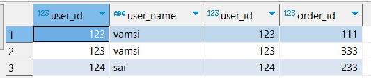
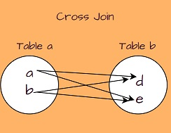

## SQL

SQL:

Statements in SQL:

DDL -Create, Alter, Drop and Truncate

DML- Select, Insert, Update and delete

DCL – Grant, Revoke

TCL – Commit, Rollback

## ACID Properties

Atomicity: means either successful or not.

Consistency: data should be consistent.

Isolation: ensures that transaction is isolated from other transaction.

Durability: means once a transaction has been committed, it will remain in case of errors or power loss.

## Difference between SQL and No SQL

**SQL**: Data will be in rows and columns , Schema is constant ,vertical scalable.

Ex: MySQL, Oracle ,PostgreSQL

**NO SQL**: Large data, Faster Delivery and data which change frequently.

Ex: Cassandra ,HBase (wide columns)

MongoDB(document)

Redis ,Dynamo( key value)

Infinite Dynamo (graph)

## Difference between my sql vs postgresql

| Sql                                | Postgresql                                  |
|------------------------------------|---------------------------------------------|
| Sql compliant                      | Partial sql compliant                       |
| Read and write operation is faster | When we huge transactions go for postgresql |
| Complex queries, json and xml      | Json , and cascading is supported           |

## Difference between JDBC and Hibernate

| JDBC                                                     | Hibernate                                  |
|----------------------------------------------------------|--------------------------------------------|
| Data base specific                                       | Hibernate is database independent          |
| Does not support caching                                 | Support caching                            |
| Low performance                                          | Better performance                         |
| User is responsible for creating and closing connection. | Hibernate is responsible.                  |
| Does not support lazy loading                            | Supports lazy loading , exception handling |

## Primary Key vs Unique Key

| Primary Key                       | Unique Key                                                       |
|-----------------------------------|------------------------------------------------------------------|
| Used to identify a row in a table | Used to identify a column in a table and it prevents duplicates. |
| One Primary key per table         | Can have more than one unique key per table.                     |
| Cannot accept null                | Can accept only one null value.                                  |
| Cannot be changed or deleted      | Unique key values can be modified.                               |
| It adds a clustered index         | It adds a non-clustered index.                                   |

## Clustered Index vs Non-Clustered Index

| Clustered Index                                                      | Non-Clustered Index                                                                        |
|----------------------------------------------------------------------|--------------------------------------------------------------------------------------------|
| This will arrange the rows physically in the memory in sorted order. | This will not arrange the rows physically in sorted order.                                 |
| This will be fast in searching for the range of values.              | This will be fast in searching for the values that are not in the range.                   |
| Leaf node of clustered index contains table data.                    | Leaf nodes of non-clustered index contains pointers to get the pointers that contain data. |


## Delete, Drop and Truncate


**Delete:**

* It is a DML statement.
* Remove rows one by one.
* We can use "where" condition and delete a particular row.
* DELETE may leave fragmented space that requires additional maintenance to reclaim.

```sql
          delete from Student;
```          

```sql          
          delete from Student where id = 10;
``` 
**Drop**

* It is a DDL statement
* Deletes the entire table along with the structure.

``` sql
           drop table Student;
```

**Truncate**

* It is a DDL statement.
* It will also delete the rows, but it will delete all the rows at once.
* However, TRUNCATE is generally faster than DELETE because it deallocates the space used by the table and its data in a more efficient way.
      
          truncate table Student;


## Joins


**Self Join**

* It is a type of join operation where a table is joined with itself.
* It is used when you want to combine rows from the same table based on a related column.
* To perform a self join, you need to use table aliases to create two or more refernces to the same table within the SQL query.

```sql

      select id 
      from emp e1 inner join emp e2
      on t1.name = t2.name
      where salary > 50000;
```
ex: SQL Query to retrieve name of all the employees who are also manager from employee table.

     select distinct name 
     from employee e1 join employee e2
     on e1.id = e2.manager_id;


**Natural Join**

       select u.user_id, u.user_name, o.user_id,o.order_id 
       from user_table  u 
       natural join order_table o



**Inner Join**

       select u.user_id, u.user_name, o.user_id,o.order_id 
       from user_table  u 
       inner join order_table o 
       on u.user_id = o.user_id


**Cross Join**



      select * from engfiledetails e cross join iedinstance i 


JOIN:

JOIN is a keyword used to combine rows from two or more tables based on a related column.
The JOIN operation is not restricted to any specific type, so it might refer to different types of joins, including INNER JOIN, LEFT JOIN, RIGHT JOIN, or FULL JOIN. If the type of join is not specified, the default is usually an INNER JOIN.
INNER JOIN:

INNER JOIN is the most common type of join. It returns only the rows where there is a match in both tables based on the specified condition.
The syntax for INNER JOIN is as follows:
sql
Copy code
SELECT *
FROM table1
INNER JOIN table2 ON table1.column_name = table2.column_name;
NATURAL JOIN:

NATURAL JOIN is a type of join that automatically matches the columns with the same name in both tables.
The syntax for NATURAL JOIN is simpler than that of INNER JOIN because it doesn't require specifying the columns to join on. However, it can be less explicit and might lead to unexpected results if the table structures change.
sql
Copy code
SELECT *
FROM table1
NATURAL JOIN table2;
Example:
Consider two tables, employees and departments, with a common column department_id.

Using INNER JOIN:

sql
Copy code
SELECT *
FROM employees
INNER JOIN departments ON employees.department_id = departments.department_id;
Using NATURAL JOIN:

sql
Copy code
SELECT *
FROM employees
NATURAL JOIN departments;
It's essential to carefully choose the type of join based on the specific requirements of your query and the relationship between the tables. While INNER JOIN and NATURAL JOIN can be convenient, they have their advantages and disadvantages, and understanding their behavior is crucial for writing efficient and accurate SQL queries


## Join vs Union

JOIN:

The JOIN operation is used to combine rows from two or more tables based on a related column between them.
It is employed when you want to retrieve data from multiple tables based on a common condition or relationship.
There are different types of joins, including INNER JOIN, LEFT JOIN, RIGHT JOIN, and FULL JOIN, each with its specific behavior.
Example of INNER JOIN:

sql
Copy code
SELECT *
FROM table1
INNER JOIN table2 ON table1.column_name = table2.column_name;
UNION:

The UNION operation is used to combine the result sets of two or more SELECT statements into a single result set.
It is employed when you want to combine rows from different tables or queries that have similar structures.
The columns in the SELECT statements being unioned must have the same data types in corresponding positions.
Duplicate rows are automatically eliminated in the result set unless UNION ALL is used.
Example of UNION:

sql
Copy code
SELECT column1, column2
FROM table1
UNION
SELECT column1, column2
FROM table2;
Key differences:

JOIN is used to retrieve data from multiple tables based on a common condition, while UNION is used to combine the results of two or more SELECT statements.
JOIN operates on rows, combining columns from different tables based on a specified condition, while UNION operates on columns, combining rows from different SELECT statements with similar structures.
The result of a JOIN is a single table containing columns from both tables, while the result of a UNION is a single table with rows from the combined result sets.


## WHERE VS HAVING

SELECT product, region, SUM(total_sales) as total
FROM sales
WHERE sales_date >= '2022-01-01' AND sales_date <= '2022-12-31'
GROUP BY product, region
HAVING SUM(total_sales) > 1000;


## Aggregate Functions


## SubQuery

## Normalization

* Denormalized data set: All the different type of data is bundled together into a single file or a table.
* Effectively designing a database such that we can avoid data redundancy.
* There is a step-by-step process you need to follow in order to normalize your database

**Different levels of normalization:**
* 1 NF, 2NF, 3NF, 4NF, 5NF, BCNF (Boyce-Codd NF)

**1NF**

* Every column/attribute need to have a single value.
* Each row should be unique.Either through a single or multiple columns. Not mandatory to have primary key.

**2NF**

* Must be in 1NF.
* All non-key attributes must be fully dependent on candidate key  ( for example : Order Number + Product code)
* Every table should have primary key and relationship between the tables should be formed using foreign key.

**3NF**

* Must be in 2NF.
* Avoid Transitive dependencies.


## Indexing

1. How Table data(rows) are actually stored?
2. What type of indexing present?
3. Understanding the data structure used for indexing and how it works?


## Nth highest salary


``` sql

      create table empsalary( id  int ,  salary int);
      insert into empsalary values(1,1000);
      insert into empsalary values(2,1000);
      insert into empsalary  values(3,10000);
```

Using max function:

     select max(salary) from empsalary where salary < 
     (select max(salary) from empsalary)

Using Limit:

    SELECT * from empsalary e ORDER BY salary DESC limit 1,1; -->( for my sql 2nd highest salary)

     SELECT * FROM empsalary e ORDER BY salary DESC OFFSET 2 LIMIT 1; (in postgres)

Without using Limit:

    select distinct(salary) from empsalary e where n-1 =
    (select count(salary) from empsalary e2  where e2.salary > e.salary)

for second highest it is 2-1 = where 1 = (select count(salary) from empsalary e2  where e2.salary > e.salary)
    
Using dense_rank:

    select distinct(salary) from (select salary, dense_rank() 
    over(order by salary desc) as salary_rank from empsalary) as temp where salary_rank = 2

Using not in:

     select max(salary) from empsalary e where salary 
     not in (select max(salary) from empsalary e )


## Duplicate rows in a table

    select salary , count(*) from empsalary e group by salary having count(*)>1

## Delete duplicate rows from a table

    delete from empsalary where salary  in 
    (select salary from (select salary , count(*) from empsalary e group by salary having count(*)>1 ) as temp)


## Maximum marks from each department

     select s.ROLL_NO,s.NAME,d.MARKS,d.SUBJECT from STUDENT s join MARKS d

     on s.ROLL_NO=d.ROLL_NO

     where d.marks=(select max(MARKS) from MARKS dd

    group by dd.SUBJECT having dd.SUBJECT =d.SUBJECT)

## Count of employees in each department

    select count(*), dept_name

    from employee

    join department on e.dept_id=d.id

    group by e.dept_id;


## Stored Procedure

* 