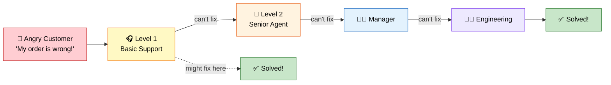
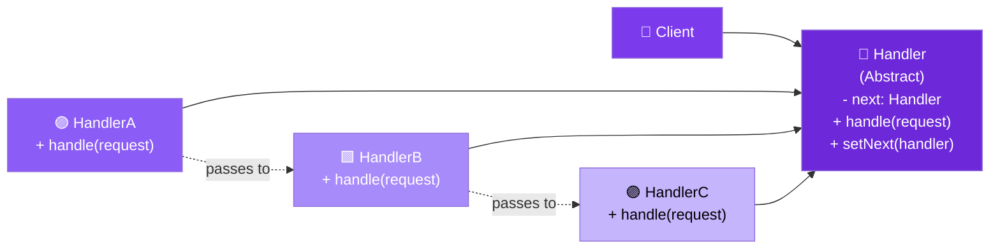

# 🔗 Chain of Responsibility Design Pattern

> **Avoid coupling the sender of a request to its receiver by giving more than one object a chance to handle the request. Chain the receiving objects and pass the request along the chain until an object handles it.**

---

## 🌍 Real-World Analogy

!!! abstract "Analogy — Customer Support Escalation"
    When you call customer support, you first speak to a **Level 1 agent**. If they can't solve your problem, they escalate to **Level 2**. If that fails, it goes to a **manager**, then to **engineering**. Each handler in the chain either resolves the issue or passes it up. You don't decide who handles it — the chain does.



---

## 🏗️ Pattern Structure



---

## ❓ The Problem

You have a request that could be handled by multiple handlers, but:

- The handler is not known at compile time
- You don't want the sender to be **coupled** to a specific handler
- Multiple handlers may need to process the same request (pipeline)
- The set of handlers and their order may change at runtime

**Example:** An HTTP request passes through authentication, authorization, rate limiting, logging, and validation — each middleware can stop or pass the request forward.

---

## ✅ The Solution

The Chain of Responsibility pattern organizes handlers into a **linked chain**:

1. Each handler has a reference to the **next** handler in the chain
2. Upon receiving a request, a handler decides to **process** it, **pass** it forward, or **both**
3. The client only needs to send the request to the **first** handler
4. Handlers can be reordered, added, or removed dynamically

---

## 💻 Implementation

=== "Classic Chain (Stop on Handle)"

    ```java
    // Base Handler
    public abstract class SupportHandler {
        private SupportHandler next;

        public SupportHandler setNext(SupportHandler next) {
            this.next = next;
            return next; // enables fluent chaining
        }

        public void handle(SupportTicket ticket) {
            if (canHandle(ticket)) {
                process(ticket);
            } else if (next != null) {
                next.handle(ticket);
            } else {
                System.out.println("❌ No handler could process: " + ticket.getIssue());
            }
        }

        protected abstract boolean canHandle(SupportTicket ticket);
        protected abstract void process(SupportTicket ticket);
    }

    // Request object
    public class SupportTicket {
        public enum Priority { LOW, MEDIUM, HIGH, CRITICAL }

        private final String issue;
        private final Priority priority;

        public SupportTicket(String issue, Priority priority) {
            this.issue = issue;
            this.priority = priority;
        }

        public String getIssue() { return issue; }
        public Priority getPriority() { return priority; }
    }

    // Concrete Handlers
    public class FAQHandler extends SupportHandler {
        @Override
        protected boolean canHandle(SupportTicket ticket) {
            return ticket.getPriority() == SupportTicket.Priority.LOW;
        }

        @Override
        protected void process(SupportTicket ticket) {
            System.out.println("📖 FAQ Bot resolved: " + ticket.getIssue());
        }
    }

    public class TechSupportHandler extends SupportHandler {
        @Override
        protected boolean canHandle(SupportTicket ticket) {
            return ticket.getPriority() == SupportTicket.Priority.MEDIUM;
        }

        @Override
        protected void process(SupportTicket ticket) {
            System.out.println("🛠️ Tech Support resolved: " + ticket.getIssue());
        }
    }

    public class EngineeringHandler extends SupportHandler {
        @Override
        protected boolean canHandle(SupportTicket ticket) {
            return ticket.getPriority() == SupportTicket.Priority.HIGH ||
                   ticket.getPriority() == SupportTicket.Priority.CRITICAL;
        }

        @Override
        protected void process(SupportTicket ticket) {
            System.out.println("👨‍💻 Engineering team resolved: " + ticket.getIssue());
        }
    }

    // Usage
    public class Main {
        public static void main(String[] args) {
            // Build the chain
            SupportHandler chain = new FAQHandler();
            chain.setNext(new TechSupportHandler())
                 .setNext(new EngineeringHandler());

            // Send tickets
            chain.handle(new SupportTicket("Reset password", SupportTicket.Priority.LOW));
            chain.handle(new SupportTicket("App crashing", SupportTicket.Priority.MEDIUM));
            chain.handle(new SupportTicket("Data corruption", SupportTicket.Priority.CRITICAL));
        }
    }
    ```

=== "Pipeline (All Handlers Process)"

    ```java
    // Middleware-style chain — every handler processes and passes along
    public interface Middleware {
        boolean handle(HttpRequest request);
    }

    public abstract class BaseMiddleware implements Middleware {
        private BaseMiddleware next;

        public BaseMiddleware linkWith(BaseMiddleware next) {
            this.next = next;
            return next;
        }

        @Override
        public boolean handle(HttpRequest request) {
            if (!check(request)) {
                return false; // Stop chain
            }
            return next == null || next.handle(request);
        }

        protected abstract boolean check(HttpRequest request);
    }

    public class AuthenticationMiddleware extends BaseMiddleware {
        @Override
        protected boolean check(HttpRequest request) {
            if (request.getHeader("Authorization") == null) {
                System.out.println("🚫 Auth failed: No token");
                return false;
            }
            System.out.println("✅ Authenticated");
            return true;
        }
    }

    public class RateLimitMiddleware extends BaseMiddleware {
        private final Map<String, Integer> requestCounts = new HashMap<>();
        private static final int MAX_REQUESTS = 100;

        @Override
        protected boolean check(HttpRequest request) {
            String ip = request.getRemoteAddr();
            int count = requestCounts.getOrDefault(ip, 0) + 1;
            requestCounts.put(ip, count);
            if (count > MAX_REQUESTS) {
                System.out.println("🚫 Rate limit exceeded for: " + ip);
                return false;
            }
            System.out.println("✅ Rate limit OK");
            return true;
        }
    }

    public class LoggingMiddleware extends BaseMiddleware {
        @Override
        protected boolean check(HttpRequest request) {
            System.out.println("📝 Logging: " + request.getMethod() + " " + request.getPath());
            return true; // Always passes
        }
    }

    // Build pipeline
    BaseMiddleware chain = new LoggingMiddleware();
    chain.linkWith(new AuthenticationMiddleware())
         .linkWith(new RateLimitMiddleware());
    ```

---

## 🎯 When to Use

- When more than one object may handle a request and the handler isn't known a priori
- When you want to issue a request to one of several objects without specifying the receiver explicitly
- When the set of handlers should be configured dynamically
- When you need a **middleware pipeline** (authentication, logging, validation)
- When you want to decouple request senders from their processors

---

## 🏭 Real-World Examples

| Framework/Library | Usage |
|---|---|
| **Java Servlet Filters** | `javax.servlet.FilterChain` — classic chain of responsibility |
| **Spring Security Filter Chain** | Authentication and authorization filters in sequence |
| **Spring Interceptors** | `HandlerInterceptor` pre/post processing |
| **Java `try-catch` blocks** | Exception handling is a chain — first matching catch wins |
| **Java Logging** | `java.util.logging.Logger` parent chain |
| **Apache Commons Chain** | Explicit Chain of Responsibility framework |
| **Netty ChannelPipeline** | Network event processing chain |

---

## ⚠️ Pitfalls

!!! warning "Common Mistakes"
    - **Unhandled requests** — If no handler processes the request, it silently disappears. Always have a fallback handler at the end.
    - **Performance** — Long chains with many handlers add latency. Profile if chains grow large.
    - **Debugging difficulty** — Hard to trace which handler processed (or dropped) a request. Add logging.
    - **Circular chains** — Accidentally linking handlers in a circle causes infinite loops.
    - **Guaranteed handling** — If a request *must* be handled, validate the chain at construction time.

---

## 📝 Key Takeaways

!!! tip "Summary"
    - Chain of Responsibility **decouples** senders from receivers by passing requests along a chain
    - Two flavors: **stop-on-handle** (first capable handler processes) or **pipeline** (all handlers process)
    - Handlers are linked at runtime — easy to add, remove, or reorder
    - The pattern is the backbone of **servlet filters**, **middleware stacks**, and **event bubbling**
    - Follows **Single Responsibility Principle** — each handler does one thing
    - Combine with **Command** pattern to queue and chain commands
