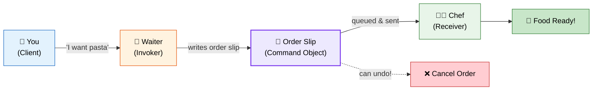
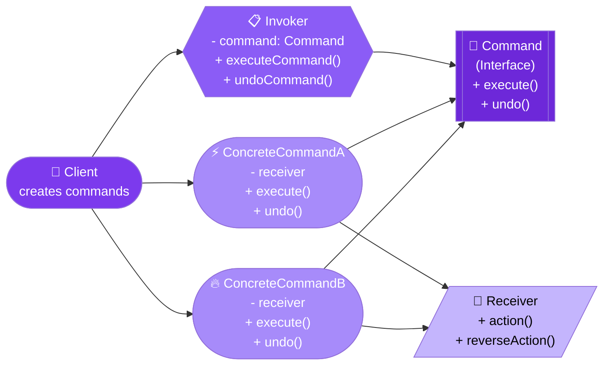
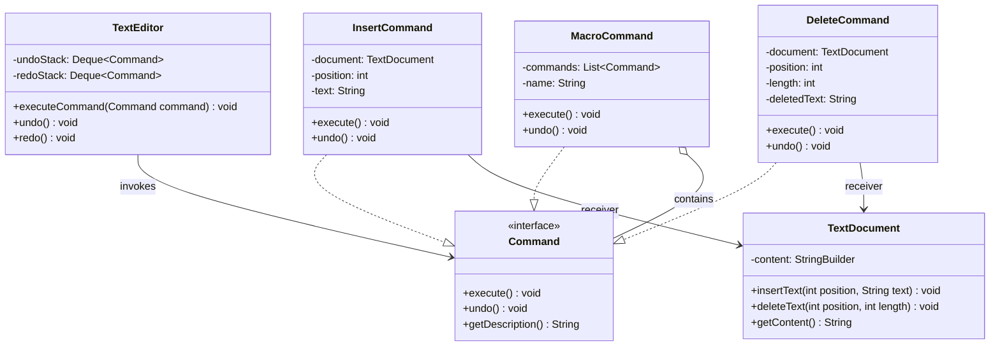

# 🎮 Command Design Pattern

> **Encapsulate a request as an object, thereby letting you parameterize clients with different requests, queue or log requests, and support undoable operations.**

---

## 🌍 Real-World Analogy

!!! abstract "Analogy — Restaurant Orders"
    In a restaurant, you don't walk into the kitchen and cook your food. Instead, the **waiter** takes your order (Command), writes it on a slip, and hands it to the **chef** (Receiver). The order slip is a tangible object that can be queued, prioritized, canceled, or even repeated. The waiter doesn't need to know how to cook — they just deliver commands.



---

## 🏗️ Pattern Structure



---

## UML Class Diagram



---

## ❓ The Problem

You need to issue requests to objects without knowing:

- **What** operation is being requested
- **Who** the receiver of the request is
- **When** the operation should be executed

Additionally, you need:

- **Undo/Redo** capability
- **Transaction logging** — persist commands and replay them after a crash
- **Macro commands** — composite commands that execute a sequence
- **Queueing** — decouple when a request is made from when it's executed

---

## ✅ The Solution

The Command pattern turns a request into a **stand-alone object** containing all information about the request:

1. **Command interface** — declares `execute()` and optionally `undo()`
2. **Concrete Commands** — implement the interface, hold a reference to the receiver
3. **Receiver** — the object that performs the actual work
4. **Invoker** — triggers command execution, maintains history for undo
5. **Client** — creates commands and associates them with receivers

---

## 💻 Implementation

=== "Text Editor with Undo"

    ```java
    // Command interface
    public interface Command {
        void execute();
        void undo();
        String getDescription();
    }

    // Receiver
    public class TextDocument {
        private final StringBuilder content = new StringBuilder();

        public void insertText(int position, String text) {
            content.insert(position, text);
        }

        public void deleteText(int position, int length) {
            content.delete(position, position + length);
        }

        public String getContent() {
            return content.toString();
        }
    }

    // Concrete Commands
    public class InsertCommand implements Command {
        private final TextDocument document;
        private final int position;
        private final String text;

        public InsertCommand(TextDocument document, int position, String text) {
            this.document = document;
            this.position = position;
            this.text = text;
        }

        @Override
        public void execute() {
            document.insertText(position, text);
        }

        @Override
        public void undo() {
            document.deleteText(position, text.length());
        }

        @Override
        public String getDescription() {
            return "Insert '" + text + "' at position " + position;
        }
    }

    public class DeleteCommand implements Command {
        private final TextDocument document;
        private final int position;
        private final int length;
        private String deletedText; // saved for undo

        public DeleteCommand(TextDocument document, int position, int length) {
            this.document = document;
            this.position = position;
            this.length = length;
        }

        @Override
        public void execute() {
            deletedText = document.getContent().substring(position, position + length);
            document.deleteText(position, length);
        }

        @Override
        public void undo() {
            document.insertText(position, deletedText);
        }

        @Override
        public String getDescription() {
            return "Delete " + length + " chars at position " + position;
        }
    }

    // Invoker with history
    public class TextEditor {
        private final Deque<Command> undoStack = new ArrayDeque<>();
        private final Deque<Command> redoStack = new ArrayDeque<>();

        public void executeCommand(Command command) {
            command.execute();
            undoStack.push(command);
            redoStack.clear(); // Clear redo history on new action
        }

        public void undo() {
            if (!undoStack.isEmpty()) {
                Command command = undoStack.pop();
                command.undo();
                redoStack.push(command);
                System.out.println("↩️ Undo: " + command.getDescription());
            }
        }

        public void redo() {
            if (!redoStack.isEmpty()) {
                Command command = redoStack.pop();
                command.execute();
                undoStack.push(command);
                System.out.println("↪️ Redo: " + command.getDescription());
            }
        }
    }

    // Usage
    public class Main {
        public static void main(String[] args) {
            TextDocument doc = new TextDocument();
            TextEditor editor = new TextEditor();

            editor.executeCommand(new InsertCommand(doc, 0, "Hello "));
            editor.executeCommand(new InsertCommand(doc, 6, "World!"));
            System.out.println(doc.getContent()); // "Hello World!"

            editor.undo(); // Removes "World!"
            System.out.println(doc.getContent()); // "Hello "

            editor.redo(); // Re-inserts "World!"
            System.out.println(doc.getContent()); // "Hello World!"
        }
    }
    ```

=== "Macro Command (Composite)"

    ```java
    // Macro command — executes multiple commands as one
    public class MacroCommand implements Command {
        private final List<Command> commands;
        private final String name;

        public MacroCommand(String name, Command... commands) {
            this.name = name;
            this.commands = Arrays.asList(commands);
        }

        @Override
        public void execute() {
            commands.forEach(Command::execute);
        }

        @Override
        public void undo() {
            // Undo in reverse order
            List<Command> reversed = new ArrayList<>(commands);
            Collections.reverse(reversed);
            reversed.forEach(Command::undo);
        }

        @Override
        public String getDescription() {
            return "Macro: " + name + " (" + commands.size() + " commands)";
        }
    }

    // Usage — "Format Document" macro
    TextDocument doc = new TextDocument();
    TextEditor editor = new TextEditor();

    editor.executeCommand(new InsertCommand(doc, 0, "Hello World"));

    MacroCommand formatDoc = new MacroCommand("Format Document",
        new InsertCommand(doc, 0, "=== HEADER ===\n"),
        new InsertCommand(doc, doc.getContent().length(), "\n=== FOOTER ===")
    );
    editor.executeCommand(formatDoc);
    editor.undo(); // Undoes entire macro at once
    ```

---

## 🎯 When to Use

- When you need **undo/redo** functionality
- When you want to **queue** operations and execute them at a different time
- When you need to support **transactions** (execute all or rollback)
- When you want to **log** changes so the system can recover by replaying commands
- When you need to parameterize objects with operations (callbacks on steroids)
- When you want to build **macro** commands (composite of multiple commands)

---

## 🏭 Real-World Examples

| Framework/Library | Usage |
|---|---|
| **`java.lang.Runnable`** | A command with no receiver — just `run()` |
| **`javax.swing.Action`** | UI actions encapsulated as command objects |
| **Spring `@Transactional`** | Database operations as undoable commands |
| **Java `Callable<V>`** | Command that returns a result |
| **Apache Kafka** | Messages are commands queued for async processing |
| **CQRS Pattern** | Commands separated from queries at architecture level |
| **`java.util.concurrent.ThreadPoolExecutor`** | Commands (Runnable) queued for execution |

---

## ⚠️ Pitfalls

!!! warning "Common Mistakes"
    - **Complexity overhead** — Simple operations don't need to be commands. Use it when you actually need undo, queuing, or logging.
    - **Memory bloat** — Storing unlimited command history can exhaust memory. Implement a max history size.
    - **Undo complexity** — Some operations are hard to reverse (e.g., sending an email). Not every command is undoable.
    - **State capture** — Commands must capture enough state at creation time to execute later. Be careful with references that may change.
    - **Thread safety** — Shared command queues need synchronization.

---

## 📝 Key Takeaways

!!! tip "Summary"
    - Command **decouples** the object that invokes an operation from the one that performs it
    - Enables undo/redo by storing execution history and implementing `undo()` on each command
    - Commands are **first-class objects** — store them, pass them, serialize them
    - Combine with **Composite** pattern for macro commands
    - In Java, `Runnable` and `Callable` are the simplest built-in command patterns
    - The pattern is the backbone of **CQRS**, **Event Sourcing**, and **task scheduling** architectures
