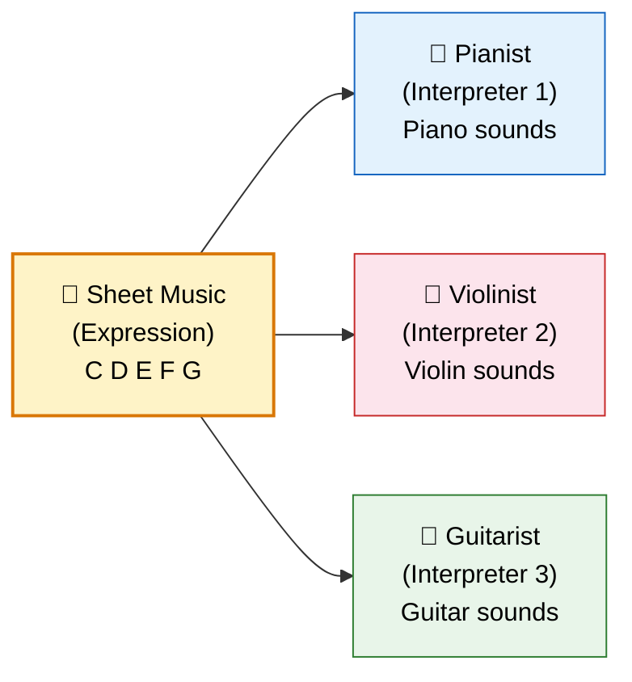
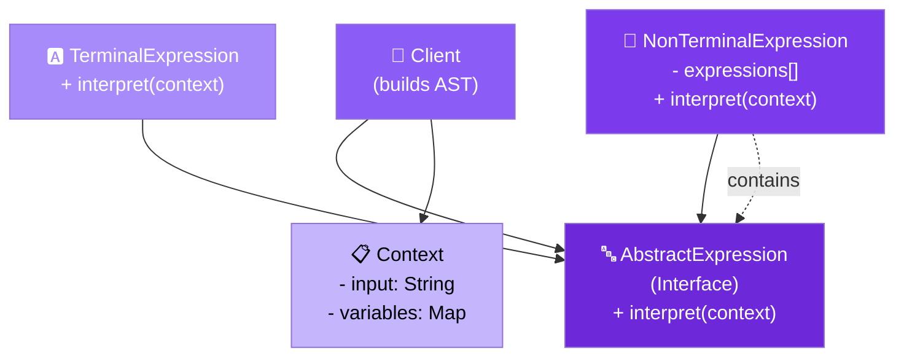

# 🔤 Interpreter Design Pattern

> **Given a language, define a representation for its grammar along with an interpreter that uses the representation to interpret sentences in the language.**

---

## 🌍 Real-World Analogy

!!! abstract "Analogy — Musical Notation"
    A piece of sheet music is a language with its own grammar — notes, rests, time signatures, dynamics. A **musician** (Interpreter) reads the notation and converts it into sound. Different musicians (piano, violin, guitar) interpret the same notation differently, but the grammar remains the same. Each symbol in the score is an expression that gets interpreted.



---

## 🏗️ Pattern Structure



---

## ❓ The Problem

You need to evaluate expressions or sentences in a simple language or DSL:

- SQL-like query filters for a search engine
- Mathematical expression evaluation
- Regular expression matching
- Configuration rules (if user.age > 18 AND user.country == "US")
- Business rule engines

Without the Interpreter pattern, you'd write monolithic parsers with complex conditional logic that's hard to extend with new grammar rules.

---

## ✅ The Solution

The Interpreter pattern models grammar rules as a **class hierarchy** (Abstract Syntax Tree):

1. **AbstractExpression** — declares an `interpret()` method
2. **TerminalExpression** — represents leaf nodes (literals, variables)
3. **NonTerminalExpression** — represents composite rules (AND, OR, sequences) containing other expressions
4. **Context** — holds global information needed during interpretation (variable values, input)

The client **builds the AST** and then calls `interpret()` on the root — evaluation cascades through the tree.

---

## 💻 Implementation

=== "Boolean Rule Engine"

    ```java
    // Context — holds variable values
    public class RuleContext {
        private final Map<String, Object> variables = new HashMap<>();

        public void setVariable(String name, Object value) {
            variables.put(name, value);
        }

        public Object getVariable(String name) {
            return variables.get(name);
        }

        public int getInt(String name) {
            return (Integer) variables.get(name);
        }

        public String getString(String name) {
            return (String) variables.get(name);
        }
    }

    // Abstract Expression
    public interface Expression {
        boolean interpret(RuleContext context);
    }

    // Terminal Expressions
    public class EqualsExpression implements Expression {
        private final String variable;
        private final Object value;

        public EqualsExpression(String variable, Object value) {
            this.variable = variable;
            this.value = value;
        }

        @Override
        public boolean interpret(RuleContext context) {
            return value.equals(context.getVariable(variable));
        }

        @Override
        public String toString() {
            return variable + " == " + value;
        }
    }

    public class GreaterThanExpression implements Expression {
        private final String variable;
        private final int value;

        public GreaterThanExpression(String variable, int value) {
            this.variable = variable;
            this.value = value;
        }

        @Override
        public boolean interpret(RuleContext context) {
            return context.getInt(variable) > value;
        }

        @Override
        public String toString() {
            return variable + " > " + value;
        }
    }

    public class ContainsExpression implements Expression {
        private final String variable;
        private final String substring;

        public ContainsExpression(String variable, String substring) {
            this.variable = variable;
            this.substring = substring;
        }

        @Override
        public boolean interpret(RuleContext context) {
            String val = context.getString(variable);
            return val != null && val.contains(substring);
        }

        @Override
        public String toString() {
            return variable + " contains '" + substring + "'";
        }
    }

    // Non-Terminal Expressions (Composite)
    public class AndExpression implements Expression {
        private final Expression left;
        private final Expression right;

        public AndExpression(Expression left, Expression right) {
            this.left = left;
            this.right = right;
        }

        @Override
        public boolean interpret(RuleContext context) {
            return left.interpret(context) && right.interpret(context);
        }

        @Override
        public String toString() {
            return "(" + left + " AND " + right + ")";
        }
    }

    public class OrExpression implements Expression {
        private final Expression left;
        private final Expression right;

        public OrExpression(Expression left, Expression right) {
            this.left = left;
            this.right = right;
        }

        @Override
        public boolean interpret(RuleContext context) {
            return left.interpret(context) || right.interpret(context);
        }

        @Override
        public String toString() {
            return "(" + left + " OR " + right + ")";
        }
    }

    public class NotExpression implements Expression {
        private final Expression expression;

        public NotExpression(Expression expression) {
            this.expression = expression;
        }

        @Override
        public boolean interpret(RuleContext context) {
            return !expression.interpret(context);
        }

        @Override
        public String toString() {
            return "NOT(" + expression + ")";
        }
    }

    // Usage — Business Rules Engine
    public class Main {
        public static void main(String[] args) {
            // Rule: (age > 18 AND country == "US") OR role == "admin"
            Expression rule = new OrExpression(
                new AndExpression(
                    new GreaterThanExpression("age", 18),
                    new EqualsExpression("country", "US")
                ),
                new EqualsExpression("role", "admin")
            );

            System.out.println("Rule: " + rule);

            // Test with different contexts
            RuleContext adultUS = new RuleContext();
            adultUS.setVariable("age", 25);
            adultUS.setVariable("country", "US");
            adultUS.setVariable("role", "user");
            System.out.println("Adult US user: " + rule.interpret(adultUS)); // true

            RuleContext teenUK = new RuleContext();
            teenUK.setVariable("age", 16);
            teenUK.setVariable("country", "UK");
            teenUK.setVariable("role", "user");
            System.out.println("Teen UK user: " + rule.interpret(teenUK)); // false

            RuleContext adminTeen = new RuleContext();
            adminTeen.setVariable("age", 15);
            adminTeen.setVariable("country", "JP");
            adminTeen.setVariable("role", "admin");
            System.out.println("Admin teen: " + rule.interpret(adminTeen)); // true
        }
    }
    ```

=== "Math Expression Evaluator"

    ```java
    // Expression interface for math
    public interface MathExpression {
        double interpret();
    }

    // Terminal — Number literal
    public class NumberExpression implements MathExpression {
        private final double number;

        public NumberExpression(double number) {
            this.number = number;
        }

        @Override
        public double interpret() { return number; }

        @Override
        public String toString() { return String.valueOf(number); }
    }

    // Non-Terminal — Binary operations
    public class AddExpression implements MathExpression {
        private final MathExpression left, right;

        public AddExpression(MathExpression left, MathExpression right) {
            this.left = left;
            this.right = right;
        }

        @Override
        public double interpret() {
            return left.interpret() + right.interpret();
        }
    }

    public class MultiplyExpression implements MathExpression {
        private final MathExpression left, right;

        public MultiplyExpression(MathExpression left, MathExpression right) {
            this.left = left;
            this.right = right;
        }

        @Override
        public double interpret() {
            return left.interpret() * right.interpret();
        }
    }

    public class SubtractExpression implements MathExpression {
        private final MathExpression left, right;

        public SubtractExpression(MathExpression left, MathExpression right) {
            this.left = left;
            this.right = right;
        }

        @Override
        public double interpret() {
            return left.interpret() - right.interpret();
        }
    }

    // Simple parser — builds AST from postfix notation
    public class PostfixParser {
        public static MathExpression parse(String expression) {
            Deque<MathExpression> stack = new ArrayDeque<>();
            String[] tokens = expression.split("\\s+");

            for (String token : tokens) {
                switch (token) {
                    case "+" -> {
                        MathExpression right = stack.pop();
                        MathExpression left = stack.pop();
                        stack.push(new AddExpression(left, right));
                    }
                    case "*" -> {
                        MathExpression right = stack.pop();
                        MathExpression left = stack.pop();
                        stack.push(new MultiplyExpression(left, right));
                    }
                    case "-" -> {
                        MathExpression right = stack.pop();
                        MathExpression left = stack.pop();
                        stack.push(new SubtractExpression(left, right));
                    }
                    default -> stack.push(new NumberExpression(Double.parseDouble(token)));
                }
            }
            return stack.pop();
        }
    }

    // Usage
    // "3 4 + 2 *" = (3 + 4) * 2 = 14
    MathExpression expr = PostfixParser.parse("3 4 + 2 *");
    System.out.println("Result: " + expr.interpret()); // 14.0
    ```

---

## 🎯 When to Use

- When you have a **simple grammar** that can be represented as a class hierarchy
- When efficiency is not a primary concern (interpreter is not fast for complex grammars)
- When you need to evaluate **rules, expressions, or queries** dynamically
- When the grammar is **stable** but new sentences/expressions are added frequently
- When you want to build **DSLs** (Domain-Specific Languages) for configuration or business rules

---

## 🏭 Real-World Examples

| Framework/Library | Usage |
|---|---|
| **`java.util.regex.Pattern`** | Regex is interpreted against input strings |
| **Spring Expression Language (SpEL)** | `#{expression}` evaluated at runtime |
| **SQL parsers** | SQL statements parsed into AST and interpreted |
| **JEXL (Apache Commons)** | Expression language for Java |
| **Drools Rule Engine** | Business rules interpreted at runtime |
| **ANTLR** | Parser generator that builds interpreter ASTs |
| **`javax.el.ExpressionFactory`** | JSP/JSF expression language |

---

## ⚠️ Pitfalls

!!! warning "Common Mistakes"
    - **Complex grammars** — Interpreter pattern becomes unwieldy for grammars with many rules. Use parser generators (ANTLR) instead.
    - **Performance** — Tree traversal for every interpretation is slow. For hot paths, compile to bytecode or use caching.
    - **Class explosion** — Every grammar rule becomes a class. 20+ rule types means 20+ classes.
    - **No error handling** — Simple interpreters often lack good error messages. Add validation before interpretation.
    - **Reinventing the wheel** — For math, regex, SQL, or JSON path — use existing libraries. Only build custom interpreters for your own DSLs.

---

## 📝 Key Takeaways

!!! tip "Summary"
    - Interpreter maps grammar rules to a **class hierarchy** forming an Abstract Syntax Tree (AST)
    - **Terminal expressions** are leaves (literals, variables); **Non-terminal expressions** are composites (AND, OR, +, *)
    - Best for **simple, stable grammars** where new sentences are common but new rules are rare
    - The pattern naturally combines with **Composite** (tree structure) and **Iterator** (traversal)
    - For complex languages, use **parser generators** (ANTLR, JavaCC) — Interpreter is for simple DSLs
    - Modern alternative: Java's **Pattern Matching** and **sealed interfaces** can simplify expression hierarchies
