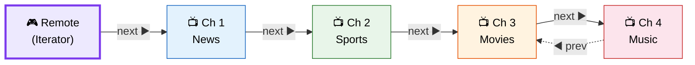
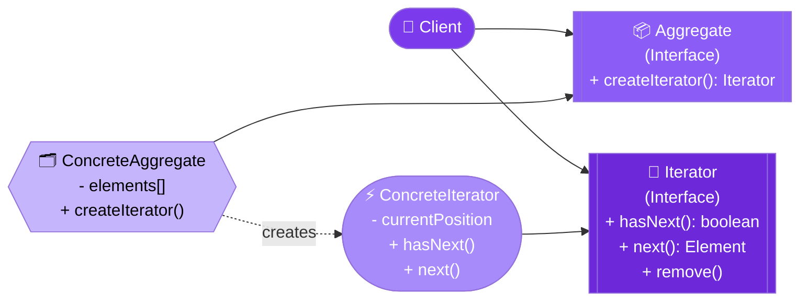
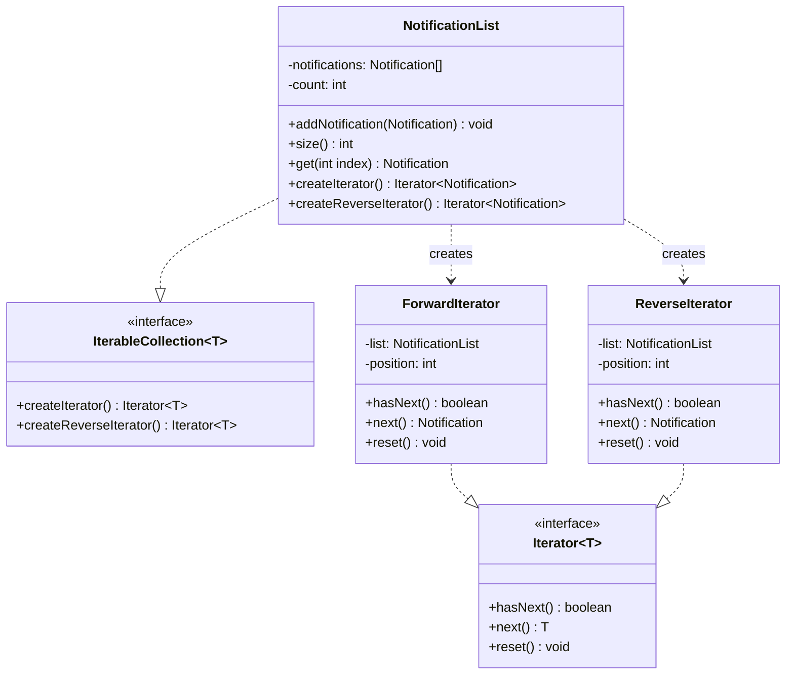

# 🔁 Iterator Design Pattern

> **Provide a way to access the elements of an aggregate object sequentially without exposing its underlying representation.**

---

## 🌍 Real-World Analogy

!!! abstract "Analogy — TV Remote Channel Surfing"
    A TV remote lets you surf channels by pressing **Next** and **Previous** — without knowing whether the channels come from cable, satellite, or streaming. The remote (Iterator) provides a uniform way to traverse channels (elements) regardless of the underlying source (collection type). You don't need to know the internal data structure — you just navigate.



---

## 🏗️ Pattern Structure



---

## UML Class Diagram



---

## ❓ The Problem

Collections can have complex internal structures (trees, graphs, stacks, hash tables), but clients need to traverse them without:

- Knowing the **internal representation** (array? linked list? tree?)
- Duplicating traversal logic across multiple clients
- Exposing the collection's internal structure (breaking encapsulation)
- Being limited to a single traversal algorithm

**Example:** A social network graph where you want to iterate over a user's friends — by depth-first, breadth-first, or filtered by location — without exposing the graph internals.

---

## ✅ The Solution

The Iterator pattern extracts traversal behavior into a **separate iterator object**:

1. **Iterator interface** — defines `hasNext()`, `next()`, and optionally `remove()`
2. **Concrete Iterator** — implements traversal logic, tracks current position
3. **Aggregate interface** — declares a factory method `createIterator()`
4. **Concrete Aggregate** — returns the appropriate iterator for its structure

---

## 💻 Implementation

=== "Custom Collection with Iterator"

    ```java
    // Iterator interface
    public interface Iterator<T> {
        boolean hasNext();
        T next();
        void reset();
    }

    // Aggregate interface
    public interface IterableCollection<T> {
        Iterator<T> createIterator();
        Iterator<T> createReverseIterator();
    }

    // Concrete Aggregate — custom notification list
    public class NotificationList implements IterableCollection<Notification> {
        private final Notification[] notifications;
        private int count = 0;

        public NotificationList(int capacity) {
            this.notifications = new Notification[capacity];
        }

        public void addNotification(Notification notification) {
            if (count < notifications.length) {
                notifications[count++] = notification;
            }
        }

        public int size() { return count; }
        public Notification get(int index) { return notifications[index]; }

        @Override
        public Iterator<Notification> createIterator() {
            return new ForwardIterator(this);
        }

        @Override
        public Iterator<Notification> createReverseIterator() {
            return new ReverseIterator(this);
        }
    }

    // Concrete Iterator — forward traversal
    public class ForwardIterator implements Iterator<Notification> {
        private final NotificationList list;
        private int position = 0;

        public ForwardIterator(NotificationList list) {
            this.list = list;
        }

        @Override
        public boolean hasNext() {
            return position < list.size();
        }

        @Override
        public Notification next() {
            if (!hasNext()) throw new NoSuchElementException();
            return list.get(position++);
        }

        @Override
        public void reset() { position = 0; }
    }

    // Concrete Iterator — reverse traversal
    public class ReverseIterator implements Iterator<Notification> {
        private final NotificationList list;
        private int position;

        public ReverseIterator(NotificationList list) {
            this.list = list;
            this.position = list.size() - 1;
        }

        @Override
        public boolean hasNext() {
            return position >= 0;
        }

        @Override
        public Notification next() {
            if (!hasNext()) throw new NoSuchElementException();
            return list.get(position--);
        }

        @Override
        public void reset() { position = list.size() - 1; }
    }

    // Usage
    public class Main {
        public static void main(String[] args) {
            NotificationList list = new NotificationList(10);
            list.addNotification(new Notification("Welcome!"));
            list.addNotification(new Notification("New message"));
            list.addNotification(new Notification("Update available"));

            // Forward iteration
            System.out.println("📬 Latest notifications:");
            Iterator<Notification> it = list.createIterator();
            while (it.hasNext()) {
                System.out.println("  → " + it.next().getText());
            }

            // Reverse iteration
            System.out.println("📬 Oldest first:");
            Iterator<Notification> reverse = list.createReverseIterator();
            while (reverse.hasNext()) {
                System.out.println("  → " + reverse.next().getText());
            }
        }
    }
    ```

=== "Tree Iterator (DFS/BFS)"

    ```java
    // Binary tree node
    public class TreeNode<T> {
        T value;
        TreeNode<T> left, right;

        public TreeNode(T value) { this.value = value; }
    }

    // Tree with multiple iteration strategies
    public class BinaryTree<T> implements IterableCollection<T> {
        private TreeNode<T> root;

        public void setRoot(TreeNode<T> root) { this.root = root; }

        @Override
        public Iterator<T> createIterator() {
            return new InOrderIterator<>(root);
        }

        public Iterator<T> createBfsIterator() {
            return new BreadthFirstIterator<>(root);
        }
    }

    // DFS In-Order Iterator
    public class InOrderIterator<T> implements Iterator<T> {
        private final Deque<TreeNode<T>> stack = new ArrayDeque<>();

        public InOrderIterator(TreeNode<T> root) {
            pushLeft(root);
        }

        private void pushLeft(TreeNode<T> node) {
            while (node != null) {
                stack.push(node);
                node = node.left;
            }
        }

        @Override
        public boolean hasNext() { return !stack.isEmpty(); }

        @Override
        public T next() {
            TreeNode<T> node = stack.pop();
            pushLeft(node.right);
            return node.value;
        }

        @Override
        public void reset() { /* re-initialize from root */ }
    }

    // BFS Iterator
    public class BreadthFirstIterator<T> implements Iterator<T> {
        private final Queue<TreeNode<T>> queue = new LinkedList<>();

        public BreadthFirstIterator(TreeNode<T> root) {
            if (root != null) queue.add(root);
        }

        @Override
        public boolean hasNext() { return !queue.isEmpty(); }

        @Override
        public T next() {
            TreeNode<T> node = queue.poll();
            if (node.left != null) queue.add(node.left);
            if (node.right != null) queue.add(node.right);
            return node.value;
        }

        @Override
        public void reset() { /* re-initialize */ }
    }
    ```

---

## 🎯 When to Use

- When you want to traverse a collection **without exposing** its internal structure
- When you need **multiple traversal algorithms** for the same collection (forward, reverse, filtered, DFS, BFS)
- When you want a **uniform interface** for traversing different collection types
- When you want to support **concurrent iteration** with independent iterator instances
- When the collection structure may change but the traversal interface should remain stable

---

## 🏭 Real-World Examples

| Framework/Library | Usage |
|---|---|
| **`java.util.Iterator`** | The core iterator interface in Java Collections |
| **`java.util.Enumeration`** | Legacy iterator (pre-Java 2) |
| **`java.util.Scanner`** | Iterates over tokens in input |
| **`java.sql.ResultSet`** | Iterates over database query results |
| **`java.util.stream.Stream`** | Internal iteration with `forEach`, `map`, `filter` |
| **Spring `JdbcTemplate.queryForStream()`** | Lazy row iteration over large result sets |
| **Kafka `ConsumerRecords`** | Iterable over consumed records |

---

## ⚠️ Pitfalls

!!! warning "Common Mistakes"
    - **ConcurrentModificationException** — Modifying a collection while iterating. Use `ConcurrentHashMap` or `CopyOnWriteArrayList` for concurrent access.
    - **Stateful iterators** — Iterators hold position state; sharing them between threads without synchronization causes bugs.
    - **Lazy vs. Eager** — Decide if the iterator fetches all elements upfront or lazily. Lazy is better for large/infinite collections.
    - **Memory leaks** — Iterators over database cursors or file streams must be closed. Use try-with-resources.
    - **External vs. Internal iteration** — Java Streams (internal) are often simpler than custom external iterators for standard traversals.

---

## 📝 Key Takeaways

!!! tip "Summary"
    - Iterator **separates** traversal logic from the collection, following Single Responsibility
    - Multiple iterators can traverse the same collection **simultaneously** and independently
    - Java's `Iterable`/`Iterator` interfaces enable the **for-each** loop (`for (var x : collection)`)
    - Modern Java prefers **Streams** for most traversals — use custom iterators for complex structures
    - The pattern enables **lazy evaluation** — elements are computed on demand, crucial for large datasets
    - Iterator + Factory Method = collections that create the right iterator without exposing internals
