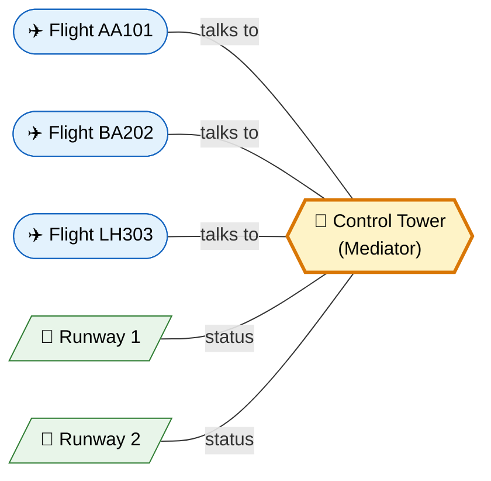
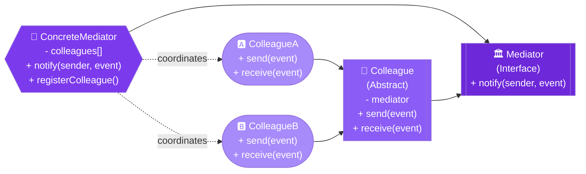
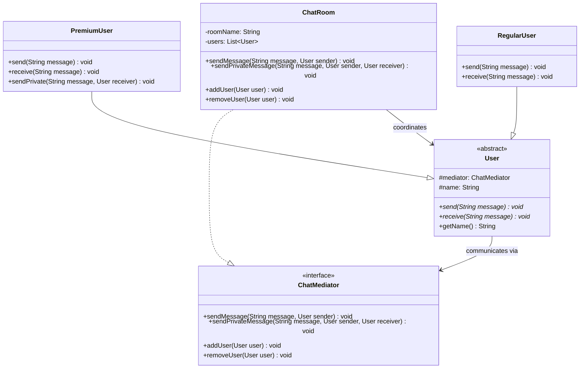

# 🏛️ Mediator Design Pattern

> **Define an object that encapsulates how a set of objects interact. Mediator promotes loose coupling by keeping objects from referring to each other explicitly, and lets you vary their interaction independently.**

---

## 🌍 Real-World Analogy

!!! abstract "Analogy — Air Traffic Control Tower"
    At a busy airport, planes don't communicate directly with each other to coordinate landing and takeoff — that would be chaos. Instead, the **control tower** (Mediator) manages all communication. Pilots (Colleagues) talk only to the tower, and the tower coordinates their interactions. Adding a new runway or aircraft type doesn't require changing how planes communicate with each other.



---

## 🏗️ Pattern Structure



---

## UML Class Diagram



---

## ❓ The Problem

When many objects need to communicate with each other:

- **N objects communicating directly** leads to N*(N-1)/2 connections — a tangled mesh
- Adding a new object requires modifying **all** existing objects it interacts with
- Objects become **tightly coupled** — you can't reuse one without bringing its dependencies
- The interaction logic is **scattered** across many classes

**Example:** A chat room with 50 users. Without a mediator, each user would need references to 49 other users. Adding user #51 would require modifying all 50 existing users.

---

## ✅ The Solution

The Mediator pattern introduces a **central coordinator**:

1. **Mediator interface** — defines the communication protocol
2. **Concrete Mediator** — implements coordination logic, knows all colleagues
3. **Colleague (abstract)** — holds a reference to the mediator, communicates through it
4. **Concrete Colleagues** — interact with each other only through the mediator

Objects go from a **mesh topology** to a **star topology** — all communication flows through the center.

---

## 💻 Implementation

=== "Chat Room"

    ```java
    // Mediator interface
    public interface ChatMediator {
        void sendMessage(String message, User sender);
        void sendPrivateMessage(String message, User sender, User receiver);
        void addUser(User user);
        void removeUser(User user);
    }

    // Concrete Mediator
    public class ChatRoom implements ChatMediator {
        private final String roomName;
        private final List<User> users = new ArrayList<>();

        public ChatRoom(String roomName) {
            this.roomName = roomName;
        }

        @Override
        public void addUser(User user) {
            users.add(user);
            System.out.println("📢 " + user.getName() + " joined " + roomName);
            // Notify others
            users.stream()
                .filter(u -> !u.equals(user))
                .forEach(u -> u.receive("🔔 " + user.getName() + " has joined the chat"));
        }

        @Override
        public void removeUser(User user) {
            users.remove(user);
            System.out.println("📢 " + user.getName() + " left " + roomName);
        }

        @Override
        public void sendMessage(String message, User sender) {
            String formatted = sender.getName() + ": " + message;
            users.stream()
                .filter(u -> !u.equals(sender))
                .forEach(u -> u.receive(formatted));
        }

        @Override
        public void sendPrivateMessage(String message, User sender, User receiver) {
            if (users.contains(receiver)) {
                receiver.receive("[DM from " + sender.getName() + "]: " + message);
            }
        }
    }

    // Colleague
    public abstract class User {
        protected final ChatMediator mediator;
        protected final String name;

        public User(ChatMediator mediator, String name) {
            this.mediator = mediator;
            this.name = name;
        }

        public abstract void send(String message);
        public abstract void receive(String message);
        public String getName() { return name; }
    }

    // Concrete Colleagues
    public class PremiumUser extends User {
        public PremiumUser(ChatMediator mediator, String name) {
            super(mediator, name);
        }

        @Override
        public void send(String message) {
            System.out.println("⭐ " + name + " sends: " + message);
            mediator.sendMessage(message, this);
        }

        @Override
        public void receive(String message) {
            System.out.println("  ⭐ " + name + " received: " + message);
        }

        public void sendPrivate(String message, User receiver) {
            mediator.sendPrivateMessage(message, this, receiver);
        }
    }

    public class RegularUser extends User {
        public RegularUser(ChatMediator mediator, String name) {
            super(mediator, name);
        }

        @Override
        public void send(String message) {
            System.out.println("👤 " + name + " sends: " + message);
            mediator.sendMessage(message, this);
        }

        @Override
        public void receive(String message) {
            System.out.println("  👤 " + name + " received: " + message);
        }
    }

    // Usage
    public class Main {
        public static void main(String[] args) {
            ChatMediator chatRoom = new ChatRoom("Java Developers");

            User alice = new PremiumUser(chatRoom, "Alice");
            User bob = new RegularUser(chatRoom, "Bob");
            User charlie = new RegularUser(chatRoom, "Charlie");

            chatRoom.addUser(alice);
            chatRoom.addUser(bob);
            chatRoom.addUser(charlie);

            alice.send("Hey everyone!");
            bob.send("Hi Alice!");
            ((PremiumUser) alice).sendPrivate("Secret message", bob);
        }
    }
    ```

=== "UI Component Coordination"

    ```java
    // Mediator for form components
    public interface FormMediator {
        void notify(Component sender, String event);
    }

    // Concrete Mediator — coordinates form interactions
    public class RegistrationFormMediator implements FormMediator {
        private TextField emailField;
        private TextField passwordField;
        private CheckBox termsCheckbox;
        private Button submitButton;

        public void setComponents(TextField email, TextField password,
                                  CheckBox terms, Button submit) {
            this.emailField = email;
            this.passwordField = password;
            this.termsCheckbox = terms;
            this.submitButton = submit;
        }

        @Override
        public void notify(Component sender, String event) {
            if (sender == emailField && event.equals("textChanged")) {
                validateEmail();
            } else if (sender == passwordField && event.equals("textChanged")) {
                validatePassword();
            } else if (sender == termsCheckbox && event.equals("toggled")) {
                updateSubmitButton();
            } else if (sender == submitButton && event.equals("clicked")) {
                submitForm();
            }
            updateSubmitButton();
        }

        private void validateEmail() {
            boolean valid = emailField.getText().matches(".*@.*\\..*");
            emailField.setValid(valid);
        }

        private void validatePassword() {
            boolean valid = passwordField.getText().length() >= 8;
            passwordField.setValid(valid);
        }

        private void updateSubmitButton() {
            boolean canSubmit = emailField.isValid() &&
                               passwordField.isValid() &&
                               termsCheckbox.isChecked();
            submitButton.setEnabled(canSubmit);
        }

        private void submitForm() {
            System.out.println("✅ Form submitted!");
        }
    }

    // Base Component
    public abstract class Component {
        protected FormMediator mediator;

        public void setMediator(FormMediator mediator) {
            this.mediator = mediator;
        }

        protected void changed(String event) {
            mediator.notify(this, event);
        }
    }
    ```

---

## 🎯 When to Use

- When a set of objects communicate in **complex but well-defined** ways
- When reusing an object is difficult because it communicates with many other objects
- When you want to customize interaction behavior without subclassing many components
- When you need to reduce **chaotic dependencies** between tightly-coupled classes
- When object interactions should be **centralized** for maintainability

---

## 🏭 Real-World Examples

| Framework/Library | Usage |
|---|---|
| **`java.util.Timer`** | Mediates between timer tasks and thread scheduling |
| **Spring `ApplicationContext`** | Mediates between beans — they don't reference each other directly |
| **Java Message Service (JMS)** | Message broker mediates between producers and consumers |
| **`java.util.concurrent.Executor`** | Mediates between task submission and task execution |
| **Spring MVC `DispatcherServlet`** | Mediates between request and controllers/views |
| **JavaFX/Swing Event System** | Event bus mediates between UI components |
| **Apache Kafka Broker** | Mediates between producers and consumer groups |

---

## ⚠️ Pitfalls

!!! warning "Common Mistakes"
    - **God Object** — The mediator can grow into a monolithic class doing too much. Split by concern if needed.
    - **Single point of failure** — All communication flows through one object; if it fails, everything stops.
    - **Hidden complexity** — Moving logic into the mediator makes individual colleagues simpler but the mediator complex. Don't just relocate the mess.
    - **Performance bottleneck** — In high-throughput systems, the mediator can become a bottleneck if it's synchronous.
    - **Over-use** — If only 2-3 objects interact, direct communication is simpler. Mediator shines with 5+ interconnected objects.

---

## 📝 Key Takeaways

!!! tip "Summary"
    - Mediator replaces **many-to-many** relationships with **many-to-one** (star topology)
    - Colleagues only know the mediator — they are fully decoupled from each other
    - Follows **Single Responsibility** — interaction logic is centralized in one place
    - Mediator vs. Observer: Mediator is **bidirectional** (coordinates), Observer is **unidirectional** (notifies)
    - Mediator vs. Facade: Facade simplifies an interface; Mediator coordinates behavior between peers
    - In enterprise systems, **message brokers** (Kafka, RabbitMQ) are distributed mediators
