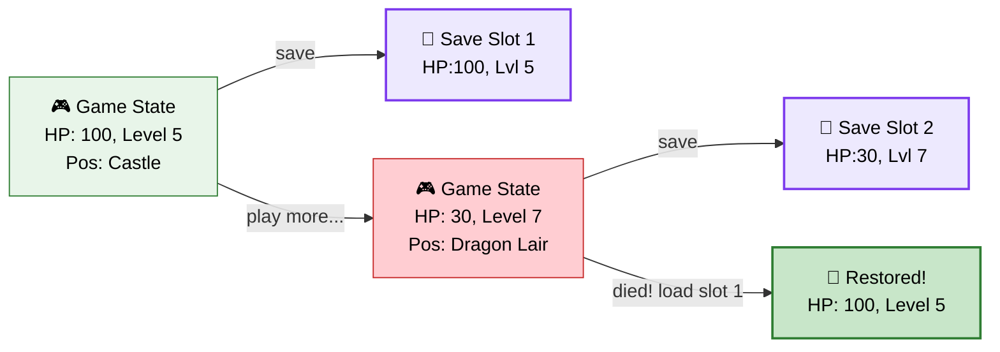
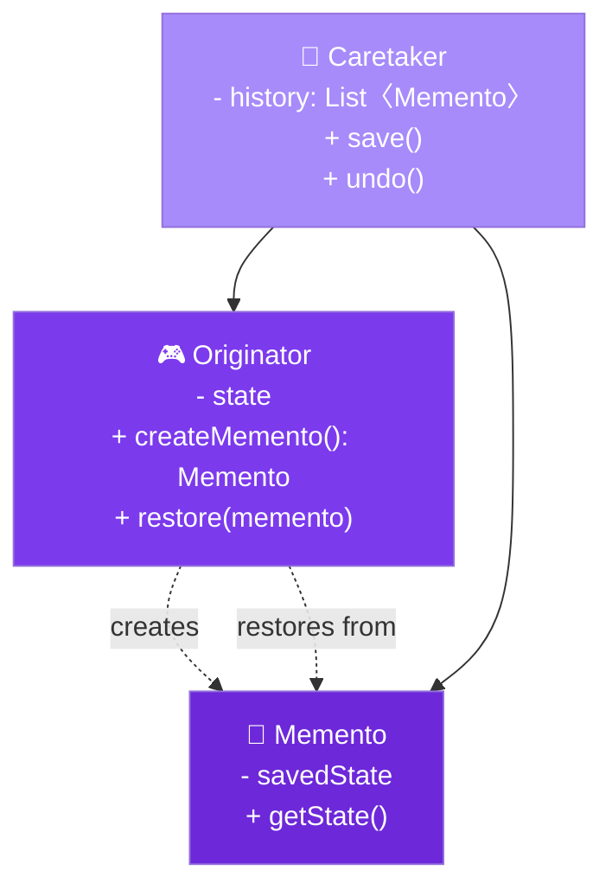

# 💾 Memento Design Pattern

> **Without violating encapsulation, capture and externalize an object's internal state so that the object can be restored to this state later.**

---

## 🌍 Real-World Analogy

!!! abstract "Analogy — Save Game in Video Games"
    When you save a video game, the entire game state (player position, health, inventory, quest progress) is captured into a **save file** — without the save system needing to understand the game's internal mechanics. You can load any save point later to restore the exact state. The save file is opaque — you can't edit it, just load it.



---

## 🏗️ Pattern Structure



---

## ❓ The Problem

You need to implement undo, snapshots, or rollback, but:

- The object's fields are **private** — external code can't access them to save state
- Exposing internal state through getters **breaks encapsulation**
- You need to save **complete snapshots** — partial state leads to corrupt restores
- The saving mechanism shouldn't depend on the object's internal structure

**Example:** A drawing application where users can undo multiple steps. Each shape has complex internal state (position, color, transformations, layers) that must be captured without exposing it.

---

## ✅ The Solution

The Memento pattern uses three participants:

1. **Originator** — the object whose state needs saving. It creates mementos and restores from them
2. **Memento** — an immutable snapshot of the originator's state. Opaque to everyone except the originator
3. **Caretaker** — manages the history of mementos. Requests saves and restores but never inspects memento contents

---

## 💻 Implementation

=== "Text Editor with Undo History"

    ```java
    // Memento — immutable snapshot
    public class EditorMemento {
        private final String content;
        private final int cursorPosition;
        private final String fontFamily;
        private final int fontSize;
        private final LocalDateTime timestamp;

        // Package-private constructor — only Originator should create
        EditorMemento(String content, int cursorPosition,
                      String fontFamily, int fontSize) {
            this.content = content;
            this.cursorPosition = cursorPosition;
            this.fontFamily = fontFamily;
            this.fontSize = fontSize;
            this.timestamp = LocalDateTime.now();
        }

        // Package-private getters — only Originator should access
        String getContent() { return content; }
        int getCursorPosition() { return cursorPosition; }
        String getFontFamily() { return fontFamily; }
        int getFontSize() { return fontSize; }

        // Public metadata for Caretaker display purposes
        public LocalDateTime getTimestamp() { return timestamp; }
        public String getDescription() {
            return "Snapshot at " + timestamp.format(
                DateTimeFormatter.ofPattern("HH:mm:ss"));
        }
    }

    // Originator — creates and restores from mementos
    public class TextEditor {
        private String content = "";
        private int cursorPosition = 0;
        private String fontFamily = "Arial";
        private int fontSize = 12;

        public void type(String text) {
            content = content.substring(0, cursorPosition) +
                      text +
                      content.substring(cursorPosition);
            cursorPosition += text.length();
        }

        public void setFont(String family, int size) {
            this.fontFamily = family;
            this.fontSize = size;
        }

        public void moveCursor(int position) {
            this.cursorPosition = Math.min(position, content.length());
        }

        // Create memento
        public EditorMemento save() {
            return new EditorMemento(content, cursorPosition, fontFamily, fontSize);
        }

        // Restore from memento
        public void restore(EditorMemento memento) {
            this.content = memento.getContent();
            this.cursorPosition = memento.getCursorPosition();
            this.fontFamily = memento.getFontFamily();
            this.fontSize = memento.getFontSize();
        }

        public String getContent() { return content; }

        @Override
        public String toString() {
            return String.format("Editor[content='%s', cursor=%d, font=%s %d]",
                content, cursorPosition, fontFamily, fontSize);
        }
    }

    // Caretaker — manages memento history
    public class EditorHistory {
        private final Deque<EditorMemento> undoStack = new ArrayDeque<>();
        private final Deque<EditorMemento> redoStack = new ArrayDeque<>();
        private final TextEditor editor;
        private static final int MAX_HISTORY = 50;

        public EditorHistory(TextEditor editor) {
            this.editor = editor;
        }

        public void save() {
            if (undoStack.size() >= MAX_HISTORY) {
                // Remove oldest to prevent memory bloat
                ((ArrayDeque<EditorMemento>) undoStack).removeLast();
            }
            undoStack.push(editor.save());
            redoStack.clear();
        }

        public void undo() {
            if (undoStack.isEmpty()) {
                System.out.println("⚠️ Nothing to undo");
                return;
            }
            redoStack.push(editor.save()); // Save current for redo
            EditorMemento memento = undoStack.pop();
            editor.restore(memento);
            System.out.println("↩️ Undo → " + memento.getDescription());
        }

        public void redo() {
            if (redoStack.isEmpty()) {
                System.out.println("⚠️ Nothing to redo");
                return;
            }
            undoStack.push(editor.save());
            EditorMemento memento = redoStack.pop();
            editor.restore(memento);
            System.out.println("↪️ Redo → " + memento.getDescription());
        }

        public void showHistory() {
            System.out.println("📜 History (" + undoStack.size() + " snapshots):");
            undoStack.forEach(m -> System.out.println("  • " + m.getDescription()));
        }
    }

    // Usage
    public class Main {
        public static void main(String[] args) {
            TextEditor editor = new TextEditor();
            EditorHistory history = new EditorHistory(editor);

            // Type and save
            history.save();
            editor.type("Hello ");
            System.out.println(editor); // content='Hello '

            history.save();
            editor.type("World!");
            System.out.println(editor); // content='Hello World!'

            history.save();
            editor.setFont("Courier", 14);
            editor.type(" How are you?");
            System.out.println(editor); // content='Hello World! How are you?'

            // Undo
            history.undo(); // Back to "Hello World!"
            System.out.println(editor);

            history.undo(); // Back to "Hello "
            System.out.println(editor);

            // Redo
            history.redo(); // Forward to "Hello World!"
            System.out.println(editor);
        }
    }
    ```

=== "Nested Class Approach (Strict Encapsulation)"

    ```java
    // Originator with nested Memento — strictest encapsulation
    public class GameCharacter {
        private int health;
        private int mana;
        private int x, y;
        private List<String> inventory;

        public GameCharacter(int health, int mana) {
            this.health = health;
            this.mana = mana;
            this.inventory = new ArrayList<>();
        }

        public void takeDamage(int damage) { health -= damage; }
        public void heal(int amount) { health += amount; }
        public void move(int x, int y) { this.x = x; this.y = y; }
        public void addItem(String item) { inventory.add(item); }

        // Memento as inner class — only GameCharacter can access internals
        public class SaveState {
            private final int health;
            private final int mana;
            private final int x, y;
            private final List<String> inventory;

            private SaveState() {
                this.health = GameCharacter.this.health;
                this.mana = GameCharacter.this.mana;
                this.x = GameCharacter.this.x;
                this.y = GameCharacter.this.y;
                this.inventory = new ArrayList<>(GameCharacter.this.inventory);
            }
        }

        public SaveState saveState() {
            return new SaveState();
        }

        public void loadState(SaveState state) {
            this.health = state.health;
            this.mana = state.mana;
            this.x = state.x;
            this.y = state.y;
            this.inventory = new ArrayList<>(state.inventory);
        }

        @Override
        public String toString() {
            return String.format("Character[HP=%d, MP=%d, pos=(%d,%d), items=%s]",
                health, mana, x, y, inventory);
        }
    }
    ```

---

## 🎯 When to Use

- When you need to save and restore an object's state (**undo/redo**)
- When direct access to an object's fields would **violate encapsulation**
- When you need **checkpoints** to rollback to a known good state
- When implementing **transactional behavior** — commit or rollback
- When you need a **history** of states for debugging or auditing

---

## 🏭 Real-World Examples

| Framework/Library | Usage |
|---|---|
| **`java.io.Serializable`** | Serialize entire object state to bytes (a form of memento) |
| **`javax.swing.undo.UndoManager`** | Stores `UndoableEdit` mementos for UI undo |
| **Spring `@Transactional` savepoints** | Database savepoints for partial rollback |
| **Git commits** | Each commit is a memento of the repository state |
| **Hibernate `Session.evict()`** | Detached entity is a memento of DB state |
| **Java `Object.clone()`** | Shallow copy as a snapshot (simple memento) |

---

## ⚠️ Pitfalls

!!! warning "Common Mistakes"
    - **Memory consumption** — Storing full state snapshots is expensive for large objects. Consider delta-based or incremental mementos.
    - **Deep copy required** — If the originator has mutable reference fields, the memento must deep-copy them, or restoring will share references.
    - **Too frequent saves** — Saving on every keystroke wastes memory. Batch saves (e.g., after pauses or explicit save points).
    - **Serialization overhead** — Using serialization for mementos is convenient but slow. Profile for hot paths.
    - **Breaking encapsulation** — Making memento fields public defeats the purpose. Use package-private or nested classes.

---

## 📝 Key Takeaways

!!! tip "Summary"
    - Memento preserves **encapsulation** while enabling state capture and restore
    - Three roles: **Originator** (creates), **Memento** (stores), **Caretaker** (manages history)
    - The Caretaker never inspects memento contents — it's a black box
    - Combined with **Command** pattern, enables robust undo/redo systems
    - Limit history size to prevent memory issues — implement circular buffers or LRU eviction
    - In Java, use **nested classes** or **package-private access** to enforce memento opacity
