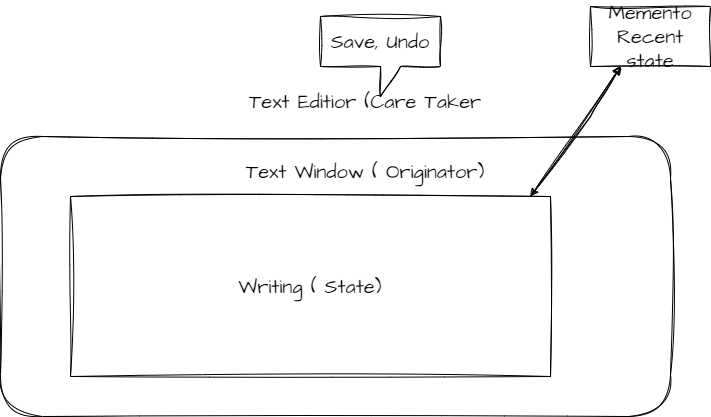

Intent
-----------
Without violating encapsulation, capture and externalize an object's internal state
so that the object can be restored to this state later.

Motivation:
-----------
* Sometimes it's necessary to record the internal state of an object. This is required when implementing checkpoints and undo mechanisms that let users back outof 
  tentative operations or recover from errors. You must save state information somewhere so that you can restore objects to their previous states.But objects normally
  encapsulate some or all of their state, making it inaccessible to other objects and
  impossible to save externally. Exposing this state would violate encapsulation,
  which can compromise the application's reliability and extensibility

* A memento is an object that stores a _snapshot_ of the internal state of another object—the memento's originator. The undo mechanism will request a memento from the originator when it needs to checkpoint
  the originator's state. The originator initializes the memento with information that characterizes its current state.Only the originator can store and retrieve information from the memento.
  the memento is "opaque" to other objects

**Class Diagram**

Example:

Practically, the object whose state needs to be saved is called an **Originator**.
The **Caretaker** is the object triggering the save and restore of the state, which is called the **Memento**.

The Memento object should expose as little information as possible to the Caretaker.
This is to ensure that we don't expose the internal state of the Originator to the outside world, as it would break encapsulation principles.
However, the Originator should access enough information in order to restore to the original state

As we can see, the Originator can produce and consume a Memento. Meanwhile, the Caretaker only keeps the state before restoring it.
The internal representation of the Originator is kept hidden from the external world.

**When to Use Memento Design Pattern?**

Typically, the Memento Design Pattern will be used in situations where some actions are undoable,
therefore requiring to rollback to a previous state. However, if the state of the Originator is heavy,
using the Memento Design Pattern can lead to an expensive creation process and increased use of memory.