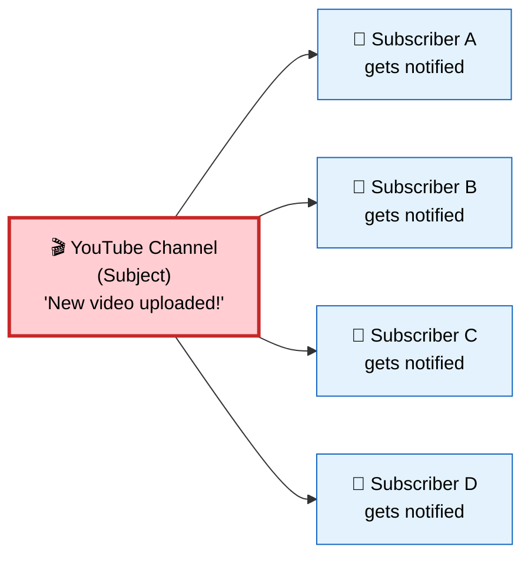
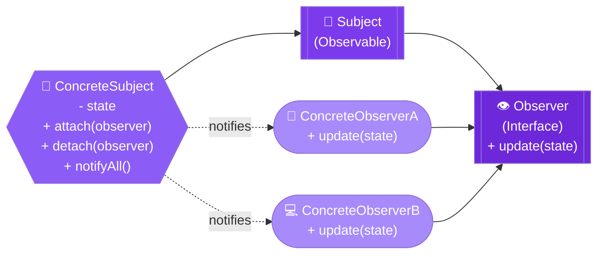
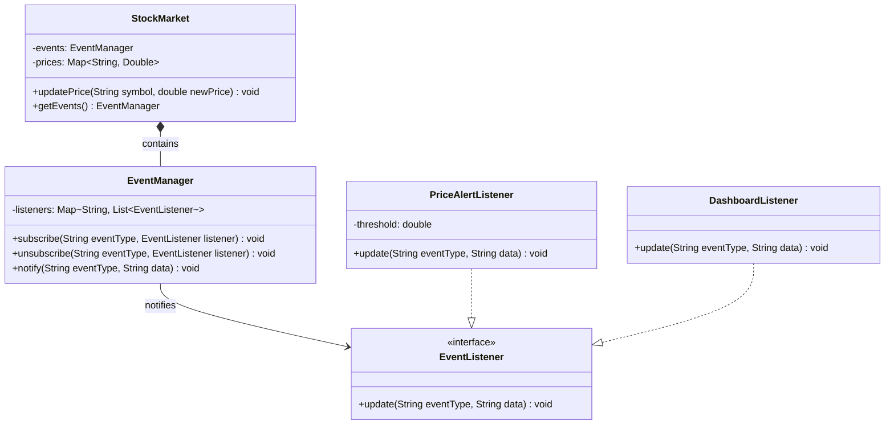

# 👁️ Observer Design Pattern

> **Define a one-to-many dependency between objects so that when one object changes state, all its dependents are notified and updated automatically.**

---

## 🌍 Real-World Analogy

!!! abstract "Analogy — YouTube Subscriptions"
    Think of a YouTube channel. When you **subscribe** to a channel, you get notified every time a new video is uploaded. You don't need to keep checking — the channel (Subject) pushes notifications to all subscribers (Observers). You can unsubscribe anytime, and new subscribers can join without affecting others.



---

## 🏗️ Pattern Structure



---

## UML Class Diagram



---

## ❓ The Problem

You have an object whose state changes matter to other objects, but:

- You don't know **how many** objects care about the changes at compile time
- You don't want to **tightly couple** the subject to its dependents
- Polling for changes wastes resources and creates lag
- Adding new listeners should not require modifying the subject

**Example:** A stock trading platform where price changes need to update charts, alerts, portfolio views, and third-party integrations — all independently.

---

## ✅ The Solution

The Observer pattern establishes a **subscription mechanism** where:

1. The **Subject** maintains a list of observers and provides methods to subscribe/unsubscribe
2. When state changes, the subject **iterates** through observers and calls their `update()` method
3. Observers implement a common interface so the subject doesn't know their concrete types
4. This achieves **loose coupling** — subject and observers can vary independently

---

## 💻 Implementation

=== "Push Model"

    ```java
    // Observer interface
    public interface EventListener {
        void update(String eventType, String data);
    }

    // Concrete Subject - Event Manager
    public class EventManager {
        private final Map<String, List<EventListener>> listeners = new HashMap<>();

        public EventManager(String... operations) {
            for (String operation : operations) {
                listeners.put(operation, new ArrayList<>());
            }
        }

        public void subscribe(String eventType, EventListener listener) {
            listeners.get(eventType).add(listener);
        }

        public void unsubscribe(String eventType, EventListener listener) {
            listeners.get(eventType).remove(listener);
        }

        public void notify(String eventType, String data) {
            for (EventListener listener : listeners.get(eventType)) {
                listener.update(eventType, data);
            }
        }
    }

    // Concrete Subject using EventManager
    public class StockMarket {
        private final EventManager events;
        private Map<String, Double> prices = new HashMap<>();

        public StockMarket() {
            this.events = new EventManager("priceChange", "newStock");
        }

        public void updatePrice(String symbol, double newPrice) {
            prices.put(symbol, newPrice);
            events.notify("priceChange", symbol + ":" + newPrice);
        }

        public EventManager getEvents() {
            return events;
        }
    }

    // Concrete Observers
    public class PriceAlertListener implements EventListener {
        private final double threshold;

        public PriceAlertListener(double threshold) {
            this.threshold = threshold;
        }

        @Override
        public void update(String eventType, String data) {
            String[] parts = data.split(":");
            double price = Double.parseDouble(parts[1]);
            if (price > threshold) {
                System.out.println("⚠️ ALERT: " + parts[0] + " exceeded $" + threshold);
            }
        }
    }

    public class DashboardListener implements EventListener {
        @Override
        public void update(String eventType, String data) {
            System.out.println("📊 Dashboard updated: " + data);
        }
    }

    // Usage
    public class Main {
        public static void main(String[] args) {
            StockMarket market = new StockMarket();

            market.getEvents().subscribe("priceChange", new PriceAlertListener(150.0));
            market.getEvents().subscribe("priceChange", new DashboardListener());

            market.updatePrice("AAPL", 155.0);
            // Output:
            // ⚠️ ALERT: AAPL exceeded $150.0
            // 📊 Dashboard updated: AAPL:155.0
        }
    }
    ```

=== "Pull Model"

    ```java
    // Observer pulls data from subject when notified
    public interface Observer {
        void update(Observable subject);
    }

    public abstract class Observable {
        private final List<Observer> observers = new ArrayList<>();

        public void addObserver(Observer o) { observers.add(o); }
        public void removeObserver(Observer o) { observers.remove(o); }

        protected void notifyObservers() {
            for (Observer o : observers) {
                o.update(this);  // Pass self — observer pulls what it needs
            }
        }
    }

    public class WeatherStation extends Observable {
        private double temperature;
        private double humidity;

        public void setMeasurements(double temp, double humidity) {
            this.temperature = temp;
            this.humidity = humidity;
            notifyObservers();
        }

        public double getTemperature() { return temperature; }
        public double getHumidity() { return humidity; }
    }

    public class PhoneDisplay implements Observer {
        @Override
        public void update(Observable subject) {
            if (subject instanceof WeatherStation ws) {
                System.out.println("📱 Phone: " + ws.getTemperature() + "°C");
            }
        }
    }
    ```

---

## 🎯 When to Use

- When changes to one object require changing others, and you don't know how many objects need to change
- When an object should notify other objects without making assumptions about who they are
- When you need a **publish-subscribe** mechanism within your application
- When you want to decouple the sender of a notification from its receivers
- When the set of observers changes dynamically at runtime

---

## 🏭 Real-World Examples

| Framework/Library | Usage |
|---|---|
| **Java `java.util.Observer`** | Built-in (deprecated in Java 9, but foundational) |
| **Spring `ApplicationEventPublisher`** | Application events and `@EventListener` |
| **Java Swing** | `ActionListener`, `MouseListener`, all GUI listeners |
| **RxJava / Project Reactor** | Reactive streams are built on Observer |
| **Kafka Consumer Groups** | Pub/sub at distributed scale |
| **JavaBeans `PropertyChangeListener`** | Property change notifications |
| **Jakarta CDI Events** | `@Observes` annotation |

---

## ⚠️ Pitfalls

!!! warning "Common Mistakes"
    - **Memory leaks** — Forgetting to unsubscribe observers (especially in long-lived subjects). Use `WeakReference` or explicit cleanup.
    - **Unexpected update order** — Don't rely on notification order; observers should be independent.
    - **Cascade updates** — Observer A updates Subject B which notifies Observer C... infinite loops are possible.
    - **Thread safety** — `CopyOnWriteArrayList` or synchronization needed in concurrent environments.
    - **Performance** — Notifying thousands of observers synchronously blocks the thread. Consider async notification.
    - **Lapsed listener problem** — In GC languages, registered listeners prevent garbage collection.

---

## 📝 Key Takeaways

!!! tip "Summary"
    - Observer establishes a **one-to-many** dependency with loose coupling
    - Subject knows observers only through a common interface — **Open/Closed Principle**
    - Prefer **composition** (EventManager) over inheritance for subjects
    - In modern Java, consider `Flow.Publisher`/`Flow.Subscriber` (Java 9+) or reactive libraries
    - The pattern is the foundation of **event-driven architectures** and **reactive programming**
    - Push model sends data; Pull model lets observers fetch what they need — choose based on your use case
