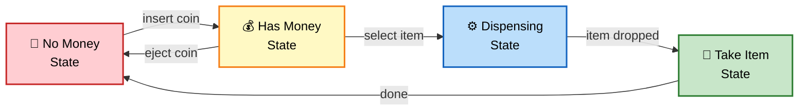
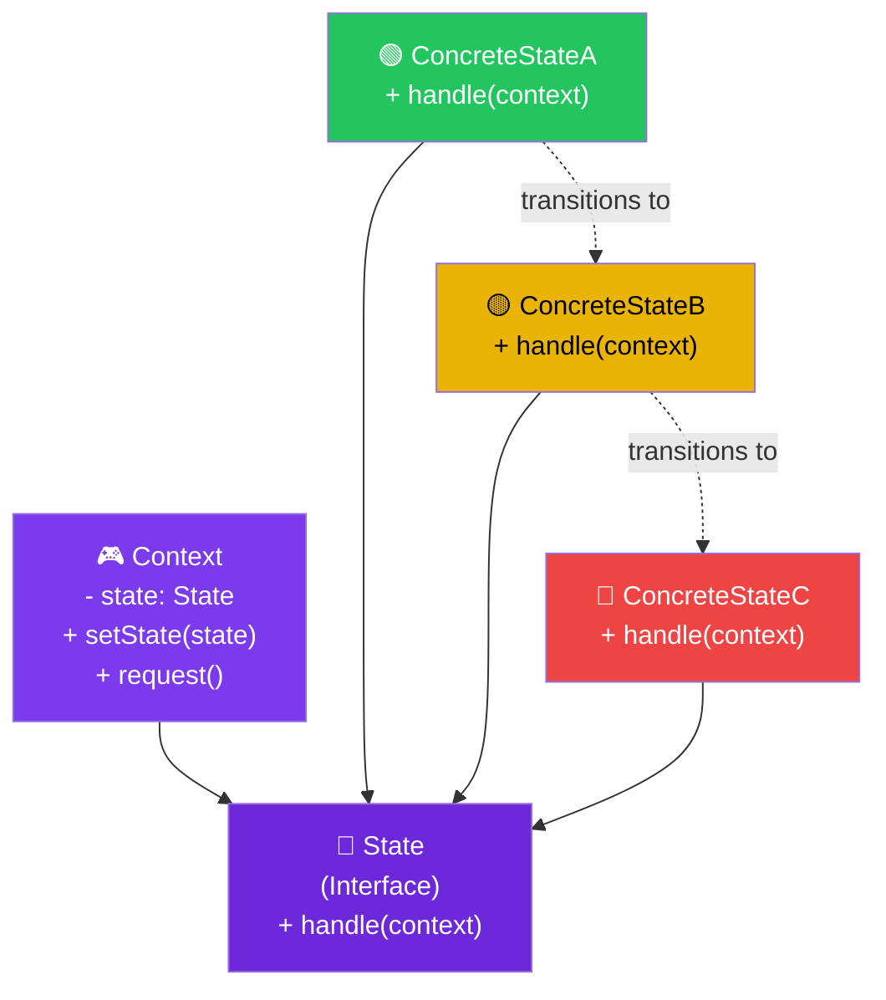

# 🔄 State Design Pattern

> **Allow an object to alter its behavior when its internal state changes. The object will appear to change its class.**

---

## 🌍 Real-World Analogy

!!! abstract "Analogy — Vending Machine"
    A vending machine behaves differently based on its **state**. When it has no money inserted, pressing the dispense button does nothing. When money is inserted, it shows available items. When an item is selected, it dispenses and returns change. Same buttons, completely different behavior — depending on the machine's current state.



---

## 🏗️ Pattern Structure



---

## ❓ The Problem

An object's behavior depends on its state, and it must change behavior at runtime:

- You have **large conditional blocks** (`if/switch`) checking the current state before every action
- Adding a new state means modifying **every method** that has state-dependent behavior
- State transitions are scattered throughout the code and hard to track
- The same transitions exist in multiple places — violating DRY

**Example:** An order processing system where an order goes through PENDING, CONFIRMED, SHIPPED, DELIVERED, CANCELLED — each with different allowed operations.

---

## ✅ The Solution

The State pattern extracts state-specific behavior into **separate state classes**:

1. Define a **State interface** with methods for all state-dependent behavior
2. Create **Concrete State** classes, one per state, implementing the behavior for that state
3. The **Context** holds a reference to the current state object and delegates behavior to it
4. State transitions happen by **replacing** the current state object with another

---

## 💻 Implementation

=== "Order Processing System"

    ```java
    // State interface
    public interface OrderState {
        void next(Order order);
        void previous(Order order);
        void cancel(Order order);
        String getStatus();
    }

    // Context
    public class Order {
        private OrderState state;
        private final String orderId;

        public Order(String orderId) {
            this.orderId = orderId;
            this.state = new PendingState(); // Initial state
        }

        public void setState(OrderState state) {
            System.out.println("📦 Order " + orderId + ": " +
                this.state.getStatus() + " → " + state.getStatus());
            this.state = state;
        }

        public void nextStep() { state.next(this); }
        public void previousStep() { state.previous(this); }
        public void cancel() { state.cancel(this); }
        public String getStatus() { return state.getStatus(); }
    }

    // Concrete States
    public class PendingState implements OrderState {
        @Override
        public void next(Order order) {
            order.setState(new ConfirmedState());
        }

        @Override
        public void previous(Order order) {
            System.out.println("⚠️ Already at initial state");
        }

        @Override
        public void cancel(Order order) {
            order.setState(new CancelledState());
        }

        @Override
        public String getStatus() { return "PENDING"; }
    }

    public class ConfirmedState implements OrderState {
        @Override
        public void next(Order order) {
            order.setState(new ShippedState());
        }

        @Override
        public void previous(Order order) {
            order.setState(new PendingState());
        }

        @Override
        public void cancel(Order order) {
            order.setState(new CancelledState());
        }

        @Override
        public String getStatus() { return "CONFIRMED"; }
    }

    public class ShippedState implements OrderState {
        @Override
        public void next(Order order) {
            order.setState(new DeliveredState());
        }

        @Override
        public void previous(Order order) {
            order.setState(new ConfirmedState());
        }

        @Override
        public void cancel(Order order) {
            System.out.println("❌ Cannot cancel — already shipped!");
        }

        @Override
        public String getStatus() { return "SHIPPED"; }
    }

    public class DeliveredState implements OrderState {
        @Override
        public void next(Order order) {
            System.out.println("✅ Order complete — no further steps");
        }

        @Override
        public void previous(Order order) {
            System.out.println("❌ Cannot revert — already delivered");
        }

        @Override
        public void cancel(Order order) {
            System.out.println("❌ Cannot cancel — already delivered");
        }

        @Override
        public String getStatus() { return "DELIVERED"; }
    }

    public class CancelledState implements OrderState {
        @Override
        public void next(Order order) {
            System.out.println("❌ Order cancelled — no transitions allowed");
        }

        @Override
        public void previous(Order order) {
            System.out.println("❌ Order cancelled — no transitions allowed");
        }

        @Override
        public void cancel(Order order) {
            System.out.println("⚠️ Already cancelled");
        }

        @Override
        public String getStatus() { return "CANCELLED"; }
    }

    // Usage
    public class Main {
        public static void main(String[] args) {
            Order order = new Order("ORD-001");

            order.nextStep();     // PENDING → CONFIRMED
            order.nextStep();     // CONFIRMED → SHIPPED
            order.cancel();       // ❌ Cannot cancel — already shipped!
            order.nextStep();     // SHIPPED → DELIVERED
            order.nextStep();     // ✅ Order complete — no further steps
        }
    }
    ```

=== "Media Player States"

    ```java
    // State interface
    public interface PlayerState {
        void play(MediaPlayer player);
        void pause(MediaPlayer player);
        void stop(MediaPlayer player);
    }

    public class MediaPlayer {
        private PlayerState state;
        private String currentTrack;

        public MediaPlayer() {
            this.state = new StoppedState();
        }

        public void setState(PlayerState state) { this.state = state; }
        public void setCurrentTrack(String track) { this.currentTrack = track; }
        public String getCurrentTrack() { return currentTrack; }

        public void play() { state.play(this); }
        public void pause() { state.pause(this); }
        public void stop() { state.stop(this); }
    }

    public class StoppedState implements PlayerState {
        @Override
        public void play(MediaPlayer player) {
            System.out.println("▶️ Playing: " + player.getCurrentTrack());
            player.setState(new PlayingState());
        }

        @Override
        public void pause(MediaPlayer player) {
            System.out.println("⚠️ Can't pause — nothing playing");
        }

        @Override
        public void stop(MediaPlayer player) {
            System.out.println("⚠️ Already stopped");
        }
    }

    public class PlayingState implements PlayerState {
        @Override
        public void play(MediaPlayer player) {
            System.out.println("⚠️ Already playing");
        }

        @Override
        public void pause(MediaPlayer player) {
            System.out.println("⏸️ Paused");
            player.setState(new PausedState());
        }

        @Override
        public void stop(MediaPlayer player) {
            System.out.println("⏹️ Stopped");
            player.setState(new StoppedState());
        }
    }

    public class PausedState implements PlayerState {
        @Override
        public void play(MediaPlayer player) {
            System.out.println("▶️ Resuming: " + player.getCurrentTrack());
            player.setState(new PlayingState());
        }

        @Override
        public void pause(MediaPlayer player) {
            System.out.println("⚠️ Already paused");
        }

        @Override
        public void stop(MediaPlayer player) {
            System.out.println("⏹️ Stopped");
            player.setState(new StoppedState());
        }
    }
    ```

---

## 🎯 When to Use

- When an object's behavior depends on its state and must change at runtime
- When you have **large conditionals** that switch behavior based on the object's state
- When state transitions have complex rules and you want them explicit
- When you want to model a **finite state machine** in an object-oriented way
- When state-specific behavior should be extensible (new states without modifying existing ones)

---

## 🏭 Real-World Examples

| Framework/Library | Usage |
|---|---|
| **Java `Thread.State`** | NEW, RUNNABLE, BLOCKED, WAITING, TERMINATED |
| **Spring State Machine** | `spring-statemachine` — full state machine framework |
| **JSF Lifecycle** | Request processing phases as states |
| **TCP Connection** | LISTEN, ESTABLISHED, CLOSE_WAIT, etc. |
| **Workflow Engines (Camunda, Activiti)** | Task states in BPMN processes |
| **Iterator** | Internal state tracks position (has next, exhausted) |

---

## ⚠️ Pitfalls

!!! warning "Common Mistakes"
    - **State explosion** — Too many states with too many transitions becomes unmanageable. Consider a state machine library for complex cases.
    - **Hardcoded transitions** — State classes directly instantiate the next state. Use a transition table for flexibility.
    - **Shared state objects** — If state objects are shared (flyweight), ensure they are **stateless**. Otherwise, create new instances.
    - **Context coupling** — State objects need a reference to the context for transitions, creating a circular dependency. Keep the interface minimal.
    - **Forgetting terminal states** — Always define behavior for terminal states (delivered, cancelled) to prevent illegal transitions.

---

## 📝 Key Takeaways

!!! tip "Summary"
    - State eliminates complex conditionals by delegating behavior to **state objects**
    - Each state class handles only its own behavior — **Single Responsibility Principle**
    - New states are added without modifying existing state classes — **Open/Closed Principle**
    - State is similar to Strategy, but states know about each other and trigger **transitions**
    - For complex state machines, prefer dedicated libraries (Spring State Machine) over hand-rolling
    - The pattern makes state transitions **explicit and traceable** — invaluable for debugging
