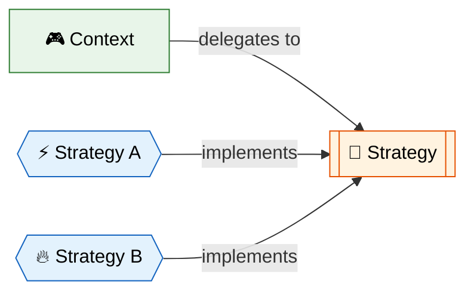
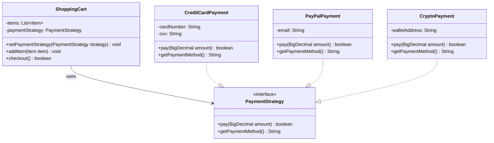

# 🎯 Strategy Design Pattern

> **Define a family of algorithms, encapsulate each one, and make them interchangeable. Strategy lets the algorithm vary independently from the clients that use it.**

---

## 🌍 Real-World Analogy

!!! abstract "Analogy — GPS Navigation"
    Think of a GPS navigation app like Google Maps. You choose a **routing strategy** — fastest route, shortest distance, avoid tolls, or scenic route. The app (context) doesn't change; only the **algorithm** for computing the route changes. You can switch strategies at runtime based on your preference.


---

## 🏗️ Pattern Structure



---

## UML Class Diagram



---

## ❓ The Problem

You need different variants of an algorithm within an object, and you want to switch between them at runtime. Without Strategy:

- You end up with massive `if-else` or `switch` blocks in your code
- Adding a new algorithm means **modifying** existing classes (violates Open/Closed Principle)
- Testing individual algorithms in isolation becomes difficult
- Client code becomes tightly coupled to specific algorithm implementations

**Example:** A payment system that needs to support credit card, PayPal, cryptocurrency, and bank transfer — each with completely different processing logic.

### Without This Pattern

```java
public class ShoppingCart {
    public boolean checkout(String paymentType) {
        BigDecimal total = calculateTotal();
        if (paymentType.equals("CREDIT_CARD")) {
            // 20 lines of credit card processing logic
            System.out.println("Charging credit card...");
            return processCreditCard(total);
        } else if (paymentType.equals("PAYPAL")) {
            // 20 lines of PayPal API logic
            System.out.println("PayPal transfer...");
            return processPayPal(total);
        } else if (paymentType.equals("CRYPTO")) {
            // 20 lines of crypto wallet logic
            System.out.println("Crypto payment...");
            return processCrypto(total);
        }
        // Adding Apple Pay? Modify this method AGAIN.
        throw new IllegalArgumentException("Unknown payment: " + paymentType);
    }
}
```

- **Violates Open/Closed Principle** — adding a new payment method (e.g., Apple Pay) forces editing the `checkout()` method
- **Massive conditional blocks** — the method grows to hundreds of lines with unrelated logic jumbled together
- **Impossible to unit test in isolation** — you cannot test PayPal logic without instantiating the entire `ShoppingCart`
- **Violates Single Responsibility** — `ShoppingCart` knows how to process credit cards, PayPal, AND crypto
- **Pain point:** A bug fix in crypto payment logic requires touching the same file that handles credit cards, risking regressions across all payment types

---

## ✅ The Solution

The Strategy pattern suggests:

1. Extract each algorithm into its own class implementing a common **Strategy interface**
2. The **Context** holds a reference to a strategy and delegates work to it
3. Clients configure the context with the desired strategy at runtime
4. New algorithms are added by creating new strategy classes — **no existing code changes**

---

## 💻 Implementation

=== "Classic Strategy"

    ```java
    // Strategy interface
    public interface PaymentStrategy {
        boolean pay(BigDecimal amount);
        String getPaymentMethod();
    }

    // Concrete Strategies
    public class CreditCardPayment implements PaymentStrategy {
        private final String cardNumber;
        private final String cvv;

        public CreditCardPayment(String cardNumber, String cvv) {
            this.cardNumber = cardNumber;
            this.cvv = cvv;
        }

        @Override
        public boolean pay(BigDecimal amount) {
            System.out.println("💳 Charged $" + amount + " to card ending " +
                cardNumber.substring(cardNumber.length() - 4));
            return true;
        }

        @Override
        public String getPaymentMethod() { return "Credit Card"; }
    }

    public class PayPalPayment implements PaymentStrategy {
        private final String email;

        public PayPalPayment(String email) {
            this.email = email;
        }

        @Override
        public boolean pay(BigDecimal amount) {
            System.out.println("🅿️ PayPal transfer of $" + amount + " from " + email);
            return true;
        }

        @Override
        public String getPaymentMethod() { return "PayPal"; }
    }

    public class CryptoPayment implements PaymentStrategy {
        private final String walletAddress;

        public CryptoPayment(String walletAddress) {
            this.walletAddress = walletAddress;
        }

        @Override
        public boolean pay(BigDecimal amount) {
            System.out.println("₿ Crypto payment of $" + amount + " from wallet " +
                walletAddress.substring(0, 8) + "...");
            return true;
        }

        @Override
        public String getPaymentMethod() { return "Cryptocurrency"; }
    }

    // Context
    public class ShoppingCart {
        private final List<Item> items = new ArrayList<>();
        private PaymentStrategy paymentStrategy;

        public void setPaymentStrategy(PaymentStrategy strategy) {
            this.paymentStrategy = strategy;
        }

        public void addItem(Item item) {
            items.add(item);
        }

        public boolean checkout() {
            BigDecimal total = items.stream()
                .map(Item::getPrice)
                .reduce(BigDecimal.ZERO, BigDecimal::add);

            System.out.println("Total: $" + total + " via " + paymentStrategy.getPaymentMethod());
            return paymentStrategy.pay(total);
        }
    }

    // Usage
    public class Main {
        public static void main(String[] args) {
            ShoppingCart cart = new ShoppingCart();
            cart.addItem(new Item("Laptop", new BigDecimal("999.99")));
            cart.addItem(new Item("Mouse", new BigDecimal("29.99")));

            // Customer chooses payment at checkout
            cart.setPaymentStrategy(new CreditCardPayment("4111111111111234", "123"));
            cart.checkout();

            // Or switch strategy
            cart.setPaymentStrategy(new PayPalPayment("user@example.com"));
            cart.checkout();
        }
    }
    ```

=== "Modern Java (Functional)"

    ```java
    // Strategy as functional interface
    @FunctionalInterface
    public interface CompressionStrategy {
        byte[] compress(byte[] data);
    }

    // Context with lambda strategies
    public class FileCompressor {
        private CompressionStrategy strategy;

        public void setStrategy(CompressionStrategy strategy) {
            this.strategy = strategy;
        }

        public byte[] compress(byte[] data) {
            Objects.requireNonNull(strategy, "Compression strategy not set");
            return strategy.compress(data);
        }
    }

    // Usage with lambdas — no separate classes needed!
    public class Main {
        public static void main(String[] args) {
            FileCompressor compressor = new FileCompressor();

            // ZIP strategy
            compressor.setStrategy(data -> {
                // ZIP compression logic
                System.out.println("📦 ZIP compression applied");
                return zipCompress(data);
            });

            // GZIP strategy
            compressor.setStrategy(data -> {
                System.out.println("🗜️ GZIP compression applied");
                return gzipCompress(data);
            });

            // Strategy from method reference
            compressor.setStrategy(CompressionUtils::lz4Compress);
        }
    }
    ```

---

## 🎯 When to Use

- When you have multiple algorithms for a specific task and want to switch between them at runtime
- When you have a lot of `if-else` or `switch` statements selecting behavior — replace with Strategy
- When you want to isolate algorithm logic from the code that uses it
- When different variants of an algorithm are needed and new ones may be added in the future
- When algorithm details should be hidden from clients (encapsulation)

---

## 🏭 Real-World Examples

| Framework/Library | Usage |
|---|---|
| **`java.util.Comparator`** | Sorting strategy passed to `Collections.sort()` |
| **`javax.servlet.Filter`** | Different filtering strategies for HTTP requests |
| **Spring `Resource`** | `ClassPathResource`, `FileSystemResource`, `UrlResource` |
| **Spring Security `AuthenticationProvider`** | Different authentication strategies |
| **`java.util.concurrent.RejectedExecutionHandler`** | Thread pool rejection strategies |
| **Kafka `Partitioner`** | Custom partitioning strategies |
| **Jackson `SerializationFeature`** | Serialization strategies |

---

## ⚠️ Pitfalls

!!! warning "Common Mistakes"
    - **Over-engineering** — If you only have 2 strategies that never change, a simple `if-else` may be clearer.
    - **Strategy explosion** — Too many fine-grained strategies make the codebase harder to navigate.
    - **Client must know strategies** — Client needs to understand the differences to pick the right one.
    - **Increased object count** — Each strategy is a separate object (mitigate with lambdas in Java 8+).
    - **State in strategies** — Strategies should ideally be stateless and reusable; if they hold state, sharing them across contexts becomes risky.

---

## 📝 Key Takeaways

!!! tip "Summary"
    - Strategy eliminates conditional statements by delegating to **polymorphic** algorithm objects
    - Follows **Open/Closed Principle** — add new strategies without modifying existing code
    - In modern Java, use **functional interfaces + lambdas** for lightweight strategies
    - Strategy is selected at **runtime** (vs. Template Method which is fixed at compile time via inheritance)
    - Combined with a **Factory**, clients don't even need to know concrete strategy classes
    - Composition over inheritance — the Context **has-a** strategy rather than **is-a** relationship
