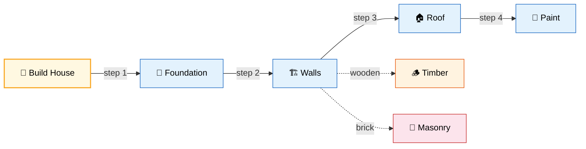
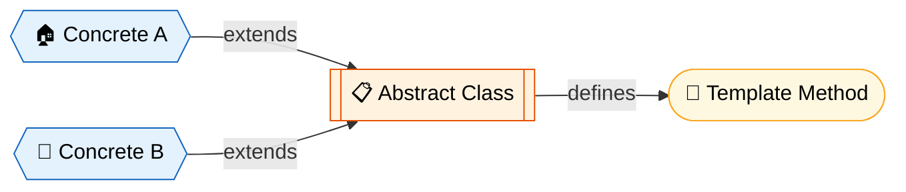
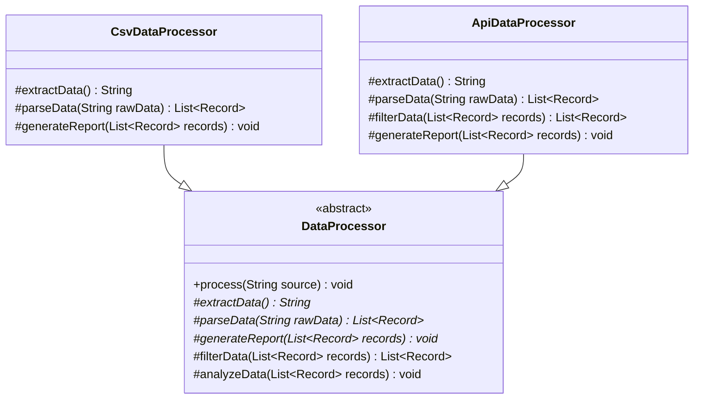

# 📋 Template Method Design Pattern

> **Define the skeleton of an algorithm in an operation, deferring some steps to subclasses. Template Method lets subclasses redefine certain steps of an algorithm without changing the algorithm's structure.**

---

## 🌍 Real-World Analogy

!!! abstract "Analogy — Building a House"
    Every house follows the same construction **template**: lay foundation, build walls, install roof, add windows, paint. But a **wooden house** uses timber frames while a **brick house** uses masonry. The **overall process** (template) stays the same; only specific **steps** differ between types. The architect defines the template; the builders customize the steps.



---

## 🏗️ Pattern Structure



---

## UML Class Diagram



---

## ❓ The Problem

You have multiple classes that follow a **similar algorithm** but differ in specific steps:

- Code is **duplicated** across classes for the shared steps
- Changing the algorithm structure requires modifying **every** implementation
- No way to enforce that subclasses follow the correct **order of operations**
- Adding a new variant requires copying the entire algorithm

**Example:** Data mining from different file formats (CSV, PDF, DOCX) — the overall process (open, extract, parse, analyze, report) is the same but extraction differs.

### Without This Pattern

```java
public class CsvDataProcessor {
    public void process(String source) {
        System.out.println("Opening: " + source);       // duplicated
        String raw = extractCsvData();
        List<Record> records = parseCsvData(raw);
        System.out.println("Analyzing " + records.size()); // duplicated
        generateCsvReport(records);
        System.out.println("Cleanup complete");           // duplicated
    }
}

public class ApiDataProcessor {
    public void process(String source) {
        System.out.println("Opening: " + source);       // SAME as above
        String raw = fetchFromApi();
        List<Record> records = parseJsonData(raw);
        System.out.println("Analyzing " + records.size()); // SAME
        generateApiReport(records);
        System.out.println("Cleanup complete");           // SAME
    }
    // If the algorithm order changes, you must fix BOTH classes.
}
```

- **Code duplication** — shared steps (open, analyze, cleanup) are copy-pasted across every variant; a bug fix must be applied N times
- **No enforced order** — nothing prevents a subclass from calling steps in the wrong order (e.g., reporting before parsing)
- **Violates DRY** — adding a new step (e.g., validation) requires editing every processor class identically
- **Divergence risk** — over time, duplicated algorithms drift apart as developers modify one but forget the other
- **Pain point:** A security team mandates adding an audit log step between parse and analyze. Without a template, you must find and modify every processor variant — and if you miss one, it ships without the audit

---

## ✅ The Solution

The Template Method pattern puts the algorithm in a **base class method** (the template):

1. Define the template method in the **abstract class** — it calls steps in order
2. Make the template method `final` to prevent subclasses from changing the structure
3. Mark customizable steps as `abstract` — subclasses **must** implement these
4. Provide **hooks** — optional steps with default (often empty) implementations

---

## 💻 Implementation

=== "Data Processing Pipeline"

    ```java
    // Abstract class with template method
    public abstract class DataProcessor {

        // Template method — defines the algorithm skeleton
        public final void process(String source) {
            openSource(source);
            String rawData = extractData();
            List<Record> records = parseData(rawData);
            List<Record> filtered = filterData(records);  // Hook with default
            analyzeData(filtered);
            generateReport(filtered);
            cleanup();
        }

        // Concrete steps (shared)
        private void openSource(String source) {
            System.out.println("📂 Opening: " + source);
        }

        private void cleanup() {
            System.out.println("🧹 Cleanup complete");
        }

        // Abstract steps — subclasses MUST implement
        protected abstract String extractData();
        protected abstract List<Record> parseData(String rawData);
        protected abstract void generateReport(List<Record> records);

        // Hook — optional override (default does nothing)
        protected List<Record> filterData(List<Record> records) {
            return records; // No filtering by default
        }

        // Hook — optional override
        protected void analyzeData(List<Record> records) {
            System.out.println("📊 Analyzing " + records.size() + " records");
        }
    }

    // Concrete implementation — CSV
    public class CsvDataProcessor extends DataProcessor {
        @Override
        protected String extractData() {
            System.out.println("📄 Extracting CSV data");
            return "name,age,city\nAlice,30,NYC\nBob,25,LA";
        }

        @Override
        protected List<Record> parseData(String rawData) {
            String[] lines = rawData.split("\n");
            String[] headers = lines[0].split(",");
            List<Record> records = new ArrayList<>();
            for (int i = 1; i < lines.length; i++) {
                records.add(new Record(headers, lines[i].split(",")));
            }
            return records;
        }

        @Override
        protected void generateReport(List<Record> records) {
            System.out.println("📊 CSV Report: " + records.size() + " rows processed");
        }
    }

    // Concrete implementation — JSON API
    public class ApiDataProcessor extends DataProcessor {
        @Override
        protected String extractData() {
            System.out.println("🌐 Fetching data from REST API");
            return "[{\"name\":\"Alice\"},{\"name\":\"Bob\"}]";
        }

        @Override
        protected List<Record> parseData(String rawData) {
            // Parse JSON array
            ObjectMapper mapper = new ObjectMapper();
            return mapper.readValue(rawData, new TypeReference<>() {});
        }

        @Override
        protected List<Record> filterData(List<Record> records) {
            // Override hook — filter inactive records
            return records.stream()
                .filter(Record::isActive)
                .collect(Collectors.toList());
        }

        @Override
        protected void generateReport(List<Record> records) {
            System.out.println("📈 API Report: " + records.size() + " active records");
        }
    }

    // Usage
    public class Main {
        public static void main(String[] args) {
            DataProcessor csvProcessor = new CsvDataProcessor();
            csvProcessor.process("data/users.csv");

            DataProcessor apiProcessor = new ApiDataProcessor();
            apiProcessor.process("https://api.example.com/users");
        }
    }
    ```

=== "Game Character with Hooks"

    ```java
    // Abstract game character with template
    public abstract class GameCharacter {

        // Template method
        public final void performTurn() {
            beginTurn();
            if (canAttack()) {    // Hook
                attack();
            }
            move();
            useSpecialAbility();  // Abstract
            endTurn();
        }

        // Concrete steps
        private void beginTurn() { System.out.println("--- Turn Start ---"); }
        private void endTurn() { System.out.println("--- Turn End ---\n"); }

        // Abstract steps
        protected abstract void attack();
        protected abstract void move();
        protected abstract void useSpecialAbility();

        // Hook — default returns true, can be overridden
        protected boolean canAttack() { return true; }
    }

    public class Warrior extends GameCharacter {
        @Override
        protected void attack() {
            System.out.println("⚔️ Warrior swings sword!");
        }

        @Override
        protected void move() {
            System.out.println("🚶 Warrior advances 3 tiles");
        }

        @Override
        protected void useSpecialAbility() {
            System.out.println("🛡️ Warrior raises shield — defense +50%");
        }
    }

    public class Mage extends GameCharacter {
        private int mana = 0;

        @Override
        protected void attack() {
            System.out.println("🔥 Mage casts fireball!");
        }

        @Override
        protected void move() {
            System.out.println("✨ Mage teleports 5 tiles");
        }

        @Override
        protected void useSpecialAbility() {
            System.out.println("💫 Mage regenerates mana");
            mana += 20;
        }

        @Override
        protected boolean canAttack() {
            return mana >= 10; // Hook — can't attack without mana
        }
    }
    ```

---

## 🎯 When to Use

- When you have multiple classes with **similar algorithms** that differ only in certain steps
- When you want to **enforce** a specific order of operations
- When you want to let subclasses **extend** specific steps without changing structure
- When you want to **eliminate code duplication** by pulling shared logic into a base class
- When you need **hooks** — optional extension points for subclasses

---

## 🏭 Real-World Examples

| Framework/Library | Usage |
|---|---|
| **`java.util.AbstractList`** | `get()` and `size()` are abstract; `indexOf()`, `iterator()` are template methods |
| **`java.io.InputStream`** | `read()` is abstract; `read(byte[], int, int)` is the template |
| **Spring `JdbcTemplate`** | Template for JDBC operations — you provide the query and row mapper |
| **Spring `RestTemplate`** | Template for HTTP calls |
| **Spring `AbstractController`** | `handleRequest()` is the template |
| **JUnit `TestCase`** | `setUp()`, `runTest()`, `tearDown()` is the template |
| **Servlet `HttpServlet`** | `service()` is template; `doGet()`, `doPost()` are hooks |

---

## ⚠️ Pitfalls

!!! warning "Common Mistakes"
    - **Fragile base class** — Changes to the abstract class can break all subclasses. Keep the template stable.
    - **Too many abstract steps** — If every step is abstract, you lose the benefit. The template should have shared logic.
    - **Forgetting `final`** — If the template method isn't `final`, subclasses can override it and break the algorithm.
    - **Deep inheritance** — Template Method relies on inheritance; deep hierarchies become brittle. Prefer one level.
    - **Confusing hooks vs. abstract** — Make it clear which steps are optional (hooks) vs. required (abstract).

---

## 📝 Key Takeaways

!!! tip "Summary"
    - Template Method defines the **algorithm skeleton** in a base class; subclasses fill in the details
    - Uses **inheritance** — the template method calls abstract/hook methods overridden by subclasses
    - Mark template methods as `final` to prevent subclasses from changing the workflow
    - **Hooks** are optional extension points with default implementations
    - Template Method uses inheritance (compile-time); **Strategy** uses composition (runtime) — pick based on flexibility needs
    - The "Hollywood Principle" — don't call us, we'll call you (the framework calls your code)
