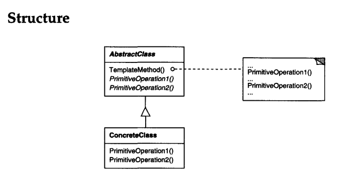

Intent
--------
Define the skeleton of an algorithm in an operation, deferring some steps to
subclasses.
Template Method lets subclasses redefine certain steps of an algorithm
without changing the algorithm's structure.

The template methodology is adopted in frameworks, in which each applies the domain's immutable
components while allowing "placeholders" for modification choices.

For the reasons listed below, the template technique is used:

1. Template method design pattern allows subclasses to specify behavioural patterns which are achieved by using the concept of method overriding.
2. To prevent code duplication, the overall workflow structure is applied once in the algorithm of the abstract class, as well as any changes are applied in the subclasses.
3. Limit the points at which subclassing is permitted. Unlike a basic polymorphic override, in which the underlying function is completely rebuilt,
   enabling drastic changes to the workflow, just the specifics of the process are permitted to alter.

AbstractClass (Application)
- defines abstract primitive operations that concrete subclasses define to
  implement steps of an algorithm.
- implements a template method defining the skeleton of an algorithm. The
  template method calls primitive operations as well as operations defined
  in AbstractClass or those of other objects.
  ConcreteClass (MyApplication)
- implements the primitive operations to carry out subclass-specific steps of the algorithm

**Examples**

1. House Construction
* buildFoundation();
* buildPillars();
* buildWalls();
* buildWindows();
2. Build Computer
* addMotherboard();
* setupMotherboard();
* addProcessor();