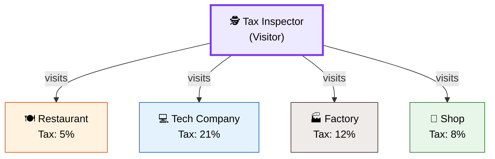
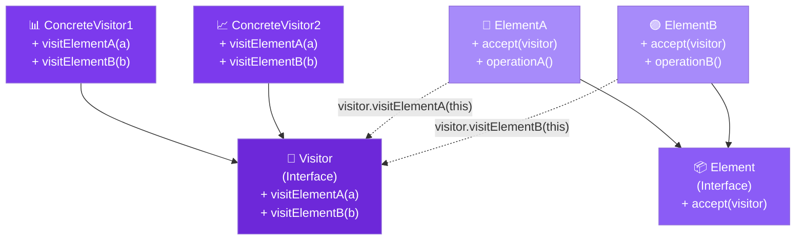

# 🚶 Visitor Design Pattern

> **Represent an operation to be performed on the elements of an object structure. Visitor lets you define a new operation without changing the classes of the elements on which it operates.**

---

## 🌍 Real-World Analogy

!!! abstract "Analogy — Tax Inspector"
    A tax inspector visits different types of businesses — restaurants, tech companies, factories. Each business type has different tax rules. The inspector (Visitor) applies different calculations depending on the business type, without the businesses needing to know tax logic. When tax law changes, you update the inspector — not every business class.



---

## 🏗️ Pattern Structure



---

## ❓ The Problem

You have a stable set of element classes but need to add **new operations** frequently:

- Adding a method to each element class for every new operation pollutes their interfaces
- The operation logic is **scattered** across multiple element classes
- Elements shouldn't know about every possible operation performed on them
- You need operations that work across **different types** of elements in a structure

**Example:** A document with paragraphs, images, and tables. You want to export to PDF, HTML, and plain text — each requiring different handling per element type. You don't want `toPDF()`, `toHTML()`, `toText()` on every element.

---

## ✅ The Solution

The Visitor pattern uses **double dispatch**:

1. **Visitor interface** — declares a `visit` method for each element type
2. **Concrete Visitors** — implement operations for all element types in one place
3. **Element interface** — declares `accept(Visitor)` method
4. **Concrete Elements** — implement `accept()` by calling `visitor.visit(this)`

The trick: `element.accept(visitor)` calls `visitor.visitConcreteElement(this)` — the actual method depends on **both** the element type and visitor type (double dispatch).

---

## 💻 Implementation

=== "Document Export System"

    ```java
    // Element hierarchy
    public interface DocumentElement {
        void accept(DocumentVisitor visitor);
    }

    public class Paragraph implements DocumentElement {
        private final String text;
        private final String style; // "heading", "body", "quote"

        public Paragraph(String text, String style) {
            this.text = text;
            this.style = style;
        }

        @Override
        public void accept(DocumentVisitor visitor) {
            visitor.visitParagraph(this);
        }

        public String getText() { return text; }
        public String getStyle() { return style; }
    }

    public class Image implements DocumentElement {
        private final String url;
        private final int width;
        private final int height;
        private final String altText;

        public Image(String url, int width, int height, String altText) {
            this.url = url;
            this.width = width;
            this.height = height;
            this.altText = altText;
        }

        @Override
        public void accept(DocumentVisitor visitor) {
            visitor.visitImage(this);
        }

        public String getUrl() { return url; }
        public int getWidth() { return width; }
        public int getHeight() { return height; }
        public String getAltText() { return altText; }
    }

    public class Table implements DocumentElement {
        private final String[][] data;
        private final String[] headers;

        public Table(String[] headers, String[][] data) {
            this.headers = headers;
            this.data = data;
        }

        @Override
        public void accept(DocumentVisitor visitor) {
            visitor.visitTable(this);
        }

        public String[][] getData() { return data; }
        public String[] getHeaders() { return headers; }
    }

    // Visitor interface
    public interface DocumentVisitor {
        void visitParagraph(Paragraph paragraph);
        void visitImage(Image image);
        void visitTable(Table table);
    }

    // Concrete Visitor — HTML Export
    public class HtmlExportVisitor implements DocumentVisitor {
        private final StringBuilder html = new StringBuilder();

        @Override
        public void visitParagraph(Paragraph p) {
            String tag = p.getStyle().equals("heading") ? "h1" : "p";
            html.append("<").append(tag).append(">")
                .append(p.getText())
                .append("</").append(tag).append(">\n");
        }

        @Override
        public void visitImage(Image img) {
            html.append(String.format("\n",
                img.getUrl(), img.getWidth(), img.getHeight(), img.getAltText()));
        }

        @Override
        public void visitTable(Table table) {
            html.append("<table>\n<tr>");
            for (String h : table.getHeaders()) {
                html.append("<th>").append(h).append("</th>");
            }
            html.append("</tr>\n");
            for (String[] row : table.getData()) {
                html.append("<tr>");
                for (String cell : row) {
                    html.append("<td>").append(cell).append("</td>");
                }
                html.append("</tr>\n");
            }
            html.append("</table>\n");
        }

        public String getHtml() { return html.toString(); }
    }

    // Concrete Visitor — Markdown Export
    public class MarkdownExportVisitor implements DocumentVisitor {
        private final StringBuilder md = new StringBuilder();

        @Override
        public void visitParagraph(Paragraph p) {
            if (p.getStyle().equals("heading")) {
                md.append("# ").append(p.getText()).append("\n\n");
            } else if (p.getStyle().equals("quote")) {
                md.append("> ").append(p.getText()).append("\n\n");
            } else {
                md.append(p.getText()).append("\n\n");
            }
        }

        @Override
        public void visitImage(Image img) {
            md.append(String.format("\n\n", img.getAltText(), img.getUrl()));
        }

        @Override
        public void visitTable(Table table) {
            md.append("| ").append(String.join(" | ", table.getHeaders())).append(" |\n");
            md.append("| ").append("--- | ".repeat(table.getHeaders().length)).append("\n");
            for (String[] row : table.getData()) {
                md.append("| ").append(String.join(" | ", row)).append(" |\n");
            }
            md.append("\n");
        }

        public String getMarkdown() { return md.toString(); }
    }

    // Concrete Visitor — Statistics
    public class StatisticsVisitor implements DocumentVisitor {
        private int wordCount = 0;
        private int imageCount = 0;
        private int tableCount = 0;

        @Override
        public void visitParagraph(Paragraph p) {
            wordCount += p.getText().split("\\s+").length;
        }

        @Override
        public void visitImage(Image img) { imageCount++; }

        @Override
        public void visitTable(Table table) { tableCount++; }

        public void printStats() {
            System.out.println("📊 Document Statistics:");
            System.out.println("  Words: " + wordCount);
            System.out.println("  Images: " + imageCount);
            System.out.println("  Tables: " + tableCount);
        }
    }

    // Usage
    public class Main {
        public static void main(String[] args) {
            List<DocumentElement> document = List.of(
                new Paragraph("Design Patterns", "heading"),
                new Paragraph("Visitor pattern separates operations from objects.", "body"),
                new Image("diagram.png", 800, 600, "Pattern diagram"),
                new Table(
                    new String[]{"Pattern", "Type"},
                    new String[][]{{"Visitor", "Behavioral"}, {"Factory", "Creational"}}
                )
            );

            // Export to HTML
            HtmlExportVisitor htmlVisitor = new HtmlExportVisitor();
            document.forEach(el -> el.accept(htmlVisitor));
            System.out.println(htmlVisitor.getHtml());

            // Export to Markdown
            MarkdownExportVisitor mdVisitor = new MarkdownExportVisitor();
            document.forEach(el -> el.accept(mdVisitor));
            System.out.println(mdVisitor.getMarkdown());

            // Gather statistics
            StatisticsVisitor statsVisitor = new StatisticsVisitor();
            document.forEach(el -> el.accept(statsVisitor));
            statsVisitor.printStats();
        }
    }
    ```

=== "Shopping Cart Pricing"

    ```java
    // Elements — different item types
    public interface ShopItem {
        void accept(PricingVisitor visitor);
    }

    public class Book implements ShopItem {
        private final String title;
        private final double price;

        public Book(String title, double price) {
            this.title = title;
            this.price = price;
        }

        @Override
        public void accept(PricingVisitor visitor) {
            visitor.visitBook(this);
        }

        public double getPrice() { return price; }
        public String getTitle() { return title; }
    }

    public class Electronics implements ShopItem {
        private final String name;
        private final double price;
        private final double weight; // kg

        public Electronics(String name, double price, double weight) {
            this.name = name;
            this.price = price;
            this.weight = weight;
        }

        @Override
        public void accept(PricingVisitor visitor) {
            visitor.visitElectronics(this);
        }

        public double getPrice() { return price; }
        public double getWeight() { return weight; }
    }

    // Visitor — different pricing strategies as visitors
    public interface PricingVisitor {
        void visitBook(Book book);
        void visitElectronics(Electronics electronics);
        double getTotal();
    }

    public class TaxCalculator implements PricingVisitor {
        private double total = 0;

        @Override
        public void visitBook(Book book) {
            total += book.getPrice() * 1.05; // 5% tax on books
        }

        @Override
        public void visitElectronics(Electronics e) {
            total += e.getPrice() * 1.18; // 18% tax on electronics
        }

        @Override
        public double getTotal() { return total; }
    }
    ```

---

## 🎯 When to Use

- When you need to perform **many unrelated operations** on objects in a structure
- When the object structure classes rarely change but you frequently **add new operations**
- When you want to keep related operations **together** in one class instead of spreading across elements
- When you need **double dispatch** — behavior depends on both the element type and the operation type
- When you want to **accumulate state** across a traversal of heterogeneous objects

---

## 🏭 Real-World Examples

| Framework/Library | Usage |
|---|---|
| **Java Compiler (AST)** | `javax.lang.model.element.ElementVisitor` for annotation processing |
| **`java.nio.file.FileVisitor`** | Visiting directory trees (`Files.walkFileTree()`) |
| **DOM/XML Parsers (SAX)** | Event-based visiting of XML nodes |
| **Apache Calcite** | SQL query plan visitors for optimization |
| **Hibernate** | Criteria visitors for query building |
| **ANTLR** | Parse tree visitors for language processing |
| **Spring Expression Language (SpEL)** | AST node visitors |

---

## ⚠️ Pitfalls

!!! warning "Common Mistakes"
    - **Adding new element types is expensive** — Every visitor must be updated with a new `visit` method. Use Visitor only when element types are stable.
    - **Breaking encapsulation** — Visitors often need access to element internals through public getters, partially exposing state.
    - **Complexity** — Double dispatch is not intuitive. Developers unfamiliar with the pattern find it confusing.
    - **Circular dependencies** — Visitor depends on all element types; elements depend on the visitor interface.
    - **Overuse** — If you only have one operation, a simple method on each element is clearer.

---

## 📝 Key Takeaways

!!! tip "Summary"
    - Visitor enables **adding new operations** without modifying element classes (Open/Closed Principle)
    - Uses **double dispatch** — `accept()` + `visit()` — to route calls based on both types
    - Best when element types are **stable** but operations change frequently
    - Each visitor class groups all logic for one operation — **Single Responsibility Principle**
    - Trade-off: easy to add operations, hard to add element types (inverse of polymorphism)
    - In modern Java, consider **pattern matching** (`instanceof` with patterns) as a simpler alternative for small hierarchies
