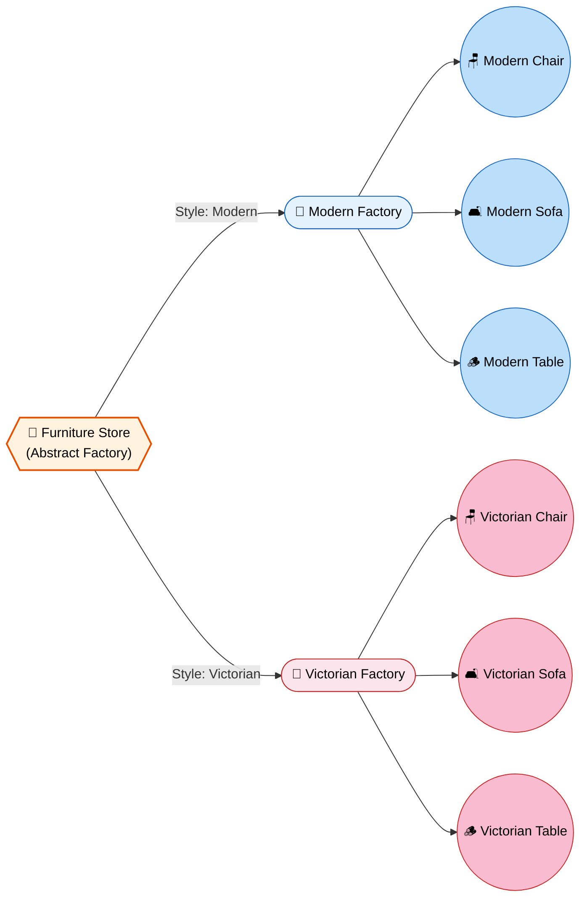
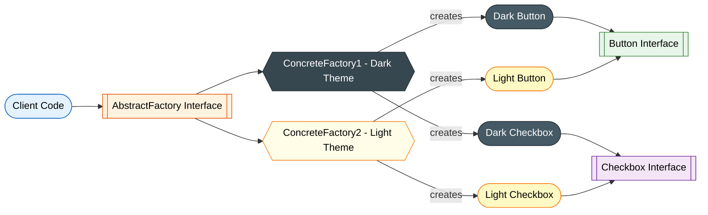
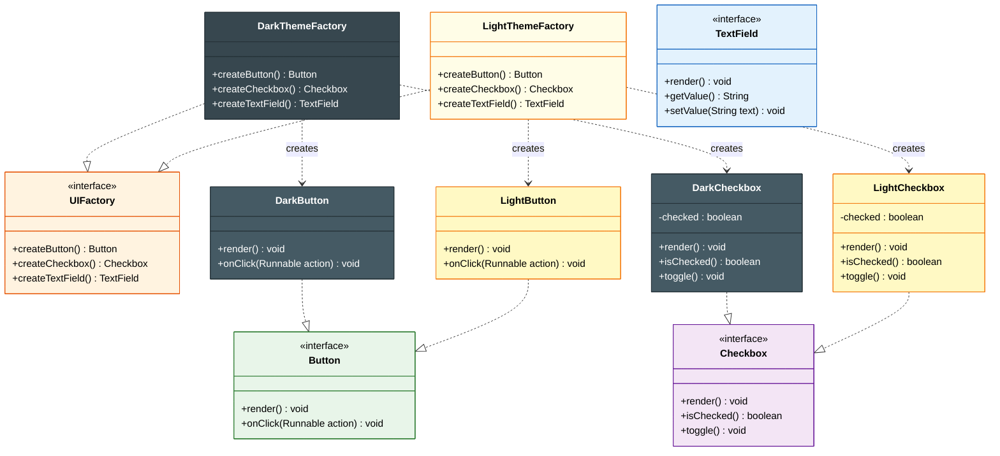

# 🏗️ Abstract Factory Design Pattern

> **Provide an interface for creating families of related objects without specifying their concrete classes.**

---

!!! abstract "Real-World Analogy"
    Think of a **furniture store** that sells in different styles — Modern, Victorian, and Art Deco. When a customer picks "Modern", they get a **matching set**: a Modern chair, a Modern sofa, and a Modern table. The store (Abstract Factory) ensures that all pieces in a set are **compatible** with each other — you'll never accidentally get a Victorian chair with a Modern table.



---

## 🏗️ Structure



---

## UML Class Diagram



---

## ❓ The Problem

Imagine you're building a **cross-platform UI toolkit** that must support Windows, macOS, and Linux. Each platform has its own style of buttons, checkboxes, and text fields.

```java
// Without Abstract Factory — platform checks scattered everywhere
if (os.equals("windows")) {
    button = new WindowsButton();
    checkbox = new WindowsCheckbox();
} else if (os.equals("macos")) {
    button = new MacButton();
    checkbox = new MacCheckbox();
}
// What if you mix WindowsButton with MacCheckbox? Chaos!
```

Problems:

- **Incompatible product combinations** — nothing prevents mixing products from different families
- **Scattered creation logic** — platform checks duplicated across the codebase
- **Violates Open/Closed Principle** — adding a new platform means modifying every `if-else` block
- **Tight coupling** — client code knows about all concrete implementations

---

## ✅ The Solution

The Abstract Factory pattern solves this by:

1. Declaring **interfaces for each product** in the family (Button, Checkbox, etc.)
2. Declaring an **Abstract Factory interface** with creation methods for all products
3. Implementing a **Concrete Factory per family/variant** (WindowsFactory, MacFactory)
4. Client code works exclusively through **abstract interfaces** — never sees concrete classes
5. The factory **guarantees compatibility** — all products from one factory work together

---

## 🛠️ Implementation

=== "UI Theme Example"

    ```java
    // ========== Product Interfaces ==========
    public interface Button {
        void render();
        void onClick(Runnable action);
    }

    public interface Checkbox {
        void render();
        boolean isChecked();
        void toggle();
    }

    public interface TextField {
        void render();
        String getValue();
        void setValue(String text);
    }

    // ========== Dark Theme Products ==========
    public class DarkButton implements Button {
        @Override
        public void render() {
            System.out.println("[Dark Button] Rendered with #333 background");
        }

        @Override
        public void onClick(Runnable action) {
            System.out.println("[Dark Button] Clicked!");
            action.run();
        }
    }

    public class DarkCheckbox implements Checkbox {
        private boolean checked = false;

        @Override
        public void render() {
            System.out.println("[Dark Checkbox] " + (checked ? "☑" : "☐"));
        }

        @Override
        public boolean isChecked() { return checked; }

        @Override
        public void toggle() { checked = !checked; }
    }

    public class DarkTextField implements TextField {
        private String value = "";

        @Override
        public void render() {
            System.out.println("[Dark TextField] ▓▓▓ " + value + " ▓▓▓");
        }

        @Override
        public String getValue() { return value; }

        @Override
        public void setValue(String text) { this.value = text; }
    }

    // ========== Light Theme Products ==========
    public class LightButton implements Button {
        @Override
        public void render() {
            System.out.println("[Light Button] Rendered with #FFF background");
        }

        @Override
        public void onClick(Runnable action) {
            System.out.println("[Light Button] Clicked!");
            action.run();
        }
    }

    public class LightCheckbox implements Checkbox {
        private boolean checked = false;

        @Override
        public void render() {
            System.out.println("[Light Checkbox] " + (checked ? "✓" : "○"));
        }

        @Override
        public boolean isChecked() { return checked; }

        @Override
        public void toggle() { checked = !checked; }
    }

    public class LightTextField implements TextField {
        private String value = "";

        @Override
        public void render() {
            System.out.println("[Light TextField] |  " + value + "  |");
        }

        @Override
        public String getValue() { return value; }

        @Override
        public void setValue(String text) { this.value = text; }
    }

    // ========== Abstract Factory ==========
    public interface UIFactory {
        Button createButton();
        Checkbox createCheckbox();
        TextField createTextField();
    }

    // ========== Concrete Factories ==========
    public class DarkThemeFactory implements UIFactory {
        @Override
        public Button createButton() { return new DarkButton(); }

        @Override
        public Checkbox createCheckbox() { return new DarkCheckbox(); }

        @Override
        public TextField createTextField() { return new DarkTextField(); }
    }

    public class LightThemeFactory implements UIFactory {
        @Override
        public Button createButton() { return new LightButton(); }

        @Override
        public Checkbox createCheckbox() { return new LightCheckbox(); }

        @Override
        public TextField createTextField() { return new LightTextField(); }
    }

    // ========== Client Code ==========
    public class Application {
        private final Button button;
        private final Checkbox checkbox;
        private final TextField textField;

        // Client works only with abstractions!
        public Application(UIFactory factory) {
            this.button = factory.createButton();
            this.checkbox = factory.createCheckbox();
            this.textField = factory.createTextField();
        }

        public void renderUI() {
            button.render();
            checkbox.render();
            textField.render();
        }

        public static void main(String[] args) {
            // Configuration determines which factory to use
            String theme = System.getProperty("app.theme", "dark");

            UIFactory factory = switch (theme) {
                case "dark"  -> new DarkThemeFactory();
                case "light" -> new LightThemeFactory();
                default -> throw new IllegalArgumentException("Unknown theme: " + theme);
            };

            Application app = new Application(factory);
            app.renderUI();
        }
    }
    ```

=== "Database Provider Example"

    ```java
    // Abstract Factory for database access layer
    public interface DatabaseFactory {
        Connection createConnection();
        Command createCommand();
        DataReader createReader();
    }

    // MySQL family
    public class MySqlFactory implements DatabaseFactory {
        @Override
        public Connection createConnection() { return new MySqlConnection(); }

        @Override
        public Command createCommand() { return new MySqlCommand(); }

        @Override
        public DataReader createReader() { return new MySqlDataReader(); }
    }

    // PostgreSQL family
    public class PostgresFactory implements DatabaseFactory {
        @Override
        public Connection createConnection() { return new PostgresConnection(); }

        @Override
        public Command createCommand() { return new PostgresCommand(); }

        @Override
        public DataReader createReader() { return new PostgresDataReader(); }
    }

    // Client code — works with ANY database without code changes
    public class DataAccessLayer {
        private final DatabaseFactory factory;

        public DataAccessLayer(DatabaseFactory factory) {
            this.factory = factory;
        }

        public List<Record> query(String sql) {
            Connection conn = factory.createConnection();
            Command cmd = factory.createCommand();
            cmd.setText(sql);
            conn.open();
            DataReader reader = cmd.execute(conn);
            List<Record> results = reader.readAll();
            conn.close();
            return results;
        }
    }
    ```

---

## 🔀 Factory Method vs Abstract Factory

| Aspect | Factory Method | Abstract Factory |
|---|---|---|
| **Creates** | Single product | Family of related products |
| **Mechanism** | Inheritance (subclass overrides) | Composition (factory object injected) |
| **Focus** | One product at a time | Ensuring product compatibility |
| **Complexity** | Simpler | More complex |
| **Extension** | Add new creator subclass | Add new factory + all its products |

---

## 🎯 When to Use

- When the system must work with **multiple families of related products**
- When you need to **enforce compatibility** between products in a family
- When you want to **swap entire product families** at runtime (e.g., themes, platforms)
- When you want to **isolate concrete classes** from client code
- When a family of products is designed to be **used together** and you must enforce this constraint

---

## 🌍 Real-World Examples

| Framework / Library | Abstract Factory Usage |
|---|---|
| Java AWT / Swing | `UIManager` switches entire Look & Feel |
| JDBC | `DriverManager` provides DB-specific Connection, Statement, ResultSet |
| Spring Framework | `AbstractFactoryBean` — creates families of beans |
| JPA / Hibernate | `EntityManagerFactory` creates related persistence objects |
| `javax.xml.parsers` | `DocumentBuilderFactory`, `SAXParserFactory` |
| JavaFX | CSS themes switch entire UI component families |

---

!!! warning "Pitfalls"

    1. **Explosion of classes** — Each new product type requires changes in ALL factories
    2. **Adding new product types is hard** — Requires modifying the abstract factory interface (violates Open/Closed for new product types)
    3. **Over-engineering** — Don't use when you only have one product type (use Factory Method instead)
    4. **Rigid family boundaries** — Mixing products across families becomes impossible by design (which is usually the goal)
    5. **Configuration complexity** — Deciding which factory to instantiate can itself become complex

---

!!! abstract "Key Takeaways"

    - Abstract Factory = **"Factory of Factories"** — creates families of related objects
    - Guarantees **product compatibility** within a family
    - Client code is **completely decoupled** from concrete implementations
    - Easy to **swap entire families** (themes, platforms, databases) by changing one factory
    - Adding **new families** is easy (new factory class); adding **new product types** is hard (modify all factories)
    - In interviews: explain the difference from Factory Method — Abstract Factory uses **composition**, Factory Method uses **inheritance**
