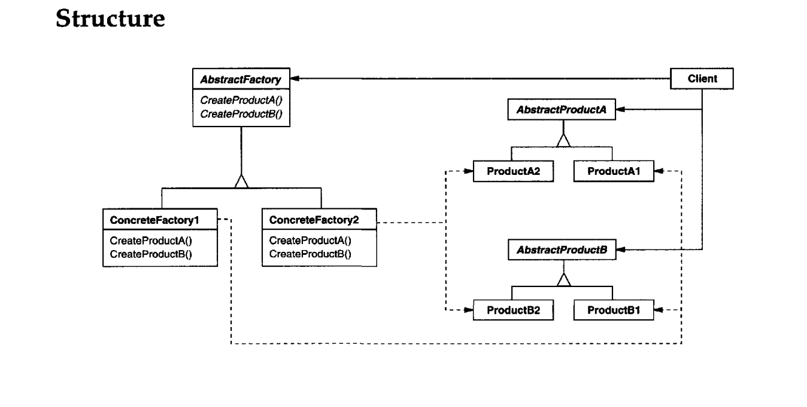

Intent
---------
Provide an interface for creating families of related or dependent objects without
specifying their concrete classes.

_Abstraction over multiple factory patterns_

**Abstraction** is the process of hiding certain details and showing only essential information to the user

Simply Called : Factory for multiple independent factory patterns

Simply we can say abstraction over Multiple Factories

Applicability
-------------

Use the Abstract Factory pattern when
1. a system should be independent of how its products are created, composed, and represented.
2. a system should be configured with one of multiple families of products.
3. a family of related product objects is designed to be used together, and you need to enforce this constraint.
4. you want to provide a class library of products, and you want to reveal just their interfaces, not their implementations.

[AbstractFactory Example](https://github.com/vamsi1998123/Java-Practice/tree/main/src/main/java/DesignPatterns/AbstractFactory)