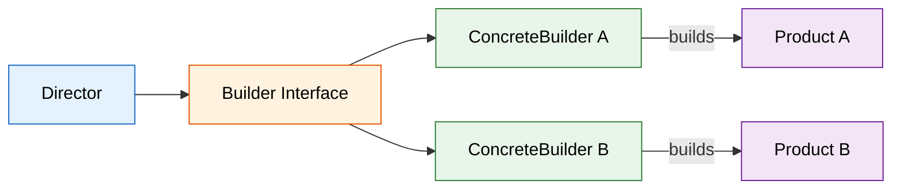
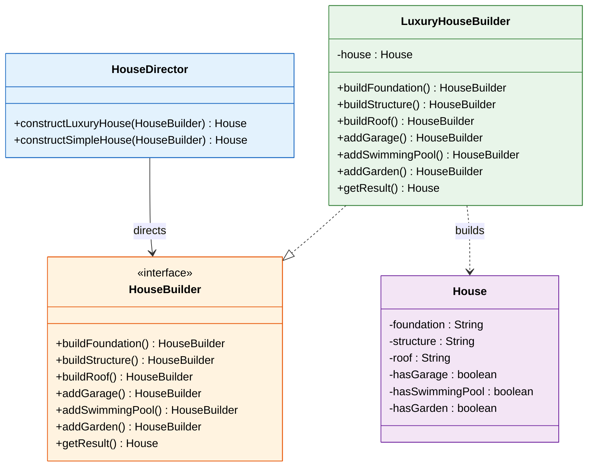

# 🔨 Builder Design Pattern

> **Separate the construction of a complex object from its representation so that the same construction process can create different representations.**

---

!!! abstract "Real-World Analogy"
    Think of ordering a **custom burger** at a restaurant. You don't get all ingredients dumped at once — instead, you go step-by-step: choose the bun, add patty, select cheese, add toppings, pick sauce. The builder (chef) constructs the burger incrementally, and you get the final product only when it's fully assembled. You could use the same step-by-step process to build a veggie burger or a double-patty burger.


---

## 🏗️ Structure



---

## UML Class Diagram



---

## ❓ The Problem

Consider creating an `HttpRequest` object with many optional parameters:

```java
// Telescoping constructor anti-pattern — which parameter is which?!
HttpRequest request = new HttpRequest(
    "https://api.example.com",  // url
    "POST",                      // method
    "application/json",          // contentType
    "{\"key\":\"value\"}",       // body
    30000,                       // timeout
    true,                        // followRedirects
    null,                        // proxy
    3,                           // retries
    true,                        // keepAlive
    null                         // certificate
);
```

Problems with constructors and setters:

1. **Telescoping constructors** — too many parameters, impossible to read
2. **Parameter confusion** — same types make it easy to swap arguments
3. **Inconsistent state** — with setters, object can be used before fully configured
4. **No immutability** — setters force the object to be mutable
5. **Complex validation** — hard to validate combinations of parameters

---

## ✅ The Solution

The Builder pattern solves this by:

1. Extracting construction into a **separate Builder class**
2. Providing **fluent methods** for each optional parameter
3. Calling a **`build()` method** that returns the final, validated, immutable object
4. The object is **never in an inconsistent state** — it's either under construction or fully built

---

## 🛠️ Implementation

=== "Modern Builder (Fluent API)"

    The most common approach in modern Java — used by Lombok, Immutables, etc.

    ```java
    public final class HttpRequest {
        // All fields are final — immutable after construction
        private final String url;
        private final String method;
        private final Map<String, String> headers;
        private final String body;
        private final int timeoutMs;
        private final int maxRetries;
        private final boolean followRedirects;

        // Private constructor — only Builder can create instances
        private HttpRequest(Builder builder) {
            this.url = builder.url;
            this.method = builder.method;
            this.headers = Collections.unmodifiableMap(new HashMap<>(builder.headers));
            this.body = builder.body;
            this.timeoutMs = builder.timeoutMs;
            this.maxRetries = builder.maxRetries;
            this.followRedirects = builder.followRedirects;
        }

        // Getters only — no setters
        public String getUrl() { return url; }
        public String getMethod() { return method; }
        public Map<String, String> getHeaders() { return headers; }
        public String getBody() { return body; }
        public int getTimeoutMs() { return timeoutMs; }
        public int getMaxRetries() { return maxRetries; }
        public boolean isFollowRedirects() { return followRedirects; }

        // Static factory to start building
        public static Builder builder(String url) {
            return new Builder(url);
        }

        // ========== The Builder ==========
        public static class Builder {
            // Required parameters
            private final String url;

            // Optional parameters with defaults
            private String method = "GET";
            private Map<String, String> headers = new HashMap<>();
            private String body = null;
            private int timeoutMs = 30_000;
            private int maxRetries = 0;
            private boolean followRedirects = true;

            private Builder(String url) {
                this.url = Objects.requireNonNull(url, "URL cannot be null");
            }

            public Builder method(String method) {
                this.method = method;
                return this;
            }

            public Builder header(String key, String value) {
                this.headers.put(key, value);
                return this;
            }

            public Builder body(String body) {
                this.body = body;
                return this;
            }

            public Builder timeoutMs(int timeoutMs) {
                this.timeoutMs = timeoutMs;
                return this;
            }

            public Builder maxRetries(int maxRetries) {
                this.maxRetries = maxRetries;
                return this;
            }

            public Builder followRedirects(boolean followRedirects) {
                this.followRedirects = followRedirects;
                return this;
            }

            // Validation happens at build time
            public HttpRequest build() {
                if (body != null && method.equals("GET")) {
                    throw new IllegalStateException("GET requests cannot have a body");
                }
                if (timeoutMs <= 0) {
                    throw new IllegalStateException("Timeout must be positive");
                }
                return new HttpRequest(this);
            }
        }
    }

    // ========== Usage ==========
    HttpRequest request = HttpRequest.builder("https://api.example.com/users")
        .method("POST")
        .header("Content-Type", "application/json")
        .header("Authorization", "Bearer token123")
        .body("{\"name\": \"John\"}")
        .timeoutMs(5000)
        .maxRetries(3)
        .build();
    ```

=== "Builder with Director"

    The GoF version — a Director orchestrates the build steps.

    ```java
    // Product
    public class House {
        private String foundation;
        private String structure;
        private String roof;
        private boolean hasGarage;
        private boolean hasSwimmingPool;
        private boolean hasGarden;

        // Setters used by builder (package-private)
        void setFoundation(String f) { this.foundation = f; }
        void setStructure(String s) { this.structure = s; }
        void setRoof(String r) { this.roof = r; }
        void setHasGarage(boolean g) { this.hasGarage = g; }
        void setHasSwimmingPool(boolean p) { this.hasSwimmingPool = p; }
        void setHasGarden(boolean g) { this.hasGarden = g; }

        @Override
        public String toString() {
            return "House{foundation=" + foundation + ", structure=" + structure +
                   ", roof=" + roof + ", garage=" + hasGarage +
                   ", pool=" + hasSwimmingPool + ", garden=" + hasGarden + "}";
        }
    }

    // Builder Interface
    public interface HouseBuilder {
        HouseBuilder buildFoundation();
        HouseBuilder buildStructure();
        HouseBuilder buildRoof();
        HouseBuilder addGarage();
        HouseBuilder addSwimmingPool();
        HouseBuilder addGarden();
        House getResult();
    }

    // Concrete Builder
    public class LuxuryHouseBuilder implements HouseBuilder {
        private House house = new House();

        @Override
        public HouseBuilder buildFoundation() {
            house.setFoundation("Reinforced Concrete");
            return this;
        }

        @Override
        public HouseBuilder buildStructure() {
            house.setStructure("Steel Frame with Glass");
            return this;
        }

        @Override
        public HouseBuilder buildRoof() {
            house.setRoof("Solar Panel Roof");
            return this;
        }

        @Override
        public HouseBuilder addGarage() {
            house.setHasGarage(true);
            return this;
        }

        @Override
        public HouseBuilder addSwimmingPool() {
            house.setHasSwimmingPool(true);
            return this;
        }

        @Override
        public HouseBuilder addGarden() {
            house.setHasGarden(true);
            return this;
        }

        @Override
        public House getResult() { return house; }
    }

    // Director — knows HOW to build specific configurations
    public class HouseDirector {
        
        public House constructLuxuryHouse(HouseBuilder builder) {
            return builder.buildFoundation()
                          .buildStructure()
                          .buildRoof()
                          .addGarage()
                          .addSwimmingPool()
                          .addGarden()
                          .getResult();
        }

        public House constructSimpleHouse(HouseBuilder builder) {
            return builder.buildFoundation()
                          .buildStructure()
                          .buildRoof()
                          .getResult();
        }
    }
    ```

=== "Lombok @Builder"

    In production, use Lombok to eliminate boilerplate.

    ```java
    import lombok.Builder;
    import lombok.Getter;
    import lombok.Singular;

    @Getter
    @Builder
    public class HttpRequest {
        private final String url;
        
        @Builder.Default
        private final String method = "GET";
        
        @Singular  // Generates addHeader() method
        private final Map<String, String> headers;
        
        private final String body;
        
        @Builder.Default
        private final int timeoutMs = 30_000;
        
        @Builder.Default
        private final int maxRetries = 0;
        
        @Builder.Default
        private final boolean followRedirects = true;
    }

    // Usage — identical fluent API, zero boilerplate
    HttpRequest request = HttpRequest.builder()
        .url("https://api.example.com")
        .method("POST")
        .header("Content-Type", "application/json")
        .body("{\"key\": \"value\"}")
        .timeoutMs(5000)
        .build();
    ```

---

## 🎯 When to Use

- When an object has **many optional parameters** (more than 3-4)
- When you need to create **immutable objects** with complex initialization
- When the construction process must allow **different representations** of the product
- When you want to **avoid telescoping constructors**
- When object creation involves **multiple steps** that must be performed in a specific order
- When you need **validation** across multiple fields at construction time

---

## 🌍 Real-World Examples

| Framework / Library | Builder Usage |
|---|---|
| `StringBuilder` / `StringBuffer` | Builds strings incrementally |
| `Stream.Builder` | `Stream.builder().add(1).add(2).build()` |
| `Lombok @Builder` | Auto-generates builder at compile time |
| `OkHttp Request.Builder` | `new Request.Builder().url(...).build()` |
| `Spring WebClient` | `WebClient.builder().baseUrl(...).build()` |
| `Protobuf` | `Message.newBuilder().setField(...).build()` |
| `java.util.Locale.Builder` | `new Locale.Builder().setLanguage("en").build()` |
| `HttpClient` (Java 11+) | `HttpClient.newBuilder().connectTimeout(...).build()` |

---

!!! warning "Pitfalls"

    1. **Over-engineering simple objects** — Don't use Builder for objects with 2-3 fields; a constructor is fine
    2. **Mutable builder reuse** — Reusing a builder instance can lead to shared state bugs; create a new builder for each object
    3. **Missing required fields** — Ensure required parameters are in the Builder constructor, not optional methods
    4. **No compile-time safety for required fields** — Builder can't enforce at compile time that all required methods were called (use Step Builder pattern for that)
    5. **Duplicated field declarations** — Fields exist in both the product and builder (Lombok solves this)

---

!!! abstract "Key Takeaways"

    - Builder **separates construction from representation** — same process, different outputs
    - Produces **immutable objects** without telescoping constructors
    - Provides a **fluent, readable API** — code reads like English
    - **Validates at build time** — object is never in an inconsistent state
    - In modern Java: use **Lombok `@Builder`** to eliminate boilerplate
    - In interviews: know both the **GoF version** (with Director) and the **modern fluent version**
    - Builder is the go-to pattern when you see constructors with more than 3-4 parameters
