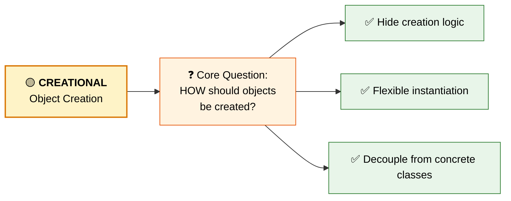
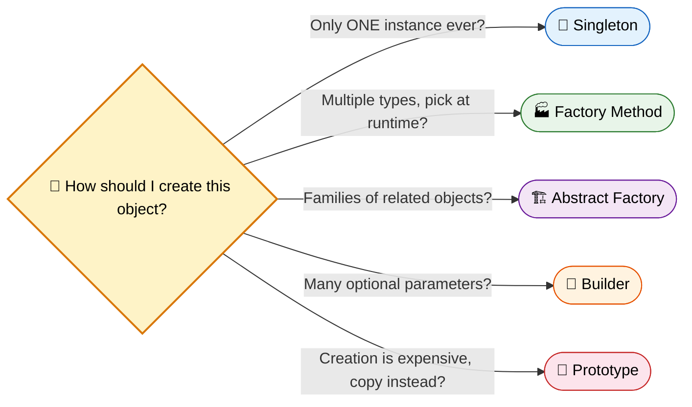

# Creational Design Patterns

> **Creational patterns abstract the instantiation process — they make a system independent of how its objects are created, composed, and represented.**

---

---

## Why Creational Patterns?

As systems grow, hardcoding object creation (`new ConcreteClass()`) everywhere leads to:

- **Tight coupling** — changing one class means modifying dozens of files
- **Inflexibility** — can't swap implementations without rewriting code
- **Duplication** — creation logic scattered and repeated

Creational patterns solve this by **encapsulating** which classes get instantiated and **hiding** how instances are assembled.

---

## The 5 Creational Patterns

| # | Pattern | When to Use | Key Idea |
|---|---------|-------------|----------|
| 1 | [**Singleton**](singletondesignpattern.md) | Need exactly ONE instance | Private constructor + static access |
| 2 | [**Factory Method**](FactoryDesignPattern.md) | Let subclasses decide what to create | Interface for creation, subclass implements |
| 3 | [**Abstract Factory**](AbstractFactoryDesignPattern.md) | Need families of related objects | Factory of factories |
| 4 | [**Builder**](BuilderDesignPattern.md) | Complex objects with many options | Step-by-step construction |
| 5 | [**Prototype**](PrototypeDesignPattern.md) | Expensive creation, clone instead | Copy existing objects |

---

## Choosing the Right Pattern

---

!!! tip "Key Principle"
    All creational patterns share one goal: **program to an interface, not an implementation.** The client never needs to know the exact class being instantiated — only the contract it fulfills.
