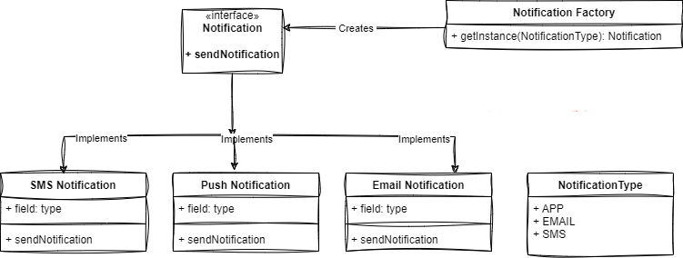

## Code Implementation
[FactoryDp Implementation](https://github.com/vamsi1998123/Design-Patterns/tree/master/src/main/java/com/example/designpatterns/creational/factory)

**Intent**
----------
Define an interface for creating an object, but let subclasses decide which class to
instantiate. Factory Method lets a class defer instantiation to subclasses.

Also called  - *Virtual Constructor*

It promotes the loose-coupling by eliminating the need to bind application-specific classes into the code.

