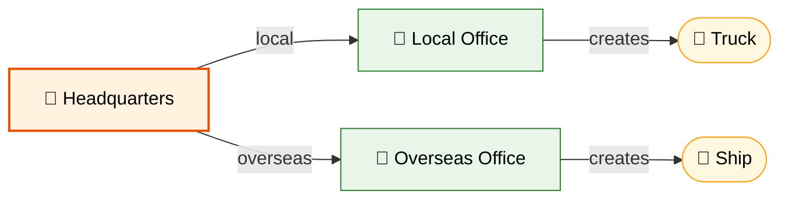
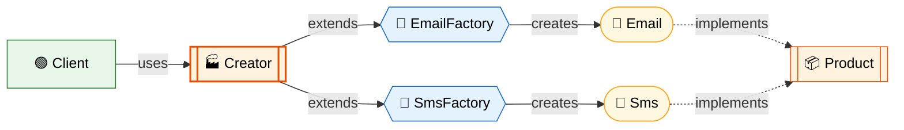
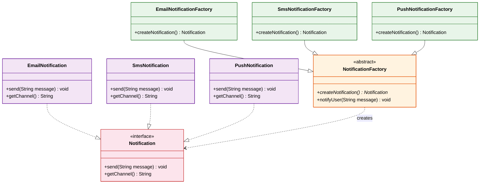

# 🏭 Factory Method Design Pattern

> **Define an interface for creating an object, but let subclasses decide which class to instantiate.**

---

!!! abstract "Real-World Analogy"
    Think of a **logistics company**. The company knows it needs to deliver packages, but the exact transport method depends on the destination — trucks for local, ships for overseas, planes for express. Each regional office (subclass) decides which vehicle (object) to create, while the headquarters (interface) defines the delivery contract.


```mermaid
flowchart LR
    HQ["🏢 Headquarters"] -->|"local"| L["🏪 Local Office"] -->|"creates"| T(["🚛 Truck"])
    HQ -->|"overseas"| O["🏪 Overseas Office"] -->|"creates"| S(["🚢 Ship"])
    
    style HQ fill:#FFF3E0,stroke:#E65100,stroke-width:2px,color:#000
    style L fill:#E8F5E9,stroke:#2E7D32,color:#000
    style O fill:#E8F5E9,stroke:#2E7D32,color:#000
    style T fill:#FFF8E1,stroke:#F9A825,color:#000
    style S fill:#FFF8E1,stroke:#F9A825,color:#000
```

---

## 🏗️ Structure


```mermaid
flowchart LR
    A["🟢 Client"] -->|"uses"| B[["🏭 Creator"]]
    B -->|"extends"| C{{"📧 EmailFactory"}}
    B -->|"extends"| D{{"📱 SmsFactory"}}
    C -->|"creates"| E(["📧 Email"])
    D -->|"creates"| F(["📱 Sms"])
    E -.->|"implements"| G[["📦 Product"]]
    F -.->|"implements"| G

    style A fill:#E8F5E9,stroke:#2E7D32,color:#000
    style B fill:#FFF3E0,stroke:#E65100,stroke-width:2px,color:#000
    style C fill:#E3F2FD,stroke:#1565C0,color:#000
    style D fill:#E3F2FD,stroke:#1565C0,color:#000
    style E fill:#FFF8E1,stroke:#F9A825,color:#000
    style F fill:#FFF8E1,stroke:#F9A825,color:#000
    style G fill:#FFF3E0,stroke:#E65100,color:#000
```

---

## UML Class Diagram


```mermaid
classDiagram
    class Notification {
        <<interface>>
        +send(String message) void
        +getChannel() String
    }
    class EmailNotification {
        +send(String message) void
        +getChannel() String
    }
    class SmsNotification {
        +send(String message) void
        +getChannel() String
    }
    class PushNotification {
        +send(String message) void
        +getChannel() String
    }
    class NotificationFactory {
        <<abstract>>
        +createNotification()* Notification
        +notifyUser(String message) void
    }
    class EmailNotificationFactory {
        +createNotification() Notification
    }
    class SmsNotificationFactory {
        +createNotification() Notification
    }
    class PushNotificationFactory {
        +createNotification() Notification
    }

    EmailNotification ..|> Notification
    SmsNotification ..|> Notification
    PushNotification ..|> Notification
    EmailNotificationFactory --|> NotificationFactory
    SmsNotificationFactory --|> NotificationFactory
    PushNotificationFactory --|> NotificationFactory
    NotificationFactory ..> Notification : creates

    style Notification fill:#FCE4EC,stroke:#C62828,color:#000
    style NotificationFactory fill:#FFF3E0,stroke:#E65100,color:#000
    style EmailNotification fill:#F3E5F5,stroke:#6A1B9A,color:#000
    style SmsNotification fill:#F3E5F5,stroke:#6A1B9A,color:#000
    style PushNotification fill:#F3E5F5,stroke:#6A1B9A,color:#000
    style EmailNotificationFactory fill:#E8F5E9,stroke:#2E7D32,color:#000
    style SmsNotificationFactory fill:#E8F5E9,stroke:#2E7D32,color:#000
    style PushNotificationFactory fill:#E8F5E9,stroke:#2E7D32,color:#000
```

---

## ❓ The Problem

Imagine you're building a notification system. Initially, you only support **Email** notifications:

### Without This Pattern

```java
public class NotificationService {

    public void sendNotification(String type, String message) {
        if (type.equals("email")) {
            EmailNotification email = new EmailNotification();
            email.setSmtpServer("smtp.company.com");
            email.send(message);
        } else if (type.equals("sms")) {
            SmsNotification sms = new SmsNotification();
            sms.setGateway("twilio");
            sms.send(message);
        } else if (type.equals("push")) {
            PushNotification push = new PushNotification();
            push.setFirebaseKey("key-123");
            push.send(message);
        }
        // Adding Slack? WhatsApp? Modify THIS method every time!
    }
}

// In OrderService.java — same if-else duplicated!
// In UserService.java — same if-else duplicated again!
```

**Problems:**

- **Violates Open/Closed Principle** — adding a new notification type (Slack, WhatsApp) forces you to modify every class that creates notifications
- **Duplicated creation logic** — the same if-else chain appears in OrderService, UserService, PaymentService, etc.
- **Tightly coupled** — client code directly references `EmailNotification`, `SmsNotification` concrete classes
- **Testing nightmare** — cannot swap in a mock notification without changing the service code; unit tests send real emails
- **Single Responsibility violated** — `NotificationService` both decides WHICH notification to create AND performs business logic

---

## ✅ The Solution

The Factory Method pattern solves this by:

1. Defining a **common interface** for all products
2. Creating an **abstract creator** with a factory method
3. Letting **concrete creators** decide which product to instantiate
4. Client code works only with the **abstraction**, never with concrete classes

This achieves **loose coupling** — the client doesn't know or care which concrete class it's working with.

---

## 🛠️ Implementation

=== "Classic Factory Method"

    ```java
    // Step 1: Product Interface
    public interface Notification {
        void send(String message);
        String getChannel();
    }

    // Step 2: Concrete Products
    public class EmailNotification implements Notification {
        @Override
        public void send(String message) {
            System.out.println("Sending EMAIL: " + message);
        }

        @Override
        public String getChannel() {
            return "Email";
        }
    }

    public class SmsNotification implements Notification {
        @Override
        public void send(String message) {
            System.out.println("Sending SMS: " + message);
        }

        @Override
        public String getChannel() {
            return "SMS";
        }
    }

    public class PushNotification implements Notification {
        @Override
        public void send(String message) {
            System.out.println("Sending PUSH: " + message);
        }

        @Override
        public String getChannel() {
            return "Push";
        }
    }

    // Step 3: Abstract Creator
    public abstract class NotificationFactory {
        
        // Factory Method — subclasses decide what to create
        public abstract Notification createNotification();

        // Template method that uses the factory method
        public void notifyUser(String message) {
            Notification notification = createNotification();
            System.out.println("Channel: " + notification.getChannel());
            notification.send(message);
        }
    }

    // Step 4: Concrete Creators
    public class EmailNotificationFactory extends NotificationFactory {
        @Override
        public Notification createNotification() {
            return new EmailNotification();
        }
    }

    public class SmsNotificationFactory extends NotificationFactory {
        @Override
        public Notification createNotification() {
            return new SmsNotification();
        }
    }

    public class PushNotificationFactory extends NotificationFactory {
        @Override
        public Notification createNotification() {
            return new PushNotification();
        }
    }

    // Step 5: Client Code
    public class Application {
        public static void main(String[] args) {
            NotificationFactory factory = getFactory("sms");
            factory.notifyUser("Your order has shipped!");
        }

        static NotificationFactory getFactory(String type) {
            return switch (type) {
                case "email" -> new EmailNotificationFactory();
                case "sms"   -> new SmsNotificationFactory();
                case "push"  -> new PushNotificationFactory();
                default -> throw new IllegalArgumentException("Unknown type: " + type);
            };
        }
    }
    ```

=== "Simple Factory (Static Method)"

    A simplified variant often used in practice — not a true GoF pattern but widely used.

    ```java
    public class NotificationFactory {

        // Static factory method — decides creation based on input
        public static Notification createNotification(String channel) {
            return switch (channel.toLowerCase()) {
                case "email" -> new EmailNotification();
                case "sms"   -> new SmsNotification();
                case "push"  -> new PushNotification();
                default -> throw new IllegalArgumentException(
                    "Unknown channel: " + channel
                );
            };
        }
    }

    // Usage
    Notification notification = NotificationFactory.createNotification("email");
    notification.send("Hello World!");
    ```

    !!! tip "When to use Simple Factory vs Factory Method"
        - **Simple Factory**: When creation logic is straightforward and unlikely to change
        - **Factory Method**: When you need extensibility — new products without modifying existing code

=== "Factory with Registry (Extensible)"

    The most extensible approach — new products registered at runtime.

    ```java
    public class NotificationRegistry {
        private static final Map<String, Supplier<Notification>> registry = 
            new HashMap<>();

        // Register new notification types dynamically
        public static void register(String type, Supplier<Notification> supplier) {
            registry.put(type.toLowerCase(), supplier);
        }

        public static Notification create(String type) {
            Supplier<Notification> supplier = registry.get(type.toLowerCase());
            if (supplier == null) {
                throw new IllegalArgumentException("Unknown type: " + type);
            }
            return supplier.get();
        }

        // Bootstrap registrations
        static {
            register("email", EmailNotification::new);
            register("sms", SmsNotification::new);
            register("push", PushNotification::new);
        }
    }

    // Adding new type without modifying existing code!
    NotificationRegistry.register("slack", SlackNotification::new);
    Notification slack = NotificationRegistry.create("slack");
    ```

---

## 🎯 When to Use

- When a class **can't anticipate** the type of objects it needs to create
- When you want to **delegate** creation responsibility to subclasses
- When you want to **decouple** client code from concrete product classes
- When you need to **centralize** complex creation logic
- When you want to follow the **Open/Closed Principle** — open for extension, closed for modification

---

## 🌍 Real-World Examples

| Framework / Library | Factory Usage |
|---|---|
| `java.util.Calendar` | `Calendar.getInstance()` |
| `java.text.NumberFormat` | `NumberFormat.getInstance()` |
| `java.nio.charset.Charset` | `Charset.forName("UTF-8")` |
| Spring Framework | `BeanFactory` / `ApplicationContext` |
| JDBC | `DriverManager.getConnection()` |
| `java.util.concurrent` | `Executors.newFixedThreadPool()` |
| SLF4J | `LoggerFactory.getLogger()` |
| `javax.xml.parsers` | `DocumentBuilderFactory.newInstance()` |

---

!!! warning "Pitfalls"

    1. **Class Explosion** — Each new product requires a new creator subclass (mitigate with parameterized factories)
    2. **Over-engineering** — Don't use Factory Method for simple object creation with no variation
    3. **Tight Coupling to Factory** — Clients still depend on the factory; combine with DI for maximum flexibility
    4. **God Factory Anti-pattern** — A single factory creating too many unrelated types; split into focused factories
    5. **Forgetting to make products via interface** — If you cast the product to a concrete type, you lose the benefit

---

!!! abstract "Key Takeaways"

    - Factory Method **encapsulates object creation** and defers it to subclasses
    - It promotes **loose coupling** — clients depend on abstractions, not concrete classes
    - Follows **Open/Closed Principle** — add new products without changing existing code
    - Also known as **Virtual Constructor** — subclass determines which class to instantiate
    - In interviews, distinguish between **Simple Factory** (static method), **Factory Method** (subclass decides), and **Abstract Factory** (family of products)
    - Prefer **dependency injection** (Spring) over manual factories in modern applications
