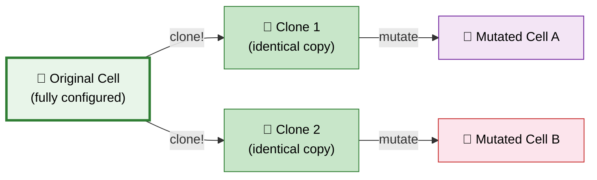
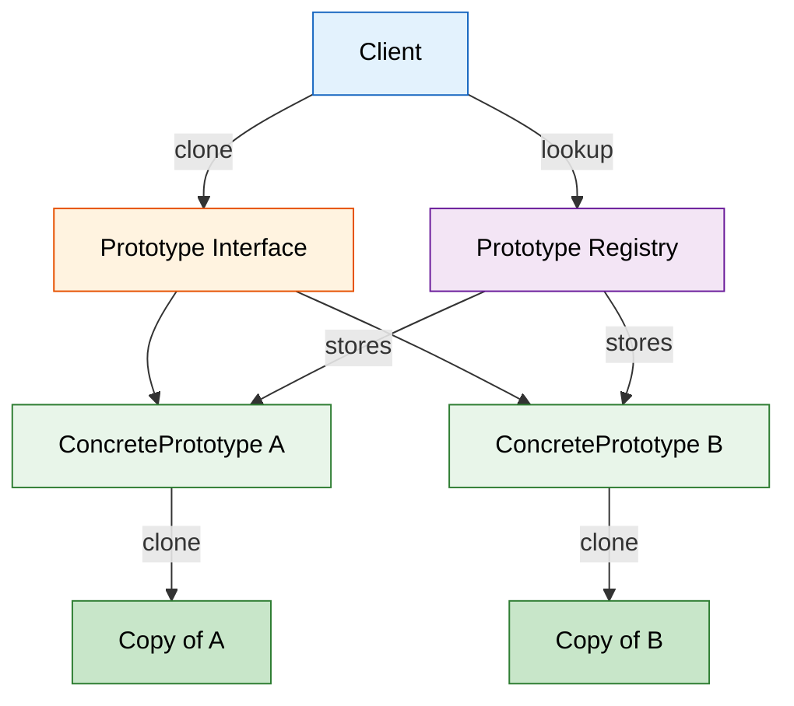

# 🧬 Prototype Design Pattern

> **Create new objects by copying an existing instance (prototype) rather than building from scratch.**

---

!!! abstract "Real-World Analogy"
    Think of **cell division (mitosis)**. Instead of building a new cell from raw amino acids (expensive!), an existing cell copies itself — duplicating all its internal structure. The clone can then mutate independently. Similarly, the Prototype pattern clones an existing configured object instead of going through costly creation steps.



---

## 🏗️ Structure



---

## ❓ The Problem

Consider these scenarios where creating objects from scratch is problematic:

```java
// Scenario 1: Expensive database call to populate object
User user = userRepository.findById(123);  // DB call, network I/O
// Need 50 copies of this user template for load testing...
// Do we hit the DB 50 times?

// Scenario 2: Complex configuration that took many steps
GraphicsContext ctx = new GraphicsContext();
ctx.setResolution(4096, 2160);
ctx.loadShaders("pbr_vertex.glsl", "pbr_fragment.glsl");
ctx.initializeBuffers(1024);
ctx.calibrateColors();  // Takes 2 seconds!
// Need another context with same config but different scene...

// Scenario 3: Object class determined at runtime
Shape shape = getShapeFromUserInput();  // Could be Circle, Rectangle, etc.
// How do you create "another one of those" without knowing the concrete type?
```

Problems:

- **Costly initialization** — objects loaded from DB, network, or files
- **Complex setup** — many configuration steps to reproduce
- **Unknown concrete type** — can't use `new` when you don't know the class at compile time
- **Tight coupling** — client code depends on concrete classes to instantiate them

---

## ✅ The Solution

The Prototype pattern solves this by:

1. Declaring a **`clone()` method** in a prototype interface
2. Each concrete class **implements its own cloning logic**
3. Client code **clones the prototype** instead of constructing from scratch
4. Optionally, a **Prototype Registry** stores pre-configured prototypes for lookup

This shifts the cost from **creation** to **copying** — which is almost always cheaper.

---

## 🛠️ Implementation

=== "Shallow vs Deep Copy"

    ```java
    // Prototype Interface
    public interface Prototype<T> {
        T clone();
    }

    // ========== Shallow Copy Example ==========
    public class Address {
        private String street;
        private String city;
        private String country;

        public Address(String street, String city, String country) {
            this.street = street;
            this.city = city;
            this.country = country;
        }

        // Getters and setters
        public String getStreet() { return street; }
        public void setStreet(String street) { this.street = street; }
        public String getCity() { return city; }
        public void setCity(String city) { this.city = city; }
        public String getCountry() { return country; }
    }

    public class Employee implements Prototype<Employee> {
        private String name;
        private String department;
        private Address address;        // Reference type!
        private List<String> skills;    // Reference type!

        public Employee(String name, String department, Address address, 
                        List<String> skills) {
            this.name = name;
            this.department = department;
            this.address = address;
            this.skills = skills;
        }

        // SHALLOW COPY — address and skills are shared references!
        public Employee shallowClone() {
            return new Employee(name, department, address, skills);
        }

        // DEEP COPY — all nested objects are independently copied
        @Override
        public Employee clone() {
            Address clonedAddress = new Address(
                address.getStreet(), address.getCity(), address.getCountry()
            );
            List<String> clonedSkills = new ArrayList<>(skills);
            return new Employee(name, department, clonedAddress, clonedSkills);
        }

        // Getters and setters
        public void setName(String name) { this.name = name; }
        public String getName() { return name; }
        public Address getAddress() { return address; }
        public List<String> getSkills() { return skills; }
    }

    // ========== Usage ==========
    public class Demo {
        public static void main(String[] args) {
            Employee original = new Employee(
                "Alice", "Engineering",
                new Address("123 Main St", "San Jose", "USA"),
                new ArrayList<>(List.of("Java", "Spring", "AWS"))
            );

            // Deep clone — independent copy
            Employee clone = original.clone();
            clone.setName("Bob");
            clone.getAddress().setStreet("456 Oak Ave");
            clone.getSkills().add("Kubernetes");

            // Original is NOT affected
            System.out.println(original.getName());           // Alice
            System.out.println(original.getAddress().getStreet()); // 123 Main St
            System.out.println(original.getSkills().size());  // 3
        }
    }
    ```

    !!! warning "Shallow vs Deep Copy"
        - **Shallow Copy**: Copies primitive values, but references point to the SAME objects. Modifying nested objects in the clone affects the original!
        - **Deep Copy**: Recursively copies ALL nested objects. Clone is fully independent.
        - **Always use Deep Copy** unless you explicitly want shared state.

=== "Prototype Registry"

    Pre-configure prototypes and retrieve them by key.

    ```java
    public class ShapePrototypeRegistry {
        private final Map<String, Shape> prototypes = new HashMap<>();

        public ShapePrototypeRegistry() {
            // Pre-configure expensive prototypes
            Circle defaultCircle = new Circle();
            defaultCircle.setColor("red");
            defaultCircle.setRadius(10);
            prototypes.put("red-circle", defaultCircle);

            Rectangle defaultRect = new Rectangle();
            defaultRect.setColor("blue");
            defaultRect.setWidth(100);
            defaultRect.setHeight(50);
            prototypes.put("blue-rectangle", defaultRect);

            // Complex shape that takes expensive computation
            FractalShape fractal = new FractalShape();
            fractal.computeIterations(10000);  // Expensive!
            prototypes.put("fractal", fractal);
        }

        public Shape get(String key) {
            Shape prototype = prototypes.get(key);
            if (prototype == null) {
                throw new IllegalArgumentException("Unknown prototype: " + key);
            }
            return prototype.clone();  // Always return a copy!
        }

        public void register(String key, Shape prototype) {
            prototypes.put(key, prototype);
        }
    }

    // Usage — get copies without expensive setup
    ShapePrototypeRegistry registry = new ShapePrototypeRegistry();

    Shape circle1 = registry.get("red-circle");      // Instant clone
    Shape circle2 = registry.get("red-circle");      // Another instant clone
    Shape fractal = registry.get("fractal");          // Skip 10000 iterations!
    ```

=== "Java Cloneable (Built-in)"

    Java's built-in mechanism — works but has design flaws.

    ```java
    public class Document implements Cloneable {
        private String title;
        private String content;
        private List<String> authors;
        private Map<String, String> metadata;

        public Document(String title, String content) {
            this.title = title;
            this.content = content;
            this.authors = new ArrayList<>();
            this.metadata = new HashMap<>();
        }

        public void addAuthor(String author) { authors.add(author); }
        public void addMetadata(String key, String value) { metadata.put(key, value); }

        @Override
        public Document clone() {
            try {
                Document clone = (Document) super.clone();  // Shallow copy
                // Deep copy mutable fields
                clone.authors = new ArrayList<>(this.authors);
                clone.metadata = new HashMap<>(this.metadata);
                return clone;
            } catch (CloneNotSupportedException e) {
                throw new AssertionError("Should not happen", e);
            }
        }

        @Override
        public String toString() {
            return "Document{title='" + title + "', authors=" + authors + "}";
        }
    }

    // Usage
    Document original = new Document("Design Patterns", "Chapter 1...");
    original.addAuthor("Gang of Four");
    original.addMetadata("version", "1.0");

    Document copy = original.clone();
    copy.addAuthor("New Author");

    System.out.println(original);  // authors=[Gang of Four]
    System.out.println(copy);      // authors=[Gang of Four, New Author]
    ```

    !!! warning "Problems with Java's Cloneable"
        - `Cloneable` is a **marker interface** — doesn't declare `clone()`
        - `Object.clone()` does **shallow copy** by default
        - Must manually deep copy all mutable fields
        - `CloneNotSupportedException` is a checked exception (awkward)
        - Joshua Bloch: *"Cloneable is broken. Use copy constructors or copy factories instead."*

=== "Copy Constructor (Recommended)"

    The cleanest modern approach — no Cloneable needed.

    ```java
    public class GameState {
        private int score;
        private int level;
        private List<String> inventory;
        private Map<String, Integer> achievements;

        // Regular constructor
        public GameState(int level) {
            this.score = 0;
            this.level = level;
            this.inventory = new ArrayList<>();
            this.achievements = new HashMap<>();
        }

        // Copy constructor — explicit and clear
        public GameState(GameState other) {
            this.score = other.score;
            this.level = other.level;
            this.inventory = new ArrayList<>(other.inventory);
            this.achievements = new HashMap<>(other.achievements);
        }

        // Copy factory method — alternative style
        public static GameState copyOf(GameState other) {
            return new GameState(other);
        }

        // Mutators
        public void addScore(int points) { score += points; }
        public void addItem(String item) { inventory.add(item); }
        public void unlock(String achievement) { achievements.put(achievement, level); }
    }

    // Save game state before a risky action
    GameState checkpoint = new GameState(currentState);  // Deep copy
    try {
        currentState.enterBossFight();
    } catch (GameOverException e) {
        currentState = checkpoint;  // Restore from copy
    }
    ```

---

## 🎯 When to Use

- When object creation is **more expensive than copying** (DB calls, network, computation)
- When you need to **create objects without knowing their concrete class** at compile time
- When objects have **many shared configurations** with minor variations
- When you want to **avoid subclass proliferation** just to configure different instances
- When you need **undo/redo functionality** — save snapshots via cloning
- When **reducing the number of initializations** in performance-critical code

---

## 🌍 Real-World Examples

| Framework / Library | Prototype Usage |
|---|---|
| `Object.clone()` | Java's built-in prototype mechanism |
| Spring Framework | `scope="prototype"` — new instance per request |
| `java.util.Arrays.copyOf()` | Creates copies of arrays |
| Apache Commons | `SerializationUtils.clone()` — deep copy via serialization |
| `Collections.unmodifiableList()` | Defensive copies of collections |
| JavaScript | `Object.create()` — prototypal inheritance |
| Game Engines | Spawn entities by cloning prefab templates |

---

!!! warning "Pitfalls"

    1. **Shallow copy bugs** — Forgetting to deep copy nested mutable objects leads to shared state corruption
    2. **Circular references** — Objects referencing each other can cause infinite loops during deep copy
    3. **Final fields** — Cannot reassign `final` fields in a clone (use constructor-based approach)
    4. **Clone identity confusion** — `clone != original` but `clone.equals(original)` should be true; maintain contract
    5. **Performance assumption** — Cloning isn't always faster; for simple objects, `new` can be faster than copy
    6. **Broken Cloneable** — Java's `Cloneable` interface is poorly designed; prefer copy constructors

---

!!! abstract "Key Takeaways"

    - Prototype creates objects by **cloning existing instances** — avoids costly re-initialization
    - Always implement **deep copy** for objects with mutable reference fields
    - **Prototype Registry** pre-configures and caches expensive-to-create templates
    - In modern Java, prefer **copy constructors** or **copy factory methods** over `Cloneable`
    - Key interview distinction: Prototype avoids the `new` keyword complexity — client doesn't need to know the concrete class
    - Combines well with other patterns: use Prototype with **Factory** (factory clones a prototype) or **Memento** (save/restore state)
