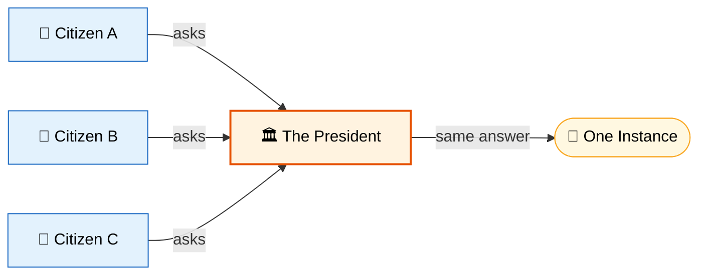
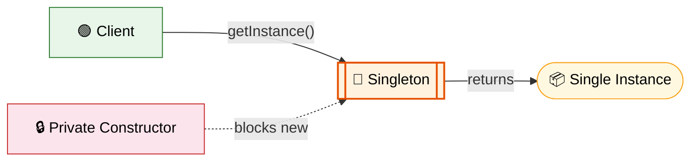
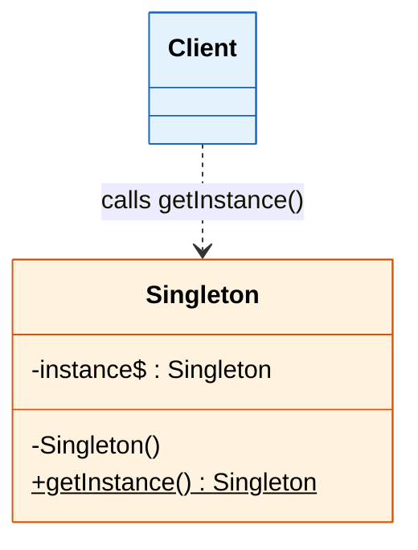

# 🎯 Singleton Design Pattern

> **Ensure a class has only one instance and provide a global point of access to it.**

---

!!! abstract "Real-World Analogy"
    Think of the **President of a country**. There can only be one active president at a time. No matter who asks "Who is the president?", they all get the same answer — the same single instance. The office (class) ensures only one person (instance) holds the position at any given time.



---

## 🏗️ Structure



---

## UML Class Diagram



---

## ❓ The Problem

In many applications, certain objects should exist only once:

- **Database connection pools** — creating multiple pools wastes resources
- **Configuration managers** — conflicting configs cause chaos
- **Logger instances** — multiple loggers writing to the same file corrupt data
- **Cache managers** — duplicate caches waste memory and cause inconsistency
- **Thread pools** — uncontrolled pool creation leads to resource exhaustion

Without the Singleton pattern, any code can create new instances freely, leading to resource waste, inconsistent state, and hard-to-debug issues.

### Without This Pattern

```java
// Anyone can create new instances — no control
public class DatabaseConnectionPool {
    private List<Connection> connections = new ArrayList<>();

    public DatabaseConnectionPool(int size) {
        for (int i = 0; i < size; i++) {
            connections.add(createConnection()); // Expensive!
        }
    }

    public Connection getConnection() {
        return connections.remove(0);
    }
}

// In ServiceA.java
DatabaseConnectionPool poolA = new DatabaseConnectionPool(10);

// In ServiceB.java — OOPS, another pool!
DatabaseConnectionPool poolB = new DatabaseConnectionPool(10);

// In ServiceC.java — yet another!
DatabaseConnectionPool poolC = new DatabaseConnectionPool(10);
// Now 30 connections open instead of 10. DB runs out of connections.
```

**Problems:**

- **Resource exhaustion** — each `new` creates an independent pool, multiplying DB connections beyond limits
- **Inconsistent state** — one pool may be drained while others sit idle; no shared view of available connections
- **No single point of control** — impossible to enforce connection limits, timeouts, or monitoring across multiple pools
- **Violates DRY** — initialization logic (pool size, config) is duplicated and can drift out of sync
- **Hard to debug** — when the DB rejects connections, which of the N pools is the culprit?

---

## ✅ The Solution

The Singleton pattern solves this by:

1. Making the **constructor private** — prevents external instantiation
2. Providing a **static method** as the single access point
3. Storing the instance in a **private static field**
4. Returning the **same instance** every time the method is called

---

## 🛠️ Implementation

=== "Eager Initialization"

    The simplest approach — instance created at class loading time.

    ```java
    public class Singleton {
        // Instance created at class loading — thread-safe by JVM guarantee
        private static final Singleton INSTANCE = new Singleton();

        private Singleton() {
            // Prevent reflection-based instantiation
            if (INSTANCE != null) {
                throw new IllegalStateException("Instance already created!");
            }
        }

        public static Singleton getInstance() {
            return INSTANCE;
        }
    }
    ```

    !!! tip "Pros & Cons"
        **Pros:** Simple, inherently thread-safe, no synchronization overhead  
        **Cons:** Instance created even if never used (wastes memory if object is heavy)

=== "Lazy Initialization"

    Instance created only when first requested — but NOT thread-safe.

    ```java
    public class Singleton {
        private static Singleton instance;

        private Singleton() {}

        public static Singleton getInstance() {
            if (instance == null) {
                instance = new Singleton(); // Race condition possible!
            }
            return instance;
        }
    }
    ```

    !!! warning "Not Thread-Safe"
        Two threads can simultaneously see `instance == null` and create two objects. Never use this in multi-threaded environments.

=== "Thread-Safe (Synchronized)"

    Solves the thread-safety issue but with a performance cost.

    ```java
    public class Singleton {
        private static Singleton instance;

        private Singleton() {}

        public static synchronized Singleton getInstance() {
            if (instance == null) {
                instance = new Singleton();
            }
            return instance;
        }
    }
    ```

    !!! tip "Pros & Cons"
        **Pros:** Thread-safe  
        **Cons:** `synchronized` on every call — even after instance is created. Causes unnecessary lock contention.

=== "Double-Checked Locking"

    The industry-standard approach — minimal synchronization overhead.

    ```java
    public class Singleton {
        // volatile prevents instruction reordering
        private static volatile Singleton instance;

        private Singleton() {}

        public static Singleton getInstance() {
            if (instance == null) {                  // First check (no lock)
                synchronized (Singleton.class) {
                    if (instance == null) {          // Second check (with lock)
                        instance = new Singleton();
                    }
                }
            }
            return instance;
        }
    }
    ```

    !!! example "Why `volatile`?"
        Without `volatile`, the JVM may reorder instructions: allocate memory → assign reference → call constructor. Another thread could see a non-null but **partially constructed** object. `volatile` prevents this reordering.

=== "Bill Pugh (Static Inner Class)"

    The most elegant lazy-loading solution — leverages JVM class loading.

    ```java
    public class Singleton {

        private Singleton() {}

        // Inner class is not loaded until getInstance() is called
        private static class SingletonHolder {
            private static final Singleton INSTANCE = new Singleton();
        }

        public static Singleton getInstance() {
            return SingletonHolder.INSTANCE;
        }
    }
    ```

    !!! tip "Why This Works"
        The JVM guarantees that a class is loaded only when it's first referenced. `SingletonHolder` is loaded only when `getInstance()` is called — giving us **lazy initialization** with **zero synchronization cost**.

=== "Enum Singleton (Recommended)"

    The **best** approach — recommended by Joshua Bloch in *Effective Java*.

    ```java
    public enum Singleton {
        INSTANCE;

        // Add your methods here
        private int counter = 0;

        public int getCounter() {
            return counter;
        }

        public void increment() {
            counter++;
        }
    }

    // Usage
    // Singleton.INSTANCE.increment();
    // int count = Singleton.INSTANCE.getCounter();
    ```

    !!! tip "Why Enum is Best"
        - **Thread-safe** by JVM guarantee
        - **Serialization-safe** — JVM handles it natively
        - **Reflection-safe** — JVM prevents instantiation of enum via reflection
        - **Concise** — no boilerplate code

---

## 🎯 When to Use

- When exactly **one instance** of a class is needed across the application
- When you need **controlled access** to a shared resource (DB pool, cache, config)
- When the single instance should be **extensible by subclassing** (use registry-based approach)
- When you need a **global access point** but want to avoid global variables

---

## 🌍 Real-World Examples

| Framework / Library | Singleton Usage |
|---|---|
| `java.lang.Runtime` | `Runtime.getRuntime()` |
| `java.lang.System` | System class with static fields |
| Spring Framework | Default bean scope is **singleton** |
| `java.awt.Desktop` | `Desktop.getDesktop()` |
| SLF4J / Log4j | `LoggerFactory.getLogger()` |
| Hibernate | `SessionFactory` (one per DB) |

---

!!! warning "Pitfalls"

    1. **Broken by Reflection** — Use enum or throw exception in constructor
    2. **Broken by Serialization** — Implement `readResolve()` or use enum
    3. **Broken by Cloning** — Override `clone()` to throw `CloneNotSupportedException`
    4. **Hidden Dependencies** — Classes using Singleton are tightly coupled to it
    5. **Testing Difficulty** — Hard to mock; prefer dependency injection in production code
    6. **Classloader Issues** — Multiple classloaders can create multiple instances
    7. **Violates Single Responsibility** — The class manages its own lifecycle AND business logic

    ```java
    // Serialization fix (if not using Enum)
    protected Object readResolve() {
        return getInstance();
    }
    ```

---

!!! abstract "Key Takeaways"

    | Approach | Lazy? | Thread-Safe? | Reflection-Safe? | Serialization-Safe? |
    |---|---|---|---|---|
    | Eager | No | Yes | No | No |
    | Lazy | Yes | No | No | No |
    | Synchronized | Yes | Yes | No | No |
    | Double-Checked | Yes | Yes | No | No |
    | Bill Pugh | Yes | Yes | No | No |
    | **Enum** | No | **Yes** | **Yes** | **Yes** |

    - For **interviews**: Know all approaches and their trade-offs
    - For **production**: Use **Enum Singleton** or **Spring's DI container**
    - For **legacy code**: Double-Checked Locking with `volatile` is acceptable
