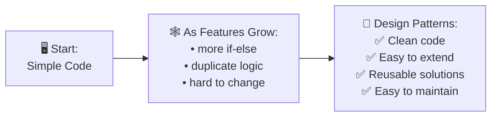
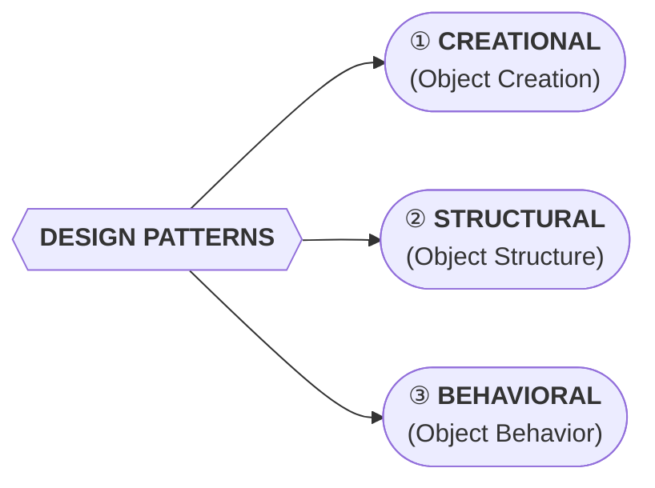
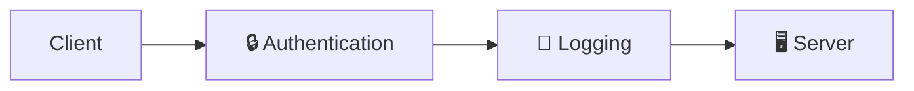
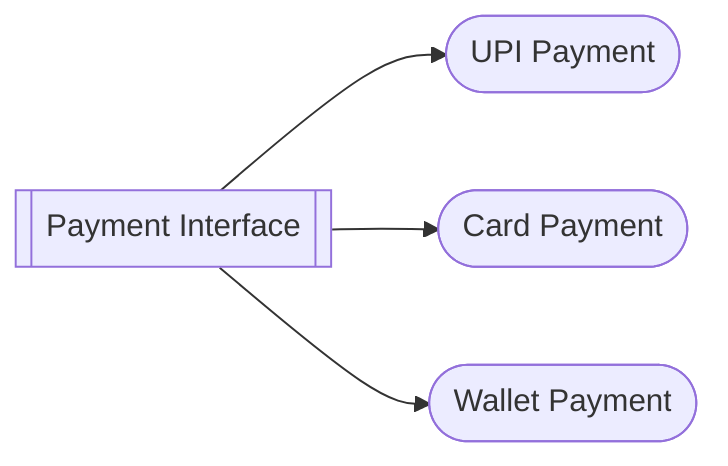
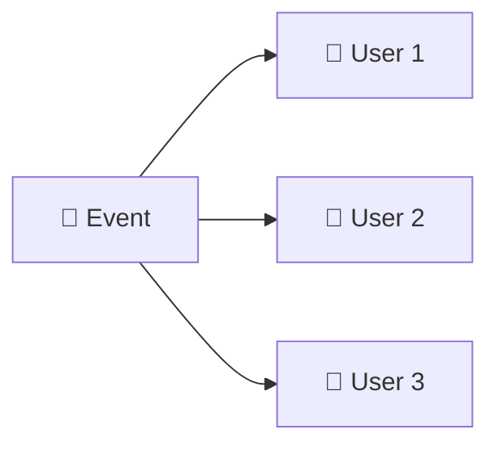

# Design Patterns

## Why Do We Need Design Patterns?

!!! abstract "What are Design Patterns?"
    Design patterns are **proven solutions** to common software design problems. They are not code — they are **templates** for how to solve problems that can be used in many different situations.

!!! tip "Practice Repository"
    Full Java implementations of all patterns: [:fontawesome-brands-github: lld-Design-Patterns](https://github.com/saivamsikaruturi/lld-Design-Patterns)

---

## Types of Design Patterns

---

## ① Creational Patterns — *Object Creation*

!!! question "Problem"
    How to create different objects in a clean and flexible way **without tying code to concrete classes**?

**Example:** Payment method selection — UPI, Card, or Wallet. You don't want `new UPIPayment()` scattered everywhere.

**Goal:** Create objects without hard-coding the exact class to instantiate.

**Used In:** Payment systems, Notification systems, Document parsers

| # | Pattern | What it Does |
|---|---------|-------------|
| 1 | [**Singleton**](creationalDesignPatterns/singletondesignpattern.md) | Ensures only ONE instance of a class exists globally |
| 2 | [**Factory Method**](creationalDesignPatterns/FactoryDesignPattern.md) | Creates objects without specifying the exact class |
| 3 | [**Abstract Factory**](creationalDesignPatterns/AbstractFactoryDesignPattern.md) | Creates families of related objects |
| 4 | [**Builder**](creationalDesignPatterns/BuilderDesignPattern.md) | Constructs complex objects step by step |
| 5 | [**Prototype**](creationalDesignPatterns/PrototypeDesignPattern.md) | Creates new objects by cloning existing ones |

---

## ② Structural Patterns — *Object Structure*

!!! question "Problem"
    How to add new behavior or features to existing objects **without changing their code**?

**Example:** Add logging + authentication to every API call without modifying the API handler.

**Goal:** Extend functionality without modifying existing code.

**Used In:** API wrappers, Adapters, Logging, Caching, Decorators

| # | Pattern | What it Does |
|---|---------|-------------|
| 1 | [**Adapter**](structuralDesignPatterns/AdapterDesignPattern.md) | Makes incompatible interfaces work together |
| 2 | [**Decorator**](structuralDesignPatterns/DecoratorDesignPattern.md) | Adds behavior dynamically without subclassing |
| 3 | [**Facade**](structuralDesignPatterns/facadedesignpattern.md) | Simplifies a complex subsystem with one interface |
| 4 | [**Proxy**](structuralDesignPatterns/Proxydesignpattern.md) | Controls access to another object |
| 5 | [**Composite**](structuralDesignPatterns/CompositeDesignPattern.md) | Treats individual objects and compositions uniformly |
| 6 | [**Bridge**](structuralDesignPatterns/BridgeDesignPattern.md) | Separates abstraction from implementation |
| 7 | [**Flyweight**](structuralDesignPatterns/flyweightdesignpattern.md) | Shares objects to reduce memory usage |

---

## ③ Behavioral Patterns — *Object Behavior*

!!! question "Problem"
    How objects **communicate and behave** in different situations without tight coupling?

**Example 1:** Payment System — same interface, different logic (Strategy)

**Example 2:** Notification System — one event, many users notified (Observer)

**Goal:** Handle different behaviors and interactions between objects.

**Used In:** Notification systems, Event handling, Undo/Redo, Workflows

| # | Pattern | What it Does |
|---|---------|-------------|
| 1 | [**Observer**](behaviouralDesignPatterns/ObserverDesignPattern.md) | Notifies multiple objects when state changes |
| 2 | [**Strategy**](behaviouralDesignPatterns/StrategyDp.md) | Swaps algorithms at runtime |
| 3 | [**Command**](behaviouralDesignPatterns/CommandDp.md) | Encapsulates a request as an object |
| 4 | [**Chain of Responsibility**](behaviouralDesignPatterns/ChainOfResponsibilityDesignPattern.md) | Passes request along a chain of handlers |
| 5 | [**State**](behaviouralDesignPatterns/StateDp.md) | Changes behavior when internal state changes |
| 6 | [**Template Method**](behaviouralDesignPatterns/TemplateDp.md) | Defines skeleton, subclasses fill in steps |
| 7 | [**Iterator**](behaviouralDesignPatterns/Iterator.md) | Traverses a collection without exposing internals |
| 8 | [**Mediator**](behaviouralDesignPatterns/MediatorDp.md) | Reduces chaotic dependencies between objects |
| 9 | [**Memento**](behaviouralDesignPatterns/MementoDp.md) | Captures and restores object state (undo) |
| 10 | [**Visitor**](behaviouralDesignPatterns/VisitorDp.md) | Adds operations without changing classes |
| 11 | [**Interpreter**](behaviouralDesignPatterns/Interpreter.md) | Evaluates sentences in a language |

---

## Quick Reference — All 23 Patterns

🟡

<h3>Creational Patterns</h3>

How objects get <strong>created</strong>

5

<a href="creationalDesignPatterns/singletondesignpattern/" class="dp-card">
🏗️
Singleton
One instance only
</a>
<a href="creationalDesignPatterns/FactoryDesignPattern/" class="dp-card">
🏭
Factory
Create by type
</a>
<a href="creationalDesignPatterns/AbstractFactoryDesignPattern/" class="dp-card">
🏭
Abstract Factory
Families of objects
</a>
<a href="creationalDesignPatterns/BuilderDesignPattern/" class="dp-card">
🧱
Builder
Step-by-step build
</a>
<a href="creationalDesignPatterns/PrototypeDesignPattern/" class="dp-card">
🐑
Prototype
Clone objects
</a>

🟢

<h3>Structural Patterns</h3>

How objects are <strong>composed</strong>

7

<a href="structuralDesignPatterns/AdapterDesignPattern/" class="dp-card">
🔌
Adapter
Convert interface
</a>
<a href="structuralDesignPatterns/DecoratorDesignPattern/" class="dp-card">
🎨
Decorator
Add behavior
</a>
<a href="structuralDesignPatterns/facadedesignpattern/" class="dp-card">
🏛️
Facade
Simplify access
</a>
<a href="structuralDesignPatterns/Proxydesignpattern/" class="dp-card">
🛡️
Proxy
Control access
</a>
<a href="structuralDesignPatterns/CompositeDesignPattern/" class="dp-card">
🌳
Composite
Tree structure
</a>
<a href="structuralDesignPatterns/BridgeDesignPattern/" class="dp-card">
🌉
Bridge
Decouple layers
</a>
<a href="structuralDesignPatterns/flyweightdesignpattern/" class="dp-card">
🪶
Flyweight
Share & save memory
</a>

🟣

<h3>Behavioral Patterns</h3>

How objects <strong>communicate</strong>

11

<a href="behaviouralDesignPatterns/ObserverDesignPattern/" class="dp-card">
👁️
Observer
Notify changes
</a>
<a href="behaviouralDesignPatterns/StrategyDp/" class="dp-card">
♟️
Strategy
Swap algorithms
</a>
<a href="behaviouralDesignPatterns/CommandDp/" class="dp-card">
📦
Command
Encapsulate action
</a>
<a href="behaviouralDesignPatterns/ChainOfResponsibilityDesignPattern/" class="dp-card">
⛓️
Chain of Resp.
Pass along
</a>
<a href="behaviouralDesignPatterns/StateDp/" class="dp-card">
🔄
State
Behavior switch
</a>
<a href="behaviouralDesignPatterns/TemplateDp/" class="dp-card">
📋
Template
Define skeleton
</a>
<a href="behaviouralDesignPatterns/Iterator/" class="dp-card">
🔂
Iterator
Traverse
</a>
<a href="behaviouralDesignPatterns/MediatorDp/" class="dp-card">
🤝
Mediator
Centralize comms
</a>
<a href="behaviouralDesignPatterns/MementoDp/" class="dp-card">
💾
Memento
Undo / Redo
</a>
<a href="behaviouralDesignPatterns/VisitorDp/" class="dp-card">
🚶
Visitor
Add operations
</a>
<a href="behaviouralDesignPatterns/Interpreter/" class="dp-card">
📖
Interpreter
Parse grammar
</a>

---

!!! tip "Think in Patterns, Write Better Code!"
    Don't memorize patterns — **understand the problem each one solves**. When you face a similar problem in your code, the right pattern will come naturally.
