# J2EE Design Patterns — Enterprise Architecture Patterns

> **Why This Still Matters:** Every Spring annotation you use (`@Controller`, `@Service`, `@Repository`) maps directly to a J2EE pattern. Understanding the original patterns reveals why Spring works the way it does — and these patterns still appear in senior-level and architect interviews.

---

!!! abstract "The Three Tiers"
    J2EE (now Jakarta EE) patterns are organized into three tiers: Presentation, Business, and Integration. Modern frameworks implement these patterns implicitly, but knowing the underlying architecture helps you make better design decisions.

```mermaid
flowchart LR
    subgraph PT["Presentation Tier"]
        FC["Front Controller"]
        IF["Intercepting Filter"]
        VH["View Helper"]
        CV["Composite View"]
    end

    subgraph BT["Business Tier"]
        BD["Business Delegate"]
        SL["Service Locator"]
        SF["Session Facade"]
        TO["Transfer Object"]
    end

    subgraph IT["Integration Tier"]
        DAO["Data Access Object"]
        SA["Service Activator"]
    end

    PT --> BT --> IT

    style FC fill:#DBEAFE,stroke:#93C5FD,color:#1E40AF
    style IF fill:#DBEAFE,stroke:#93C5FD,color:#1E40AF
    style VH fill:#DBEAFE,stroke:#93C5FD,color:#1E40AF
    style CV fill:#DBEAFE,stroke:#93C5FD,color:#1E40AF
    style BD fill:#D1FAE5,stroke:#6EE7B7,color:#065F46
    style SL fill:#D1FAE5,stroke:#6EE7B7,color:#065F46
    style SF fill:#D1FAE5,stroke:#6EE7B7,color:#065F46
    style TO fill:#D1FAE5,stroke:#6EE7B7,color:#065F46
    style DAO fill:#FEF3C7,stroke:#FCD34D,color:#92400E
    style SA fill:#FEF3C7,stroke:#FCD34D,color:#92400E
```

---

## Presentation Tier Patterns

### Front Controller

**Problem:** Multiple request handlers duplicating common logic (authentication, logging, routing).

**Solution:** A single entry point that handles all requests, delegating to specific handlers.

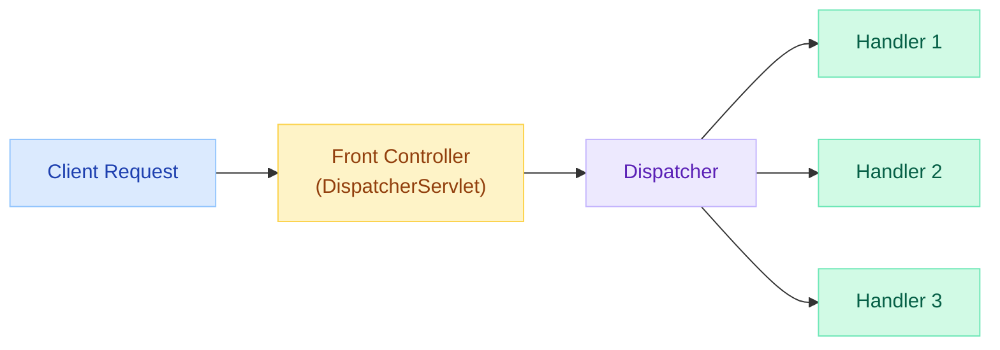

```java
// Classic J2EE implementation
public class FrontController extends HttpServlet {

    @Override
    protected void service(HttpServletRequest req, HttpServletResponse resp)
            throws ServletException, IOException {
        // Common pre-processing
        authenticate(req);
        logRequest(req);

        // Delegate to appropriate handler
        String action = req.getParameter("action");
        Command command = CommandFactory.getCommand(action);
        String view = command.execute(req, resp);

        // Forward to view
        req.getRequestDispatcher(view).forward(req, resp);
    }
}
```

| J2EE Pattern | Spring Equivalent | How Spring Implements It |
|---|---|---|
| Front Controller | `DispatcherServlet` | Single servlet handles all requests, routes to `@Controller` methods |
| Command objects | `@RequestMapping` methods | Each handler method is a command |
| CommandFactory | `HandlerMapping` | Maps URLs to handler methods |

---

### Intercepting Filter

**Problem:** Pre/post processing logic (encoding, auth, compression) tangled with request handling.

**Solution:** A chain of filters that process requests/responses before reaching the handler.

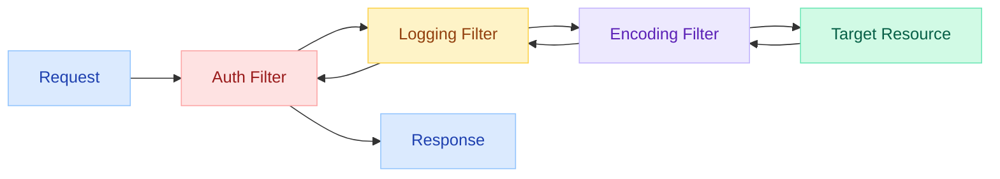

```java
// Classic J2EE Filter
public class AuthenticationFilter implements Filter {

    @Override
    public void doFilter(ServletRequest req, ServletResponse resp, FilterChain chain)
            throws IOException, ServletException {
        HttpServletRequest httpReq = (HttpServletRequest) req;

        if (!isAuthenticated(httpReq)) {
            ((HttpServletResponse) resp).sendError(401);
            return; // Short-circuit the chain
        }

        chain.doFilter(req, resp); // Continue chain
    }
}

// Spring equivalent
@Component
@Order(1)
public class AuthenticationFilter extends OncePerRequestFilter {

    @Override
    protected void doFilterInternal(HttpServletRequest request,
            HttpServletResponse response, FilterChain chain)
            throws ServletException, IOException {
        if (!isAuthenticated(request)) {
            response.sendError(401);
            return;
        }
        chain.doFilter(request, response);
    }
}
```

| J2EE Pattern | Spring Equivalent |
|---|---|
| Filter interface | `OncePerRequestFilter` / Spring Security `SecurityFilterChain` |
| FilterChain | Same (`FilterChain`) |
| Filter ordering | `@Order` annotation or `FilterRegistrationBean` |

---

### View Helper

**Problem:** JSP pages cluttered with business logic and data formatting code.

**Solution:** Helper classes that handle formatting and data transformation for views.

```java
// Classic: Tag libraries and helper beans
public class DateViewHelper {
    public static String formatDate(Date date, String pattern) {
        return new SimpleDateFormat(pattern).format(date);
    }

    public static String timeAgo(Date date) {
        long diff = System.currentTimeMillis() - date.getTime();
        if (diff < 60_000) return "just now";
        if (diff < 3_600_000) return (diff / 60_000) + " minutes ago";
        return (diff / 3_600_000) + " hours ago";
    }
}

// Spring equivalent: Thymeleaf utilities, @ModelAttribute
@ControllerAdvice
public class GlobalViewHelper {

    @ModelAttribute("dateUtil")
    public DateViewHelper dateHelper() {
        return new DateViewHelper();
    }
}
```

---

### Composite View

**Problem:** Pages share common layouts (header, footer, navigation) but differ in content.

**Solution:** Compose pages from reusable view fragments.

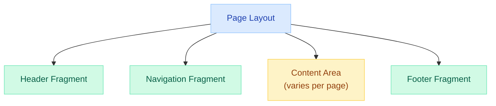

```html
<!-- Thymeleaf (Spring's Composite View) -->
<!-- layout.html -->
<html>
<head th:replace="~{fragments/head :: head}"></head>
<body>
    <nav th:replace="~{fragments/nav :: navigation}"></nav>
    <main th:replace="${content}"></main>
    <footer th:replace="~{fragments/footer :: footer}"></footer>
</body>
</html>
```

| J2EE Approach | Spring Equivalent |
|---|---|
| Apache Tiles | Thymeleaf Layout Dialect |
| JSP includes | Thymeleaf fragments (`th:replace`, `th:insert`) |
| Sitemesh | Spring + Thymeleaf templates |

---

## Business Tier Patterns

### Business Delegate

**Problem:** Presentation tier directly coupled to business service APIs, JNDI lookups, and remote exceptions.

**Solution:** An intermediary that decouples presentation from business logic and handles lookup/exception translation.

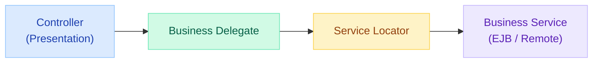

```java
// Classic J2EE Business Delegate
public class OrderBusinessDelegate {

    private OrderService orderService;

    public OrderBusinessDelegate() {
        // Encapsulates lookup and connection logic
        this.orderService = ServiceLocator.lookup("OrderService");
    }

    public OrderDTO placeOrder(OrderRequest request) {
        try {
            return orderService.placeOrder(request);
        } catch (RemoteException e) {
            // Translate technical exceptions
            throw new ApplicationException("Order service unavailable", e);
        }
    }
}

// Spring equivalent: @Service layer IS the business delegate
@Service
public class OrderService {

    @Autowired // DI replaces Service Locator
    private OrderRepository orderRepository;

    @Autowired
    private PaymentClient paymentClient; // Feign/RestClient hides remote complexity

    @Transactional
    public OrderDTO placeOrder(OrderRequest request) {
        // Business logic - no lookup or remote exception handling
        Order order = new Order(request);
        orderRepository.save(order);
        paymentClient.charge(order.getPaymentDetails());
        return OrderDTO.from(order);
    }
}
```

---

### Service Locator

**Problem:** Every client that needs a service must perform expensive JNDI lookups and handle connection logic.

**Solution:** Centralize service lookup and cache references.

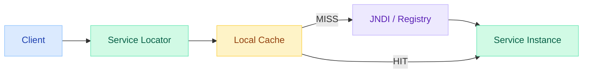

```java
// Classic J2EE Service Locator
public class ServiceLocator {

    private static final Map<String, Object> cache = new ConcurrentHashMap<>();

    @SuppressWarnings("unchecked")
    public static <T> T lookup(String jndiName) {
        return (T) cache.computeIfAbsent(jndiName, key -> {
            try {
                InitialContext ctx = new InitialContext();
                return ctx.lookup(key);
            } catch (NamingException e) {
                throw new ServiceLocatorException("Cannot find: " + key, e);
            }
        });
    }
}

// Usage
OrderService service = ServiceLocator.lookup("java:comp/env/OrderService");
```

!!! warning "Anti-Pattern in Modern Spring"
    Service Locator is considered an anti-pattern when Dependency Injection is available. DI makes dependencies explicit, testable, and compile-time verifiable.

| Service Locator | Dependency Injection (Spring) |
|---|---|
| Client actively looks up dependencies | Container injects dependencies |
| Hidden dependencies | Explicit dependencies (constructor) |
| Hard to test (needs mock locator) | Easy to test (just pass mocks) |
| Runtime failures | Compile-time/startup failures |

---

### Session Facade

**Problem:** Clients make multiple fine-grained calls to business objects, causing excessive network round-trips and exposing internal complexity.

**Solution:** A coarse-grained facade that encapsulates complex business workflows in a single method.

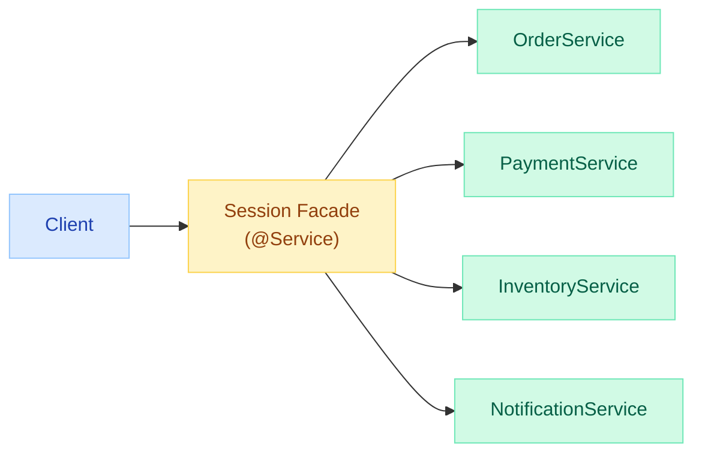

```java
// Classic: Session Bean as Facade (EJB)
@Stateless
public class OrderFacade {

    @EJB private OrderBean orderBean;
    @EJB private PaymentBean paymentBean;
    @EJB private InventoryBean inventoryBean;

    // Single coarse-grained operation
    public OrderConfirmation placeOrder(OrderRequest request) {
        Order order = orderBean.create(request);
        inventoryBean.reserve(order.getItems());
        PaymentResult payment = paymentBean.charge(order.getTotal());
        order.confirm(payment.getTransactionId());
        return new OrderConfirmation(order);
    }
}

// Spring equivalent: @Service is the facade
@Service
@Transactional
public class OrderFacadeService {

    private final OrderRepository orderRepo;
    private final PaymentService paymentService;
    private final InventoryService inventoryService;
    private final NotificationService notificationService;

    public OrderFacadeService(OrderRepository orderRepo,
                              PaymentService paymentService,
                              InventoryService inventoryService,
                              NotificationService notificationService) {
        this.orderRepo = orderRepo;
        this.paymentService = paymentService;
        this.inventoryService = inventoryService;
        this.notificationService = notificationService;
    }

    public OrderConfirmation placeOrder(OrderRequest request) {
        Order order = orderRepo.save(Order.from(request));
        inventoryService.reserve(order.getItems());
        PaymentResult result = paymentService.charge(order);
        order.confirm(result.getTransactionId());
        notificationService.sendConfirmation(order);
        return OrderConfirmation.from(order);
    }
}
```

---

### Transfer Object (DTO)

**Problem:** Sending entity objects over the network exposes internal structure, causes lazy-loading issues, and transfers more data than needed.

**Solution:** Plain serializable objects that carry only the data needed by the client.

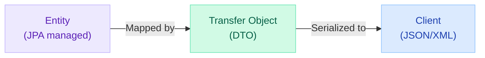

```java
// Entity (internal, rich domain model)
@Entity
public class Order {
    @Id private Long id;
    private BigDecimal total;
    private OrderStatus status;
    @ManyToOne private Customer customer;
    @OneToMany private List<OrderItem> items;
    private String internalTrackingCode; // Don't expose this
}

// Transfer Object / DTO (external contract)
public record OrderDTO(
    Long id,
    BigDecimal total,
    String status,
    String customerName,
    int itemCount
) {
    public static OrderDTO from(Order order) {
        return new OrderDTO(
            order.getId(),
            order.getTotal(),
            order.getStatus().name(),
            order.getCustomer().getName(),
            order.getItems().size()
        );
    }
}

// In modern Spring: use MapStruct for complex mappings
@Mapper(componentModel = "spring")
public interface OrderMapper {
    @Mapping(source = "customer.name", target = "customerName")
    @Mapping(expression = "java(order.getItems().size())", target = "itemCount")
    OrderDTO toDto(Order order);
}
```

### Value Object vs Transfer Object

| Concept | Transfer Object (DTO) | Value Object (DDD) |
|---|---|---|
| Purpose | Data transfer between layers/services | Domain concept with equality by value |
| Mutability | Typically immutable (records) | Always immutable |
| Identity | Has no identity (just data) | Equality based on all fields |
| Example | `OrderDTO` | `Money(amount, currency)`, `Address` |

---

## Integration Tier Patterns

### Data Access Object (DAO)

**Problem:** Business logic polluted with database-specific code (SQL, JDBC, connection management).

**Solution:** Encapsulate all data access logic in dedicated objects, exposing only business-friendly methods.

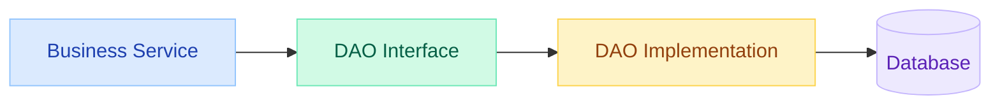

```java
// Classic J2EE DAO
public interface OrderDao {
    Order findById(Long id);
    List<Order> findByCustomer(Long customerId);
    void save(Order order);
    void delete(Long id);
}

public class OrderDaoJdbc implements OrderDao {

    private DataSource dataSource;

    @Override
    public Order findById(Long id) {
        String sql = "SELECT * FROM orders WHERE id = ?";
        try (Connection conn = dataSource.getConnection();
             PreparedStatement ps = conn.prepareStatement(sql)) {
            ps.setLong(1, id);
            ResultSet rs = ps.executeQuery();
            if (rs.next()) {
                return mapRow(rs);
            }
            return null;
        } catch (SQLException e) {
            throw new DataAccessException("Failed to find order: " + id, e);
        }
    }

    private Order mapRow(ResultSet rs) throws SQLException {
        Order order = new Order();
        order.setId(rs.getLong("id"));
        order.setTotal(rs.getBigDecimal("total"));
        order.setStatus(OrderStatus.valueOf(rs.getString("status")));
        return order;
    }
}

// Spring Data equivalent (auto-implemented!)
public interface OrderRepository extends JpaRepository<Order, Long> {
    List<Order> findByCustomerId(Long customerId);

    @Query("SELECT o FROM Order o WHERE o.status = :status AND o.total > :min")
    List<Order> findHighValueOrders(@Param("status") OrderStatus status,
                                    @Param("min") BigDecimal min);
}
```

| Classic DAO | Spring Data Repository |
|---|---|
| Manual JDBC/JPA code | Auto-generated from method names |
| Explicit SQL mapping | Convention + `@Query` |
| Custom exception handling | `DataAccessException` hierarchy (auto-translated) |
| Manual transaction management | `@Transactional` declarative |
| Test with mock DataSource | Test with `@DataJpaTest` + H2 |

---

### Service Activator

**Problem:** Business logic needs to respond to asynchronous messages (JMS, MQ) without coupling to messaging infrastructure.

**Solution:** A component that listens for messages and delegates to business services.

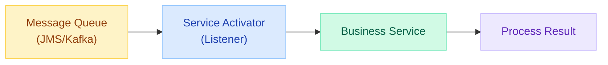

```java
// Classic J2EE: Message-Driven Bean
@MessageDriven(activationConfig = {
    @ActivationConfigProperty(propertyName = "destination",
                              propertyValue = "queue/OrderQueue")
})
public class OrderMessageBean implements MessageListener {

    @EJB private OrderService orderService;

    @Override
    public void onMessage(Message message) {
        try {
            TextMessage textMsg = (TextMessage) message;
            OrderRequest request = parseRequest(textMsg.getText());
            orderService.processOrder(request);
        } catch (JMSException e) {
            throw new RuntimeException("Failed to process message", e);
        }
    }
}

// Spring equivalent: @KafkaListener / @JmsListener
@Component
public class OrderEventListener {

    private final OrderService orderService;

    @KafkaListener(topics = "order-events", groupId = "order-processor")
    public void handleOrderEvent(OrderEvent event) {
        switch (event.getType()) {
            case CREATED -> orderService.processNewOrder(event.getOrderId());
            case CANCELLED -> orderService.cancelOrder(event.getOrderId());
            case PAYMENT_RECEIVED -> orderService.fulfillOrder(event.getOrderId());
        }
    }
}
```

---

## Pattern Comparison: J2EE vs Modern Spring

| J2EE Pattern | Spring Equivalent | Key Improvement |
|---|---|---|
| Front Controller | `DispatcherServlet` | Auto-configured, annotation-driven |
| Intercepting Filter | `OncePerRequestFilter`, Security Filter Chain | Composable, testable |
| View Helper | `@ModelAttribute`, Thymeleaf utilities | Type-safe templates |
| Composite View | Thymeleaf layouts/fragments | No XML configuration |
| Business Delegate | `@Service` | DI eliminates manual wiring |
| Service Locator | `ApplicationContext` / DI | **Anti-pattern** — use constructor injection |
| Session Facade | `@Service` + `@Transactional` | Declarative transactions |
| Transfer Object | Records / DTOs + MapStruct | Immutable, compile-time mapping |
| DAO | `JpaRepository` / Spring Data | Zero-boilerplate CRUD |
| Service Activator | `@KafkaListener` / `@JmsListener` | Declarative, testable |

---

## When to Use Each Pattern (Decision Guide)

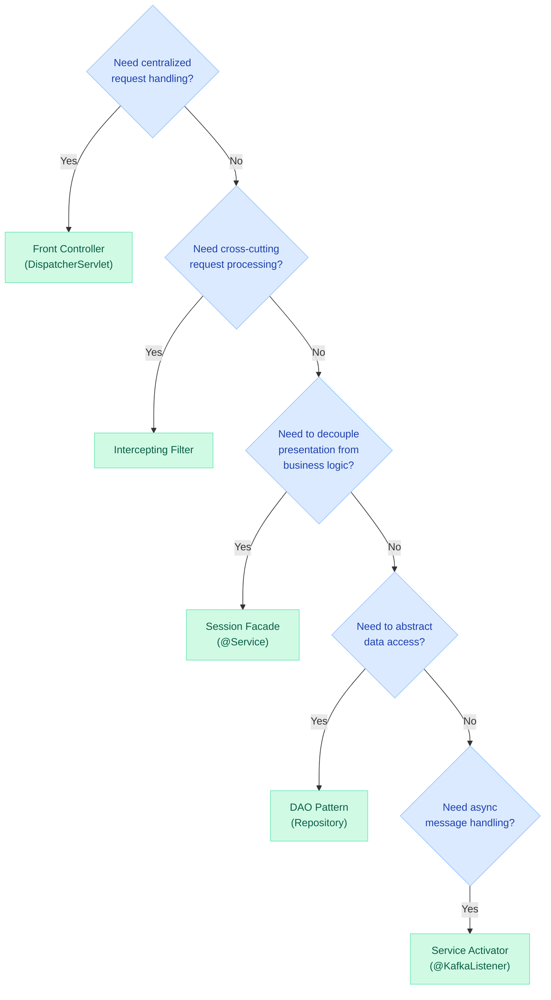

---

## Interview Questions

??? question "Q: Explain the Front Controller pattern and how Spring MVC implements it."
    The Front Controller pattern provides a single entry point for all web requests. It centralizes common logic (routing, authentication, logging) and delegates to specific handlers.

    In Spring MVC, `DispatcherServlet` is the Front Controller. It:
    1. Receives all HTTP requests
    2. Consults `HandlerMapping` to find the right `@Controller` method
    3. Invokes `HandlerAdapter` to execute the method
    4. Uses `ViewResolver` to render the response
    5. Applies `HandlerInterceptors` (pre/post processing)

    Benefits: DRY request processing, centralized error handling, consistent security enforcement.

??? question "Q: What is the difference between Service Locator and Dependency Injection? Why is DI preferred?"
    **Service Locator**: Client actively requests dependencies from a registry. Dependencies are hidden inside implementation code.

    **Dependency Injection**: Container pushes dependencies to the client (typically via constructor). Dependencies are declared explicitly.

    DI is preferred because: (1) Dependencies are visible in constructors (self-documenting). (2) Easy to test — just pass mock objects. (3) Compile-time safety — missing beans fail at startup. (4) No coupling to container API. (5) Supports immutability (final fields with constructor injection).

    Service Locator still has niche uses: plugin systems where dependencies are discovered at runtime, or legacy code migration where refactoring to DI is too expensive.

??? question "Q: Explain the DAO pattern and how Spring Data JPA improves upon it."
    The DAO pattern encapsulates data access logic behind an interface, separating persistence from business logic. Classic DAOs require writing JDBC code, managing connections, mapping ResultSets, and translating SQLExceptions.

    Spring Data JPA improves this by: (1) Auto-generating implementations from method names (`findByStatusAndCreatedAfter`). (2) Providing `@Query` for custom JPQL/SQL. (3) Auto-translating exceptions to Spring's `DataAccessException` hierarchy. (4) Adding pagination, sorting, and specifications out of the box. (5) Supporting auditing (`@CreatedDate`, `@LastModifiedBy`) automatically.

    The Repository is essentially a DAO with zero boilerplate — the pattern is the same, just the implementation effort is eliminated.

??? question "Q: What is the Transfer Object (DTO) pattern and when should you NOT use it?"
    Transfer Object (DTO) carries data between processes/layers. It decouples internal domain models from external API contracts, preventing: lazy-loading issues, circular references in serialization, over-exposure of fields, and coupling clients to schema changes.

    When NOT to use: (1) Simple CRUD with flat entities that match API contract exactly. (2) Internal method calls within same service (unnecessary copying). (3) When using GraphQL (client specifies fields). (4) Event sourcing where events ARE the transfer objects.

    In practice, most production APIs use DTOs for: input validation (request DTOs), response shaping (response DTOs), and versioning (v1/v2 DTOs mapping to same entity).

??? question "Q: How does the Session Facade pattern relate to the @Transactional annotation in Spring?"
    The Session Facade provides a coarse-grained interface that encapsulates multiple business operations into a single unit of work. In J2EE, it was an EJB Session Bean with container-managed transactions.

    In Spring, `@Service` classes annotated with `@Transactional` serve the same purpose:
    - **Coarse-grained API**: One `@Transactional` method orchestrates multiple repository calls
    - **Transaction boundary**: The method defines the transaction scope
    - **Atomicity**: All operations succeed or all roll back
    - **Reduced round-trips**: Client makes one call instead of many

    Example: `orderService.placeOrder()` (one call) internally does: validate, reserve inventory, charge payment, save order, send notification — all in one transaction boundary.

---

## Quick Recall

| Pattern | Tier | Problem Solved | Spring Equivalent |
|---|---|---|---|
| **Front Controller** | Presentation | Centralized request handling | `DispatcherServlet` |
| **Intercepting Filter** | Presentation | Cross-cutting request/response processing | `Filter` / Security Filter Chain |
| **View Helper** | Presentation | Separate formatting from views | `@ModelAttribute` / Thymeleaf |
| **Composite View** | Presentation | Reusable page layouts | Thymeleaf layouts/fragments |
| **Business Delegate** | Business | Decouple presentation from services | `@Service` layer |
| **Service Locator** | Business | Centralize service lookup | DI (`@Autowired`) — locator is anti-pattern |
| **Session Facade** | Business | Coarse-grained transaction boundary | `@Service` + `@Transactional` |
| **Transfer Object** | Business | Decouple internal model from API | Records / DTOs + MapStruct |
| **DAO** | Integration | Abstract persistence mechanism | `JpaRepository` / Spring Data |
| **Service Activator** | Integration | Async message-to-service bridge | `@KafkaListener` / `@JmsListener` |

---

## See Also

- [Design Patterns Introduction](dp.md) — GoF patterns overview
- [Spring IoC & DI](../springboot/SpringIOC.md) — How DI replaced Service Locator
- [Spring MVC Request Lifecycle](../springboot/mvc-request-lifecycle.md) — Front Controller in action
- [Filters vs Interceptors vs AOP](../springboot/filters-interceptors-aop.md) — Intercepting Filter deep dive
- [Entity-to-DTO Mapping](../springboot/dto-mapping.md) — Transfer Object with MapStruct
- [Spring Data JPA](../springboot/spring-data-jpa.md) — Modern DAO implementation
