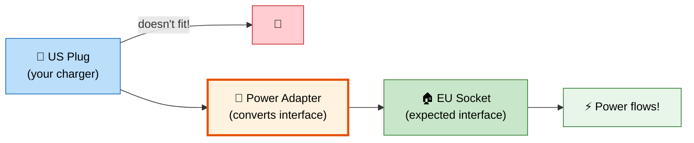
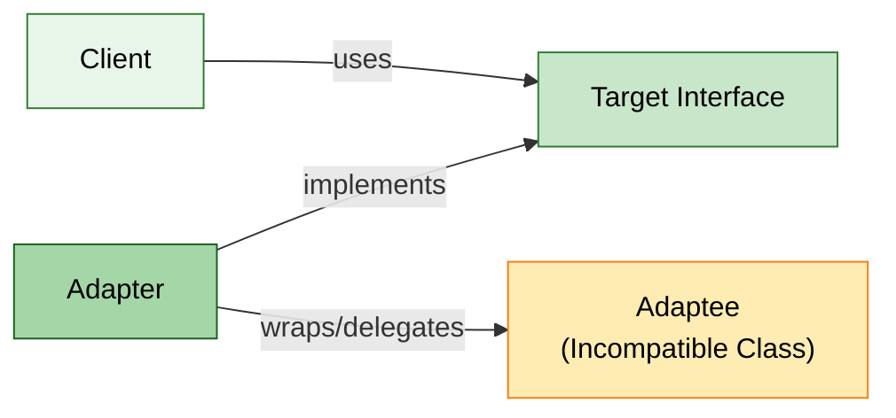
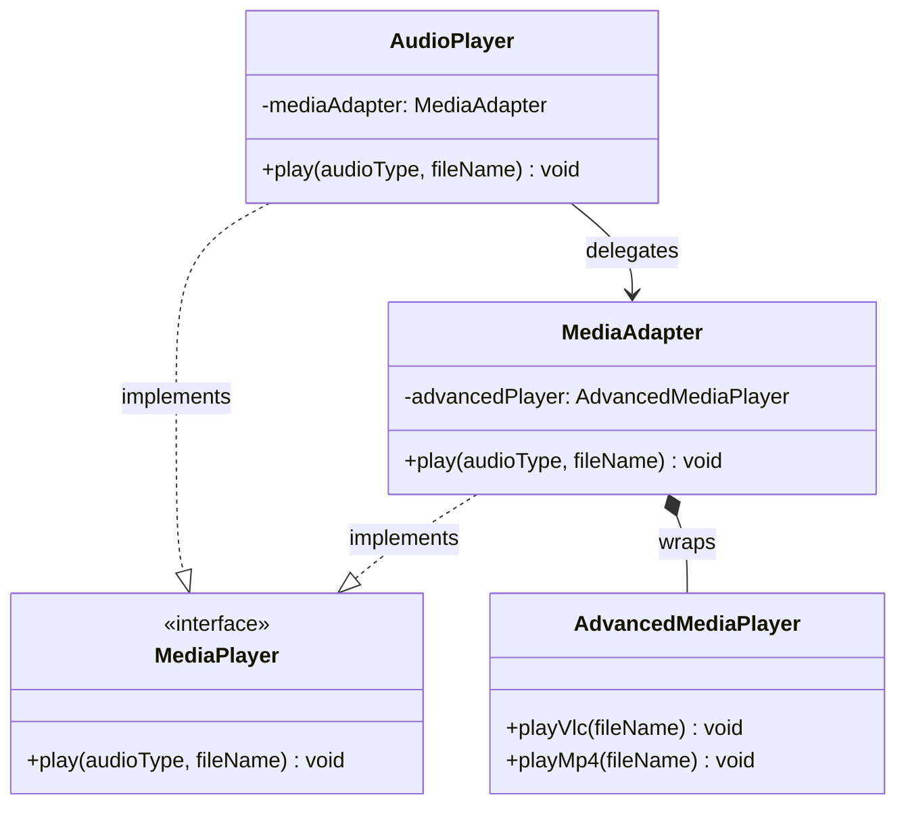
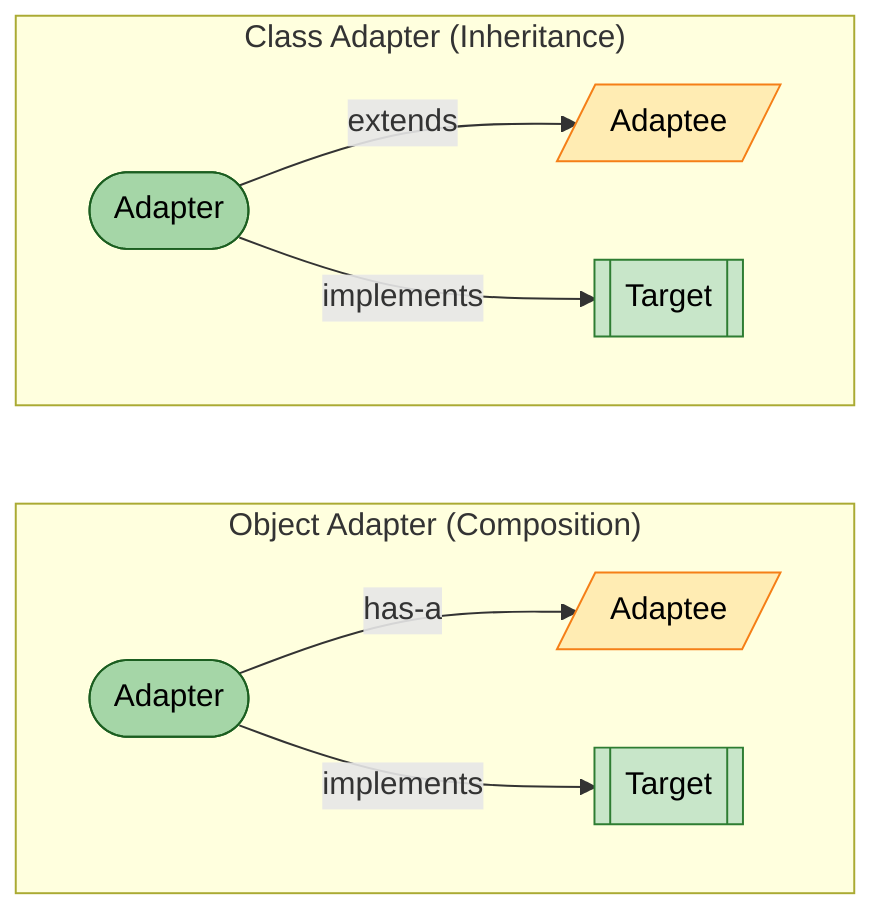

# :electric_plug: Adapter Design Pattern

> **Convert the interface of a class into another interface clients expect. Adapter lets classes work together that couldn't otherwise because of incompatible interfaces.**

---

## :bulb: Real-World Analogy

!!! abstract "Think of a Power Adapter"
    When you travel from the US to Europe, your laptop charger plug won't fit European wall sockets. You use a **power adapter** — it doesn't change what your charger does, it simply makes the incompatible plug fit into the socket. The Adapter pattern does the same for software interfaces.


```mermaid
flowchart LR
    A["🔌 US Plug<br/>(your charger)"] -->|doesn't fit!| B["🚫"]
    A --> C["🔄 Power Adapter<br/>(converts interface)"]
    C --> D["🏠 EU Socket<br/>(expected interface)"]
    D --> E["⚡ Power flows!"]
    
    style A fill:#BBDEFB,stroke:#1565C0,color:#000
    style B fill:#FFCDD2,stroke:#C62828,color:#000
    style C fill:#FFF3E0,stroke:#E65100,stroke-width:3px,color:#000
    style D fill:#C8E6C9,stroke:#2E7D32,color:#000
    style E fill:#E8F5E9,stroke:#2E7D32,color:#000
```

---

## :triangular_ruler: Pattern Structure


```mermaid
flowchart LR
    Client["Client"]
    Target["Target Interface"]
    Adapter["Adapter"]
    Adaptee["Adaptee\n(Incompatible Class)"]

    Client -->|uses| Target
    Adapter -->|implements| Target
    Adapter -->|wraps/delegates| Adaptee

    style Client fill:#e8f5e9,stroke:#2e7d32,color:#000
    style Target fill:#c8e6c9,stroke:#2e7d32,color:#000
    style Adapter fill:#a5d6a7,stroke:#1b5e20,color:#000
    style Adaptee fill:#ffecb3,stroke:#f57f17,color:#000
```

## UML Class Diagram


```mermaid
classDiagram
    class MediaPlayer {
        <<interface>>
        +play(audioType, fileName) void
    }
    class AdvancedMediaPlayer {
        +playVlc(fileName) void
        +playMp4(fileName) void
    }
    class MediaAdapter {
        -advancedPlayer: AdvancedMediaPlayer
        +play(audioType, fileName) void
    }
    class AudioPlayer {
        -mediaAdapter: MediaAdapter
        +play(audioType, fileName) void
    }

    MediaAdapter ..|> MediaPlayer : implements
    AudioPlayer ..|> MediaPlayer : implements
    MediaAdapter *-- AdvancedMediaPlayer : wraps
    AudioPlayer --> MediaAdapter : delegates
```

### Object Adapter vs Class Adapter


```mermaid
flowchart LR
    subgraph ObjectAdapter["Object Adapter (Composition)"]
        direction LR
        OA_Adapter(["Adapter"]) -->|has-a| OA_Adaptee[/"Adaptee"/]
        OA_Adapter -->|implements| OA_Target[["Target"]]
    end

    subgraph ClassAdapter["Class Adapter (Inheritance)"]
        direction LR
        CA_Adapter(["Adapter"]) -->|extends| CA_Adaptee[/"Adaptee"/]
        CA_Adapter -->|implements| CA_Target[["Target"]]
    end

    style OA_Adapter fill:#a5d6a7,stroke:#1b5e20,color:#000
    style OA_Adaptee fill:#ffecb3,stroke:#f57f17,color:#000
    style OA_Target fill:#c8e6c9,stroke:#2e7d32,color:#000
    style CA_Adapter fill:#a5d6a7,stroke:#1b5e20,color:#000
    style CA_Adaptee fill:#ffecb3,stroke:#f57f17,color:#000
    style CA_Target fill:#c8e6c9,stroke:#2e7d32,color:#000
```

---

## :x: The Problem

You're integrating a **third-party analytics library** that returns data in XML format. But your application's reporting module exclusively works with JSON. You can't modify the third-party library, and rewriting your reporting module would break existing code.

Without an adapter, you'd face:

- Tight coupling to specific data formats
- Inability to swap implementations
- Violation of the Open/Closed Principle

---

## :white_check_mark: The Solution

The Adapter pattern introduces a **wrapper class** that translates one interface into another. The client works with the Target interface; the Adapter translates those calls into the format the Adaptee understands.

**Two flavors:**

| Type | Mechanism | Java Support |
|------|-----------|------|
| **Object Adapter** | Composition (has-a) | Preferred in Java |
| **Class Adapter** | Multiple Inheritance (is-a) | Not directly possible (no MI) — use interfaces |

---

## :hammer_and_wrench: Implementation

=== "Object Adapter (Recommended)"

    ```java
    // Target interface - what our client expects
    public interface MediaPlayer {
        void play(String audioType, String fileName);
    }

    // Adaptee - incompatible interface (third-party or legacy)
    public class AdvancedMediaPlayer {
        public void playVlc(String fileName) {
            System.out.println("Playing VLC file: " + fileName);
        }

        public void playMp4(String fileName) {
            System.out.println("Playing MP4 file: " + fileName);
        }
    }

    // Adapter - bridges the gap using COMPOSITION
    public class MediaAdapter implements MediaPlayer {

        private final AdvancedMediaPlayer advancedPlayer;

        public MediaAdapter() {
            this.advancedPlayer = new AdvancedMediaPlayer();
        }

        @Override
        public void play(String audioType, String fileName) {
            switch (audioType.toLowerCase()) {
                case "vlc" -> advancedPlayer.playVlc(fileName);
                case "mp4" -> advancedPlayer.playMp4(fileName);
                default -> throw new UnsupportedOperationException(
                    "Format not supported: " + audioType);
            }
        }
    }

    // Client code
    public class AudioPlayer implements MediaPlayer {

        private final MediaAdapter mediaAdapter = new MediaAdapter();

        @Override
        public void play(String audioType, String fileName) {
            if ("mp3".equalsIgnoreCase(audioType)) {
                System.out.println("Playing MP3 file: " + fileName);
            } else {
                mediaAdapter.play(audioType, fileName);
            }
        }
    }
    ```

=== "Class Adapter (via Interface)"

    ```java
    // In Java, we simulate class adapter using interface + extending adaptee
    public interface Target {
        String getData();
    }

    // Adaptee with incompatible interface
    public class LegacyXmlService {
        public String getXmlData() {
            return "<data><name>Adapter Pattern</name></data>";
        }
    }

    // Class Adapter - extends Adaptee AND implements Target
    public class XmlToJsonAdapter extends LegacyXmlService implements Target {

        @Override
        public String getData() {
            String xml = getXmlData(); // inherited from LegacyXmlService
            return convertXmlToJson(xml);
        }

        private String convertXmlToJson(String xml) {
            // Conversion logic (simplified)
            return "{\"name\": \"Adapter Pattern\"}";
        }
    }

    // Client only knows Target interface
    public class ReportGenerator {
        private final Target dataSource;

        public ReportGenerator(Target dataSource) {
            this.dataSource = dataSource;
        }

        public void generateReport() {
            String json = dataSource.getData();
            System.out.println("Report data: " + json);
        }
    }
    ```

=== "Spring Example — Repository Adapter"

    ```java
    // Target interface
    public interface UserRepository {
        User findById(Long id);
        List<User> findAll();
        void save(User user);
    }

    // Adaptee — Legacy JDBC-based DAO
    public class LegacyUserDao {
        public Map<String, Object> queryUserById(long id) { /* ... */ }
        public List<Map<String, Object>> queryAllUsers() { /* ... */ }
        public void insertUser(Map<String, Object> userData) { /* ... */ }
    }

    // Adapter
    @Repository
    public class UserRepositoryAdapter implements UserRepository {

        private final LegacyUserDao legacyDao;

        public UserRepositoryAdapter(LegacyUserDao legacyDao) {
            this.legacyDao = legacyDao;
        }

        @Override
        public User findById(Long id) {
            Map<String, Object> raw = legacyDao.queryUserById(id);
            return mapToUser(raw);
        }

        @Override
        public List<User> findAll() {
            return legacyDao.queryAllUsers().stream()
                .map(this::mapToUser)
                .collect(Collectors.toList());
        }

        @Override
        public void save(User user) {
            legacyDao.insertUser(mapToRaw(user));
        }

        private User mapToUser(Map<String, Object> raw) {
            return new User((Long) raw.get("id"), (String) raw.get("name"));
        }

        private Map<String, Object> mapToRaw(User user) {
            return Map.of("id", user.getId(), "name", user.getName());
        }
    }
    ```

---

## :dart: When to Use

- You want to use an **existing class** but its interface doesn't match what you need
- You're building a **reusable class** that must cooperate with unrelated/unforeseen classes
- You need to integrate **legacy code** with a modern system without modifying the legacy code
- You're wrapping **third-party libraries** to isolate your code from external changes
- You need to provide a **unified interface** for multiple classes with different interfaces

---

## :globe_with_meridians: Real-World Examples

| Where | Example |
|-------|---------|
| **JDK** | `Arrays.asList()` — adapts array to List interface |
| **JDK** | `InputStreamReader` — adapts InputStream to Reader |
| **JDK** | `Collections.enumeration()` — adapts Collection to Enumeration |
| **Spring** | `HandlerAdapter` — adapts various handler types to a common interface |
| **Spring** | `JpaVendorAdapter` — adapts different JPA providers |
| **SLF4J** | Entire library is an adapter over logging frameworks |
| **Jackson** | `ObjectMapper` adapts Java objects to/from JSON |

---

## :warning: Pitfalls

!!! warning "Common Mistakes"
    - **Over-adapting**: Creating adapters for classes that can easily be refactored — increases unnecessary indirection
    - **Two-way adapters**: Trying to adapt both directions makes the adapter overly complex
    - **Using Class Adapter in Java**: Java doesn't support multiple inheritance of classes — prefer Object Adapter (composition)
    - **Leaking Adaptee details**: The adapter should completely hide the Adaptee's interface from the client
    - **Not following ISP**: Creating a "fat" target interface forces the adapter to implement methods it doesn't need

---

## :memo: Key Takeaways

!!! tip "Summary"
    | Aspect | Detail |
    |--------|--------|
    | **Intent** | Make incompatible interfaces work together |
    | **Mechanism** | Wraps an existing class with a new interface |
    | **Preferred Type** | Object Adapter (composition over inheritance) |
    | **Key Principle** | Open/Closed Principle — extend without modifying |
    | **Interview Tip** | Adapter converts an interface; Decorator adds behavior; Facade simplifies a subsystem |
    | **One-liner** | "If you have a square peg and a round hole, you need an Adapter" |
