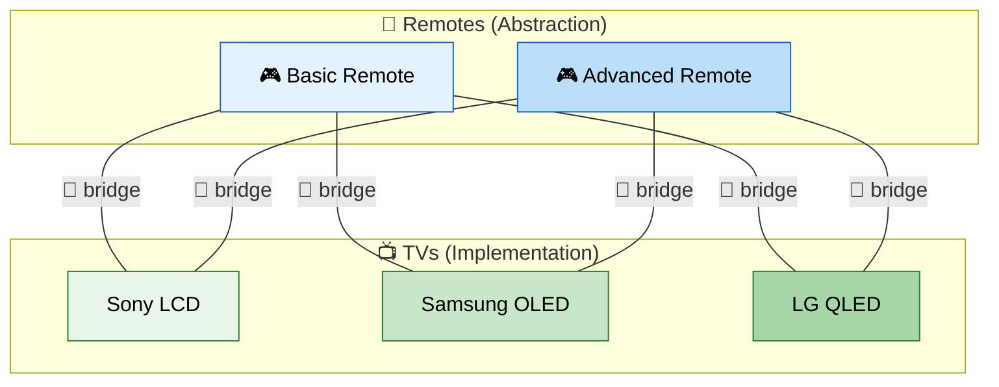
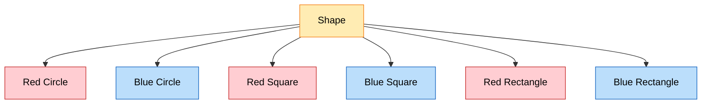

# :bridge_at_night: Bridge Design Pattern

> **Decouple an abstraction from its implementation so that the two can vary independently.**

---

## :bulb: Real-World Analogy

!!! abstract "Think of a Remote Control and TV"
    A remote control (abstraction) works with any TV brand (implementation) — Sony, Samsung, LG. You can have a basic remote or an advanced remote (abstraction hierarchy). You can have LCD or OLED TVs (implementation hierarchy). The remote and TV vary **independently** — any remote works with any TV. The "bridge" is the connection between them.



---

## :triangular_ruler: Pattern Structure

```mermaid
flowchart LR
    subgraph Abstraction["Abstraction Hierarchy"]
        Abs["Abstraction"]
        RefAbs["Refined\nAbstraction"]
        RefAbs -->|extends| Abs
    end

    subgraph Implementation["Implementation Hierarchy"]
        Impl["Implementor\n(interface)"]
        ImplA["Concrete\nImplementor A"]
        ImplB["Concrete\nImplementor B"]
        ImplA -->|implements| Impl
        ImplB -->|implements| Impl
    end

    Abs -->|has-a\n(bridge)| Impl

    style Abs fill:#a5d6a7,stroke:#1b5e20,color:#000
    style RefAbs fill:#c8e6c9,stroke:#2e7d32,color:#000
    style Impl fill:#b2dfdb,stroke:#00695c,color:#000
    style ImplA fill:#e0f2f1,stroke:#00695c,color:#000
    style ImplB fill:#e0f2f1,stroke:#00695c,color:#000
```

### Without Bridge (Class Explosion)



**6 classes** for 3 shapes x 2 colors. Adding one color = 3 more classes. Adding one shape = 2 more classes. This grows as `M x N`!

---

## :x: The Problem

You have a `Shape` class that can be rendered in different ways (OpenGL, DirectX, SVG). You also want to have different shapes (Circle, Square, Triangle). Without Bridge:

- `CircleOpenGL`, `CircleDirectX`, `CircleSVG`
- `SquareOpenGL`, `SquareDirectX`, `SquareSVG`
- `TriangleOpenGL`, `TriangleDirectX`, `TriangleSVG`

That's **M shapes x N renderers = M*N classes**. Adding a new renderer means modifying every shape. This violates the Open/Closed Principle and creates maintenance nightmares.

---

## :white_check_mark: The Solution

Bridge splits the monolithic hierarchy into **two independent hierarchies**:

1. **Abstraction** — the high-level control layer (e.g., Shape)
2. **Implementation** — the low-level platform layer (e.g., Renderer)

Connected by a **bridge** (composition). Now you have `M + N` classes instead of `M * N`.

!!! example "The Math"
    - Without Bridge: 3 shapes x 3 renderers = **9 classes**
    - With Bridge: 3 shapes + 3 renderers = **6 classes**
    - At scale (10 x 10): Without = **100**, With = **20**

---

## :hammer_and_wrench: Implementation

=== "Shape + Renderer Example"

    ```java
    // Implementation interface (the "bridge" target)
    public interface Renderer {
        void renderCircle(double radius);
        void renderSquare(double side);
        void renderTriangle(double base, double height);
    }

    // Concrete Implementations
    public class OpenGLRenderer implements Renderer {
        @Override
        public void renderCircle(double radius) {
            System.out.println("OpenGL: Drawing circle with radius " + radius);
        }

        @Override
        public void renderSquare(double side) {
            System.out.println("OpenGL: Drawing square with side " + side);
        }

        @Override
        public void renderTriangle(double base, double height) {
            System.out.println("OpenGL: Drawing triangle " + base + "x" + height);
        }
    }

    public class SVGRenderer implements Renderer {
        @Override
        public void renderCircle(double radius) {
            System.out.println("SVG: <circle r=\"" + radius + "\"/>");
        }

        @Override
        public void renderSquare(double side) {
            System.out.println("SVG: <rect width=\"" + side + "\" height=\"" + side + "\"/>");
        }

        @Override
        public void renderTriangle(double base, double height) {
            System.out.println("SVG: <polygon points=\"...\"/> (triangle)");
        }
    }

    // Abstraction
    public abstract class Shape {
        protected final Renderer renderer; // BRIDGE

        protected Shape(Renderer renderer) {
            this.renderer = renderer;
        }

        public abstract void draw();
        public abstract void resize(double factor);
    }

    // Refined Abstractions
    public class Circle extends Shape {
        private double radius;

        public Circle(Renderer renderer, double radius) {
            super(renderer);
            this.radius = radius;
        }

        @Override
        public void draw() {
            renderer.renderCircle(radius);
        }

        @Override
        public void resize(double factor) {
            radius *= factor;
        }
    }

    public class Square extends Shape {
        private double side;

        public Square(Renderer renderer, double side) {
            super(renderer);
            this.side = side;
        }

        @Override
        public void draw() {
            renderer.renderSquare(side);
        }

        @Override
        public void resize(double factor) {
            side *= factor;
        }
    }

    // Client — mix any shape with any renderer
    public class DrawingApp {
        public static void main(String[] args) {
            Renderer opengl = new OpenGLRenderer();
            Renderer svg = new SVGRenderer();

            Shape circle = new Circle(opengl, 5.0);
            Shape square = new Square(svg, 10.0);

            circle.draw(); // OpenGL: Drawing circle with radius 5.0
            square.draw(); // SVG: <rect width="10.0" height="10.0"/>

            // Easy to switch renderer at runtime!
            Shape svgCircle = new Circle(svg, 3.0);
            svgCircle.draw(); // SVG: <circle r="3.0"/>
        }
    }
    ```

=== "Notification System (Practical)"

    ```java
    // Implementation — how to send
    public interface MessageSender {
        void send(String recipient, String message);
    }

    public class EmailSender implements MessageSender {
        @Override
        public void send(String recipient, String message) {
            System.out.println("Email to " + recipient + ": " + message);
        }
    }

    public class SmsSender implements MessageSender {
        @Override
        public void send(String recipient, String message) {
            System.out.println("SMS to " + recipient + ": " + message);
        }
    }

    public class SlackSender implements MessageSender {
        @Override
        public void send(String recipient, String message) {
            System.out.println("Slack to #" + recipient + ": " + message);
        }
    }

    // Abstraction — what to send
    public abstract class Notification {
        protected final MessageSender sender; // BRIDGE

        protected Notification(MessageSender sender) {
            this.sender = sender;
        }

        public abstract void notify(String recipient, String event);
    }

    // Refined Abstractions
    public class UrgentNotification extends Notification {
        public UrgentNotification(MessageSender sender) {
            super(sender);
        }

        @Override
        public void notify(String recipient, String event) {
            String message = "🚨 URGENT: " + event + " — Immediate action required!";
            sender.send(recipient, message);
            sender.send(recipient, "REMINDER: " + message); // Send twice for urgency
        }
    }

    public class RegularNotification extends Notification {
        public RegularNotification(MessageSender sender) {
            super(sender);
        }

        @Override
        public void notify(String recipient, String event) {
            sender.send(recipient, "Info: " + event);
        }
    }

    // Usage — any notification type x any sender
    public class AlertSystem {
        public static void main(String[] args) {
            Notification urgentEmail = new UrgentNotification(new EmailSender());
            Notification regularSlack = new RegularNotification(new SlackSender());
            Notification urgentSms = new UrgentNotification(new SmsSender());

            urgentEmail.notify("admin@company.com", "Server CPU at 95%");
            regularSlack.notify("engineering", "Deploy v2.3 complete");
            urgentSms.notify("+1234567890", "Database connection pool exhausted");
        }
    }
    ```

=== "Database Persistence Bridge"

    ```java
    // Implementation — database technology
    public interface DatabaseEngine {
        void connect(String connectionString);
        void execute(String query);
        List<Map<String, Object>> fetch(String query);
        void disconnect();
    }

    public class MySqlEngine implements DatabaseEngine {
        @Override
        public void connect(String connectionString) {
            System.out.println("MySQL connected: " + connectionString);
        }

        @Override
        public void execute(String query) {
            System.out.println("MySQL executing: " + query);
        }

        @Override
        public List<Map<String, Object>> fetch(String query) {
            System.out.println("MySQL fetching: " + query);
            return List.of();
        }

        @Override
        public void disconnect() {
            System.out.println("MySQL disconnected");
        }
    }

    public class PostgresEngine implements DatabaseEngine {
        @Override
        public void connect(String connectionString) {
            System.out.println("Postgres connected: " + connectionString);
        }

        @Override
        public void execute(String query) {
            System.out.println("Postgres executing: " + query);
        }

        @Override
        public List<Map<String, Object>> fetch(String query) {
            System.out.println("Postgres fetching: " + query);
            return List.of();
        }

        @Override
        public void disconnect() {
            System.out.println("Postgres disconnected");
        }
    }

    // Abstraction — repository operations
    public abstract class Repository<T> {
        protected final DatabaseEngine engine;

        protected Repository(DatabaseEngine engine) {
            this.engine = engine;
        }

        public abstract void save(T entity);
        public abstract T findById(Long id);
        public abstract List<T> findAll();
    }

    // Refined Abstraction
    public class UserRepository extends Repository<User> {
        public UserRepository(DatabaseEngine engine) {
            super(engine);
        }

        @Override
        public void save(User user) {
            engine.execute("INSERT INTO users (name, email) VALUES ('" +
                           user.name() + "', '" + user.email() + "')");
        }

        @Override
        public User findById(Long id) {
            List<Map<String, Object>> results = engine.fetch(
                "SELECT * FROM users WHERE id = " + id);
            // Map results to User
            return new User(id, "mapped_name", "mapped_email");
        }

        @Override
        public List<User> findAll() {
            engine.fetch("SELECT * FROM users");
            return List.of();
        }
    }

    // Swap database without touching repository logic!
    UserRepository mysqlRepo = new UserRepository(new MySqlEngine());
    UserRepository pgRepo = new UserRepository(new PostgresEngine());
    ```

---

## :dart: When to Use

- You want to avoid a **permanent binding** between abstraction and implementation
- Both abstractions and implementations should be **extensible independently** via subclassing
- You have a **Cartesian product** problem (M x N class explosion)
- You need to **switch implementations at runtime**
- You want to **share an implementation** among multiple abstractions
- You're building **platform-independent code** (e.g., same logic, different OS/DB/renderer)

---

## :globe_with_meridians: Real-World Examples

| Where | Example |
|-------|---------|
| **JDBC** | `DriverManager` (abstraction) + vendor drivers (implementation) — classic Bridge |
| **JDK** | `java.util.logging.Handler` + `Formatter` |
| **Spring** | `AbstractPlatformTransactionManager` + vendor transaction implementations |
| **SLF4J** | Logging API (abstraction) bridged to Logback/Log4j (implementation) |
| **Hibernate** | `Dialect` — same ORM, different SQL dialects per database |
| **AWT** | `java.awt.peer` — platform-independent widgets bridged to OS-specific rendering |
| **Android** | View system bridges UI logic to platform-specific drawing |

---

## :warning: Pitfalls

!!! warning "Common Mistakes"
    - **Over-engineering**: Don't use Bridge when you only have one dimension of variation — YAGNI
    - **Confusing with Strategy**: Bridge is structural (splits class hierarchy); Strategy is behavioral (swaps algorithms). Bridge is designed upfront; Strategy is often added later
    - **Leaky abstractions**: The abstraction shouldn't expose implementation details — keep the bridge clean
    - **Too many dimensions**: If you have 3+ dimensions, consider combining Bridge with other patterns
    - **Forgetting runtime swapping**: If you never swap implementations at runtime, you might just need an interface (simpler than full Bridge)

---

## :memo: Key Takeaways

!!! tip "Summary"
    | Aspect | Detail |
    |--------|--------|
    | **Intent** | Separate "what" (abstraction) from "how" (implementation) |
    | **Mechanism** | Composition — abstraction holds reference to implementor |
    | **Key Benefit** | Eliminates M x N class explosion; both sides extend independently |
    | **Key Principle** | Prefer composition over inheritance |
    | **vs Strategy** | Bridge separates hierarchies at design time; Strategy swaps behavior at runtime |
    | **Interview Tip** | "JDBC is the classic Bridge — your code uses java.sql interfaces while vendor drivers provide the implementation" |
