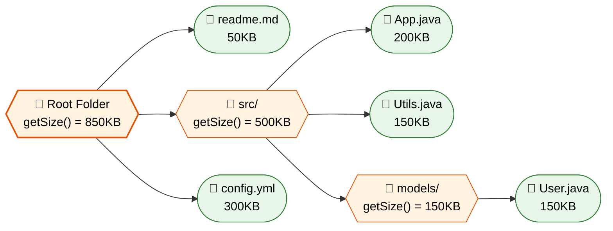
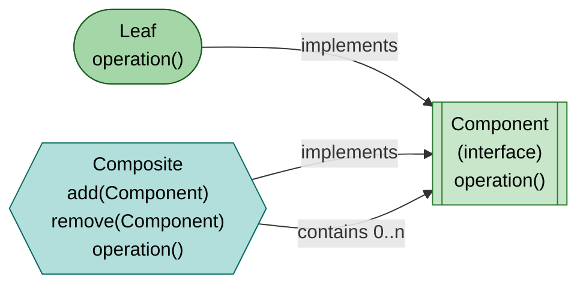
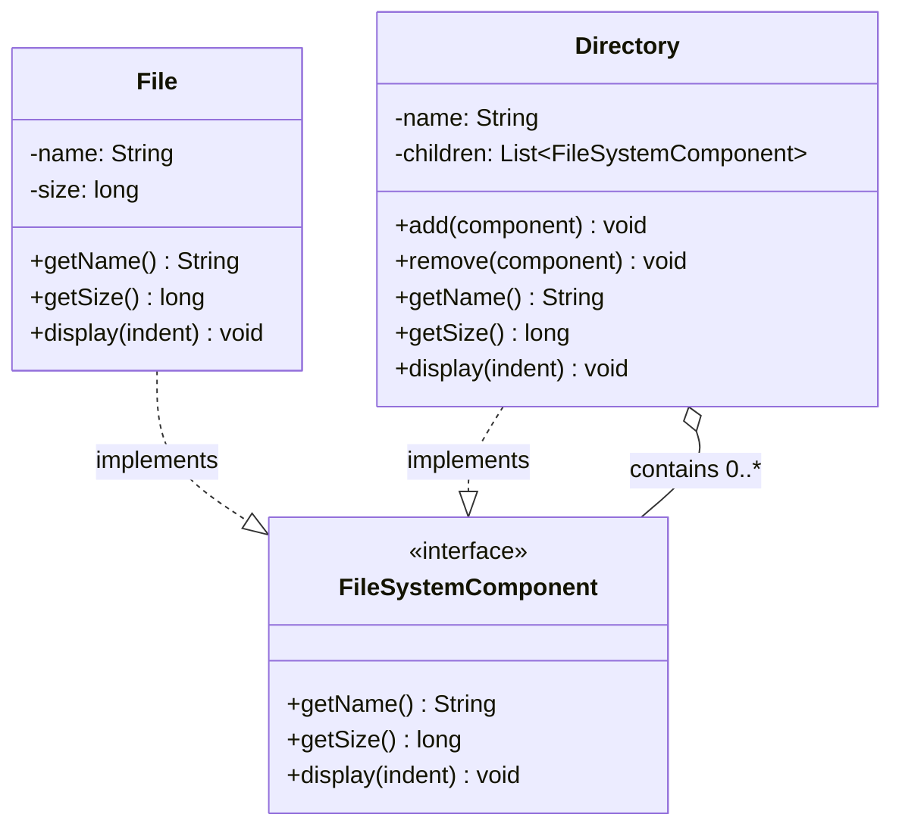
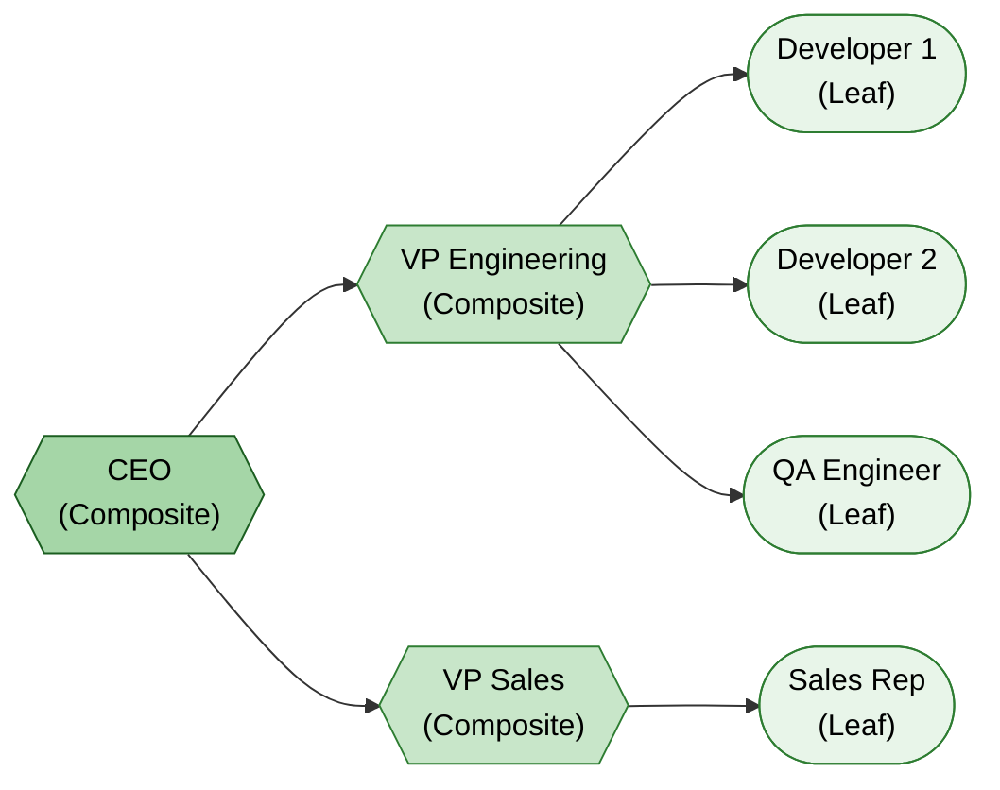

# :deciduous_tree: Composite Design Pattern

> **Compose objects into tree structures to represent part-whole hierarchies. Composite lets clients treat individual objects and compositions of objects uniformly.**

---

## :bulb: Real-World Analogy

!!! abstract "Think of a File System"
    A folder can contain files and other folders. A file is a leaf — it has no children. A folder is a composite — it can contain both files and other folders. When you calculate the total size, you call `getSize()` on the root folder, and it recursively sums up all nested files and folders. **You treat a single file and an entire folder tree the same way.**



---

## :triangular_ruler: Pattern Structure



## UML Class Diagram



### Example Tree Structure



---

## :x: The Problem

You're building a graphics editor. Shapes can be simple (circles, rectangles) or complex (groups of shapes). Users want to:

- Move a single shape
- Move a group of shapes as one unit
- Nest groups inside groups

Without Composite, you'd need separate code paths for "single shape" and "group of shapes", and deeply nested groups would require recursive special-casing everywhere.

---

## :white_check_mark: The Solution

The Composite pattern defines a **common interface** for both simple (leaf) and complex (composite) elements. The composite element stores children and delegates operations to them recursively. Clients interact with the interface without knowing if they're dealing with a leaf or an entire subtree.

**Four participants:**

| Role | Responsibility |
|------|---------------|
| **Component** | Common interface for leaf and composite |
| **Leaf** | Represents end objects with no children |
| **Composite** | Stores children; delegates operations recursively |
| **Client** | Interacts uniformly via the Component interface |

---

## :hammer_and_wrench: Implementation

=== "File System Example"

    ```java
    // Component
    public interface FileSystemComponent {
        String getName();
        long getSize();
        void display(String indent);
    }

    // Leaf
    public class File implements FileSystemComponent {
        private final String name;
        private final long size;

        public File(String name, long size) {
            this.name = name;
            this.size = size;
        }

        @Override
        public String getName() { return name; }

        @Override
        public long getSize() { return size; }

        @Override
        public void display(String indent) {
            System.out.println(indent + "📄 " + name + " (" + size + " bytes)");
        }
    }

    // Composite
    public class Directory implements FileSystemComponent {
        private final String name;
        private final List<FileSystemComponent> children = new ArrayList<>();

        public Directory(String name) {
            this.name = name;
        }

        public void add(FileSystemComponent component) {
            children.add(component);
        }

        public void remove(FileSystemComponent component) {
            children.remove(component);
        }

        @Override
        public String getName() { return name; }

        @Override
        public long getSize() {
            // Recursively calculates total size
            return children.stream()
                .mapToLong(FileSystemComponent::getSize)
                .sum();
        }

        @Override
        public void display(String indent) {
            System.out.println(indent + "📁 " + name + " (" + getSize() + " bytes)");
            for (FileSystemComponent child : children) {
                child.display(indent + "  ");
            }
        }
    }

    // Client
    public class FileExplorer {
        public static void main(String[] args) {
            Directory root = new Directory("root");
            Directory src = new Directory("src");
            Directory tests = new Directory("tests");

            src.add(new File("Main.java", 2048));
            src.add(new File("Utils.java", 1024));
            tests.add(new File("MainTest.java", 1536));

            root.add(src);
            root.add(tests);
            root.add(new File("README.md", 512));

            // Treat entire tree uniformly
            root.display("");
            System.out.println("Total size: " + root.getSize() + " bytes");
        }
    }
    ```

    Output:
    ```
    📁 root (5120 bytes)
      📁 src (3072 bytes)
        📄 Main.java (2048 bytes)
        📄 Utils.java (1024 bytes)
      📁 tests (1536 bytes)
        📄 MainTest.java (1536 bytes)
      📄 README.md (512 bytes)
    Total size: 5120 bytes
    ```

=== "Organization Hierarchy"

    ```java
    // Component
    public interface Employee {
        String getName();
        double getSalary();
        void displayHierarchy(String indent);
    }

    // Leaf — individual contributor
    public class Developer implements Employee {
        private final String name;
        private final double salary;

        public Developer(String name, double salary) {
            this.name = name;
            this.salary = salary;
        }

        @Override
        public String getName() { return name; }

        @Override
        public double getSalary() { return salary; }

        @Override
        public void displayHierarchy(String indent) {
            System.out.println(indent + "👨‍💻 " + name + " ($" + salary + ")");
        }
    }

    // Composite — manager with reports
    public class Manager implements Employee {
        private final String name;
        private final double salary;
        private final List<Employee> reports = new ArrayList<>();

        public Manager(String name, double salary) {
            this.name = name;
            this.salary = salary;
        }

        public void addReport(Employee employee) {
            reports.add(employee);
        }

        public void removeReport(Employee employee) {
            reports.remove(employee);
        }

        @Override
        public String getName() { return name; }

        @Override
        public double getSalary() { return salary; }

        public double getTeamCost() {
            return salary + reports.stream()
                .mapToDouble(e -> e instanceof Manager m ? m.getTeamCost() : e.getSalary())
                .sum();
        }

        @Override
        public void displayHierarchy(String indent) {
            System.out.println(indent + "👔 " + name + " ($" + salary + ") [Team Cost: $" + getTeamCost() + "]");
            for (Employee report : reports) {
                report.displayHierarchy(indent + "  ");
            }
        }
    }

    // Usage
    public class OrgChart {
        public static void main(String[] args) {
            Manager ceo = new Manager("Alice (CEO)", 300000);

            Manager vpEng = new Manager("Bob (VP Eng)", 200000);
            vpEng.addReport(new Developer("Charlie", 150000));
            vpEng.addReport(new Developer("Diana", 140000));

            Manager vpSales = new Manager("Eve (VP Sales)", 180000);
            vpSales.addReport(new Developer("Frank", 120000));

            ceo.addReport(vpEng);
            ceo.addReport(vpSales);

            ceo.displayHierarchy("");
        }
    }
    ```

=== "UI Component Tree"

    ```java
    // Component — UI element
    public interface UIComponent {
        void render();
        void resize(int width, int height);
    }

    // Leaf — simple UI element
    public class Button implements UIComponent {
        private final String label;

        public Button(String label) { this.label = label; }

        @Override
        public void render() {
            System.out.println("  [Button: " + label + "]");
        }

        @Override
        public void resize(int width, int height) {
            System.out.println("  Resizing button '" + label + "' to " + width + "x" + height);
        }
    }

    public class TextField implements UIComponent {
        private final String placeholder;

        public TextField(String placeholder) { this.placeholder = placeholder; }

        @Override
        public void render() {
            System.out.println("  [TextField: " + placeholder + "]");
        }

        @Override
        public void resize(int width, int height) {
            System.out.println("  Resizing textfield to " + width + "x" + height);
        }
    }

    // Composite — container of UI elements
    public class Panel implements UIComponent {
        private final String name;
        private final List<UIComponent> children = new ArrayList<>();

        public Panel(String name) { this.name = name; }

        public void add(UIComponent component) { children.add(component); }

        @Override
        public void render() {
            System.out.println("[Panel: " + name + "]");
            children.forEach(UIComponent::render);
        }

        @Override
        public void resize(int width, int height) {
            System.out.println("Resizing panel '" + name + "' and all children:");
            children.forEach(c -> c.resize(width, height));
        }
    }

    // Usage
    Panel form = new Panel("Login Form");
    form.add(new TextField("Username"));
    form.add(new TextField("Password"));
    form.add(new Button("Submit"));

    Panel page = new Panel("Main Page");
    page.add(form);
    page.add(new Button("Help"));

    page.render(); // Renders entire tree uniformly
    ```

---

## :dart: When to Use

- You want to represent **part-whole hierarchies** of objects (trees)
- You want clients to **treat individual objects and compositions uniformly**
- The structure is **recursive** — composites contain both leaves and other composites
- You're working with **nested menus, file systems, org charts, or UI component trees**
- You want to run operations **recursively across the entire tree**

---

## :globe_with_meridians: Real-World Examples

| Where | Example |
|-------|---------|
| **JDK** | `java.awt.Container` — contains `Component` objects (which can be containers) |
| **JDK** | `javax.swing.JPanel` — can hold other panels and widgets |
| **JSF** | `UIComponent` tree — the entire JSF component hierarchy |
| **Spring** | `BeanDefinition` with nested beans |
| **XML/DOM** | `org.w3c.dom.Node` — elements contain other elements |
| **React/Angular** | Component trees where parent components render child components |
| **Build tools** | Maven modules — a parent POM contains child modules |

---

## :warning: Pitfalls

!!! warning "Common Mistakes"
    - **Overly general Component interface**: Leaf nodes shouldn't expose `add()`/`remove()` — it violates ISP (prefer making child management composite-only)
    - **Circular references**: A composite accidentally added as its own descendant causes infinite recursion
    - **Difficulty restricting composition**: It's hard to constrain which types can be children (e.g., "only files in this folder")
    - **Performance on deep trees**: Recursive operations on deeply nested structures can be slow — consider caching computed results
    - **Thread safety**: Modifying the tree while iterating it causes `ConcurrentModificationException`

---

## :memo: Key Takeaways

!!! tip "Summary"
    | Aspect | Detail |
    |--------|--------|
    | **Intent** | Treat individual objects and groups uniformly via tree structure |
    | **Mechanism** | Common interface; composites delegate to children recursively |
    | **Key Benefit** | Simplifies client code — no need to distinguish leaf vs. composite |
    | **Key Principle** | Open/Closed — add new component types without changing client |
    | **When to use** | Any recursive tree structure (files, UI, org charts, menus) |
    | **Interview Tip** | "Java's AWT/Swing uses Composite — a JPanel is a Component that contains other Components" |
