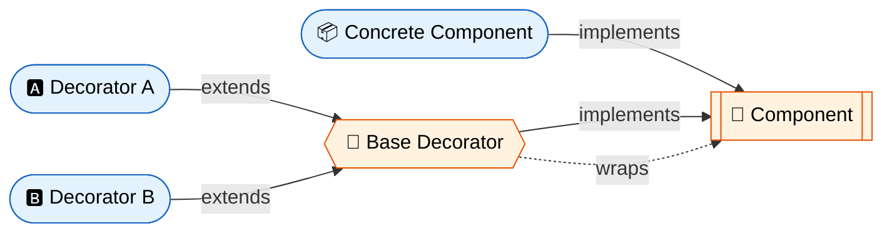
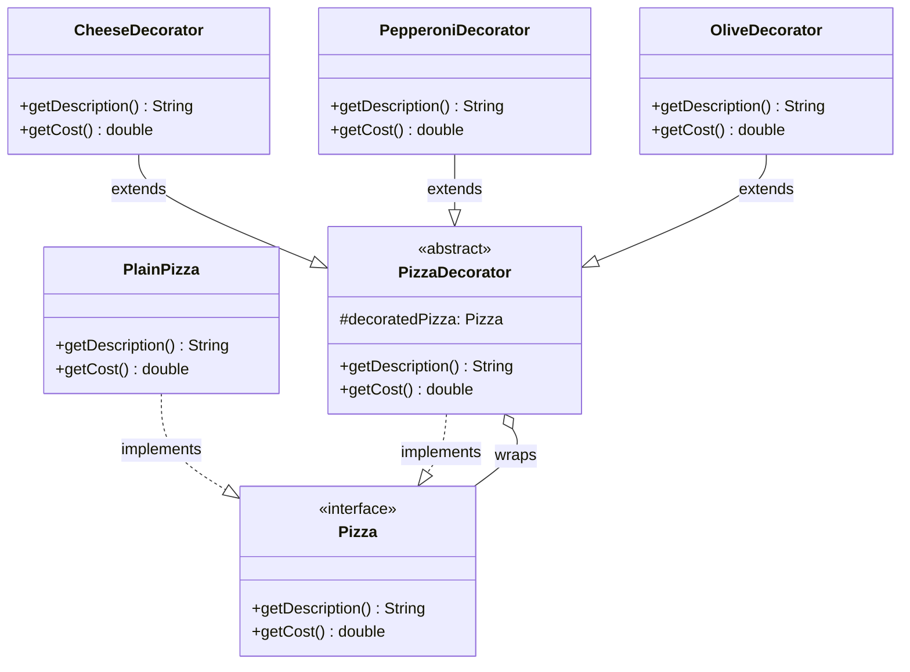

# :gift: Decorator Design Pattern

> **Attach additional responsibilities to an object dynamically. Decorators provide a flexible alternative to subclassing for extending functionality.**

---

## :bulb: Real-World Analogy

!!! abstract "Think of a Coffee Order"
    You start with a plain coffee. Then you add milk — it's still coffee but with milk. Add whipped cream — still coffee but with more toppings. Each addition "decorates" the base coffee without changing what coffee fundamentally is. You can stack any combination of add-ons dynamically.


---

## :triangular_ruler: Pattern Structure



## UML Class Diagram



---

## :x: The Problem

You have a `Notifier` class that sends emails. Now you need to also send notifications via SMS, Slack, and Facebook. You could create subclasses like `SMSNotifier`, `SlackNotifier` — but what if a user wants **both** SMS and Slack? You'd need `SMSSlackNotifier`, `SMSFacebookNotifier`, `SlackFacebookNotifier`...

This leads to a **class explosion** — `2^n` combinations for `n` notification types!

---

## Without This Pattern

```java
// BAD: Subclass for every combination of notification channels
public class EmailNotifier { /* sends email */ }
public class SmsNotifier extends EmailNotifier { /* sends email + SMS */ }
public class SlackNotifier extends EmailNotifier { /* sends email + Slack */ }
public class SmsSlackNotifier extends EmailNotifier { /* sends email + SMS + Slack */ }
public class SmsFacebookNotifier extends EmailNotifier { /* sends email + SMS + Facebook */ }
public class SlackFacebookNotifier extends EmailNotifier { /* email + Slack + Facebook */ }
public class SmsSlackFacebookNotifier extends EmailNotifier { /* all four */ }
// 2^n classes for n notification channels!

// Client cannot compose behaviors at runtime
public class AlertService {
    public void sendAlert(String message, boolean sms, boolean slack, boolean fb) {
        // Ugly conditional logic
        if (sms && slack && fb) {
            new SmsSlackFacebookNotifier().send(message);
        } else if (sms && slack) {
            new SmsSlackNotifier().send(message);
        } else if (sms) {
            new SmsNotifier().send(message);
        }
        // ... endless if-else for every combination
    }
}
```

**Problems:**

- **Class explosion (2^n)**: With 4 notification types, you need up to 16 subclasses to cover every combination — adding one more channel doubles the number
- **Static, compile-time binding**: You cannot add or remove a notification channel at runtime based on user preferences — the combination is hardcoded in the class hierarchy
- **Violates Single Responsibility**: Each combined subclass (e.g., `SmsSlackNotifier`) handles multiple unrelated concerns in one class
- **Violates Open/Closed Principle**: Adding a new channel (e.g., WhatsApp) requires creating new subclasses for every existing combination
- **Pain point**: A product manager says "users should pick which channels they want at runtime" — and your rigid inheritance hierarchy cannot support it without a complete rewrite

---

## :white_check_mark: The Solution

Instead of static subclassing, the Decorator pattern lets you **wrap** objects with new behaviors at runtime. Each decorator:

1. Implements the same interface as the wrapped object
2. Holds a reference to the wrapped object
3. Delegates to the wrapped object and adds its own behavior

Decorators can be **stacked** — wrapping a decorator with another decorator, creating layered behavior.

---

## :hammer_and_wrench: Implementation

=== "Pizza Decorator Example"

    ```java
    // Component interface
    public interface Pizza {
        String getDescription();
        double getCost();
    }

    // Concrete Component
    public class PlainPizza implements Pizza {
        @Override
        public String getDescription() {
            return "Plain pizza dough";
        }

        @Override
        public double getCost() {
            return 5.00;
        }
    }

    // Base Decorator
    public abstract class PizzaDecorator implements Pizza {
        protected final Pizza decoratedPizza;

        protected PizzaDecorator(Pizza pizza) {
            this.decoratedPizza = pizza;
        }

        @Override
        public String getDescription() {
            return decoratedPizza.getDescription();
        }

        @Override
        public double getCost() {
            return decoratedPizza.getCost();
        }
    }

    // Concrete Decorators
    public class CheeseDecorator extends PizzaDecorator {
        public CheeseDecorator(Pizza pizza) {
            super(pizza);
        }

        @Override
        public String getDescription() {
            return decoratedPizza.getDescription() + " + Cheese";
        }

        @Override
        public double getCost() {
            return decoratedPizza.getCost() + 1.50;
        }
    }

    public class PepperoniDecorator extends PizzaDecorator {
        public PepperoniDecorator(Pizza pizza) {
            super(pizza);
        }

        @Override
        public String getDescription() {
            return decoratedPizza.getDescription() + " + Pepperoni";
        }

        @Override
        public double getCost() {
            return decoratedPizza.getCost() + 2.00;
        }
    }

    public class OliveDecorator extends PizzaDecorator {
        public OliveDecorator(Pizza pizza) {
            super(pizza);
        }

        @Override
        public String getDescription() {
            return decoratedPizza.getDescription() + " + Olives";
        }

        @Override
        public double getCost() {
            return decoratedPizza.getCost() + 0.75;
        }
    }

    // Client — stacking decorators
    public class PizzaShop {
        public static void main(String[] args) {
            Pizza pizza = new PlainPizza();
            pizza = new CheeseDecorator(pizza);
            pizza = new PepperoniDecorator(pizza);
            pizza = new OliveDecorator(pizza);

            System.out.println(pizza.getDescription());
            // Output: Plain pizza dough + Cheese + Pepperoni + Olives
            System.out.println("Total: $" + pizza.getCost());
            // Output: Total: $9.25
        }
    }
    ```

=== "I/O Stream Example (JDK Style)"

    ```java
    // Simulating Java's InputStream decorator chain
    public interface DataSource {
        void writeData(String data);
        String readData();
    }

    // Concrete Component
    public class FileDataSource implements DataSource {
        private final String filename;

        public FileDataSource(String filename) {
            this.filename = filename;
        }

        @Override
        public void writeData(String data) {
            // Write to file
            System.out.println("Writing raw data to " + filename);
        }

        @Override
        public String readData() {
            return "raw data from " + filename;
        }
    }

    // Base Decorator
    public abstract class DataSourceDecorator implements DataSource {
        protected final DataSource wrappee;

        protected DataSourceDecorator(DataSource source) {
            this.wrappee = source;
        }

        @Override
        public void writeData(String data) {
            wrappee.writeData(data);
        }

        @Override
        public String readData() {
            return wrappee.readData();
        }
    }

    // Encryption Decorator
    public class EncryptionDecorator extends DataSourceDecorator {
        public EncryptionDecorator(DataSource source) {
            super(source);
        }

        @Override
        public void writeData(String data) {
            String encrypted = encrypt(data);
            super.writeData(encrypted);
        }

        @Override
        public String readData() {
            return decrypt(super.readData());
        }

        private String encrypt(String data) { return "ENC[" + data + "]"; }
        private String decrypt(String data) { return data.replace("ENC[", "").replace("]", ""); }
    }

    // Compression Decorator
    public class CompressionDecorator extends DataSourceDecorator {
        public CompressionDecorator(DataSource source) {
            super(source);
        }

        @Override
        public void writeData(String data) {
            String compressed = compress(data);
            super.writeData(compressed);
        }

        @Override
        public String readData() {
            return decompress(super.readData());
        }

        private String compress(String data) { return "ZIP[" + data + "]"; }
        private String decompress(String data) { return data.replace("ZIP[", "").replace("]", ""); }
    }

    // Usage — stacking encryption + compression
    public class Demo {
        public static void main(String[] args) {
            DataSource source = new FileDataSource("secrets.txt");
            source = new CompressionDecorator(source);
            source = new EncryptionDecorator(source);

            source.writeData("sensitive information");
            // Writes: ENC[ZIP[sensitive information]]
        }
    }
    ```

---

## :dart: When to Use

- You need to add responsibilities to individual objects **dynamically and transparently**
- Extension by subclassing is impractical due to **class explosion**
- You want to add/remove behaviors at **runtime**
- You need to combine multiple behaviors in **various combinations**
- When you want features that can be **withdrawn** (unlike inheritance)

---

## :globe_with_meridians: Real-World Examples

| Where | Example |
|-------|---------|
| **JDK** | `BufferedInputStream(new FileInputStream(...))` — entire I/O stream hierarchy |
| **JDK** | `Collections.unmodifiableList()`, `synchronizedList()`, `checkedList()` |
| **Spring** | `HttpServletRequestWrapper` — decorates servlet requests |
| **Spring Security** | Filter chain — each filter decorates the security handling |
| **Spring** | `TransactionProxyFactoryBean` — adds transactional behavior |
| **Jackson** | `ObjectMapper` features added via modules (decorator-like) |

---

## :warning: Pitfalls

!!! warning "Common Mistakes"
    - **Removing a decorator from the middle** of the stack is difficult — you only have reference to the outermost wrapper
    - **Identity checks fail**: `decoratedObj != originalObj` even though they represent the same logical entity
    - **Order matters**: `Encrypt(Compress(data))` produces different results than `Compress(Encrypt(data))`
    - **Too many small classes**: Having dozens of single-purpose decorators can make code hard to navigate
    - **Confusing with Proxy**: Decorator adds new behavior; Proxy controls access to existing behavior

---

## :memo: Key Takeaways

!!! tip "Summary"
    | Aspect | Detail |
    |--------|--------|
    | **Intent** | Add behavior to objects dynamically without subclassing |
    | **Mechanism** | Wrapping objects in decorator layers (composition) |
    | **Key Benefit** | Avoids class explosion; Single Responsibility Principle |
    | **Key Principle** | Open/Closed — add behavior without modifying existing code |
    | **vs Inheritance** | Decorator = runtime flexibility; Inheritance = compile-time only |
    | **Interview Tip** | "Java I/O streams are the textbook example of Decorator pattern" |
