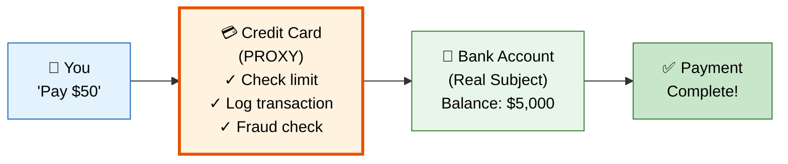
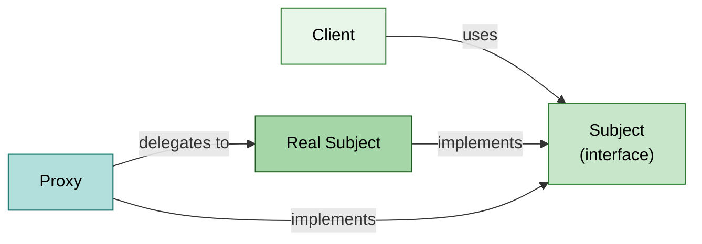
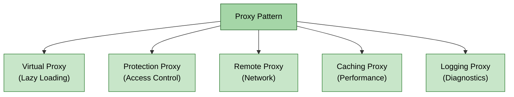

# :shield: Proxy Design Pattern

> **Provide a surrogate or placeholder for another object to control access to it.**

---

## :bulb: Real-World Analogy

!!! abstract "Think of a Credit Card"
    A credit card is a proxy for your bank account. It provides the same interface (you can pay with it) but adds access control (credit limit), lazy loading (doesn't transfer money immediately), and logging (transaction history). The bank account is the real subject; the credit card is its proxy.



---

## :triangular_ruler: Pattern Structure



### Types of Proxies



---

## :x: The Problem

Consider a massive `Document` object that loads a high-resolution image from disk. Loading this image takes 5 seconds. But the user might never scroll down to see it. You don't want to:

- Load expensive resources that might never be used (wasted RAM/time)
- Give all users access to sensitive operations
- Make direct network calls without caching or retrying

---

## :white_check_mark: The Solution

The Proxy object sits between the client and the real object. It implements the same interface, so the client doesn't know it's talking to a proxy. Depending on the type:

| Proxy Type | Purpose |
|------------|---------|
| **Virtual** | Defers creation of expensive objects until actually needed |
| **Protection** | Controls access based on permissions/roles |
| **Remote** | Represents an object in a different address space |
| **Caching** | Stores results to avoid repeated expensive operations |
| **Logging** | Records requests for diagnostics |

---

## :hammer_and_wrench: Implementation

=== "Virtual Proxy (Lazy Loading)"

    ```java
    // Subject interface
    public interface Image {
        void display();
        String getFilename();
    }

    // Real Subject — expensive to create
    public class HighResolutionImage implements Image {
        private final String filename;
        private final byte[] imageData;

        public HighResolutionImage(String filename) {
            this.filename = filename;
            this.imageData = loadFromDisk(filename); // EXPENSIVE!
            System.out.println("Loaded image: " + filename + " (" + imageData.length + " bytes)");
        }

        @Override
        public void display() {
            System.out.println("Displaying: " + filename);
        }

        @Override
        public String getFilename() {
            return filename;
        }

        private byte[] loadFromDisk(String filename) {
            // Simulate expensive I/O operation
            try { Thread.sleep(3000); } catch (InterruptedException e) {}
            return new byte[10_000_000]; // 10MB image
        }
    }

    // Virtual Proxy — defers loading until display() is called
    public class ImageProxy implements Image {
        private final String filename;
        private HighResolutionImage realImage; // lazy-loaded

        public ImageProxy(String filename) {
            this.filename = filename;
            // NO loading here — that's the point!
        }

        @Override
        public void display() {
            if (realImage == null) {
                realImage = new HighResolutionImage(filename);
            }
            realImage.display();
        }

        @Override
        public String getFilename() {
            return filename; // No need to load image for this
        }
    }

    // Client
    public class DocumentViewer {
        public static void main(String[] args) {
            // Images are NOT loaded yet — just proxies
            List<Image> images = List.of(
                new ImageProxy("photo1.png"),
                new ImageProxy("photo2.png"),
                new ImageProxy("photo3.png")
            );

            // Only loads when user actually views
            System.out.println("Document opened. Scrolling to image 2...");
            images.get(1).display(); // Only THIS image gets loaded
        }
    }
    ```

=== "Protection Proxy (Access Control)"

    ```java
    // Subject interface
    public interface Document {
        void read();
        void write(String content);
        void delete();
    }

    // Real Subject
    public class SensitiveDocument implements Document {
        private String content;
        private final String name;

        public SensitiveDocument(String name, String content) {
            this.name = name;
            this.content = content;
        }

        @Override
        public void read() {
            System.out.println("Reading document '" + name + "': " + content);
        }

        @Override
        public void write(String content) {
            this.content = content;
            System.out.println("Document '" + name + "' updated.");
        }

        @Override
        public void delete() {
            System.out.println("Document '" + name + "' deleted.");
        }
    }

    // Protection Proxy — enforces role-based access
    public class DocumentProxy implements Document {
        private final SensitiveDocument realDocument;
        private final User currentUser;

        public DocumentProxy(SensitiveDocument doc, User currentUser) {
            this.realDocument = doc;
            this.currentUser = currentUser;
        }

        @Override
        public void read() {
            if (currentUser.hasPermission(Permission.READ)) {
                realDocument.read();
            } else {
                throw new SecurityException("Access denied: READ permission required");
            }
        }

        @Override
        public void write(String content) {
            if (currentUser.hasPermission(Permission.WRITE)) {
                realDocument.write(content);
            } else {
                throw new SecurityException("Access denied: WRITE permission required");
            }
        }

        @Override
        public void delete() {
            if (currentUser.hasRole(Role.ADMIN)) {
                realDocument.delete();
            } else {
                throw new SecurityException("Access denied: ADMIN role required");
            }
        }
    }

    // Supporting classes
    public enum Permission { READ, WRITE, DELETE }
    public enum Role { VIEWER, EDITOR, ADMIN }

    public class User {
        private final String name;
        private final Role role;
        private final Set<Permission> permissions;

        public User(String name, Role role, Set<Permission> permissions) {
            this.name = name;
            this.role = role;
            this.permissions = permissions;
        }

        public boolean hasPermission(Permission p) { return permissions.contains(p); }
        public boolean hasRole(Role r) { return this.role == r; }
    }
    ```

=== "Caching Proxy"

    ```java
    // Subject interface
    public interface WeatherService {
        WeatherData getWeather(String city);
    }

    // Real Subject — makes expensive API call
    public class RealWeatherService implements WeatherService {
        @Override
        public WeatherData getWeather(String city) {
            System.out.println("Calling external weather API for: " + city);
            // Simulate HTTP call to weather API
            return new WeatherData(city, 72.0, "Sunny");
        }
    }

    // Caching Proxy — avoids repeated API calls
    public class CachingWeatherProxy implements WeatherService {
        private final RealWeatherService realService;
        private final Map<String, CacheEntry> cache = new ConcurrentHashMap<>();
        private final Duration cacheTtl;

        public CachingWeatherProxy(Duration cacheTtl) {
            this.realService = new RealWeatherService();
            this.cacheTtl = cacheTtl;
        }

        @Override
        public WeatherData getWeather(String city) {
            CacheEntry entry = cache.get(city);

            if (entry != null && !entry.isExpired(cacheTtl)) {
                System.out.println("Cache HIT for: " + city);
                return entry.data();
            }

            System.out.println("Cache MISS for: " + city);
            WeatherData data = realService.getWeather(city);
            cache.put(city, new CacheEntry(data, Instant.now()));
            return data;
        }

        private record CacheEntry(WeatherData data, Instant timestamp) {
            boolean isExpired(Duration ttl) {
                return Instant.now().isAfter(timestamp.plus(ttl));
            }
        }
    }

    // Usage
    public class App {
        public static void main(String[] args) {
            WeatherService service = new CachingWeatherProxy(Duration.ofMinutes(5));

            service.getWeather("NYC"); // Cache MISS — calls API
            service.getWeather("NYC"); // Cache HIT — returns cached
            service.getWeather("LA");  // Cache MISS — calls API
        }
    }
    ```

=== "Dynamic Proxy (JDK)"

    ```java
    // Java's built-in dynamic proxy mechanism
    public class LoggingProxyFactory {

        @SuppressWarnings("unchecked")
        public static <T> T createLoggingProxy(T target, Class<T> interfaceType) {
            return (T) Proxy.newProxyInstance(
                interfaceType.getClassLoader(),
                new Class<?>[]{ interfaceType },
                new LoggingHandler(target)
            );
        }

        private static class LoggingHandler implements InvocationHandler {
            private final Object target;
            private static final Logger log = LoggerFactory.getLogger(LoggingHandler.class);

            LoggingHandler(Object target) {
                this.target = target;
            }

            @Override
            public Object invoke(Object proxy, Method method, Object[] args) throws Throwable {
                long start = System.nanoTime();
                log.info("Calling: {}.{}({})", target.getClass().getSimpleName(),
                         method.getName(), Arrays.toString(args));

                try {
                    Object result = method.invoke(target, args);
                    long elapsed = (System.nanoTime() - start) / 1_000_000;
                    log.info("Completed: {}.{} in {}ms",
                             target.getClass().getSimpleName(), method.getName(), elapsed);
                    return result;
                } catch (InvocationTargetException e) {
                    log.error("Exception in {}.{}: {}",
                              target.getClass().getSimpleName(), method.getName(),
                              e.getTargetException().getMessage());
                    throw e.getTargetException();
                }
            }
        }
    }

    // Usage
    UserService realService = new UserServiceImpl();
    UserService proxiedService = LoggingProxyFactory.createLoggingProxy(realService, UserService.class);
    proxiedService.findById(1L); // Automatically logged!
    ```

---

## :dart: When to Use

- **Lazy initialization** (Virtual Proxy) — defer costly object creation
- **Access control** (Protection Proxy) — restrict who can do what
- **Remote objects** (Remote Proxy) — represent objects on remote servers (RMI, gRPC)
- **Caching** (Caching Proxy) — store results of expensive operations
- **Logging/Auditing** — transparently record all interactions
- **Smart references** — perform actions when an object is accessed (reference counting, etc.)

---

## :globe_with_meridians: Real-World Examples

| Where | Example |
|-------|---------|
| **Spring** | AOP Proxies — `@Transactional`, `@Cacheable`, `@Async` all use CGLIB/JDK proxies |
| **Spring** | `@Lazy` annotation creates a virtual proxy for bean injection |
| **Hibernate** | Lazy loading of entities — `user.getOrders()` returns a proxy |
| **JDK** | `java.lang.reflect.Proxy` — dynamic proxy mechanism |
| **JDK** | `java.rmi.*` — remote method invocation uses proxy stubs |
| **MyBatis** | Mapper interfaces are proxies that generate SQL |
| **Feign** | HTTP client interfaces are proxies for REST calls |

---

## :warning: Pitfalls

!!! warning "Common Mistakes"
    - **Performance overhead**: Each method call goes through the proxy — avoid for hot paths unless necessary
    - **Hibernate N+1 problem**: Lazy proxies that trigger individual queries in a loop
    - **Debugging difficulty**: Stack traces through proxies are harder to read (especially CGLIB)
    - **Proxy identity**: `proxy != realObject` — be careful with equals/hashCode
    - **Confusing Proxy with Decorator**: Proxy controls **access**; Decorator adds **behavior**. Proxy usually creates the real object; Decorator receives it

---

## :memo: Key Takeaways

!!! tip "Summary"
    | Aspect | Detail |
    |--------|--------|
    | **Intent** | Control access to an object through a surrogate |
    | **Mechanism** | Same interface as subject; intercepts and delegates calls |
    | **Key Benefit** | Separates concerns (access control, caching, lazy-init) from business logic |
    | **Key Variants** | Virtual, Protection, Remote, Caching, Logging |
    | **Spring Connection** | AOP is fundamentally implemented using proxies |
    | **Interview Tip** | "Every `@Transactional` method in Spring works because of a Proxy wrapping your bean" |
