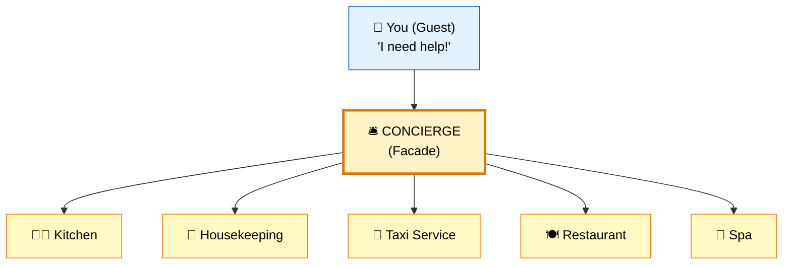
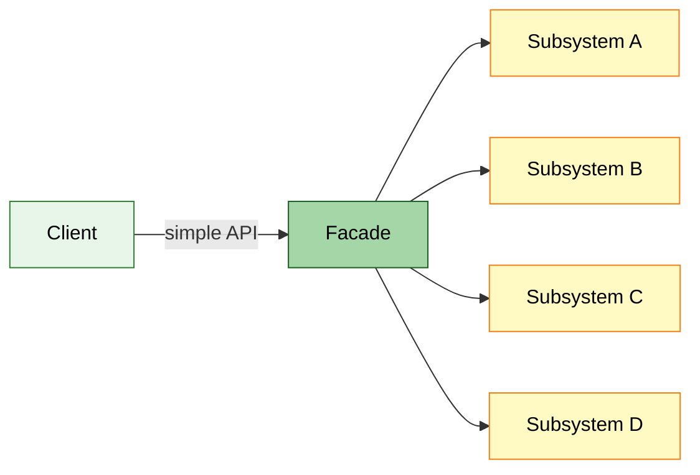

# :classical_building: Facade Design Pattern

> **Provide a unified interface to a set of interfaces in a subsystem. Facade defines a higher-level interface that makes the subsystem easier to use.**

---

## :bulb: Real-World Analogy

!!! abstract "Think of a Hotel Concierge"
    When you stay at a hotel, you don't call the kitchen, housekeeping, taxi service, and restaurant separately. You call the **concierge** — one person who coordinates everything for you. The concierge is the Facade. They hide the complexity of multiple subsystems behind a single, friendly interface.



---

## :triangular_ruler: Pattern Structure



---

## :x: The Problem

Imagine placing an online order. Behind the scenes, the system must:

1. Verify inventory
2. Process payment
3. Update order database
4. Send confirmation email
5. Notify shipping service

Without a facade, the client code must know about and interact with **5 different subsystems**, understand their APIs, handle their exceptions, and coordinate the workflow. This creates:

- **Tight coupling** between client and subsystems
- **Fragile code** — any subsystem change breaks the client
- **Duplicated orchestration logic** across multiple clients

---

## :white_check_mark: The Solution

The Facade pattern provides a **single entry point** that orchestrates multiple subsystem operations. Clients interact with one simple method; the facade handles all the complexity internally.

Key characteristics:

- Facade **doesn't add new functionality** — it simplifies access to existing functionality
- Subsystems are still accessible directly if needed (facade doesn't lock you in)
- Multiple facades can exist for different use cases

---

## :hammer_and_wrench: Implementation

=== "Order Processing Facade"

    ```java
    // Subsystem 1: Inventory
    public class InventoryService {
        public boolean checkStock(String productId, int quantity) {
            System.out.println("Checking inventory for: " + productId);
            return true; // simplified
        }

        public void reserveStock(String productId, int quantity) {
            System.out.println("Reserved " + quantity + " units of " + productId);
        }
    }

    // Subsystem 2: Payment
    public class PaymentService {
        public boolean processPayment(String userId, double amount) {
            System.out.println("Processing payment of $" + amount + " for user: " + userId);
            return true;
        }

        public void refund(String transactionId) {
            System.out.println("Refunding transaction: " + transactionId);
        }
    }

    // Subsystem 3: Shipping
    public class ShippingService {
        public String createShipment(String orderId, String address) {
            System.out.println("Creating shipment for order: " + orderId);
            return "TRACK-" + orderId;
        }
    }

    // Subsystem 4: Notification
    public class NotificationService {
        public void sendOrderConfirmation(String email, String orderId) {
            System.out.println("Sending confirmation to " + email + " for order " + orderId);
        }

        public void sendShippingNotification(String email, String trackingId) {
            System.out.println("Sending tracking info: " + trackingId);
        }
    }

    // FACADE — the simple interface
    public class OrderFacade {

        private final InventoryService inventory;
        private final PaymentService payment;
        private final ShippingService shipping;
        private final NotificationService notification;

        public OrderFacade() {
            this.inventory = new InventoryService();
            this.payment = new PaymentService();
            this.shipping = new ShippingService();
            this.notification = new NotificationService();
        }

        /**
         * Single method to place an entire order.
         * Client doesn't need to know about subsystems.
         */
        public String placeOrder(String userId, String productId,
                                 int quantity, String address, String email) {

            // Step 1: Check inventory
            if (!inventory.checkStock(productId, quantity)) {
                throw new RuntimeException("Product out of stock");
            }
            inventory.reserveStock(productId, quantity);

            // Step 2: Process payment
            double amount = calculateTotal(productId, quantity);
            if (!payment.processPayment(userId, amount)) {
                throw new RuntimeException("Payment failed");
            }

            // Step 3: Create shipment
            String orderId = generateOrderId();
            String trackingId = shipping.createShipment(orderId, address);

            // Step 4: Notify customer
            notification.sendOrderConfirmation(email, orderId);
            notification.sendShippingNotification(email, trackingId);

            return orderId;
        }

        private double calculateTotal(String productId, int quantity) {
            return 29.99 * quantity; // simplified
        }

        private String generateOrderId() {
            return "ORD-" + System.currentTimeMillis();
        }
    }

    // Client code — simple!
    public class Client {
        public static void main(String[] args) {
            OrderFacade facade = new OrderFacade();
            String orderId = facade.placeOrder(
                "user123", "LAPTOP-001", 1,
                "123 Main St", "user@email.com"
            );
            System.out.println("Order placed: " + orderId);
        }
    }
    ```

=== "Spring Boot Facade"

    ```java
    @Service
    public class UserRegistrationFacade {

        private final UserService userService;
        private final EmailService emailService;
        private final WalletService walletService;
        private final AnalyticsService analyticsService;

        public UserRegistrationFacade(UserService userService,
                                       EmailService emailService,
                                       WalletService walletService,
                                       AnalyticsService analyticsService) {
            this.userService = userService;
            this.emailService = emailService;
            this.walletService = walletService;
            this.analyticsService = analyticsService;
        }

        @Transactional
        public UserDto registerUser(RegistrationRequest request) {
            // Orchestrate multiple subsystems
            User user = userService.createUser(request);
            walletService.createWallet(user.getId(), BigDecimal.ZERO);
            emailService.sendWelcomeEmail(user.getEmail(), user.getName());
            analyticsService.trackEvent("USER_REGISTERED", user.getId());

            return UserDto.from(user);
        }

        public void deactivateUser(Long userId) {
            userService.deactivate(userId);
            walletService.freezeWallet(userId);
            emailService.sendDeactivationEmail(userId);
            analyticsService.trackEvent("USER_DEACTIVATED", userId);
        }
    }

    // Controller uses the facade — clean and simple
    @RestController
    @RequestMapping("/api/users")
    public class UserController {

        private final UserRegistrationFacade registrationFacade;

        @PostMapping("/register")
        public ResponseEntity<UserDto> register(@RequestBody RegistrationRequest request) {
            UserDto user = registrationFacade.registerUser(request);
            return ResponseEntity.status(HttpStatus.CREATED).body(user);
        }
    }
    ```

---

## :dart: When to Use

- You need a **simple interface** to a complex subsystem
- There are **many dependencies** between clients and implementation classes
- You want to **layer your subsystems** — facade as entry point to each layer
- You want to **decouple** client code from subsystem internals
- You're building an **API layer** over complex business logic

---

## :globe_with_meridians: Real-World Examples

| Where | Example |
|-------|---------|
| **Spring** | `JdbcTemplate` — facades over raw JDBC (Connection, Statement, ResultSet) |
| **Spring** | `RestTemplate` / `WebClient` — facades over HTTP handling |
| **Spring Boot** | Auto-configuration is a facade over complex bean wiring |
| **JDK** | `java.net.URL` — facades over socket connections, HTTP protocol |
| **SLF4J** | Facade over multiple logging frameworks |
| **Hibernate** | `Session` — facades over SQL, connection pooling, caching |
| **AWS SDK** | High-level `TransferManager` facades over S3 multipart upload API |

---

## :warning: Pitfalls

!!! warning "Common Mistakes"
    - **God Facade**: A facade that does too much becomes a "god object" — split into multiple focused facades
    - **Forcing exclusive access**: Don't prevent clients from accessing subsystems directly when they need fine-grained control
    - **Business logic in facade**: Facade should **orchestrate**, not contain business logic — that belongs in services
    - **Tight coupling within facade**: Use dependency injection rather than instantiating subsystems directly
    - **Confusing with Adapter**: Facade simplifies; Adapter converts. Facade wraps many classes; Adapter wraps one

---

## :memo: Key Takeaways

!!! tip "Summary"
    | Aspect | Detail |
    |--------|--------|
    | **Intent** | Simplify access to a complex subsystem |
    | **Mechanism** | Single unified interface that delegates to subsystems |
    | **Key Benefit** | Reduces coupling; provides a clean API |
    | **Key Principle** | Least Knowledge (Law of Demeter) |
    | **Does NOT** | Add new functionality — only simplifies existing APIs |
    | **Interview Tip** | "Spring's JdbcTemplate is the classic Facade — it hides Connection, Statement, and ResultSet management" |
