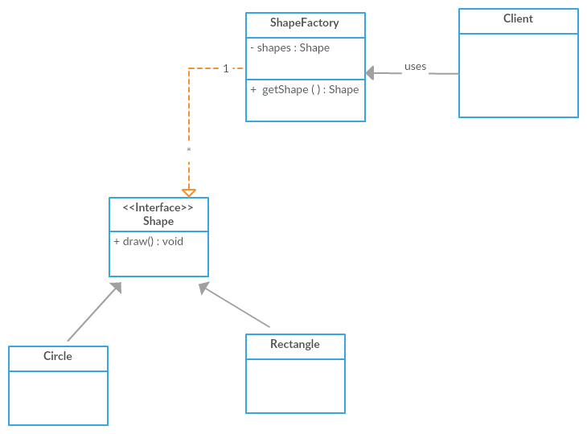

* It is a structural design pattern
* It can be used to save memory.
* Instead of creating large number of similar objects. we can reduce the number of objects that are created by reusing
  the objects
  and saving memory.
* Memory is a huge concern especially when it comes to mobile applications with limited memory.
* Let's say we are working on a paint app that allows users to draw different shapes that is circles
  and rectangles.
* Here we have a shape interface with a draw method on it.
* Then we have a circle class and the rectangle classes that implements that interface using a circle.
* The user can draw a circle using a rectangle of course he can try her rectangle to do that.
* He will have to create a circle and assign a radius for each circle he wants to create.
* Similarly, for each rectangle he will how to set the length and the breadth by creating a separate object
  by using the flyweight pattern.
* and rectangles the circle and rectangle implement the shape interface override the draw method.

And they have their own set of fields or State like radius fill color and line color for circle.

Rectangle will have Length Breath and fill style let's see what the problem is by implementing those interfaces

and classes go to core patterns right click new interface shape is the interface that will go into

com dot bharath dot Patterns dot the new name is fly.

Weight.

Finish.

Shape will have a single method called Draw void draw.

Is the method.

Right click on the package create a new class called circle click on the Add button search for the new shape

that we have created from our own package.

click OK.

Finish circle will have its own

STATE that is it will have its own fields starting with private string label private int radius of the

circle private string

Let's say fill color the color that we are going to fill the circle with we are not going to really do

it but well displayed will print using.

Using a sysout we are going to display all these inside the draw method private string line.

Color is the color that will be used to draw the circle.

Inside the draw method do a sysout and print out all the fields of it.

drawing drawing a plus the label tells what kind of shape we are drawing will initialize that in the constructor

drawing a circle the label tells that plus within double quotes with radius

plus display the radius field radius

plus fill color within of quotes the

fill color

spaces at the beginning and the end plus.

fill color plus within double quotes line color

plus line color and inside the constructor for circle create a public constructor hit Control-D to delete

the two do initialize the label to circle

and for rectangle.

This will be a rectangle class right click new class call it a rectangle click

on add select shape again from our own package not from java dot AWT.

hit OK.

Finish the draw method will be similar to that of rectangle, to that circle but it will have its

own feelings.

So first define the field starting with private string label.

private int length for the rectangle private private int breathe and private lets say string fill style.

The fill style that we want inside the rectangle and in here will use similar sysout to that of a circle

so you can grab this come back paste the sysout drawing.

In this case it'll be a rectangle with length display the length.

We don't have a fill color but use the breath fill

Finally, fill style there is no line color here.

Fill Style.

Do a control shift F to format so you have successfully created the shape and implemented it through circle and

rectangle classes in the next lecture you will create a paint app and use these glasses and see what the

problem is.

* STEPS FOR IMPLEMENTING FLYWEIGHT:

the intrinsic state: the fields that contain unchanging data duplicated across many objects
the extrinsic state: the fields that contain contextual data unique to each object
The first step is to separate out the extrinsic state in your objects or classes.

The second step is to pass that extrinsic state as a parameter to the methods.

Third step is to create a factory class and the client should always use the factory class to create

our objects instead of directly creating circles and rectangles so the three steps spread out the extinsic

state pass that extrinsic state.

In our case to the Draw method on circle and rectangle create a factory class that will be used to by

the end client to create our objects.

UML Diagram:
